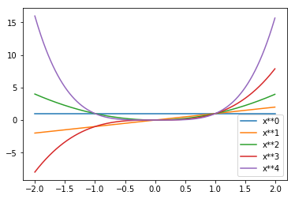
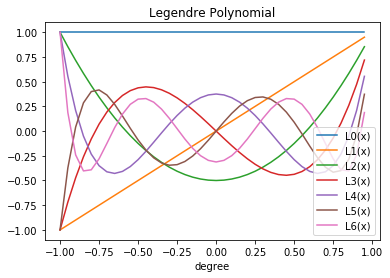
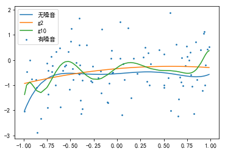
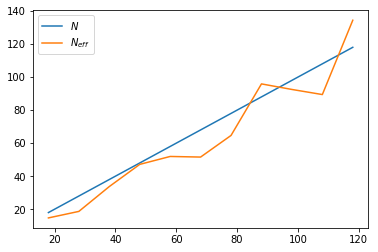
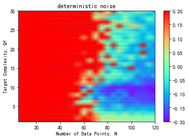
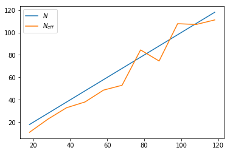
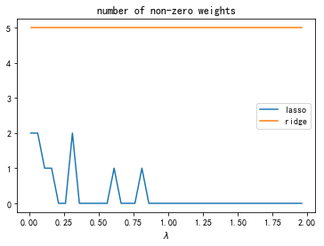
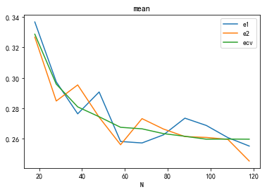
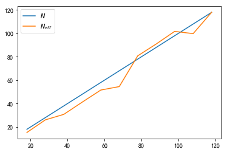

大家好，这篇是有关Learning from data第四章习题的详解，这一章主要介绍了如何处理Overfitting。

我的github地址：  
https://github.com/Doraemonzzz

个人主页：  
http://doraemonzzz.com/

参考资料:  
https://blog.csdn.net/a1015553840/article/details/51085129  
http://www.vynguyen.net/category/study/machine-learning/page/6/  
http://book.caltech.edu/bookforum/index.php  
http://beader.me/mlnotebook/


## Chapter 4 Overfitting

 ###  Part 1: Exercise

#### Exercise 4.1 (Page 121)

Let $\mathcal {H_2}$ and $\mathcal {H_{10}}$ be the 2nd and 10th order hypothesis sets respectively. Specify these sets as parameterized sets of functions. Show that $\mathcal {H_{2}}\subset\mathcal {H_{10}}$ .    

$\mathcal {H_{10}}$为$10$次多项式，$\mathcal {H_{2}}$为$2$次多项式，$2$次多项式显然为特殊的$10$次多项式，所以$\mathcal {H_{2}}\subset\mathcal {H_{10}}$


#### Exercise 4.2 (Page 123)

这题在Problem 4.3,4.4有详细的推导，这里略过。


#### Exercise 4.3 (Page 125)

Deterministic noise depends on $\mathcal{H}$, as some models approximate $f$ better than others. 

(a) Assume $\mathcal{H}$ is fixed and we increase the complexity of $f$. Will deterministic noise in general go up or down? Is there a higher or lower tendency to overfit? 

(b) Assume $f$ is fixed and we decrease the complexity of $\mathcal{H}$. Will deterministic noise in general go up or down? Is there a higher or lower tendency to overfit? [Hint: There is a race between two factors that affect overfitting in opposite ways, but one wins.]

我的理解是deterministic noise是由$f$产生的，而过拟合是由于$\mathcal{H}$比$f$更复杂产生的，所以有如下结论：

(a)如果固定$\mathcal{H}$，增加$f$的复杂度，那么deterministic noise会增加，但是过拟合的趋势降低了。

(b)如果固定$f$，增加$\mathcal{H}$的复杂度，那么deterministic noise不变，但是过拟合的趋势上升了，因为$\mathcal{H}$要比$f$更“复杂”一些。


#### Exercise 4.4 (Page 129)

Let $Z=[z_1,... ,z_N]^T$ be the data matrix (assume $Z$ has full column rank) ; let $w_{\text{lin}}=(Z^TZ)^{-1}Z^Ty$; and let $H=Z(Z^TZ)^{-1} Z^T$ (the hat matrix of Exercise 3.3). Show that
$$
E_{\text{in}}(w) =\frac {(w - w_{\text{lin}})^T(Z^TZ) (w - w_{\text{lin}}) + y^T(I - H)y}{N}
$$
where $I​$ is the identity matrix. 

(a) What value of $w$ minimizes $E_{\text{in}}$? 

(b) What is the minimum in sample error? 

$E_{\text{in}}$的推导可以参考Problem 3.9，这里不再重复。

(a)$Z^TZ$为半正定阵，所以
$$
(w - w_{\text{lin}})^T(Z^TZ) (w - w_{\text{lin}})\ge0 \\
当且仅当w=w_{\text{lin}}时等号成立
$$
所以当$w=w_{\text{lin}}$时，$E_{\text{in}}$最小。

(b)当$w=w_{\text{lin}}$时，$E_{\text{in}}$最小，所以
$$
\min E_{\text{in}}=\frac { y^T(I - H)y}  N
$$


#### Exercise 4.5 (Page 131)

 [Tikhonov regularizer]A more general soft constraint is the *Tkhonov* regularization constraint 
$$
w^T \Gamma ^T\Gamma w \le C
$$
which can capture relationships among the $w_i$ (the matrix $\Gamma$ is the Tikhonov regularizer) . 

(a) What should $\Gamma$ be to obtain the constraint $\sum_{q=0}^{Q}w_q^2\le C$? 

(b) What should $\Gamma$ be to obtain the constraint $(\sum_{q=0}^{Q}w_q)^2\le C$?    

(a)当$\Gamma =I$时，
$$
\Gamma w= \left(
 \begin{matrix}
   w_0  \\
    w_1  \\
   ...  \\
   w_Q
  \end{matrix}
  \right) \\
w^T \Gamma ^T\Gamma w =w^Tw=\sum_{q=0}^{Q}w_q^2
$$
所以原问题可以化为
$$
w^T \Gamma ^T\Gamma w =w^Tw=\sum_{q=0}^{Q}w_q^2 \le C
$$
(b)当 $\Gamma = \left(
 \begin{matrix}
   1 & ... & 1 \\
  0& ...& 0 \\
   ... & ... & ... \\
   0 & ... & 0
  \end{matrix}
  \right)$ 时，
$$
\Gamma w= 
  \left(
 \begin{matrix}
   \sum_{i=0}^Q w_i  \\
    0  \\
   ...  \\
   0
  \end{matrix}
  \right)\\
  w^T \Gamma ^T\Gamma w= ( \sum_{i=0}^Q w_i)^2 \\
$$

 所以原问题可以化为
$$
  w^T \Gamma ^T\Gamma w =( \sum_{i=0}^Q w_i)^2 \le C
$$


#### Exercise 4.6 (Page 133)

We have seen both the hard-order constraint and the soft-order constraint. Which do you expect to be more useful for binary classification using the perceptron model? [Hint: ${\text{sign}}(w^Tx)={\text{sign}}(aw^Tx)$ for any $a > 0$].    

首先回顾下两种限制，hard-order constraint为限制某些权重为0，soft-order constraint为限制$w^Tw\le C$。

如果我们使用soft-order constraint，那么问题就化为最小化
$$
E_{\text{aug}}(w)=\sum_{i=1}^n [\![ {\text{sign}}(w^Tx_i) \neq y_i]\!]+w^Tw，\\
s.t \ \ w^Tw\le C
$$
不加soft-order constraint的问题为最小化
$$
E_{\text{in}}(w)=\sum_{i=1}^n [\![ {\text{sign}}(w^Tx_i) \neq y_i]\!]
$$
设这个问题的最优解为$w$，因为对于任意$a > 0$，${\text{sign}}(w^Tx)={\text{sign}}(aw^Tx)$ ，所以$aw'$也为这个问题的最优解，即
$$
E_{\text{in}}(w')=E_{\text{in}}(aw{'})=\min E_{\text{in}}(w)
$$
再来看$E_{\text{aug }}​$，显然有
$$
E_{\text{aug}}(w)\ge \min \{\sum_{i=1}^n [\![ {\text{sign}}(w^Tx_i) \neq y_i]\!]\}+\min\{w^Tw\} \ge E_{\text{in}}(w')
$$
该不等式对任意$w$都成立，所以有
$$
\min E_{\text{aug}}(w) \ge E_{\text{in}}(w') =\min E_{\text{in}}(w)
$$
取很小的$a​$，使得$(aw')^T(aw')\le C​$，计算$E_{\text{aug}}(aw')​$
$$
E_{\text{aug}}(aw')=E_{\text{in}}(aw')+(aw')^T(aw')=E_{\text{in}}(w')+||aw'||^2
$$
如果$a​$充分小，那么
$$
E_{\text{aug}}(aw') \approx E_{\text{in}}(w')
$$
结合
$$
\min E_{\text{aug}}(w) \ge E_{\text{in}}(w')\approx E_{\text{aug}}(aw')
$$
可得
$$
\min E_{\text{aug}}(w) \approx E_{\text{aug}}(aw')
$$
所以$aw'$可以近似为加上soft-order constraint后的最优解，而$aw'$为不加soft-order constraint的解，从而soft-order constraint基本没有效果。而hard-order constraint直接限制一些权重为$0​$，必然有效果。所以对于此题hard-order constraint的效果好于soft-order constraint。


#### Exercise 4.7 (Page 139)

Fix $g$ (learned from $\mathcal{D}_{\text{train}}$) and define $\sigma_{\text{val}}^2 \overset {\text{def}}= \text{Var}_{\mathcal{D}_{\text{train}}}[E_{\text{val}}(g^{-})]$ . We consider how $\sigma_{\text{val}}^2$ depends on $K$. Let 
$$
\sigma^2 (g^{-})= \text{Var}_{x}[e(g^{-}(x),y)]
$$
be the pointwise variance in the out-of-sample error of $g$ .

(a) Show that $\sigma_{\text{val}}^2=\frac1{K} {\sigma^2 (g^{-})}​$

(b) In a classification problem, where $e(g^{-} (x) , y) =[\![g ^{-}(x) \neq y]\!]$ , express $\sigma_{\text{val}}^2$  in terms of $\mathbb P[g ^{-}(x) \neq y]$. 

(c) Show that for any $g^{-}​$ in a classification problem, $\sigma_{\text{val}}^2 \le \frac {1}{4K}​$

(d) Is there a uniform upper bound for $\text{Var}{[E_{\text{val}}(g^{-})]}$ similar to (c) in the case of regression with squared error $e(g^{-} (x), y) =(g ^{-}(x) - y)^2$? [Hint: The squared error is unbounded.] 

(e) For regression with squared error, if we train using fewer points (smaller $N-K$) to get $g$ , do you expect $\sigma^2 (g^{-})$ to be higher or lower? [Hint: For continuous, non-negative random variables, higher mean often implies higher variance.] 

(f) Conclude that increasing the size of the validation set can result in a better or a worse estimate of $E_{\text{out}}​$·    

(a)因为
$$
E_{\text{val}}(g^{-})=\frac 1K\sum _{x_n\in \mathcal D_{\text{val}}}e(g^{-} (x_n) , y_n)
$$
所以
$$
\begin{aligned}
\sigma_{\text{val}}^2 &\overset {\text{def}}= \text{Var}_{\mathcal{D}_{\text{train}}}[E_{\text{val}}(g^{-})]\\
&=\text{Var}_{\mathcal{D}_{\text{train}}} [\frac 1K\sum _{x_n\in \mathcal D_{\text{val}}}e(g^{-} (x_n) , y_n)] \\
&=\frac 1 {K^2}   \sum _{x_n\in \mathcal D_{\text{val}}}  \text{Var}_{x_n}e(g^{-} (x_n) , y_n)\\
&=\frac 1 {K^2} K  \sigma^2 (g^{-})\\
&=\frac 1 K  \sigma^2 (g^{-})
\end{aligned}
$$
(b)由题意我们知道
$$
e(g^{-} (x) , y)=\begin{cases}
0, & \text{如果$ g ^{-}(x) = y $}\\
1, & \text{如果$ g ^{-}(x) \neq y $}
\end{cases}
$$
从而
$$
\mathbb E_x[e(g^{-} (x) , y)]=\mathbb P[g ^{-}(x) \neq y]\\
\begin{aligned}
\sigma^2 (g^{-})&= \text{Var}_{x}[e(g^{-}(x),y)]\\
&=\mathbb E_x[e(g^{-} (x) , y)-\mathbb E_x[e(g^{-} (x) , y)]]^2 \\
&=\mathbb E_x[e(g^{-} (x) , y)-\mathbb P[g ^{-}(x) \neq y]]^2 \\
&=(1-\mathbb P[g ^{-}(x) \neq y])\mathbb P^2[g ^{-}(x) \neq y]+\mathbb P[g ^{-}(x) \neq y]
(1-\mathbb P[g ^{-}(x) \neq y])^2\\
&=(1-\mathbb P[g ^{-}(x) \neq y])\mathbb P[g ^{-}(x)\neq y]
\end{aligned}
$$
由(a)我们可得
$$
\sigma_{\text{val}}^2=\frac1{K} {\sigma^2 (g^{-})}=\frac 1 K (1-\mathbb P[g ^{-}(x) \neq y])
\mathbb P[g ^{-}(x)\neq y]
$$
(a)由不等式
$$
(1-x)x\le \frac 1 4
$$
可得
$$
\sigma_{\text{val}}^2=\frac 1 K (1-\mathbb P[g ^{-}(x) \neq y])\mathbb P[g ^{-}(x)\neq y]\le \frac 1 {4K}
$$
(d)这题举个例子来说明，假设我们$y=f(x)+\epsilon,\epsilon \sim \mathcal  N(0,\sigma^2)$，我们训练出来的$g^{-}(x)=f(x)$，所以
$$
\sigma^2 (g^{-})= \text{Var}_{x}[e(g^{-}(x),y)]=\text{Var}_x(\epsilon ^2)=\mathbb E(\epsilon^4)-(\mathbb E(\epsilon^2))=3\sigma^4-\sigma^4=2\sigma^4
$$
由于$\sigma$可以取任意值，所以对于平方误差，$\sigma^2 (g^{-})$没有上界，$\sigma_{\text{val}}^2=\frac1{K} {\sigma^2 (g^{-})}$也没有上界。

(e)对于平方误差
$$
\sigma^{2}(g^{-}) =\text{Var}[(g^{-}(x) - y)^{2}]
$$
如果训练集的数量$N-K$减少，那么$g^{-}(x)$会比较糟糕，从而$(g^{-}(x) - y)^{2}$会增加一些，从而$\mathbb E(g^{-}(x) - y)^{2}$也会增加，由题目里的提示：**对于连续非负随机变量，较大的数学期望往往带来较大的方差**，所以$\sigma^{2}(g^{-}) =\text{Var}[(g^{-}(x) - y)^{2}]$大概率会增加。（这题感觉没法定量分析，只能这样定性思考）

(f)由$\sigma_{\text{val}}^2=\frac1{K} {\sigma^2 (g^{-})}​$我们知道增加$K​$会减小$\sigma_{\text{val}}^2​$，但是注意对于平方误差增加$K​$也会增加${\sigma^2 (g^{-})}​$，所以我认为这题的结论应该是在一定范围内，增加$K​$会减小$E_{\text{out}}​$，超过这个范围，增加$K​$会增加$E_{\text{out}}​$（和上一题一样，这题感觉没法准确的定量分析，只能这样定性思考）


#### Exercise 4.8 (Page 142)

Is $E_m$ an unbiased estimate for the out of sample error $E_{\text{out}}(g^-_m)$?    

回顾$E_m$的定义
$$
E_m = E_{\text{va1}}(g_m^-)
$$
所以
$$
\mathbb E_{\mathcal D_{\text{val}}}(E_m) =\mathbb  E_{\mathcal D_{\text{val}}}(E_{\text{val}}(g_m^-))=E_{\text{out}}(g_m^{-})
$$
所以$E_m$是$E_{\text{out}}(g^-_m)$的无偏估计。（$\mathbb  E_{\mathcal D_{\text{val}}}(E_{\text{val}}(g_m^-))=E_{\text{out}}(g_m^{-})$这一步可以参考课本139页）


#### Exercise 4.9 (Page 142)

Referring to Figure 4. 10, why are both curves increasing with $K$? Why do they converge to each other with increasing $K$? 

先看下图片


对于第一个问题，随着$K$增加，我们的训练集数量$N-K$减少，这样就会产生较差的结果，所以这两个曲线就会上升。

对于第二个问题，注意课本143页公式11
$$
E_{\text{out}}(g^-_{m_*} ) \le E_{\text{val}}(g^-_{m_*}) + O(\sqrt {\frac {\ln -M}{K}})
$$
所以随着$K$增加$E_{\text{out}}(g^-_{m_*} )$ 和$E_{\text{val}}(g^-_{m_*}) $越来越接近。


#### Exercise 4.10 (Page 144)

(a) From Figure 4.12, $\mathbb E[E_{\text{out}}(g^-_{m^*} )]$ is initially decreasing. How can this be, if $\mathbb E[E_{\text{val}}(g^-_{m})]$ is increasing in $K$ for each $m$? 

(b) From Figure 4.12 we see that $\mathbb E[E_{\text{out}}(g_{m^*} )]​$ is initially decreasing, and then it starts to increase. What are the possible reasons for this? 

(c) When $K = 1$ , $\mathbb E[E_{\text{out}}(g^-_{m^*} )]<\mathbb E[E_{\text{out}}(g_{m^*} )]$. How can this be, if the learning curves for both models are decreasing?    

先看下这张图


这里首先要把各个符号的含义理清楚。假设有$M​$个模型$\mathcal H_1,...,\mathcal H_M​$，对每个模型，采用训练集$\mathcal D_{\text{train}}​$对这些模型训练出来的结果为$g^-_{m},m=1,...M​$，现在利用验证集$\mathcal D_{\text{val}}​$计算每个模型的误差，得到的最好结果为$g^-_{m^*}​$，对应的模型为$\mathcal H_{m^*}​$，这时候再利用全部数据$D​$对模型$\mathcal H_{m^*}​$进行训练，得到的结果为$g_{m^*}​$。

现在理清楚这些关系了，可以回答以下问题。

(a)这个之前也讨论过了，因为一开始验证集数量不多，$K​$增加会让我们选择效果更好的模型，所以$\mathbb E[E_{\text{out}}(g^-_{m^*} )]​$一开始会减少。但随着$K​$增加很多，训练集数量大幅减少，得到的模型比较差，所以$\mathbb E[E_{\text{out}}(g^-_{m^*} )]​$又开始增加。

(b)来比较$g^-_{m^*}$和$g_{m^*}$，因为前者拿$\mathcal D_{\text{train}}$训练的，后者是拿全部数据$\mathcal D$训练的。当$K$很小时，$\mathcal D_{\text{train}}$和$\mathcal D$差别很小，所以$g^-_{m^*}$和$g_{m^*}$非常接近，因此一开始$g_{m^*}$的趋势和$g^-_{m^*}$一致，都是先减少。当$K$增大到一定数量时，$g^-_{m^*}$变得非常糟糕，我们选择的模型$\mathcal H_{m^*}$也会逐渐变差，所以拿全部数据训练出来的$g_{m^*}$也会逐渐变差，所以后来曲线也是上升。之所以$g_{m^*}$的变化趋势没有$g^-_{m^*}$那么明显，是因为$g_{m^*}$是拿全部数据训练的，数据更多，结果更加稳定。

(c)这题需要解释$K = 1​$时 , $\mathbb E[E_{\text{out}}(g^-_{m^*} )]<\mathbb E[E_{\text{out}}(g_{m^*} )]​$的原因。我的理解是$g_{m^*}​$训练出来的结果是保证$E_{\text{in}}​$比较小，但是$E_{\text{out}}​$未必很小。而$g^-_{m^*}​$本身就是选择在$D_{\text{val}}​$误差最小的模型，所以在$E_{\text{out}}​$上的结果还会更好一些。


#### Exercise 4.11 (Page 152)

In this particular experiment, the black curve ($E_{\text{cv}}$) is sometimes below and sometimes above the the red curve ($E_{\text{out}}$). If we repeated this experiment many times, and plotted the average black and red curves, would you expect the black curve to lie above or below the red curve?    


回顾课本147页
$$
\mathbb E_{\mathcal D}(E_{\text{out}}(g)) =\bar{E}_{\text{out}}(N)\\
\mathbb E_{\mathcal D}(E_{\text{cv}}) =\bar{E}_{\text{out}}(N-1)
$$
因为数据越多往往$E_{\text{out}}​$越小，所以
$$
\bar{E}_{\text{out}}(N)\le \bar{E}_{\text{out}}(N-1)
$$
应该大概率成立。从而多次实验取平均值的话，black curve应该在red curve之上。


### Part 2: Problems

#### Problem 4.1 (Page 154)

Plot the monomials of order $i, \phi (x) = x^i$. As you increase the order, does this correspond to the intuitive notion of increasing complexity?    

由数学知识我们知道，随着$i$增加，$\phi (x) = x^i$会变得更“陡峭”，也就是更复杂，我们从图像里看一下。


```python
# -*- coding: utf-8 -*-
"""
Created on Fri Mar  8 10:51:18 2019

@author: qinzhen
"""

import matplotlib.pyplot as plt
import numpy as np

x = np.arange(-2, 2, 0.01)
degree = np.arange(5)
for i in degree:
    y = x ** i
    label = 'x**'+str(i)
    plt.plot(x, y, label=label)
plt.legend()
plt.show()
```





#### Problem 4.2 (Page 154)

Consider the fature transform $z = [L_0(x), L_1 (x), L_2(x)]^T$ and the linear model $h(x) = w^Tz$. For the hypothesis with $w = [1, -1, 1]^T$, what is $h(x)$ explicitly as a function of $x$. What is its degree?    

注意$L_i(x)$为勒让德多项式，回顾课本128页，我们知道
$$
L_0 (x) = 1,L_1 (x) = x,L_2 (x) = \frac 1 2(3x^2-1)
$$
所以
$$
h(x) = w^Tz=1-x+ \frac 1 2(3x^2-1)=\frac 3 2 x^2-x+\frac 1 2
$$
因此$h(x)$为二次多项式。


#### Problem 4.3 (Page 154)

The Legendre Polynomials are a family of orthogonal polynomials which are useful for regression. The first two Legendre Polynomials are $L_0 (x) = 1,L_1 (x) = x$. The higher order Legendre Polynomials are defined by the recursion:    
$$
L_k(x)=\frac {2k-1}{k} xL_{k-1}(x)-\frac{k-1}{k}L_{k-2}(x)
$$
(a) What are the first six Legendre Polynomials? Use the recursion to de velop an efficient algorithm to compute $L_0(x), . . . , L_K(x) $given $x$. Your algorithm should run in time linear in $K$. Plot the first six Legendre polynomials. 

(b) Show that $L_k (x)$ is a linear combination of monomials $x^k , x^{k-2}, . . .$ (either all odd or all even order, with highest order $k$) . Thus,
$$
L_k(-x) = (-1)^kL_k(x)
$$
(c) Show that $\frac{x^2-1}{k}\frac {dL_k(x)}{dx} = xL_k (x) - L_{k-1} (x) $. [Hint: use induction.]

(d) Use part (c) to show that $L_k$ satisfies Legendre 's differential equation 
$$
\frac {d}{dx}(x^2 - 1) \frac{dL_k (x)}{dx} = k(k + 1)L_k (x)
$$
This means that the Legendre Polynomials are eigenfunctions of a Hermitian linear differential operator and, from Sturm Liouville theory, they form an orthogonal basis for continuous functions on $[-1, 1]$ .

(e) Use the recurrence to show directly the orthogonality property: 
$$
\int_{-1}^{1}dx\ L_k(x)L_{ l}(x)=\begin{cases}
0 & {l \neq k}\\
\frac{2}{2k+1} & {l=k}
\end{cases}
$$
[Hint: use induction on $k$, with $l\le k$. Use the recurrence for $L_k$ and consider separately the four cases $l = k, k - 1, k - 2$ and $l < k - 2$. For the case $l = k$ you will need to compute the integral $\int_{-1}^{1}dx\ x^2L_{k-1}(x)$. In order to do this, you could use the differential equation in part (c), multiply by $xL_k$ and then integrate both sides (the LHS can be integrated by parts). Now solve the resulting equation for $\int_{-1}^{1}dx\ x^2L_{k-1}(x)$.]

这题主要讲了勒让德多项式的性质，还是有一定难度的。

(a)这题要计算$L_0(x), . . . , L_K(x) $，只要用做循环即可，如下所示。

先计算$L_0(x),L_1(x)$，对于 $k=2,...,K$:
$$
L_k(x)=\frac {2k-1}{k} xL_{k-1}(x)-\frac{k-1}{k}L_{k-2}(x)
$$
这样就可计算出$L_0(x), . . . , L_K(x) $。由递推式我们可知，计算$L_0(x), . . . , L_K(x) $的算法复杂度是$O(K)$，接着做图看一下。


```python
# -*- coding: utf-8 -*-
"""
Created on Fri Mar  8 11:06:45 2019

@author: qinzhen
"""

import numpy as np
import matplotlib.pyplot as plt

def L(k, x):
    if k == 0:
        return [1]
    elif k == 1:
        return [1, x]
    else:
        temp = L(k-1, x)
        lkx = (2 * k - 1) / k * x * temp[-1] - (k - 1) / k * temp[-2]
        temp.append(lkx)
        return temp

X = np.arange(-1, 1, 0.05)
Y = []
for x in X:
    y = L(6, x)
    Y.append(y)
Y = np.array(Y)

for k in range(7):
    plt.plot(X, Y[:, k], label="L"+str(k)+"(x)")
    plt.legend()

plt.legend()
plt.xlabel("degree")
plt.title("Legendre Polynomial")
plt.show()
```





(b)使用归纳法，显然对于$k=0,k=1$结论成立，假设对于$k\le n-1$结论成立，现在证明$k=n$时，结论也成立。

由归纳假设我们知道$L_{n-1}(x)$是单项$x^{n-1},x^{n-3},...$的线性组合，所以$xL_{n-1}(x)$是单项$x^{n},x^{n-2},...$的线性组合，此外由归纳假设$L_{n-2}(x)$是单项$x^{n-2},x^{n-4},...$的线性组合，所以由递推式
$$
L_n(x)=\frac {2n-1}{n} xL_{n-1}(x)-\frac{n-1}{n}L_{n-2}(x)
$$
我们可得$L_n(x)$是单项$x^{n},x^{n -2},...$的线性组合。

由于$(-x)^{k}=(-1)^kx^k,(-x)^{k-2i}=(-1)^kx^{k-2i}$以及$L_k(x)$是单项$x^{k},x^{k-2},...$的线性组合,所以
$$
L_k(-x) = (-1)^kL_k(x)
$$
(c)依旧使用归纳法，我们知道
$$
L_0 (x) = 1,L_1 (x) = x,L_2 (x) = \frac 1 2(3x^2-1)
$$
所以
$$
\frac{x^2-1}{1}\frac {dL_1(x)}{dx} = \frac{x^2-1}{1} = x\times x-1=xL_1 (x) - L_{0} (x)
$$
所以$k=1$时结论成立。假设对$k\le n-1$时结论成立，接下来证明$k=n$时结论也成立，为叙述简单起见，将后续的$L_k(x)$都简记为$L_k$。

先对结论进行变形
$$
\frac {dL_k}{dx} =\frac{k}{x^2-1} (xL_k - L_{k-1} ) \tag{1}
$$
我们将$L_n=\frac {2n-1}{n} xL_{n-1}-\frac{n-1}{n}L_{n-2}$带入上式可得
$$
\begin{aligned}
\frac {dL_n}{dx}&= \frac {d(\frac {2n-1}{n} xL_{n-1}-\frac{n-1}{n}L_{n-2})}{dx}\\
&=\frac {2n-1}{n} \frac{d( xL_{n-1})}{dx}-\frac{n-1}{n} \frac{d(L_{n-2})}{dx}\\
&=\frac {2n-1}{n}[L_{n-1}+x \frac{d(L_{n-1})}{dx}]-\frac{n-1}{n} \frac{d(L_{n-2})}{dx}（将(1)带入）\\
&=\frac {2n-1}{n}[L_{n-1}+x\times \frac{n-1}{x^2-1} (xL_{n-1}  - L_{n-2}  )]
-\frac{n-1}{n}  \frac{n-2}{x^2-1} (xL_{n-2}  - L_{n-3}  )\\
&=\frac {2n-1}{n}[1+\frac{(n-1)x^2}{x^2-1}]L_{n-1}-\frac{n-1}{n(x^2-1)}[x(2n-1)+(n-2)x]L_{n-2}+\frac{(n-1)(n-2)}{n(x^2-1)}L_{n-3}\\
&=\frac {(2n-1)(nx^2-1)}{n(x^2-1)}L_{n-1}-\frac{3x(n-1)^2}{n(x^2-1)}L_{n-2}+\frac{(n-1)(n-2)}{n(x^2-1)}L_{n-3}\\
&=\frac {(2n-1)(nx^2-1)}{n(x^2-1)}L_{n-1}-\frac{n-1}{n(x^2-1)}[3x(n-1)L_{n-2}-(n-2)L_{n-3}]
\end{aligned}
$$
接着计算$3x(n-1)L_{n-2}-(n-2)L_{n-3}​$，注意可以对递推式进行日下变形
$$
\begin{eqnarray*}

L_{n-1}&&=\frac {2n-3}{n-1} xL_{n-2}-\frac{n-2}{n-1}L_{n-3} \\
(n-1)L_{n-1}&&=(2n-3)xL_{n-2}-(n-2)L_{n-3}\\
(n-2)L_{n-3}&&=(2n-3)xL_{n-2}-(n-1)L_{n-1} \tag 2\\
(n-1)L_{n-2}&&=(2n-1)xL_{n-1}-nL_{n} \tag 3
\end{eqnarray*}
$$
将等式(2)带入可得
$$
\begin{aligned}
3x(n-1)L_{n-2}-(n-2)L_{n-3}&=3x(n-1)L_{n-2}-[(2n-3)xL_{n-2}-(n-1)L_{n-1}]\\
&=xnL_{n-2}+(n-1)L_{n-1}\\
\end{aligned}
$$
那么
$$
\begin{aligned}
\frac{n-1}{n(x^2-1)}[3x(n-1)L_{n-2}-(n-2)L_{n-3}]&=\frac{n-1}{n(x^2-1)}[xnL_{n-2}+(n-1)L_{n-1}]\\
&=\frac{1}{n(x^2-1)}[xn(n-1)L_{n-2}+(n-1)^2L_{n-1}](将等式(3)带入)\\
&=\frac{1}{n(x^2-1)}\{xn[(2n-1)xL_{n-1}-nL_n] +(n-1)^2L_{n-1}\}\\
&=-\frac{xn}{x^2-1}L_n+\frac{1}{n(x^2-1)}[n(2n-1)x^2+(n-1)^2]L_{n-1}
\end{aligned}
$$
带入原式可得
$$
\begin{aligned}
\frac {dL_n}{dx}&=\frac {(2n-1)(nx^2-1)}{n(x^2-1)}L_{n-1}-\frac{n-1}{n(x^2-1)}[3x(n-1)L_{n-2}-(n-2)L_{n-3}]\\
&=\frac {(2n-1)(nx^2-1)}{n(x^2-1)}L_{n-1}+\frac{xn}{x^2-1}L_n-\frac{1}{n(x^2-1)}[n(2n-1)x^2+(n-1)^2]L_{n-1}\\
&=\frac{n}{x^2-1}xL_n+\frac{1}{n(x^2-1)}(2n^2x^2-nx^2-2n+1-2n^2x^2+nx^2-n^2+2n-1)L_{n-1}\\
&=\frac{n}{x^2-1}xL_n+\frac{1}{n(x^2-1)}(-n^2)L_{n-1}\\
&=\frac{n}{x^2-1}xL_n-\frac{n}{x^2-1}L_{n-1}
\end{aligned}
$$
所以
$$
\frac{x^2-1}{n}\frac {dL_n}{dx} = xL_n - L_{n-1}
$$
即结论对于$k=n$也成立，所以结论成立。

(d)为叙述简单起见，将后续的$L_k(x)$都简记为$L_k$。

将(c)的式子带入可得
$$
\begin{aligned}
\frac {d}{dx}(x^2 - 1) \frac{dL_k}{dx}&=\frac {d}{dx}(x^2 - 1) \frac{k}{x^2-1}(xL_k-L_{k-1})\\
&=k \frac{d(xL_k-L_{k-1})}{dx}\\
&=k(L_k+x\frac {d L_k}{dx}-\frac {d L_{k-1}}{dx})\\
&=k[L_k+x (\frac{k}{x^2-1}xL_k-\frac{k}{x^2-1}L_{k-1})-(\frac{k-1}{x^2-1}xL_{k-1}-\frac{k-1}{x^2-1}L_{k-2})]\\
&=k(1+\frac{kx^2}{x^2-1})L_k-\frac{k}{x^2-1}[kxL_{k-1}+(kx-x)L_{k-1}-(k-1)L_{k-2}]\\
&=k(1+\frac{kx^2}{x^2-1})L_k-\frac{k}{x^2-1}[(2k-1)xL_{k-1}-(k-1)L_{k-2}]\\
\end{aligned}
$$
回顾递推式
$$
L_k=\frac {2k-1}{k} xL_{k-1}-\frac{k-1}{k}L_{k-2}\\
kL_k=(2k-1)xL_{k-1}-(k-1)L_{k-2}
$$
将其带入可得
$$
\begin{aligned}
\frac {d}{dx}(x^2 - 1) \frac{dL_k}{dx}&=k(1+\frac{kx^2}{x^2-1})L_k-\frac{k}{x^2-1}kL_k\\
&=k(1+\frac{kx^2-k}{x^2-1})L_k\\
&=k(k+1)L_k
\end{aligned}
$$
所以结论成立。

(e)这里的记法的写法和我们平常接触的有所不同，将其改为平时常用的形式
$$
{\int_{-1}^{1}dx\ L_k(x)L_{ l}(x ) }\overset{记录为}{=} \int_{-1}^{1} L_k(x)L_{ l}(x ) dx\
$$
为叙述简单起见，将后续的$L_k(x)$都简记为$L_k$。

由对称性，不妨设$l\le k$，为了后续证明需要，这里还需补充证明一个结论
$$
{\int_{-1}^{1}xL_kL_{l}}dx
=\begin{cases}
\frac{2k}{(2k+1)(2k-1)} &l=k-1\\
0 &l\le k-2
\end{cases}
$$
下面关于$k$做数学归纳法，这里要多验证几组，否则起始情况没有全部验证。回忆勒让德多项式的前几项
$$
L_0 (x) = 1,L_1 (x) = x,L_2 (x) = \frac 1 2(3x^2-1)
$$
当$k=0​$时，$l=0​$
$$
\int_{-1}^{1}\ L_kL_{ l}dx=\int_{-1}^{1}1dx =2=\frac {2}{2\times 0+1}
$$
所以$k=0$时结论成立。(此时$xL_kL_{k-1}$无意义，所以不用验证)

当$k=1​$时
$$
\int_{-1}^{1} L_kL_{ l}dx=\begin{cases}
\int_{-1}^{1}L_0L_{ 1}dx=\int_{-1}^{1}xdx=0& {(l=0, k=1)}\\
\int_{-1}^{1}L_1L_{ 1}dx=\int_{-1}^{1}x^2dx=\frac 2 3 &{(l=1, k=1)}
\end{cases}\\
{\int_{-1}^{1}xL_kL_{k-1}}dx={\int_{-1}^{1}xL_1L_{0}}dx={\int_{-1}^{1}x^2}dx=\frac 2 3=\frac{2\times 1}{(2\times 1+1)(2\times 1-1)}
$$
所以$k=1$时结论成立。

当$k=2​$时
$$
\int_{-1}^{1} L_kL_{ l}dx=\begin{cases}
\int_{-1}^{1}L_0L_{ 2}dx=\int_{-1}^{1} \frac 1 2(3x^2-1)dx=0& {(l=0, k=2)}\\
\int_{-1}^{1}L_1L_{ 2}dx=\int_{-1}^{1} \frac 1 2x(3x^2-1)dx=0 &{(l=1, k=2)}\\
\int_{-1}^{1}L_2L_{ 2}dx=\int_{-1}^{1}( \frac 1 2(3x^2-1))^2dx=\frac 4 5 &{(l=2, k=2)}
\end{cases}\\
{\int_{-1}^{1}xL_kL_{k-1}}dx=\begin{cases}
{\int_{-1}^{1}xL_2L_{1}}dx={\int_{-1}^{1}\frac 1 2x^2(3x^2-1)}dx=\frac 4 {15}=\frac{2\times 2}{(2\times 2+1)(2\times 2-1)} & (l=1,k=2)\\
{\int_{-1}^{1}xL_2L_{0}}dx=\int_{-1}^{1}\frac 1 2x(3x^2-1)dx=0 & (l=0,k=2)
\end{cases}
$$
所以$k=2$时结论成立。

基本情形验证完毕，假设$k\le n-1​$时结论成立，下面证明$k=n​$时结论也成立，这里分四种情形证明。

- $l=n-1$

  $L_n$是单项$x^{n},x^{n-2},...$的线性组合，$L_l=L_{n-1}$是单项$x^{n-1},x^{n-3},...$的线性组合，所以$L_nL_{n-1}$的每一个单项的形式为$x^{n-2i}x^{n-1-2j}=x^{2n-1-2(i+j)}$，从而$L_nL_{n-1}$每个单项都为奇数次多项式，我们知道
  $$
  \int_{-1}^{1} x^{2n+1}dx=0(n\in \mathbb N)
  $$
  所以
  $$
  \int_{-1}^{1}\ L_nL_{ n-1}dx=0
  $$
  $l=n-1$时结论成立。

- $l=n-2$

  对于递推式两边同乘$L_{n-2}​$，然后积分
  $$
  L_n=\frac {2n-1}{n} xL_{n-1}-\frac{n-1}{n}L_{n-2}\\
  L_nL_{n-2}=\frac {2n-1}{n} xL_{n-1}L_{n-2}-\frac{n-1}{n}L_{n-2}L_{n-2}\\
  \int_{-1}^{1}L_nL_{n-2}dx=\int_{-1}^{1}\frac {2n-1}{n} xL_{n-1}L_{n-2}dx-\int_{-1}^{1}\frac{n-1}{n}L_{n-2}L_{n-2}dx
  $$
  由归纳假设我们知道
  $$
  \int_{-1}^{1}\frac {2n-1}{n} xL_{n-1}L_{n-2}dx=\frac {2n-1}{n} \frac{2n-2}{(2n-1)(2n-3)}=\frac{2n-2}{n(2n-3)}\\
  \int_{-1}^{1}\frac{n-1}{n}L_{n-2}L_{n-2}dx=\frac {n-1}{n} \frac 2{2n-3}=\frac{2n-2}{n(2n-3)}
  $$
  所以
  $$
  \int_{-1}^{1}L_nL_{n-2}dx=\frac{2n-2}{n(2n-3)}-\frac{2n-2}{n(2n-3)}=0
  $$
  $l=n-2$时结论成立。

- $l< n-2$

  此时将递推式带入
  $$
  \begin{aligned}
  \int_{-1}^{1} L_nL_{ l}dx&= \int_{-1}^{1}[\frac {2n-1}{n} xL_{n-1}-\frac{n-1}{n}L_{n-2}]L_{ l}dx\\
  &=\frac {2n-1}{n} \int_{-1}^{1}xL_{n-1}L_ldx-\frac{n-1}{n}\int_{-1}^{1}L_{n-2}L_{ l}dx
  \end{aligned}
  $$
  因为$l<n-2$，所以由归纳假设我们知道
  $$
  \int_{-1}^{1}xL_{n-1}L_ldx =0\\
  \int_{-1}^{1}L_{n-2}L_{ l}dx=0
  $$
  所以
  $$
  \int_{-1}^{1} L_nL_{ l}dx=0
  $$
  $l<n-2$时结论成立。

- $l=n$

  对递推式两边平方之后积分，然后带入归纳假设的结果
  $$
  L_n=\frac {2n-1}{n} xL_{n-1}-\frac{n-1}{n}L_{n-2}\\
    L_n^2=(\frac {2n-1}{n} xL_{n-1}-\frac{n-1}{n}L_{n-2})^2\\
    L_n^2=(\frac {2n-1}{n})^2 x^2L_{n-1}^2-\frac {2(2n-1)(n-1)}{n^2}xL_{n-1}L_{n-2}+(\frac{n-1}{n})^2L_{n-2}^2\\
    \int_{-1}^{1}L_n^2dx=(\frac {2n-1}{n})^2 \int_{-1}^{1}x^2L_{n-1}^2dx
    -\frac {2(2n-1)(n-1)}{n^2}\int_{-1}^{1}xL_{n-1}L_{n-2}dx
    +(\frac{n-1}{n})^2\int_{-1}^{1}L_{n-2}^2dx\\
    \int_{-1}^{1}L_n^2dx=(\frac {2n-1}{n})^2 \int_{-1}^{1}x^2L_{n-1}^2dx
    -\frac {2(2n-1)(n-1)}{n^2}\frac{2n-2}{(2n-1)(2n-3)}
    +(\frac{n-1}{n})^2 \frac{2}{2n-3}\\
    \int_{-1}^{1}L_n^2dx=(\frac {2n-1}{n})^2 \int_{-1}^{1}x^2L_{n-1}^2dx- \frac{2(n-1)^2}{n^2(2n-3)}
  $$
    接着计算$\int_{-1}^{1}x^2L_{n-1}^2dx$，首先利用(c)的等式
  $$
    \frac{x^2-1}{n-1}\frac {dL_{n-1}}{dx} = xL_{n-1}  - L_{n-2}
  $$
    两边同乘$xL_{n-1}$，然后积分
  $$
  \frac{x(x^2-1)}{n-1}L_{n-1}\frac {dL_{n-1}}{dx}=x^2L_{n-1}^2-xL_{n-2}L_{n-1}\\
    \int_{-1}^{1}\frac{x(x^2-1)}{n-1}L_{n-1}\frac {dL_{n-1}}{dx}dx=\int_{-1}^{1}(x^2L_{n-1}^2-xL_{n-2}L_{n-1})dx 
  $$
    先处理左边
  $$
  \begin{aligned}
    \int_{-1}^{1}\frac{x(x^2-1)}{n-1}L_{n-1}\frac {dL_{n-1}}{dx}dx&=\int_{-1}^{1}\frac{x(x^2-1)}{n-1} d(\frac 1 2L_{n-1}^2)\\
    &=\frac{x(x^2-1)}{n-1}\frac 1 2L_{n-1}^2 \Big |_{x=-1}^{x=1}-\int_{-1}^{1} \frac{3x^2-1}{n-1} \frac 1 2L_{n-1}^2 dx\\
    &=-\frac{1}{2(n-1)} \int_{-1}^{1}(3x^2-1)L_{n-1}^2 dx
    \end{aligned}
  $$
    将此式带回原来的等式左边，记$a_{n}=\int_{-1}^{1}x^2L_{n}^2dx$，结合归纳假设
  $$
  -\frac{1}{2(n-1)} \int_{-1}^{1}(3x^2-1)L_{n-1}^2 dx=\int_{-1}^{1}(x^2L_{n-1}^2-xL_{n-2}L_{n-1})dx \\
    3a_{n-1}-\int_{-1}^{1}L_{n-1}^2 dx=-2(n-1)(a_{n-1}-\int_{-1}^{1}xL_{n-2}L_{n-1}dx)\\
     (2n+1)a_{n-1}= \int_{-1}^{1}L_{n-1}^2 dx+2(n-1) \int_{-1}^{1}xL_{n-2}L_{n-1}dx  \\
    (2n+1)a_{n-1}=\frac{2}{2n-1}+2(n-1)\frac{2n-2}{(2n-3)(2n-1)}\\
    \begin{aligned}
    a_{n-1}&=\frac 1{2n+1}[\frac{2}{2n-1}+\frac{4(n-1)^2}{(2n-3)(2n-1)}]\\
    &=\frac 1{(2n+1)(2n-1)(2n-3)}[2(2n-3)+4(n-1)^2]\\
    &=\frac {4n-6+4n^2-8n+4}{(2n+1)(2n-1)(2n-3)}\\
    &=\frac {4n^2-4n-2}{(2n+1)(2n-1)(2n-3)}
    \end{aligned}
  $$
  带回原式可得
  $$
  \begin{aligned}
    \int_{-1}^{1}L_n^2dx&=(\frac {2n-1}{n})^2 \int_{-1}^{1}x^2L_{n-1}^2dx- \frac{2(n-1)^2}{n^2(2n-3)}\\
    &=(\frac {2n-1}{n})^2\frac {4n^2-4n-2}{(2n+1)(2n-1)(2n-3)}-\frac{2(n-1)^2}{n^2(2n-3)}\\
    &=\frac{(2n-1)(4n^2-4n-2)-2(n-1)^2(2n+1)}{n^2(2n-3)(2n+1)}\\
     &=\frac{8n^3-8n^2-4n-4n^2+4n+2-2(n^2-2n+1)(2n+1)}{n^2(2n-3)(2n+1)}\\
     &=\frac{8n^3-12n^2+2-2(2n^3-4n^2+2n+n^2-2n+1)}{n^2(2n-3)(2n+1)}\\
        &=\frac{8n^3-12n^2+2-2(2n^3-3n^2+1)}{n^2(2n-3)(2n+1)}\\
        &=\frac{4n^3-6n^2}{n^2(2n-3)(2n+1)}\\
         &=\frac{2n^2(2n-3)}{n^2(2n-3)(2n+1)}\\
            &=\frac{2}{2n+1}\\
    \end{aligned}
  $$
  所以$l =n$时结论成立。

最后证明我补充的那个结论，先对递推式进行变形
$$
L_n=\frac {2n-1}{n} xL_{n-1}-\frac{n-1}{n}L_{n-2}\\
(2n-1)xL_{n-1}=nL_n+(n-1)L_{n-2}\\
xL_{n-1}=\frac{n}{2n-1}L_n+\frac{n-1}{2n-1}L_{n-2}
$$
注意到结论中$l\le n-1​$，所以
$$
\begin{aligned}
{\int_{-1}^{1}xL_nL_{l}}dx&={\int_{-1}^{1}L_n(\frac{l+1}{2l+1}L_{l+1}+\frac{l}{2l+1}L_{l-1})}dx\\
&=\frac{l+1}{2l+1}\int_{-1}^{1}L_{n}L_{l+1}dx+\frac{l}{2l+1}{\int_{-1}^{1}L_nL_{l-1}}dx\\
&=\begin{cases}
\frac{l+1}{2l+1}\frac{2}{2n+1}=\frac{n}{2n-1}\frac{2}{2n+1}=\frac{2n}{(2n-1)(2n+1)}, & l=n-1\\
0, & l<n-1
\end{cases}
\end{aligned}
$$
所以该结论当$k=n $时也成立。

综上所述
$$
\int_{-1}^{1}dx\ L_k(x)L_{ l}(x)=\begin{cases}
0 & {l \neq k}\\
\frac{2}{2k+1} & {l=k}
\end{cases}
$$


#### Problem 4.4 (Page 155)

This problem is a detailed version of Exercise 4.2. We set up an experimental framework which the reader may use to study various aspects of overfitting. The input space is $\mathcal X = [-1 , 1]$ . with uniform input probability density, $P(x) = \frac 1 2$ · We consider the two models $\mathcal H_2$ and $\mathcal H_{10}$ . The target function is a polynomial of degree $Q_f$ , which we write as $f(x) =\sum_{q=0}^{Q_f} a_qL_q(x)$ , where $L_q(x)$ are the Legendre polynomials. We use the Legendre polynomials because they are a convenient orthogonal basis for the polynomials on $[-1 , 1]$ (see Section 4.2 and Problem 4.3 for some basic information on Legendre polynomials). The data set is $\mathcal D = (x_1 , y_1 ) , . . . , (x_N , y_N)$ , where $y_n = f(x_n) + \sigma \epsilon_n$ and $\epsilon_n$ are iid standard Normal random variates. 

For a single experiment, with specified values for $Q_f , N, \sigma$, generate a random degree-$Q_f$ target function by selecting coefficients $a_q$ independently from a standard Normal , rescaling them so that $\mathbb E_{a,x} [f^2] = 1$ . Generate a data set, selecting $x_1 , . . . , x_N$ independently from $P(x)$ and $y_n = f(x_n) + \sigma \epsilon_n$ . Let $g_2$ and $g_{10}$ be the best fit hypotheses to the data from $\mathcal H_2$ and $\mathcal H_{10}$  respectively, with respective out of-sample errors $E_{\text{out}} (g_2)$ and $E_{\text{out}} (g_{10})$.    

(a) Why do we normalize $f​$? [Hint: how would you interpret $\sigma​$ ?] 

(b) How can we obtain $g_2 , g_{10}​$? [Hint: pose the problem as linear regression and use the technology from Chapter 3.]

(c) How can we compute $E_{\text{out}}$ analytically for a given $g_{10}$?    

(d) Vary $Q_f , N, \sigma$ and for each combination of parameters, run a large number of experiments, each time computing $E_{\text{out}} (g_2 )$ and $E_{\text{out}} (g_{10} )$ . Averaging these out-of-sample errors gives estimates of the expected out-of sample error for the given learning scenario ($Q_f , N, \sigma$) using $\mathcal H_2$ and $\mathcal H_{10}$ . Let 
$$
E_{\text{out}} (\mathcal H_{2} )=\text{average over experiments}(E_{\text{out}} (g_{2}) )  ,\\
 E_{\text{out}} (\mathcal H_{10} )=\text{average over experiments}(E_{\text{out}} (g_{10}) )
$$
Define the overfit measure $ E_{\text{out}} (\mathcal H_{10} )- E_{\text{out}} (\mathcal H_{2} )$ . When is the over fit measure significantly positive (i .e. , overfitting is serious) as opposed to significantly negative? Try the choices $Q_f\in \{ 1 , 2, . . . , 100\}$, $N \in \{20, 25, . . . , 120\}$, $\sigma^2 \in \{0, 0.05, 0. 1 , . . . , 2\}$. Explain your observations. 

(e) Why do we take the average over many experiments? Use the variance to select an acceptable number of experiments to average over. 

(f) Repeat this experiment for classification, where the target function is a noisy perceptron , $$f(x) ={\text{sign}}(\sum_{q=1}^{Q_f} a_qL_q(x)+\epsilon)$$ . Notice that $a_0 = 0$, and the $a_q$ 's should be normalized so that $E_{a,x}[\sum_{q=1}^{Q_f} a_qL_q(x)]^2=1$ . For classification, the models $\mathcal H_2$ , $\mathcal H_{10}$ contain the sign of the 2nd and 10th order polynomials respectively. You may use a learning algorithm for non-separable data from Chapter 3.    

(a)将$L_0(x),...,L_{Q_f}(x)$理解向量，由上一题我们知道$L_0(x),...,L_{Q_f}(x)$是正交的，$f(x) =\sum_{q=0}^{Q_f} a_qL_q(x)$为正交向量的线性组合，$Q_f$可以理解为自由度，标准化$f$使得$f$的模为$1$之后相当于控制了变量，才能更好地比较不同$Q_f​$的拟合效果。（这题定性理解了，可能表述的不是很好。）

下面讨论如何进行标准化，利用4.3的公式
$$
\int_{-1}^{1}dx\ L_k(x)L_{ l}(x)=\begin{cases}
0 & {l \neq k}\\
\frac{2}{2k+1} & {l=k}
\end{cases}
$$
接着计算$\mathbb E_{a,x}[f^2]$
$$
\begin{aligned}
\mathbb E_{a,x}[f^2]&=\mathbb E_{a,x}[\sum_{q=0}^{Q_f} a_qL_q(x)]^2\\
&=\int_{-1}^{1}[\sum_{q=0}^{Q_f} a_qL_q(x)]^2dx\\
&=\sum_{q=0}^{Q_f}\int_{-1}^{1} a_q^2L_q^2(x)dx\\
&=\sum_{q=0}^{Q_f}  \frac {2a^2_q}{2q+1}\\
&\triangleq S
\end{aligned}
$$
所以
$$
\mathbb E_{a,x}[(\frac{f}{\sqrt S})^2]=\frac {\mathbb E_{a,x}[f^2]}{S}=1
$$
所以要使得$\mathbb E_{a,x}[f^2]=1$，只要对产生的$a_i​$作如下变换即可
$$
\begin{aligned}
S&=\sum_{q=0}^{Q_f}  \frac {2a^2_q}{2q+1} \\
a'_i&=\frac {a_i}{\sqrt{S}}
\end{aligned}
$$
(b)计算$g_i$的方法是采用第三章的特征变换，计算出$(1,x,...,x^i)$之后对$(1,x,...,x^i)$做线性回归即可，利用公式
$$
w=(X^TX)^{-1}X^Ty
$$
(c)直接考虑$g_i​$，如果$g_{i}​$给定了，计算$E_{\text{out}}(g_{i})​$直接利用公式，
$$
\begin{aligned}
E_{\text{out}}(g_{i})
&=\mathbb E[g_{i}(x)-f(x)-\sigma \epsilon]^2\\
&=\mathbb E[(g_{i}(x)-f(x))^2]-\mathbb E[2\sigma \epsilon(g_{i}(x)-f(x))]+\mathbb E[\sigma^2 \epsilon^2](注意\epsilon与x独立且\epsilon服从标准正态分布) \\
&=\mathbb E[(g_{i}(x)-f(x))^2]+\sigma ^2\\
&=\frac 1 2 \int_{-1}^{1}(g_{i}(x)-f(x))^2dx+\sigma^2
\end{aligned}
$$
计算即可。

在做实验之前，对$f(x) =\sum_{q=0}^{Q_f} a_qL_q(x)$做一些变形，将其向量化，假设点集为$(x_1,...,x_N)$
$$
a=(a_0,...,a_{Q_f})^T,L(x)=(L_0(x),...,L_{Q_f}(x))^T\\
f(x)=L^T(x)a\\
 \left(
 \begin{matrix}
   f(x_1)  \\
   ...  \\
   f(x_N)
  \end{matrix}
  \right)=
   \left(
 \begin{matrix}
 L(x_1)^Ta  \\
   ...  \\
 L(x_N)^Ta
  \end{matrix}
  \right)=
   \left(
 \begin{matrix}
 L_0(x_1)&...&L_{Q_f}(x_1)  \\
   ... &...&...\\
 L_0(x_N)&...&L_{Q_f}(x_N)
  \end{matrix}
  \right)a\\
记Y= \left(
 \begin{matrix}
   f(x_1)  \\
   ...  \\
   f(x_N)
  \end{matrix}
  \right),
  X=   \left(
 \begin{matrix}
 L_0(x_1)&...&L_{Q_f}(x_1)  \\
   ... &...&...\\
 L_0(x_N)&...&L_{Q_f}(x_N)
  \end{matrix}
  \right)\\
$$
上式可化为
$$
Y=Xa
$$
注意还有误差项
$$
\epsilon = \sigma (\epsilon_1,...,\epsilon_1)^T
$$
所以最后产生的数据为
$$
Y+\epsilon=Xa+\epsilon
$$
有了这些准备工作，先来做一次实验。


```python
# -*- coding: utf-8 -*-
"""
Created on Wed Mar 13 17:35:52 2019

@author: qinzhen
"""

import numpy as np
from numpy.linalg import inv
from scipy.integrate import quad
from sklearn.preprocessing import PolynomialFeatures
import matplotlib.pyplot as plt
plt.rcParams['font.sans-serif']=['SimHei'] #用来正常显示中文标签
plt.rcParams['axes.unicode_minus']=False #用来正常显示负号

#参数
Qf = 5
N = 100
sigma2 = 1

#### Step 1:数据准备

#定义勒让德多项式，产生L(0,x),...,L(k,x),注意这里不要用递归
def L(k,x):
    if(k == 0):
        return [1.0]
    elif(k == 1):
        return [1.0, x * 1.0]
    else:
        result = [1, x]
        for i in range(2,k+1):
            s = (2 * i - 1) / i * (x * result[-1]) - (i - 1) / i * result[-2]
            result.append(s)
        return result

#系数ai
a = np.random.normal(size=Qf+1)

#标准化
k = np.arange(1, 2*Qf+2, 2)
s = (2*a**2/k).sum()
a = a / np.sqrt(s)

#产生点集
x = np.random.uniform(low=-1, high=1, size=N)
x.sort()
x = x.reshape(-1, 1)
#计算之前所述的X
X = []
for i in x:
    temp = L(Qf, i)
    X.append(temp)
X = np.array(X)
#差生误差项
epsilon = np.sqrt(sigma2) * np.random.normal(size=N)
#计算Y
Y1 = X.dot(a.T)
Y = Y1 + epsilon


#### Step 2:拟合数据

#对一个数据特征转换,将x转换为(1,x,...,x^k)
poly2 = PolynomialFeatures(2)
poly10 = PolynomialFeatures(10)

#特征转换
X2 = poly2.fit_transform(x)
X10 = poly10.fit_transform(x)

#计算结果
w2 = inv(X2.T.dot(X2)).dot(X2.T).dot(Y)
w10 = inv(X10.T.dot(X10)).dot(X10.T).dot(Y)


#### Step 3:计算结果

#构造被积函数,a为系数
def E(x, w, a, sigma2):
    """
    计算Eout的积分，
    """
    #计算f(x)
    #n为勒让德多项式次数
    n = len(a)-1
    l = L(n, x)
    f = a.dot(l)
    
    #计算g(x)
    X = np.array([x**i for i in range(len(w))])
    g = X.dot(w)
    
    return (g - f) ** 2 / 2 + sigma2

E2 = quad(E, -1, 1, args=(w2, a, sigma2))[0]
E10 = quad(E, -1, 1, args=(w10, a, sigma2))[0]

print("E2=" + str(E2))
print("E10=" + str(E10))
print("E10-E2=" + str(E10 - E2))

#### Step 4:作图
Y2 = X2.dot(w2)
Y10 = X10.dot(w10)

plt.plot(x, Y1, label='无噪音')
plt.scatter(x, Y, label='有噪音',s=3)
plt.plot(x, Y2, label='g2')
plt.plot(x, Y10, label='g10')
plt.legend()
plt.show()
```

    E2=2.082396716905117
    E10=2.1130425056211815
    E10-E2=0.03064578871606427




重复这个过程，进行多次实验并作图，注意这里我没有完全按照题目的要求来做，取而代之的是模拟了课本124页的两个实验，因为运行时间比较久，所以我运行完之后保存为pickle文件，这里直接作图，代码在Problem 4.4 (d)(Page 155).py文件，这里我将数据保存在字典内，键为$(q,\sigma^2,n)$，所以作图前还要预处理一下。

首先看下$Q_f=20$的情形：


```python
E = {}
t = 100

Qf = [20]
N = np.arange(5, 122, 5)
sigma2 = np.arange(0, 2.01, 0.05)
q = 20

#读取数据
pickle_in = open('stochastic noise.pickle', 'rb')
E = pickle.load(pickle_in)


#读取后横坐标N以及纵坐标sigma2以及对应的差值c      
c = []
n1 = []
s1 = []
for i in E:
    n1.append(i[1])
    s1.append(i[2])
    c.append(E[i])

c = np.array(c)
n1 = np.array(n1)
s1 = np.array(s1)

n1, s1 = np.meshgrid(n1, s1)
result = []
for i in range(len(n1)):
    n = n1[i]
    s = s1[i]
    temp = []
    for j in range(len(n)):
        temp.append(E[(q, n[j], s[j])])
    result.append(temp)

cm = plt.cm.get_cmap('rainbow')
plt.pcolormesh(n1, s1, result, cmap=cm, vmin=-0.2, vmax=0.2, shading='gouraud', edgecolors='face')
plt.xlabel("Number of Data Points, N")
plt.ylabel("Noise Level,sigma^2")
plt.title("stochastic noise")
plt.colorbar()
plt.show()
```





看下老师的图：


对比两张图可以发现，我的图虽然糙了一点，但是还是能看出整体趋势的，**数据越少，越容易overfit；Noise越多，越容易overfit**。

再来看下$\sigma^2=0.1$的情形：


```python
Qf = np.arange(1, 31)
N = np.arange(5, 121, 5)
sigma2 = 0.1
s = sigma2

E = {}
t = 150

#读取数据
pickle_in = open('deterministic noise.pickle', 'rb')
E = pickle.load(pickle_in)

c = []
q1 = []
n1 = []
for i in E:
    q1.append(i[0])
    n1.append(i[1])
    c.append(E[i])

c = np.array(c)
q1 = np.array(q1)
n1 = np.array(n1)

n1, q1 = np.meshgrid(n1, q1)
result = []

for i in range(len(q1)):
    q = q1[i]
    n = n1[i]
    temp = []
    for j in range(len(q)):
        temp.append(E[(q[j], n[j], sigma2)])
    result.append(temp)
   
cm = plt.cm.get_cmap('rainbow')
plt.pcolormesh(n1, q1, result, cmap=cm, vmin=-0.2, vmax=0.2, shading='gouraud', edgecolors='face')
plt.colorbar()
plt.xlabel("Number of Data Points, N")
plt.ylabel("Target Complexity, Qf")
plt.title("deterministic noise")
plt.show()
```





看下老师的图：


我的图和老师的图有一些区别，因为我的横坐标是从0到120，而老师的图的横坐标是60到120（老师的图里的0应该是指纵坐标的0），此外，因为运行速度问题，我这里只运行到30次多项式，但是任然可以看出一个趋势，**目标函数越复杂，越容易overfit**。

(e)多次实验取平均更接近真实结果，减少误差。题目还问了实验次数和方差的关系，感觉应该是应该利用如下公式
$$
x_1,...,x_n独立同分布，方差为\sigma^2，\overline{x}=\frac 1 n \sum_{i=1}^{n}x_i，那么\\
\text{Var}(\overline{x})=\frac 1 n \sigma^2
$$
(f)这题是对刚刚的数据进行分类，注意$a_0=0$，在运行的过程中发现这部分耗时比较长，所以暂时略过。


#### Problem 4.5 (Page 156)

If $\lambda<0$ in the augmented error $E_{\text{aug}}(w) = E_{\text{in}}(w)+\lambda w^Tw$, what soft order constraint does this correspond to? [Hint: $\lambda<0$ encourages large weights.]

当 $\lambda <0$时，只要增大$w$的模就会减小$E_{\text{aug}}(w)$，所以这题对应的soft order constraint应该为
$$
w^Tw\ge C
$$
事实上这从拉格朗日乘子法中也可以推出。


#### Problem 4.6 (Page 156)

In the augmented error minimization with $\Gamma =I$ and $\lambda > 0$: 

(a) Show that $||w_{\text{reg}}|| \le ||w_{\text{lin}}||$, justifying the term weight decay. [Hint: start by assuming that $||w_{\text{reg}}|| > ||w_{\text{lin}}||$ and derive a contradiction.] In fact a stronger statement holds: $||w_{\text{reg}}|| $ is decreasing in $\lambda$. 

(b) Explicitly verify this for linear models. [Hint: 
$$
w_{\text{reg}}^Tw_{\text{reg}}=u^T(Z^TZ+\lambda I)^{-2}u
$$
where $u = Z^Ty$ and $Z$ is the transformed data matrix. Show that $Z^TZ + \lambda I$ has the same eigenvectors with correspondingly larger eigenvalues as $Z^TZ$. Expand $u$ in the eigenbasis of $Z^TZ$. For a matrix $A$, how are the eigenvectors and eigenvalues of $A^{-2}$ related to those of $A​$?] 

(a)反证法，假设$||w_{\text{reg}}|| > ||w_{\text{lin}}||​$，由于$||w_{\text{lin}}||​$是使得$E_{\text{in}}(w)​$最小化的$w​$，那么
$$
\begin{aligned}
E_{\text{aug}}(w_{\text{reg}})&=E_{\text{in}}(w_{\text{reg}})+\lambda w_{\text{reg}}^Tw_{\text{reg}} \\
&> E_{\text{in}}(w_{\text{'in}})+\lambda w_{\text{lin}}^Tw_{\text{lin}}\\
&=E_{\text{aug}}(w_{\text{lin}})
\end{aligned}
$$
这与$||w_{\text{reg}}||​$是使得$E_{\text{aug}}(w)​$最小化的$w​$矛盾，所以
$$
||w_{\text{reg}}|| \le ||w_{\text{lin}}||
$$
(b)假设$Z\in \mathbb R^{N\times M}$，所以$Z^TZ\in  \mathbb R^{M\times M}$。

由于$Z^TZ​$为半正定对称矩阵， 所以$Z^TZ​$正交相似于对角阵，且特征值非负，令记$P​$为正交相似矩阵，$Z^TZ​$的特征值为$k_1,...,k_M(k_i\ge0)​$，所以
$$
P^{T}Z^TZP= \text{diag}\{k _1,k _2..k _M\}
$$
从而
$$
P^{T}(Z^TZ+\lambda I)P= \text{diag}\{k _1+\lambda,k _2+\lambda,...,k _M+\lambda\}\\
(Z^TZ+\lambda I)=P\text{diag}\{k _1+\lambda,k _2+\lambda,...,k _M+\lambda\}P^{T}\\
(Z^TZ+\lambda I)^{-1}=P^{T}\text{diag}\{(k _1+\lambda)^{-1},(k _2+\lambda)^{-1},...,(k _M+\lambda)^{-1}\}P\\
(Z^TZ+\lambda I)^{-2}=P^{T}\text{diag}\{(k _1+\lambda)^{-2},(k _2+\lambda)^{-2},...,(k _M+\lambda)^{-2}\}P\\
$$
带入$w_{\text{reg}}^Tw_{\text{reg}}​$的定义可得
$$
\begin{aligned}
w_{\text{reg}}^Tw_{\text{reg}}
&=((Z^TZ+\lambda I)^{-1}Z^Ty)^T((Z^TZ+\lambda I)^{-1}Z^Ty)\\
&=((Z^TZ+\lambda I)^{-1}u)^T((Z^TZ+\lambda I)^{-1}u)\\
&=u^T(Z^TZ+\lambda I)^{-2}u\\
&=u^TP^{T}\text{diag}\{(k _1+\lambda)^{-2},(k _2+\lambda)^{-2},...,(k _M+\lambda)^{-2}\}Pu
\end{aligned}
$$
记$v=Pu=(v_1,...,v_M)​$，注意$P,u​$为常量，所以$v​$也为常量，从而
$$
w_{\text{reg}}^Tw_{\text{reg}}=v^{T}\text{diag}\{(k _1+\lambda)^{-2},(k _2+\lambda)^{-2},...,(k _M+\lambda)^{-2}\}v=\sum_{i=1}^{M} (k _i+\lambda)^{-2} v_i^2
$$
因为$k_i\ge0$，所以$w_{\text{reg}}^Tw_{\text{reg}}$关于$\lambda(\lambda\ge0)$递减。


#### Problem 4.7 (Page 156)

Show that the in-sample error 
$$
E_{\text{in}}(w_{\text{reg}})=\frac 1 N y^T(1-H(\lambda))^2y
$$
from Example 4.2 is an increasing function of $\lambda$, where $H(\lambda) = Z(Z^TZ+\lambda I)^{-1}Z^T$ and $Z$ is the transformed data matrix. 

To do so, let the SVD of $Z = U\Gamma V^T$ and let $Z^TZ$ have eigenvalues  $\sigma^2_1,...,\sigma^2_d$. Define the vector $a = U^Ty$. Show that 
$$
E_{\text{in}}(w_{\text{reg}})=E_{\text{in}}(w_{\text{lin}})+\frac 1 N \sum_{i=1}^{d}a_i^2(1-\frac{\sigma _i^2}{\sigma _i^2+\lambda})^2
$$
and proceed from there.   

这题计算量比较大，暂时没找到比较简单的算法。另外解这题的时候我发现课本上114页的奇异值分解和维基百科的奇异值分解不一样，后来查阅了几本书，都是维基百科的形式，所以这里按照维基百科的奇异值分解来思考这个问题，不知道老师给的奇异值分解是笔误还是另一种形式。因为按照维基百科的形式来解决这个问题，所以要对结论做一些改变：
$$
Z=U\Gamma V^T\\
Z\in \mathbb R^{N\times d},U\in \mathbb R^{N\times N},\Gamma \in \mathbb R^{N\times d},V\in {\mathbb R^{d\times d}}\\
U^TU=UU^T=I_N, VV^T =V^T V =I_d  \\
ZZ^T\in\mathbb  R^{N\times N}，有特征值 \sigma^2_1,...,\sigma^2_N,a = U^Ty\in\mathbb  R^N\\
E_{\text{in}}(w_{\text{reg}})=E_{\text{in}}(w_{\text{lin}})+\frac 1 N \sum_{i=1}^{N}a_i^2(1-\frac{\sigma _i^2}{\sigma _i^2+\lambda})^2
$$
有了这些准备工作，开始证明结论。

首先回顾课本第87页，我们知道
$$
(1-H(0))^2=(1-H(0))
$$
令$A=Z^TZ$，计算$H(0),H(\lambda),H^2(\lambda)$
$$
H(0)=ZA^{-1}Z^T\\
H(\lambda)=Z(A+\lambda I)^{-1}Z^T\\
H^2(\lambda)=Z(Z^TZ+\lambda I)^{-1}Z^TZ(Z^TZ+\lambda I)^{-1}Z^T
=Z(A+\lambda I)^{-1}A(A+\lambda I)^{-1}Z^T
$$
接着计算$E_{\text{in}}(w_{\text{reg}})$，$E_{\text{in}}(w_{\text{lin}})$，回顾87页等式$(I-H)^K=I-H$
$$
E_{\text{in}}(w_{\text{lin}})=\frac 1 N y^T(1-H(0))^2y=\frac 1 N y^T(1-H(0))y \\
\begin{aligned}
E_{\text{in}}(w_{\text{reg}})-E_{\text{in}}(w_{\text{lin}})&=\frac 1 N y^T(I-H(\lambda))^2y-\frac 1 N y^T(I-H(0))y\\
&=\frac 1 N y^T[(I-H(\lambda))^2-(I-H(0))]y\\
&=\frac 1 N y^T[I-2H(\lambda)+H^2(\lambda)-I+H(0)]y\\
&=\frac 1 N y^T[H^2(\lambda)-2H(\lambda)+H(0)]y\\
&=\frac 1 N y^T[Z(A+\lambda I)^{-1}A(A+\lambda I)^{-1}Z^T-2Z(A+\lambda I)^{-1}Z^T+ZA^{-1}Z^T]y\\
&=\frac 1 N y^TZ[(A+\lambda I)^{-1}A(A+\lambda I)^{-1}-2(A+\lambda I)^{-1}+A^{-1}]Z^Ty\\
\end{aligned}
$$
接着计算$(A+\lambda I)^{-1}A(A+\lambda I)^{-1}-2(A+\lambda I)^{-1}+A^{-1}​$
$$
\begin{aligned}
(A+\lambda I)^{-1}A(A+\lambda I)^{-1}-2(A+\lambda I)^{-1}+A^{-1}
&=(A+\lambda I)^{-1}[A-2(A+\lambda I)+(A+\lambda I)A^{-1}(A+\lambda I)](A+\lambda I)^{-1}\\
&=(A+\lambda I)^{-1}[A-2A-2\lambda I+2\lambda I+A+\lambda^2 A^{-1}](A+\lambda I)^{-1}\\
&=(A+\lambda I)^{-1}(\lambda^2 A^{-1})(A+\lambda I)^{-1}\\
&=\lambda^2[(A+\lambda I)A(A+\lambda I)]^{-1}
\end{aligned}
$$
接着使用奇异值分解，
$$
Z=U\Gamma V^T\\
Z\in \mathbb R^{N\times d},U\in \mathbb R^{N\times N},\Gamma \in \mathbb R^{N\times d},V\in {\mathbb R^{d\times d}}\\
U^TU=UU^T=I_N, VV^T =V^T V =I_d  
$$
其中$U,Z​$为正交矩阵，利用奇异值分解计算$A,A^2,A^3​$，记$B=\Gamma \Gamma^T​$
$$
A=Z^TZ=V\Gamma^T U^TU\Gamma V^T=V\Gamma^T \Gamma V^T\\
A^2=V\Gamma^T \Gamma V^T V\Gamma^T \Gamma V^T=V\Gamma^T(\Gamma \Gamma^T) \Gamma V^T=V\Gamma^TB \Gamma V^T\\
A^3=A^2A=V\Gamma^TB \Gamma V^T V\Gamma^T \Gamma V^T 
=V\Gamma^TB \Gamma \Gamma^T \Gamma V^T
=V\Gamma^TB^2 \Gamma V^T
$$
所以
$$
\begin{aligned}
 \ [(A+\lambda I)A(A+\lambda I)\ ]^{-1}&=(A^3+2\lambda A^2+\lambda ^2 A)^{-1}\\
 &=(V\Gamma^TB^2 \Gamma V^T+2\lambda V\Gamma^TB \Gamma V^T+V\Gamma^T \Gamma V^T)^{-1}\\
 &=[V\Gamma^T(B^2+2 \lambda B+\lambda ^2 I)\Gamma V^T]^{-1}\\
 &=[V\Gamma^T(B+\lambda I)^2\Gamma V^T]^{-1}
\end{aligned}
$$
回顾之前的等式可得
$$
(A+\lambda I)^{-1}A(A+\lambda I)^{-1}-2(A+\lambda I)^{-1}+A^{-1}
=\lambda^2 [V\Gamma^T(B+\lambda I)^2\Gamma V^T]^{-1} 
=\lambda^2 (\Gamma V^T)^{-1}(B+\lambda I)^{-2}(V\Gamma^T)^{-1}
\tag 1
$$
注意之前推导的式子
$$
E_{\text{in}}(w_{\text{reg}})-E_{\text{in}}(w_{\text{lin}})=\frac 1 N y^TZ[(A+\lambda I)^{-1}A(A+\lambda I)^{-1}-2(A+\lambda I)^{-1}+A^{-1}]Z^Ty
$$
将(1)以及奇异值分解带入，注意$a=U^Ty$
$$
\begin{aligned}
E_{\text{in}}(w_{\text{reg}})-E_{\text{in}}(w_{\text{lin}})
&=\frac 1 N  y^TU\Gamma V^T[\lambda^2 (\Gamma V^T)^{-1}(B+\lambda I)^{-2}(V\Gamma^T)^{-1}]V\Gamma^T U^{T}y\\
&=\frac 1 N \lambda ^2 a^T\Gamma V^T  (\Gamma V^T)^{-1}(B+\lambda I)^{-2}(V\Gamma^T)^{-1}V\Gamma^{T} a\\
&=\frac 1 N \lambda ^2 a^T (B+\lambda I)^{-2} a\\
\end{aligned}
$$
考虑$ZZ^T​$
$$
ZZ^T=U\Gamma V^TV\Gamma ^TU=U\Gamma \Gamma ^TU=UBU\\
U为正交矩阵
$$
所以$B$相似于$Z^TZ$，注意$B=\Gamma\Gamma^T $为对角阵，$Z^TZ$的特征值为$\sigma^2_1,...,\sigma^2_N$，从而
$$
B=\text{diag}\{\sigma^2_1,...,\sigma^2_N\}\\
(B+\lambda I)^{-2}=\text{diag}\{(\sigma^2_1+\lambda)^{-2},...,(\sigma^2_N+\lambda)^{-2}\}\\
\begin{aligned}
E_{\text{in}}(w_{\text{reg}})-E_{\text{in}}(w_{\text{lin}})&=\frac 1 N \lambda ^2 a^T (B+\lambda I)^{-2} a\\
&=\frac 1 N \lambda ^2 \sum_{i=1}^{N}a_i (\sigma^2_i+\lambda)^{-2}a_i\\
&=\frac 1 N \sum_{i=1}^{N}a_i^2(1-\frac{\sigma _i^2}{\sigma _i^2+\lambda})^2
\end{aligned}
$$
所以结论成立。


#### Problem 4.8 (Page 156)

In the augmented error minimization with $\Gamma = I$ and $\lambda> 0$, assume that $E_{\text{in}}$ is differentiable and use gradient descent to minimize $E_{\text{aug}}$: 
$$
w(t + 1) \gets w(t) - \eta \nabla E_{\text{aug}}(w(t)).
$$
 Show that the update rule above is the same as 
$$
w(t + 1) \gets (1 - 2\eta \lambda)w(t) - \eta \nabla E_{\text{in}}(w(t)).
$$
Note: This is the origin of the name 'weight decay': $w(t)$ decays befre being updated by the gradient of $E_{\text{in}}$.

回顾课本132页可知
$$
E_{\text{aug}}(w(t))=E_{\text{in}}(w(t))+\lambda w(t)^Tw(t)
$$
对两边求梯度
$$
\nabla E_{\text{aug}}(w(t))=\nabla E_{\text{in}}(w(t))+2\lambda w(t)
$$
所以
$$
\begin{aligned}
w(t) - \eta \nabla E_{\text{aug}}(w(t))
&= w(t)-\eta \Big(\nabla E_{\text{in}}(w(t))+2\lambda w(t)\Big)\\
&=w(t) - \eta \nabla E_{\text{in}}(w(t))- 2\eta\lambda w(t)\\
&=(1 - 2\eta \lambda)w(t) - \eta \nabla E_{\text{in}}(w(t))
\end{aligned}
$$
所以结论成立。


#### Problem 4.9 (Page 157)

In Tikhonov regularization, the regularized weights are given by $w_{\text{reg}}= (Z^TZ +\lambda \Gamma^T \Gamma)^{ -1}Z^Ty$. The Tikhonov regularizer $\Gamma$ is a $k \times (d + 1)$ matrix, each row corresponding to a $d + 1$ dimensional vector. Each row of $Z$ corresponds to a $d + 1$ dimensional vector (the first component is $1$). For each row of $\Gamma$, construct a virtual example $(z_i , 0)$ for $i = 1, . . . , k$, where $z_i$ is the vector obtained from the $i$th row of $\Gamma$ after scaling it by $\sqrt{\lambda}$, and the target value is $0$. Add these $k​$ virtual examples to the data, to construct an augmented data set, and consider non-regularized regression with this augmented data    

(a) Show that, for the augmented data ,
$$
Z_{\text{aug}}=\left[
\begin{matrix}
   Z    \\
   \sqrt{\lambda} \Gamma  \\
  \end{matrix}
  \right],
 y_{\text{aug}} =\left[
\begin{matrix}
  y \\
0 \\
  \end{matrix}
  \right]
$$
(b) Show that solving the least squares problem with $Z_{\text{aug}}$ and $y_{\text{aug}}$ results in the same regularized weight $w_{\text{reg}}$, i.e. $w_{\text{reg}}= (Z^T_{\text{aug}}Z_{\text{aug}})^{-1}Z^T_{\text{aug}}y_{\text{aug}}$.

This result may be interpreted as follows: an equivalent way to accomplish weight-decay-type regularization with linear models is to create a bunch of virtual examples all of whose target values are zero.        

题目的意思是希望把加了正则项的线性回归转换为一般的线性回归。

(a)由题目可知
$$
(z_1,...,z_k)^T=\sqrt{\lambda} \Gamma
$$
注意$z_i​$的目标函数为$0​$，所以
$$
Z_{\text{aug}}=\left[
\begin{matrix}
   Z    \\
   \sqrt{\lambda} \Gamma  \\
  \end{matrix}
  \right],
 y_{\text{aug}} =\left[
\begin{matrix}
  y \\
0 \\
  \end{matrix}
  \right]
$$
(b)解这个线性回归问题，由公式可知
$$
w_{\text{reg}}= (Z^T_{\text{aug}}Z_{\text{aug}})^{-1}Z^T_{\text{aug}}y_{\text{aug}}
$$
将$Z_{\text{aug}}$，$ y_{\text{aug}} $带入计算
$$
Z^T_{\text{aug}}Z_{\text{aug}} =\left[
\begin{matrix}
   Z    \\
   \sqrt{\lambda} \Gamma  \\
  \end{matrix}
  \right]^T
  \left[
\begin{matrix}
   Z    \\
   \sqrt{\lambda} \Gamma  \\
  \end{matrix}
  \right]
  =Z^TZ+\lambda \Gamma^T\Gamma\\
  Z^T_{\text{aug}}y_{\text{aug}}=\left[
\begin{matrix}
   Z    \\
   \sqrt{\lambda} \Gamma  \\
  \end{matrix}
  \right]^T
  \left[
\begin{matrix}
  y \\
0 \\
  \end{matrix}
  \right]=Z^Ty\\
  w_{\text{reg}}=(Z^T_{\text{aug}}Z_{\text{aug}})^{-1}Z^T_{\text{aug}}y_{\text{aug}}= (Z^TZ +\lambda \Gamma^T \Gamma)^{ -1}Z^Ty
$$
所以结论成立。


#### Problem 4.10 (Page 157)

In this problem, you will investigate the relationship between the soft order constraint and the augmented error. The regularized weight $W_{\text{reg}}​$ is a solution to 
$$
\min\  E_{\text{in}} (w) \text{ subject to } w^T\Gamma^T\Gamma w \le C.
$$
(a) If $w_{\text{lin}}^T\Gamma^T\Gamma w_{\text{lin}} \le C​$ , then what is $w_{\text{reg}}​$?

(b) If $w_{\text{lin}}^T\Gamma^T\Gamma w_{\text{lin}} >C​$, the situation is illustrated below,          

The constraint is satisfied in the shaded region and the contours of constant $E_{\text{in}}​$ are the ellipsoids (why ellipsoids?) What is $w_{\text{reg}}^T\Gamma^T\Gamma w_{\text{reg}}​$?   


(c) Show that with    
$$
\lambda _C=-\frac{1}{2C}w_{\text{reg}}^T \nabla E_{\text{in}}(w_{\text{reg}})
$$
 $w_{\text{reg}}$ minimizes $E_{\text{in}}(w) + \lambda _Cw^T\Gamma^T\Gamma w$. [Hint: use the previous part to solve for $w_{\text{reg}}$ as an equality constrained optimization problem using the method of Lagrange multipliers.]    

(d) Show that the following hold for $\lambda _C$ : 

(i) If $w_{\text{lin}}^T\Gamma^T\Gamma w_{\text{lin}} \le C$ then $\lambda_C = 0$ ($w_{\text{lin}}$ itself satisfies the constraint). 

(ii) If $w_{\text{lin}}^T\Gamma^T\Gamma w_{\text{lin}} > C$, then $\lambda_C = 0$ (the penalty term is positive) . 

(iii) If $w_{\text{lin}}^T\Gamma^T\Gamma w_{\text{lin}} > C$, then $\lambda_C$ is a strictly decreasing function of $C$. [Hint: show that $\frac{d \lambda_C}{d C}< 0$ for $C \in [0, w_{\text{lin}}^T\Gamma^T\Gamma w_{\text{lin}} ]$]


(a)如果$w_{\text{lin}}^T\Gamma^T\Gamma w_{\text{lin}} \le C$，说明$w_{\text{lin}}$满足限制条件，从而$w_{\text{reg}}=w_{\text{lin}}$

(b)这部分是从几何意义理解，由几何知识我们知道
$$
w^T\Gamma^T\Gamma w =C
$$
对应的曲线为椭圆，由课本中所述$w_{\text{reg}}$在椭圆边界上，所以
$$
w_{\text{reg}}^T\Gamma^T\Gamma w_{\text{reg}}=C
$$
(c)现在的目标是
$$
\text{min}\  E_{\text{in}} (w) \text{ subject to } w^T\Gamma^T\Gamma w \le C
$$
使用拉格朗日乘子法，对式子
$$
f(w,t)= E_{\text{in}} (w)+\lambda _C(w^T\Gamma^T\Gamma w - C)
$$
求无条件极值即可，关于$w$求偏导
$$
\frac{\partial f}{\partial w}= \nabla E_{\text{in}}(w)+2\lambda _C\Gamma^T\Gamma w=0\\
$$
对两边关于$w$作内积
$$
w^T \nabla E_{\text{in}}(w)+2\lambda _Cw^T\Gamma^T\Gamma w=0\\
\lambda _C=-\frac{1}{2w^T\Gamma^T\Gamma w}w^T \nabla E_{\text{in}}(w)
$$
关于$\lambda _C$求偏导
$$
\frac{\partial f}{\partial \lambda _C}= w^T\Gamma^T\Gamma w - C=0\\
w^T\Gamma^T\Gamma w = C
$$
带入之前的式子可得
$$
\lambda _C=-\frac{1}{2C}w_{\text{reg}}^T \nabla E_{\text{in}}(w_{\text{reg}})
$$
所以$w_{\text{reg}}$最小化$E_{\text{in}}(w) + \lambda _Cw^T\Gamma^T\Gamma w$，其中$\lambda _C=-\frac{1}{2C}w_{\text{reg}}^T \nabla E_{\text{in}}(w_{\text{reg}})$。

这里可以关注到一点，由于我们是要最小化$E_{\text{in}}(w) + \lambda _Cw^T\Gamma^T\Gamma w​$，而$E_{\text{in}}(w)\ge 0,w^T\Gamma^T\Gamma w\ge0​$，所以必然有$\lambda_C\ge0​$(否则该问题无解)。

(d)根据之前论述现在已经可以推出
$$
\lambda_C\ge0
$$
下面分别求解

(i)如果$w_{\text{lin}}^T\Gamma^T\Gamma w_{\text{lin}} \le C$，由(a)知道$w_{\text{reg}}$最小化$E_{\text{in}}(w)$，结合$w_{\text{reg}}$最小化$E_{\text{in}}(w) + \lambda _Cw^T\Gamma^T\Gamma w$，可得$ \lambda _C=0$

(ii)如果$w_{\text{lin}}^T\Gamma^T\Gamma w_{\text{lin}} > C$，假设$\lambda_C=0$，那么$w_{\text{reg}}$最小化$E_{\text{in}}(w) + \lambda _Cw^T\Gamma^T\Gamma w=E_{\text{in}}(w) $，从而
$$
w_{\text{reg}}=w_{\text{lin}}\\
w_{\text{reg}}^T\Gamma^T\Gamma w_{\text{reg}}=w_{\text{lin}}^T\Gamma^T\Gamma w_{\text{lin}} > C
$$
这与原问题需要满足的条件
$$
w^T\Gamma^T\Gamma w \le C
$$
矛盾，所以$\lambda_C>0$

(iii)由(ii)知$\lambda_C>0$，由题目可知$C>0$，那么将$\lambda_C$的定义带入$\lambda_C>0$
$$
\lambda _C=-\frac{1}{2C}w_{\text{reg}}^T \nabla E_{\text{in}}(w_{\text{reg}})>0\\
w_{\text{reg}}^T \nabla E_{\text{in}}(w_{\text{reg}})<0
$$
现在对$\lambda _C$关于$C$求导
$$
\frac{d\lambda _C}{dC}=\frac{1}{2C^2}w_{\text{reg}}^T \nabla E_{\text{in}}(w_{\text{reg}})<0
$$
所以$\lambda_C$关于$C$严格递减，$C \in [0, w_{\text{lin}}^T\Gamma^T\Gamma w_{\text{lin}} )$


#### Problem 4.11 (Page 158)

For the linear model in Exercise 4.2, the target function is a polynomial of degree $Q_f ​$; the model is $\mathcal H_Q​$ , with polynomials up to order $Q​$. Assume $Q \ge Q_f​$ . $w_{\text{lin}} = (Z^TZ) ^{-1}Z^Ty​$, and $y = Zw_f + \epsilon​$, where $w_f ​$ is the target function and $Z​$ is the matrix containing the transformed data .   

(a) Show that $w_{\text{lin}} = w_f+(Z^TZ) ^{-1}Z^T\epsilon$. What is the average function $\overline g$? Show that $\text{bias} = 0$ (recall that: $\text{bias}(x) = (\overline g(x) - f(x))^2$).  

(b) Show that 
$$
\text{Var}=\frac {\sigma^2}{N}{\text{trace}}({\Sigma}_{\Phi} \mathbb E_Z[(\frac 1 N ZZ^T)^{-1}])
$$
where ${\Sigma}_{\phi}=\amthbb E[\Phi(x)\Phi^T(x)]$. [Hints: $\text{Var} =\mathbb E[(g^{(D)} - \overline g)^2]$; first take the expectation with respect to $\epsilon$, then with respect to $\Phi(x)$, the test point, and the last remaining expectation will be with respect to $Z$. You will need the cyclic property of the trace.]

 (c) Argue that to first order in $\frac 1 N,\text{Var}\approx \frac{\sigma^2(Q+1)}{N}$.

 [Hint: $\frac 1 N Z^T Z=\frac 1 N\sum_{n=1}^{N}\Phi(x_n)\Phi^T(x_n)$ is the in-sample estimate of ${\Sigma}_{\phi}$ . By the law of large numbers, $\frac 1 N Z^T Z={\Sigma}_{\phi}+O(1)$]

For the well specified linear model, the bias is zero and the \text{Var}iance is increasing as the model gets larger ($Q$ increases), but decreasing in $N$.    

(a)带入$y = Zw_f + \epsilon​$即可
$$
w_{\text{lin}} = (Z^TZ) ^{-1}Z^Ty=(Z^TZ) ^{-1}Z^T(Zw_f + \epsilon)=w_f+(Z^TZ) ^{-1}Z^T\epsilon
$$
设测试数据为$x$，变换后为$\Phi(x)$，回顾课本63页$\overline g(x)$的定义可得
$$
\overline g(x)=\mathbb E(\Phi^T(x)w_{\text{lin}})=\Phi^T(x)\mathbb E[w_f+(Z^TZ) ^{-1}Z^T\epsilon]=\Phi^T(x)w_f
$$
回顾课本123页Exercise 4.2，可得
$$
f(x)=\Phi^T(x)w_f=\overline{g}(x)
$$
所以
$$
\text{bias}(x) = (\overline g(x) - f(x))^2=0
$$
(b)这题可以参考Problem 3.11

设测试数据为$x$，变换后为$\Phi(x)$，所以
$$
\overline g(x)=\Phi^T(x)w_f,g^{(D)}(x)=\Phi^T(x)w_{\text{lin}}
$$
注意(a)的结论
$$
w_{\text{lin}} = w_f+(Z^TZ) ^{-1}Z^T\epsilon
$$
从而
$$
\begin{aligned}
\text{Var} &=\mathbb  E[(g^{(D)} - \overline g)^2]\\
&=\mathbb E[||\Phi^T(x)w_f-\Phi^T(x)w_{\text{lin}}||^2]\\
&=\mathbb E[||\Phi^T(x)(w_f-w_{\text{lin}})||^2]\\
&=\mathbb E[||\Phi^T(x)(Z^TZ) ^{-1}Z^T\epsilon||^2]\\
&=\mathbb E[(\Phi^T(x)(Z^TZ) ^{-1}Z^T\epsilon)^T(\Phi^T(x)(Z^TZ) ^{-1}Z^T\epsilon)]\\
&=\mathbb E[\epsilon^TZ(Z^TZ) ^{-1}\Phi(x)\Phi^T(x)(Z^TZ) ^{-1}Z^T\epsilon]\\
&=\mathbb E[{\text{trace}}[\epsilon^TZ(Z^TZ) ^{-1}\Phi(x)\Phi^T(x)(Z^TZ) ^{-1}Z^T\epsilon]]\\
&=\mathbb E[{\text{trace}}[\Phi(x)\Phi^T(x)(Z^TZ) ^{-1}Z^T\epsilon\epsilon^TZ(Z^TZ) ^{-1}]]\\
&={\text{trace}}(\mathbb E_Z\mathbb E_{\Phi}\mathbb E_{\epsilon}[\Phi(x)\Phi^T(x)(Z^TZ) ^{-1}Z^T\epsilon\epsilon^TZ(Z^TZ) ^{-1}])
\end{aligned}
$$
先计算$\mathbb E_{\epsilon}[\Phi(x)\Phi^T(x)(Z^TZ) ^{-1}Z^T\epsilon\epsilon^TZ(Z^TZ) ^{-1}]$，计算该式之前先计算$\mathbb E_{\epsilon} [\epsilon \epsilon^T]$，注意
$$
\mathbb E(\epsilon_i\epsilon_j)=\begin{cases}
\sigma^2&(i=j)\\
0&(i\neq j)
\end{cases}
$$
所以
$$
\begin{aligned}
\mathbb E_{\epsilon} [\epsilon \epsilon^T]
&=\mathbb E_{\epsilon} [(\epsilon_1,\epsilon_2,...,\epsilon_N) (\epsilon_1,\epsilon_2,...,\epsilon_N)^T]\\
&=\mathbb E_{\epsilon} 
\left(
\begin{matrix}
\epsilon_1\epsilon_1&\epsilon_1\epsilon_2&...&\epsilon_1\epsilon_N\\
\epsilon_2\epsilon_1&\epsilon_2\epsilon_2&...&\epsilon_2\epsilon_N\\
...&...&...&...\\
\epsilon_N\epsilon_1&\epsilon_N\epsilon_2&...&\epsilon_N\epsilon_N
\end{matrix}
\right)\\
&=
\left(
\begin{matrix}
\mathbb E(\epsilon_1\epsilon_1)&\mathbb E(\epsilon_1\epsilon_2)&...&\mathbb E(\epsilon_1\epsilon_N)\\
\mathbb E(\epsilon_2\epsilon_1)&\mathbb E(\epsilon_2\epsilon_2)&...&\mathbb E(\epsilon_2\epsilon_N)\\
...&...&...&...\\
\mathbb E(\epsilon_N\epsilon_1)&\mathbb E(\epsilon_N\epsilon_2)&...&\mathbb E(\epsilon_N\epsilon_N)
\end{matrix}
\right)\\
&=\sigma^2I
\end{aligned}
$$

因此
$$
\begin{aligned}
\mathbb E_{\epsilon}[\Phi(x)\Phi^T(x)(Z^TZ) ^{-1}Z^T\epsilon\epsilon^TZ(Z^TZ) ^{-1}]
&=\Phi(x)\Phi^T(x)(Z^TZ) ^{-1}Z^T\mathbb E[\epsilon\epsilon^T]Z(Z^TZ) ^{-1}\\
&=\sigma^2\Phi(x)\Phi^T(x)(Z^TZ) ^{-1}Z^TZ(Z^TZ) ^{-1}\\
&=\sigma^2\Phi(x)\Phi^T(x)(Z^TZ) ^{-1}
\end{aligned}
$$
接着计算$\mathbb E_{\Phi}\mathbb E_{\epsilon}[\Phi(x)\Phi^T(x)(Z^TZ) ^{-1}Z^T\epsilon\epsilon^TZ(Z^TZ) ^{-1}]$
$$
\begin{aligned}
\mathbb E_{\Phi}\mathbb E_{\epsilon}[\Phi(x)\Phi^T(x)(Z^TZ) ^{-1}Z^T\epsilon\epsilon^TZ(Z^TZ) ^{-1}]
&=\mathbb E_{\Phi}[\sigma^2\Phi(x)\Phi^T(x)(Z^TZ) ^{-1}]\\
&=\sigma^2 {\Sigma}_{\Phi}(Z^TZ) ^{-1}
\end{aligned}
$$
所以
$$
\begin{aligned}
\text{Var}&={\text{trace}}(\mathbb E_Z\mathbb E_{\Phi}\mathbb E_{\epsilon}[\Phi(x)\Phi^T(x)(Z^TZ) ^{-1}Z^T\epsilon\epsilon^TZ(Z^TZ) ^{-1}])\\
&={\text{trace}}(\mathbb E_z[\sigma^2 {\Sigma}_{\phi}(Z^TZ) ^{-1}])\\
&=\frac {\sigma^2}{N}{\text{trace}}({\Sigma}_{\Phi}\mathbb E_Z[(\frac 1 N ZZ^T)^{-1}])
\end{aligned}
$$
(c)还是和Problem 3.11那题差不多

$\frac 1 N Z^T Z=\frac 1 N\sum_{n=1}^{N}\Phi(x_n)\Phi^T(x_n)$为${\Sigma}_{\phi}$的极大似然估计，所以
$$
\frac 1 N Z^T Z\approx{\Sigma}_{\phi}
$$
注意$Z\in \mathbb R^{N\times (Q+1)}$，从而
$$
\begin{aligned}
\text{Var}&=\frac {\sigma^2}{N}{\text{trace}}({\Sigma}_{\Phi}\mathbb E_Z[(\frac 1 N ZZ^T)^{-1}])\\
&\approx \frac {\sigma^2}{N}{\text{trace}}({\Sigma}_{\Phi} {\Sigma}_{\phi}^{-1})\\
&=\frac {\sigma^2}{N}{\text{trace}}(I_{Q+1})\\
&=\frac {\sigma^2(Q+1)}{N}
\end{aligned}
$$
这题的含义是：对于拟合很好的的线性模型，偏差为零，方差随着模型变复杂（$Q​$增加）而增加，随着$N​$增大而减小。

显然这个结论也是符合我们预期的。


#### Problem 4.12 (Page 158)

Use the setup in Problem 4.11 with $Q \ge Q_f$ . Consider regression with weight decay using a linear model $\mathcal H$ in the transformed space with input probability distribution such that $\mathbb E[zz^T] = I$. The regularized weights are given by $w_{\text{reg}} = (Z^TZ + \lambda I)^{-1} Z^Ty$, where $y = Zw_f+ \epsilon$.   

(a) Show that $w_{\text{reg}} = w_f - \lambda(Z^TZ + \lambda I)^{-1} w_f + (Z^TZ + \lambda I)^{-1}Z^T\epsilon$.  

(b)Argue that, to first order in $\frac 1 N​$ 
$$
\begin{aligned}
\text{bias}&\approx \frac{\lambda^2}{(\lambda+N)^2}||w_f||^2\\
{\text{Var}}&\approx \frac{\sigma^2}{N}\mathbb E[{\text{trace}} (H^2(\lambda))]
\end{aligned}
$$
where $H(\lambda)=Z(Z^TZ+\lambda I)^{-1}Z^T​$

If we plot the bias and Var, we get a figure that is very similar to Figure 2.3, where the tradeoff was based on fit and complexity rather than bias and Var. Here, the bias is increasing in $\lambda$ (as expected) and in $||w_f||$ ; the Variance is decreasing in $\lambda$ When $ \lambda= 0$, ${\text{trace}}(H^2(\lambda)) = Q + 1$ and so ${\text{trace}}(H^2(\lambda)) ​$ appears to be playing the role of an effective number of parameters.    

(a)带入即可
$$
\begin{aligned}
w_{\text{reg}} &= (Z^TZ + \lambda I)^{-1} Z^Ty\\
&=(Z^TZ + \lambda I)^{-1}Z^T(Zw_f+ \epsilon)\\
&=(Z^TZ + \lambda I)^{-1}(Z^TZw_f+ Z^T\epsilon)\\
&=(Z^TZ + \lambda I)^{-1}[(Z^TZ+ \lambda I)w_f- \lambda w_f+Z^T\epsilon]\\
&=w_f-\lambda(Z^TZ + \lambda I)^{-1}w_f+(Z^TZ + \lambda I)^{-1}Z^T\epsilon
\end{aligned}
$$
(b)先计算$\overline g(x)$，设测试数据为$x$，变换后为$z=\Phi(x)$，
$$
\begin{aligned}
\overline g(x)&=\mathbb E(z^Tw_{\text{reg}})\\
&=z^T\mathbb E[w_f-\lambda(Z^TZ + \lambda I)^{-1}w_f+(Z^TZ + \lambda I)^{-1}Z^T\epsilon]\\
&=z^Tw_f-\lambda z^T(Z^TZ + \lambda I)^{-1}w_f
\end{aligned}
$$
所以
$$
\begin{aligned}
\text{bias}(x) &= (\overline g(x) - f(x))^2\\
&=||z^Tw_f-\lambda z^T(Z^TZ + \lambda I)^{-1}w_f-z^Tw_f||^2\\
&=\lambda^2 [z^T(Z^TZ + \lambda I)^{-1}w_f]^T[z^T(Z^TZ + \lambda I)^{-1}w_f]\\
&=\lambda^2 w_f^T(Z^TZ + \lambda I)^{-1}zz^T(Z^TZ + \lambda I)^{-1}w_f
\end{aligned}
$$
接着计算$\text{bias}$，利用trace，以及$\mathbb E[zz^T] = I$
$$
\begin{aligned}
\text{bias}&=\mathbb E[\text{bias}(x)]\\
&=\mathbb E[\lambda^2 w_f^T(Z^TZ + \lambda I)^{-1}zz^T(Z^TZ + \lambda I)^{-1}w_f]\\
&=\lambda^2\mathbb E[ w_f^T(Z^TZ + \lambda I)^{-1}zz^T(Z^TZ + \lambda I)^{-1}w_f]\\
&=\lambda^2\mathbb E[{\text{trace}}[ w_f^T(Z^TZ + \lambda I)^{-1}zz^T(Z^TZ + \lambda I)^{-1}w_f]]\\
&=\lambda^2\mathbb E[{\text{trace}}[zz^T(Z^TZ + \lambda I)^{-1}w_fw_f^T(Z^TZ + \lambda I)^{-1}]]\\
&=\lambda^2{\text{trace}}(\mathbb E[zz^T(Z^TZ + \lambda I)^{-1}w_fw_f^T(Z^TZ + \lambda I)^{-1}])\\
&=\lambda^2{\text{trace}}[\mathbb E[zz^T](Z^TZ + \lambda I)^{-1}w_fw_f^T(Z^TZ + \lambda I)^{-1}](利用\mathbb E[zz^T] = I)\\
&=\lambda^2{\text{trace}}[(Z^TZ + \lambda I)^{-1}w_fw_f^T(Z^TZ + \lambda I)^{-1}]\\
&=\lambda^2{\text{trace}}[(Z^TZ + \lambda I)^{-2}w_fw_f^T]\ (利用{\text{trace}}(AB)={\text{trace}}(BA))\\
\end{aligned}
$$
假设$z_i\in \mathbb R^{Q+1}$
$$
Z=
 \left(
 \begin{matrix}
   z_1^T \\
   ... \\
   z_N^T
  \end{matrix}
  \right)\in \mathbb R^{N\times (Q+1)}
$$
由题目可知$\mathbb E[zz^T] = I_{Q+1}$，所以
$$
\begin{aligned}
Z^TZ&=(z_1,...,z_N) \left(
 \begin{matrix}
   z_1^T \\
   ... \\
   z_N^T
  \end{matrix}
  \right)\\
&=\sum_{i=1}^{N}z_iz_i^T\\
&\approx \sum_{i=1}^{N}\mathbb E[z_iz_i^T]\\
&= \sum_{i=1}^{N}I_{Q+1}\\
&=NI_{Q+1}
\end{aligned}
$$
带入上式可得
$$
\begin{aligned}
\text{bias}&=\lambda^2{\text{trace}}[(Z^TZ + \lambda I)^{-2}w_fw_f^T]\\
&\approx \lambda^2{\text{trace}}[(NI_{Q+1}+\lambda I_{Q+1})^{-2}w_fw_f^T]\\
&=\frac{\lambda ^2}{(N+\lambda)^2}{\text{trace}}(w_fw_f^T)\\
&=\frac{\lambda ^2}{(N+\lambda)^2}{\text{trace}}(w_f^Tw_f)\\
&=\frac{\lambda ^2}{(N+\lambda)^2}||w_f||^2
\end{aligned}
$$
再来看Var，先计算$\overline g(x),g^{(D)}(x)$
$$
\overline g(x)=z^Tw_f-\lambda z^T(Z^TZ + \lambda I)^{-1}w_f\\
g^{(D)}(x)=z^Tw_{\text{reg}}=z^Tw_f-\lambda z^T(Z^TZ + \lambda I)^{-1}w_f+z^T(Z^TZ + \lambda I)^{-1}Z^T\epsilon\\
\overline g(x)-g^{(D)}(x)=-z^T(Z^TZ + \lambda I)^{-1}Z^T\epsilon
$$
所以
$$
\begin{aligned}
\text{Var} &=\mathbb E[(g^{(D)} - \overline g)^2]\\
&=\mathbb E[||z^T(Z^TZ + \lambda I)^{-1}Z^T\epsilon||^2]\\
&=\mathbb E[(z^T(Z^TZ + \lambda I) ^{-1}Z^T\epsilon)^T(z^T(Z^TZ + \lambda I) ^{-1}Z^T\epsilon)]\\
&=\mathbb E[\epsilon^TZ(Z^TZ + \lambda I) ^{-1}zz^T(Z^TZ + \lambda I) ^{-1}Z^T\epsilon]\\
&=\mathbb E[{\text{trace}}[\epsilon^TZ(Z^TZ + \lambda I) ^{-1}zz^T(Z^TZ + \lambda I) ^{-1}Z^T\epsilon]]\\
&=\mathbb E[{\text{trace}}[zz^T(Z^TZ + \lambda I) ^{-1}Z^T\epsilon\epsilon^TZ(Z^TZ + \lambda I) ^{-1}]]\\
&={\text{trace}}(\mathbb E_Z\mathbb E_{\epsilon}\mathbb E_{\Phi}[zz^T(Z^TZ + \lambda  I) ^{-1}Z^T\epsilon\epsilon^TZ(Z^TZ + \lambda  I) ^{-1}])(注意\mathbb E[zz^T] = I,z=\Phi(x))\\
&={\text{trace}}(\mathbb E_Z\mathbb E_{\epsilon}[(Z^TZ + \lambda  I) ^{-1}Z^T\epsilon\epsilon^TZ(Z^TZ + \lambda  I) ^{-1}])
\end{aligned}
$$
同上题一样的方法可得
$$
\mathbb E_{\epsilon}[(Z^TZ + \lambda I ) ^{-1}Z^T\epsilon\epsilon^TZ(Z^TZ + \lambda  I) ^{-1}]
={\sigma^2}(Z^TZ + \lambda I ) ^{-1}Z^TZ(Z^TZ + \lambda  I) ^{-1}
$$
所以
$$
\begin{aligned}
\text{Var}&={\text{trace}}(\mathbb E_Z\mathbb E_{\epsilon}[(Z^TZ + \lambda  I) ^{-1}Z^T\epsilon\epsilon^TZ(Z^TZ + \lambda  I) ^{-1}])\\
&={\text{trace}}(\mathbb E_Z[{\sigma^2}(Z^TZ + \lambda  I) ^{-1}Z^TZ(Z^TZ + \lambda  I) ^{-1}])\\
&={\sigma^2}{\text{trace}}(\mathbb E_Z[(Z^TZ + \lambda  I) ^{-1}Z^TZ(Z^TZ + \lambda  I) ^{-1}])\\
\end{aligned}
$$
将$Z^TZ\approx NI_{Q+1}$带入上式可得
$$
\begin{aligned}
\text{Var}&\approx {\sigma^2}{\text{trace}}[(NI_{Q+1} + \lambda  I_{Q+1}) ^{-1}NI_{Q+1}(NI_{Q+1} + \lambda  I_{Q+1}) ^{-1}]\\
&=N{\sigma^2}{\text{trace}}[(NI_{Q+1} + \lambda  I_{Q+1}) ^{-2}]\\
&=N{\sigma^2} \frac{Q+1}{(N+\lambda)^2}
\end{aligned}
$$
现在考虑$\mathbb E[{\text{trace}}(H^2(\lambda))]$，将$Z^TZ\approx NI_{Q+1}$带入
$$
\begin{aligned}
\mathbb E[{\text{trace}}(H^2(\lambda))]
&=\mathbb E[{\text{trace}}(Z(Z^TZ + \lambda  I_{Q+1}) ^{-1}Z^TZ(Z^TZ + \lambda  I_{Q+1}) ^{-1}Z^T)]\\
&={\text{trace}}(\mathbb E[(Z^TZ(Z^TZ + \lambda  I_{Q+1}) ^{-1}Z^TZ(Z^TZ + \lambda  I_{Q+1}) ^{-1})])\\
&\approx  {\text{trace}} (NI_{Q+1} (NI_{Q+1}+\lambda I_{Q+1})NI_{Q+1}(NI_{Q+1}+\lambda I_{Q+1}))\\
&=N^2 {\text{trace}}( (N+\lambda)^{-2}I_{Q+1})\\
&=N^2 \frac{Q+1}{(N+\lambda)^2}
\end{aligned}
$$
所以
$$
\text{Var}\approx N{\sigma^2} \frac{Q+1}{(N+\lambda)^2}=\sigma^2 \frac{1}{N}N^2 \frac{Q+1}{(N+\lambda)^2}\approx \sigma^2 \frac{1}{N}\mathbb E[{\text{trace}}(H^2(\lambda))]
$$
所以结论成立。


#### Problem 4.13 (Page 159)

Within the linear regression setting, many attempts have been made to quantify the effective number of parameters in a model. .Three possibilities are: 
$$
\begin{aligned}
(\text{i})& d_{e ff}(\lambda) = 2{\text{trace}}(H(\lambda)) - {\text{trace}}(H^2(\lambda)) \\
(\text{ii})& d_{eff}(\lambda) = {\text{trace}}(H(\lambda))\\
(\text{iii})& d_{eff}(\lambda) = {\text{trace}}(H^2(\lambda))
\end{aligned}
$$
where $H(\lambda) = Z(Z^TZ +\lambda I) ^{-1}Z^T$ and $Z$ is the transformed data matrix. To obtain $d_{eff}$. one must first compute $H(\lambda)$ as though you are doing regression . One can then heuristically use $d_{eff}$ in place of $d_{vc}$ in the VC bound. 

(a) When $\lambda=0$, show that for all three choices, $d_{eff }=\tilde{d} + 1$, where $\tilde{d}$ is the dimension in the $Z$ space. 

(b) When $\lambda>0$,, show that $0\le d_{eff }\le \tilde{d} + 1$ and $ffd_{eff }$ is decreasing in $\lambda$ for all three choices. [Hint: Use the singular value decomposition

这题和Problem 4.15基本一致，一起做了。

 (a)当$\lambda=0$时，
$$
H(\lambda) =H(0)= Z(Z^TZ ) ^{-1}Z^T\\
H^2(0)= Z(Z^TZ ) ^{-1}Z^TZ(Z^TZ ) ^{-1}Z^T=Z(Z^TZ ) ^{-1}Z^T=H(0)\\
{\text{trace}}(H(0))={\text{trace}}(Z(Z^TZ ) ^{-1}Z^T)={\text{trace}}(Z^TZ(Z^TZ ) ^{-1})={\text{trace}}(I_{\tilde{d}+1})=\tilde{d}+1
$$
所以
$$
\begin{aligned}
(\text{i})&d_{e ff}(0) =2{\text{trace}}(H(0))-{\text{trace}}(H^2(0))=2{\text{trace}}(H(0))-{\text{trace}}(H(0))={\text{trace}}(H(0))=\tilde{d}+1\\
(\text{ii})&d_{eff}(0) = {\text{trace}}(H(0))=\tilde{d}+1\\
(\text{iii})& d_{eff}(0) = {\text{trace}}(H^2(0))={\text{trace}}(H(0))=\tilde{d}+1
\end{aligned}
$$
(b)使用奇异值分解，设$d=\tilde{d}+1$
$$
Z=U\Gamma V^T\\
Z\in \mathbb R^{N\times d},U\in\mathbb  R^{N\times N},\Gamma \in\mathbb  R^{N\times d},V\in {\mathbb R^{d\times d}} \\
U^TU=UU^T=I_N, VV^T =V^T V =I_d  \\
$$
其中$U,Z$为正交矩阵，所以
$$
Z^TZ=V\Gamma^T U^TU\Gamma V^T=V\Gamma^T \Gamma V^T\\
\begin{aligned}
H(\lambda)&= Z(Z^TZ +\lambda I) ^{-1}Z^T\\
&=U\Gamma V^T(V\Gamma^T \Gamma V^T+\lambda I) ^{-1}V\Gamma^T U^T\\
&=U\Gamma V^T(V(\Gamma^T \Gamma+\lambda I)V^T) ^{-1}V\Gamma^T U^T\\
&=U\Gamma (V^TV)(\Gamma^T \Gamma+\lambda I) ^{-1}(V^TV)\Gamma^T U^T\\
&=U\Gamma(\Gamma^T \Gamma+\lambda I) ^{-1}\Gamma^T U^T
\end{aligned}
$$
注意我们有
$$
\Gamma^T \Gamma=\text{diag}\{\sigma_1^2,...,\sigma_{d}^2\}
$$
接着计算${\text{trace}}(H(\lambda)),{\text{trace}}(H^2(\lambda))$
$$
\begin{aligned}
{\text{trace}}(H(\lambda))&={\text{trace}}(U\Gamma(\Gamma^T \Gamma+\lambda I) ^{-1}\Gamma^T U^T)\\
&={\text{trace}}(\Gamma^T U^TU\Gamma(\Gamma^T \Gamma+\lambda I) ^{-1})\\
&={\text{trace}}(\Gamma^T\Gamma(\Gamma^T \Gamma+\lambda I) ^{-1})\\
\end{aligned}
$$
由之前结论我们知道
$$
\begin{aligned}
\Gamma^T \Gamma&=\text{diag}\{\sigma_1^2,...,\sigma_{d}^2\}\\
\Gamma^T \Gamma+\lambda I&=\text{diag}\{(\sigma_1^2+\lambda),...,(\sigma_{d}^2+\lambda)\}\\
\Gamma^T\Gamma(\Gamma^T \Gamma+\lambda I) ^{-1}
&=\text{diag}\{\frac{\sigma_1^2}{\sigma_1^2+\lambda},...,\frac{\sigma_d^2}{\sigma_d^2+\lambda}\}
\end{aligned}
$$
从而
$$
{\text{trace}}(H(\lambda))
={\text{trace}}(\text{diag}\{\frac{\sigma_1^2}{\sigma_1^2+\lambda},...,\frac{\sigma_d^2}{\sigma_d^2+\lambda}\})
=\sum_{i=1}^d \frac{\sigma_i^2}{\sigma_i^2+\lambda}
$$
再来看下${\text{trace}}(H^2(\lambda))$，将$\Gamma^T \Gamma$的式子带入
$$
\begin{aligned}
{\text{trace}}(H^2(\lambda))
&={\text{trace}}(U\Gamma(\Gamma^T \Gamma+\lambda I) ^{-1}\Gamma^T U^TU\Gamma(\Gamma^T \Gamma+\lambda I) ^{-1}\Gamma^T U^T)\\
&={\text{trace}}(U\Gamma(\Gamma^T \Gamma+\lambda I) ^{-1}\Gamma^T \Gamma(\Gamma^T \Gamma+\lambda I) ^{-1}\Gamma^T U^T)\\
&={\text{trace}}(\Gamma^T \Gamma(\Gamma^T \Gamma+\lambda I) ^{-1}\Gamma^T U^TU\Gamma(\Gamma^T \Gamma+\lambda I) ^{-1})\\
&={\text{trace}}((\Gamma^T\Gamma(\Gamma^T \Gamma+\lambda I) ^{-1})^2)\\
&={\text{trace}}((\text{diag}\{\frac{\sigma_1^2}{\sigma_1^2+\lambda},...,\frac{\sigma_d^2}{\sigma_d^2+\lambda}\})^2)\\
&={\text{trace}}(\text{diag}\{\frac{\sigma_1^4}{(\sigma_1^2+\lambda)^2},...,\frac{\sigma_d^4}{(\sigma_d^2+\lambda)^2}\})\\
&=\sum_{i=1}^d \frac{\sigma_i^4}{(\sigma_i^2+\lambda)^2}
\end{aligned}
$$
现在来看三种$d_{eff}​$

(i)
$$
\begin{aligned}
d_{e ff}(\lambda) &= 2{\text{trace}}(H(\lambda)) - {\text{trace}}(H^2(\lambda))\\
&=2\sum_{i=1}^d \frac{\sigma_i^2}{\sigma_i^2+\lambda}-\sum_{i=1}^d \frac{\sigma_i^4}{(\sigma_i^2+\lambda)^2}\\
&=\sum_{i=1}^d \frac{2\sigma_i^2(\sigma_i^2+\lambda)-\sigma_i^4}{(\sigma_i^2+\lambda)^2}\\
&=\sum_{i=1}^d \frac{\sigma_i^4+2\sigma_i^2\lambda}{(\sigma_i^2+\lambda)^2}>0
\end{aligned}\\
\begin{aligned}
\frac{d(d_{\text{eff}})}{d\lambda}
&= -2\sum_{i=1}^d \frac{\sigma_i^2}{(\sigma_i^2+\lambda)^2}+\sum_{i=1}^d \frac{2\sigma_i^4}{(\sigma_i^2+\lambda)^3}\\
&=\sum_{i=1}^d \frac{2\sigma_i^4-2\sigma_i^2(\sigma_i^2+\lambda)}{(\sigma_i^2+\lambda)^3}\\
&=\sum_{i=1}^d \frac{-2\sigma_i^2\lambda}{(\sigma_i^2+\lambda)^3}<0
\end{aligned}
$$
所以$d_{e ff}(\lambda)$递减，从而
$$
d_{e ff}(\lambda)\le \lim_{\lambda \to 0}d_{e ff}(0)=\tilde{d}+1
$$
(ii)
$$
\begin{aligned}
d_{eff}(\lambda) &= {\text{trace}}(H(\lambda))\\
&=\sum_{i=1}^d \frac{\sigma_i^2}{\sigma_i^2+\lambda}>0
\end{aligned}
$$
因为$ \frac{\sigma_i^2}{\sigma_i^2+\lambda}$在$\lambda >0$范围内递减，所以$d_{eff}(\lambda)$递减，从而
$$
d_{e ff}(\lambda)\le \lim_{\lambda \to 0}d_{e ff}(0)=\tilde{d}+1
$$
(iii)
$$
\begin{aligned}
d_{eff}(\lambda) &= {\text{trace}}(H^2(\lambda))\\
&=\sum_{i=1}^d \frac{\sigma_i^4}{(\sigma_i^2+\lambda)^2}>0
\end{aligned}
$$
因为 $在\frac{\sigma_i^4}{(\sigma_i^2+\lambda)^2}在$$\lambda >0$范围内递减，所以$d_{eff}(\lambda)​$递减，从而
$$
d_{e ff}(\lambda)\le \lim_{\lambda \to 0}d_{e ff}(0)=\tilde{d}+1
$$


#### Problem 4.14 (Page 159)

The observed target values $y$ can be separated into the true target values $f$ and the noise $\epsilon$, $y = f + \epsilon$ . The components of $\epsilon$ are iid with Variance $\sigma^2$ and expectation $0$. For linear regression with weight decay regularization, by taking the expected value of the in sample error in (4.2), show that    
$$
\begin{aligned}
\mathbb E_{\epsilon}[E_{\text{in}}]
&=\frac 1 N f^T(I-H(\lambda))^2f+\frac{\sigma^2}{N}{\text{trace}}((I-H(\lambda))^2)\\
&=\frac 1 N f^T(I-H(\lambda))^2f+\sigma^2(1-\frac{d_{\text{eff}}}{N})
\end{aligned}
$$
where $d_{e ff}(\lambda) = 2{\text{trace}}(H(\lambda)) - {\text{trace}}(H^2(\lambda))​$ as defined in Problem 4.13(i) , $H(\lambda) = Z(Z^TZ +\lambda I) ^{-1}Z^T​$ and $Z​$ is the transformed data matrix.   

(a) If the noise was not overfit, what should the term involving $\sigma^2$ be, and why? 

(b) Hence, argue that the degree to which the noise has been overfit is $\frac {\sigma^2 d_{eff}}N$. Interpret the dependence of this result on the parameters $d_{eff}$ and $N$, to justify the use of $d_{eff}$ as an effective number of parameters.

先来推导这个等式，由公式可得
$$
w=(Z^TZ+\lambda I)^{-1}Z^Ty=(Z^TZ+\lambda I)^{-1}Z^T(f+\epsilon)
$$
同之前记号，记
$$
H(\lambda)=Z(Z^TZ+\lambda I)^{-1}Z^T\\
H(\lambda)^T=H(\lambda)
$$
那么
$$
\begin{aligned}
E_{\text{in}}&=\frac 1 N ||Zw-y||^2\\
&=\frac 1 N ||Zw-f-\epsilon||^2\\
&=\frac 1 N ||Z(Z^TZ+\lambda I)^{-1}Z^T(f+\epsilon)-(f+\epsilon)||\\
&=\frac 1 N ||(H(\lambda)-I)(f+\epsilon)||^2\\
&=\frac 1 N ((H(\lambda)-I)(f+\epsilon))^T((H(\lambda)-I)(f+\epsilon))\\
&=\frac 1 N (f+\epsilon)^T(H(\lambda)-I)^2(f+\epsilon)\\
&=\frac 1 N [f^T(H(\lambda)-I)^2f+\epsilon^T(H(\lambda)-I)^2\epsilon +2\epsilon^T(H(\lambda)-I)^2f]
\end{aligned}
$$
注意$\mathbb E_{\epsilon} [\epsilon\epsilon^T]=\sigma^2I$
$$
\begin{aligned}
\mathbb E_{\epsilon}[E_{\text{in}}]
&=\frac 1 N\mathbb  E[f^T(H(\lambda)-I)^2f+\epsilon^T(H(\lambda)-I)^2\epsilon +2\epsilon^T(H(\lambda)-I)^2f]\\
&=\frac 1 N \Big(\mathbb E[f^T(H(\lambda)-I)^2f]+\mathbb E[\epsilon^T(H(\lambda)-I)^2\epsilon]\Big)\\
&=\frac 1 N\Big(f^T(H(\lambda)-I)^2f+\mathbb E({\text{trace}}[\epsilon^T(H(\lambda)-I)^2\epsilon])\Big)\\
&=\frac 1 N\Big(f^T(H(\lambda)-I)^2f+\mathbb E({\text{trace}}[\epsilon\epsilon^T(H(\lambda)-I)^2])\Big)\\
&=\frac 1 N\Big(f^T(H(\lambda)-I)^2f+
{\text{trace}}[\mathbb E(\epsilon\epsilon^T(H(\lambda)-I)^2)]\Big)\\
&=\frac 1 N\Big(f^T(H(\lambda)-I)^2f+\sigma^2{\text{trace}}[H(\lambda)-I)^2]\Big)
\end{aligned}
$$
由上题可知
$$
d_{e ff} = 2{\text{trace}}(H(\lambda)) - {\text{trace}}(H^2(\lambda))
$$
所以
$$
\begin{aligned}
{\text{trace}}(H(\lambda)-I)^2
&={\text{trace}}(H^2(\lambda)-2H(\lambda)+I)\\
&={\text{trace}}(I-2H(\lambda)+H^2(\lambda))  \\
&=N-\Big(2{\text{trace}}(H(\lambda)) - {\text{trace}}(H^2(\lambda))\Big)\\
&=N-d_{e ff}
\end{aligned}
$$
带入$E_{\text{in}}​$可得
$$
\begin{aligned}
\mathbb E_{\epsilon}[E_{\text{in}}]&=\frac 1 Nf^T(H(\lambda)-I)^2f+\frac {\sigma^2} N(N-d_{e ff})\\
&=\frac 1 Nf^T(H(\lambda)-I)^2f+\sigma^2(1-\frac{d_{e ff}}{N})
\end{aligned}
$$
(a)从结论中可以看出和$\sigma^2​$有关的项为$1-\frac{d_{e ff}}{N}​$，如果没有过拟合，那么$\mathbb E_{\epsilon}[E_{\text{in}}]​$大小适中，所以这一项应该大小适中。

(b)从定义可以看出$\sigma^2{d_{e ff}}/{N}$可以控制$\mathbb E_{\epsilon}[E_{\text{in}}]$大小，所以这一项可以理解为过拟合的量。因为$d_{e ff}$增大会使得$\mathbb  E_{\epsilon}[E_{\text{in}}] $减小，说明$d_{e ff}$相当于有效参数的个数。


#### Problem 4.15 (Page 160)

We further investigate $d_{eff}$ of Problems 4.13 and 4.14. We know that $H(\lambda) = Z(Z^TZ +\lambda \Gamma^T\Gamma) ^{-1}Z^T$. When $\Gamma$ is square and invertible, as is usually the case (for example with weight decay, $\Gamma=I$) , denote $\tilde{Z} = Z\Gamma^{-1}$ . Let $s_0^2 , . . . , s_d^2$ be the eigenvalues of $\tilde{Z} ^T\tilde{Z} $ ($s_i > 0$ when $Z$ has full column rank) .    

(a) For $d_{e ff}(\lambda) = 2{\text{trace}}(H(\lambda)) - {\text{trace}}(H^2(\lambda))$ show that    
$$
d_{\text{eff}}(\lambda)=d+1-\sum_{i=0}^d\frac{\lambda^2}{(s_i+\lambda)^2}
$$
(b) For $d_{e ff}(\lambda) = {\text{trace}}(H(\lambda)) ​$, show that
$$
d_{\text{eff}}(\lambda)=d+1-\sum_{i=0}^d\frac{\lambda}{s_i+\lambda}
$$
(c) For $d_{e ff}(\lambda) = {\text{trace}}(H^2(\lambda)) ​$, show that $d_{\text{eff}}(\lambda)=\sum_{i=0}^d\frac{s_i^4}{(s_i+\lambda)^2}​$   

In all cases, for $\lambda\ge0,0\le d_{eff }\le \tilde{d} + 1, d_{eff}(0) = d+ 1$ and $ffd_{eff}$ is decreasing in $\lambda$. [Hint: use the singular value decomposition $\tilde{Z} = USV^T$, where $U,V$ are orthogonal and $S$ is diagonal with entries $s_i$ .] 

这题变形一下就可以化13题，$\tilde{Z} = Z\Gamma^{-1},Z=\tilde{Z} \Gamma​$
$$
\begin{aligned}
H(\lambda) &= Z(Z^TZ +\lambda \Gamma^T\Gamma) ^{-1}Z^T\\
&=\tilde{Z} \Gamma(\Gamma^T\tilde{Z}^T\tilde{Z} \Gamma+\lambda \Gamma^T\Gamma)^{-1}\Gamma^T\tilde{Z}\\
&=\tilde{Z} \Gamma [\Gamma^T(\tilde{Z}^T\tilde{Z}+\lambda I)\Gamma]^{-1}\Gamma^T\tilde{Z}\\
&=\tilde{Z} \Gamma\Gamma^{-1}(\tilde{Z}^T\tilde{Z}+\lambda I)^{-1}(\Gamma^T)^{-1}\Gamma^T\tilde{Z}\\
&=\tilde{Z}(\tilde{Z}^T\tilde{Z}+\lambda I)^{-1}\tilde{Z}
\end{aligned}
$$
所以可以化为13题的情形。


#### Problem 4.16 (Page 160)

For linear models and the general Tikhonov regularizer $\Gamma$ with penalty term $\frac \lambda N w^T\Gamma ^T\Gamma w$ in the augmented error, show that
$$
w_{\text{reg}} =(Z^TZ +\lambda \Gamma^T\Gamma) ^{-1}Z^Ty
$$
 where $Z$ is the feature matrix.    

(a) Show that the in-sample predictions are 
$$
\tilde{y} = H(\lambda )y
$$
 where $H(\lambda) = Z(Z^TZ +\lambda \Gamma^T\Gamma) ^{-1}Z^T$

(b) Simplify this in the case $\Gamma= Z$ and obtain $w_{\text{reg}}$ in terms of $w_{\text{lin}}$ . This is called uniform weight decay.    

先列出$E_{\text{in}}$
$$
\begin{aligned}
E_{\text{in}}&=\frac 1 N ||Zw-y||^2+\frac \lambda N w^T\Gamma ^T\Gamma w\\
&=\frac 1 N (Zw-y)^T(Zw-y)+\frac \lambda N w^T\Gamma ^T\Gamma w\\
&=\frac 1 N (w^TZ^T-y^T)(Zw-y)+\frac \lambda N w^T\Gamma ^T\Gamma w\\
&=\frac 1 N (w^TZ^TZw+y^Ty-2y^TZw)+\frac \lambda N w^T\Gamma ^T\Gamma w
\end{aligned}
$$
求梯度，令$\nabla_w E_{\text{in}}=0$
$$
\nabla_w E_{\text{in}}=\frac 1 N(2Z^TZw-2Z^Ty)+2\frac \lambda N \Gamma ^T\Gamma w=0\\
(Z^TZ+ \lambda \Gamma ^T\Gamma)w=Z^Ty\\
w_{\text{reg}} =(Z^TZ +\lambda \Gamma^T\Gamma) ^{-1}Z^Ty
$$
(a)预测值
$$
\tilde{y} =Zw_{\text{reg}}=Z(Z^TZ +\lambda \Gamma^T\Gamma) ^{-1}Z^Ty= H(\lambda )y
$$
(b)将$\Gamma= Z$带入
$$
\begin{aligned}
w_{\text{reg}} 
&=(Z^TZ +\lambda \Gamma^T\Gamma) ^{-1}Z^Ty\\
&=(Z^TZ +\lambda Z^TZ) ^{-1}Z^Ty\\
&=(1+\lambda)^{-1}(Z^TZ)^{-1}Z^Ty\\
&=(1+\lambda)^{-1}w_{\text{lin}}
\end{aligned}
$$


#### Problem 4.17 (Page 160)

To model uncertainty in the measurement of the inputs, assume that the true inputs $x_n$ are the observed inputs $\hat{x}_n$ perturbed by some noise $\epsilon_n$: the true inputs are given by $\hat{x}_n = x_n + \epsilon_n$. Assume that the $\epsilon_n$ are independent of $(x_n, y_n)$ with covariance matrix $\mathbb E[\epsilon_n\epsilon^T_n] = \sigma_x^2I$ and mean  $\mathbb E[\epsilon_n] = 0$. The learning algorithm minimizes the expected in sample error $\hat{E}_{\text{in}}$, where the expectation is with respect to the uncertainty in the true $\hat{x}_n$.     
$$
\hat E_{\text{in}}(w)=\mathbb E_{\epsilon_1,...,\epsilon_N}[\frac 1 N\sum_{n=1}^{N}(w^T\hat x_n-y_n)^2]
$$
Show that the weights $\hat w_{\text{lin}}$ which result from minimizing $\hat E_{\text{in}}$ are equivalent to the weights which would have been obtained by minimizing $E_{\text{in}} =\frac 1 N\sum_{n=1}^{N}(w^T x_n-y_n)^2$ for the observed data, with Tikhonov regularization . What are $\Gamma$ and $\lambda$ (see Problem 4.16 for the  general Tikhonov regularizer)? One can interpret this result as follows: regularization enforces a robustness to potential measurement errors (noise) in the observed inputs.    

先处理$\frac 1 N\sum_{n=1}^{N}(w^T\hat x_n-y_n)^2​$，注意$w^T\epsilon_n=\epsilon_n^Tw​$
$$
X=(x_1^T,...,x_N^T)^T,y=(y_1,...,y_N)^T,\epsilon=(\epsilon_1,...,\epsilon_N)^T
$$

$$
\begin{aligned}
\frac 1 N\sum_{n=1}^{N}(w^T\hat x_n-y_n)^2
&=\frac 1 N\sum_{n=1}^{N}(w^T(x_n + \epsilon_n)-y_n)^2\\
&=\frac 1 N\sum_{n=1}^{N}(w^Tx_n -y_n+ w^T\epsilon_n)^2\\
&=\frac 1 N\sum_{n=1}^{N} [(w^Tx_n -y_n)^2+2(w^Tx_n -y_n) w^T\epsilon_n+ w^T\epsilon_n w^T\epsilon_n]\\
&=\frac 1 N\sum_{n=1}^{N}(w^Tx_n -y_n)^2+\frac 2 N\sum_{n=1}^{N}(w^Tx_n -y_n) w^T\epsilon_n+\frac 1 N\sum_{n=1}^{N}w^T\epsilon_n \epsilon_n^Tw
\end{aligned}
$$

根据$\mathbb  E[\epsilon_n\epsilon^T_n] = \sigma_x^2I$，$\mathbb  E[\epsilon_n] = 0​$，求期望可得
$$
\begin{aligned}
\hat E_{\text{in}}(w)&=\mathbb E_{\epsilon_1,...,\epsilon_N}[\frac 1 N\sum_{n=1}^{N}(w^T\hat x_n-y_n)^2]\\
&=\mathbb E_{\epsilon_1,...,\epsilon_N}[\frac 1 N\sum_{n=1}^{N}(w^Tx_n -y_n)^2+\frac 2 N\sum_{n=1}^{N}(w^Tx_n -y_n) w^T\epsilon_n+\frac 1 N\sum_{n=1}^{N}w^T\epsilon_n \epsilon_n^Tw]\\
&=\frac 1 N\sum_{n=1}^{N}(w^Tx_n -y_n)^2+\frac 1 Nw^T\mathbb  E_{\epsilon_1,...,\epsilon_N}[\epsilon_n \epsilon_n^T]w\\
&=\frac 1 N\sum_{n=1}^{N}(w^Tx_n -y_n)^2+\frac 1 Nw^T \sigma_x^2Iw\\
&=\frac 1 N\sum_{n=1}^{N}(w^Tx_n -y_n)^2+\frac { \sigma_x^2} Nw^Tw\\
&=E_{\text{in}}+ \frac { \sigma_x^2} Nw^Tw
\end{aligned}
$$
由Problem 16,Tikhonov regularizer为$\frac \lambda N w^T\Gamma ^T\Gamma w$ ，比较可得
$$
\lambda= \sigma_x^2 ,\Gamma =I
$$


#### Problem 4.18 (Page 161)

In a regression setting, assume the target function is linear, so $f(x) = w_f^Tx$, and $y = Zw_f + \epsilon$, where the entries in $\epsilon$ are iid with zero mean and variance $\sigma^2$ . Assume a regularization term $\frac \lambda Nw^TZ^TZw$ and that $\mathbb  E[xx^T] = I$. In this problem derive the optimal value for $\lambda$ as follows. 

(a) Show that the average function is $\overline g(x) = \frac {1}{1+\lambda}f(x)$ What is the bias? 

(b) Show that var is asymptoticaIIy $\frac {\sigma^2(d+1)}{N (1+\lambda)^2}​$ [Hint :Problem 4.12.] 

(c) Use the bias and asymptotic variance to obtain an expression for $\mathbb E[E_{\text{out}}]$ . Optimize this with respect to $\lambda$ to obtain the optimal regularization parameter. [Answer.:$ \lambda^* =\frac {\sigma^2(d+1)}{N||w_f||^2}$]

(d) Explain the dependence of the optimal regularization parameter on the parameters of the learning problem. [Hint: write $ \lambda^* =\frac {\frac{(d+1)}{N}}{\frac{||w_f||^2}{\sigma^2}}​$]

原题符号有点歧义，我查阅了论坛，我理解下来这里的$Z$其实就是$X$。

(a)先看一下损失函数$E_{\text{in}}(w)=\frac 1 N||Zw-y||^2+\frac \lambda Nw^TZ^TZw$，对其求偏导即可
$$
\begin{aligned}
\frac {\partial E_{\text{in}}(w)}{\partial w}
&=\frac {\partial}{\partial w}[\frac 1 N||Zw-y||^2+\frac \lambda Nw^TZ^TZw]\\
&=\frac {\partial}{\partial w}[\frac 1 N(Zw-y)^T(Zw-y)+\frac \lambda Nw^TZ^TZw]\\
&=\frac {\partial}{\partial w}[\frac 1 N(w^TZ^TZw+y^Ty-2y^TZw)+\frac \lambda Nw^TZ^TZw]\\
&=\frac 1 N(2Z^TZw-2Z^Ty)+\frac \lambda N2Z^TZw
\end{aligned}
$$
令$\frac {\partial E_{\text{in}}(w)}{\partial w}=0$，可得
$$
\frac 1 N(2Z^TZw-2Z^Ty)+\frac \lambda N2Z^TZw=0\\
(1+\lambda)(Z^TZ)w=Z^Ty\\
w=(1+\lambda)^{-1}(Z^TZ)^{-1}Z^Ty=(1+\lambda)^{-1}(Z^TZ)^{-1}Z^T(Zw_f+\epsilon)
=(1+\lambda)^{-1}w_f+(1+\lambda)^{-1}(Z^TZ)^{-1}Z^T\epsilon
$$
所以
$$
\begin{aligned}
\mathbb E(w)&=\mathbb E[(1+\lambda)^{-1}(Z^TZ)^{-1}Z^Ty]\\
&=\mathbb E[(1+\lambda)^{-1}(Z^TZ)^{-1}Z^T(Zw_f + \epsilon)]\\
&=(1+\lambda)^{-1}\mathbb E[w_f+(Z^TZ)^{-1}Z^T\epsilon]\\
&=(1+\lambda)^{-1}w_f
\end{aligned}
$$
因此
$$
\overline g(x)=\mathbb E(w^Tx)=\mathbb E(w)^Tx=(1+\lambda)^{-1}w_f^Tx=\frac 1{1+\lambda}f(x)
$$
接着计算$\text{bias}$，注意$\mathbb E[xx^T] = I$
$$
\begin{aligned}
\text{bias}&=\mathbb E(\overline g(x)-f(x))^2\\
&=\mathbb E(\frac 1{1+\lambda}f(x)-f(x))^2\\
&=\frac {\lambda^2}{(1+\lambda)^2}\mathbb E[f^2(x)]\\
&=\frac {\lambda^2}{(1+\lambda)^2}\mathbb E[f^T(x)f(x)]\\
&=\frac {\lambda^2}{(1+\lambda)^2}\mathbb E[x^Tw_f^Tw_fx]\\
&=\frac {\lambda^2}{(1+\lambda)^2}\mathbb E[{\text{trace}}(x^Tw_f^Tw_fx)]\\
&=\frac {\lambda^2}{(1+\lambda)^2}\mathbb E[{\text{trace}}(xx^Tw_f^Tw_f)]\\
&=\frac {\lambda^2}{(1+\lambda)^2}{\text{trace}} [\mathbb E(w_f^Tw)](注意\mathbb E[xx^T] = I)\\
&=\frac {\lambda^2}{(1+\lambda)^2} ||w_f||^2
\end{aligned}
$$
(b)
$$
\begin{aligned}
\text{Var}&=\mathbb E(g^{(D)}(x)-\overline g(x))^2\\
&=\mathbb E||g^{(D)}(x)-\overline g(x)||^2\\
&=\mathbb E||w^Tx-\mathbb E(w)^Tx||^2\\
&=\mathbb E||[(1+\lambda)^{-1}w_f+(1+\lambda)^{-1}(Z^TZ)^{-1}Z^T\epsilon-(1+\lambda)^{-1}w_f]^Tx||^2\\
&=\frac 1{(1+\lambda)^2}\mathbb E||\epsilon^TZ(Z^TZ)^{-1}x||^2\\
&=\frac 1{(1+\lambda)^2}\mathbb E[(\epsilon^TZ(Z^TZ)^{-1}x)^T\epsilon^TZ(Z^TZ)^{-1}x]\\
&=\frac 1{(1+\lambda)^2}\mathbb E[x^T(Z^TZ)^{-1}Z^T\epsilon\epsilon^TZ(Z^TZ)^{-1}x]\\
&=\frac 1{(1+\lambda)^2}\mathbb E{\text{trace}}[x^T(Z^TZ)^{-1}Z^T\epsilon\epsilon^TZ(Z^TZ)^{-1}x]\\
&=\frac 1{(1+\lambda)^2}\mathbb E({\text{trace}}[xx^T(Z^TZ)^{-1}Z^T\epsilon\epsilon^TZ(Z^TZ)^{-1}])(注意\mathbb E[xx^T] = I)\\
&=\frac 1{(1+\lambda)^2}{\text{trace}}(\mathbb E[(Z^TZ)^{-1}Z^T\epsilon\epsilon^TZ(Z^TZ)^{-1}])\\
&=\frac 1{(1+\lambda)^2}{\text{trace}}(\mathbb E_Z\mathbb E_{\epsilon}[(Z^TZ)^{-1}Z^T\epsilon\epsilon^TZ(Z^TZ)^{-1}])(注意\mathbb E[\epsilon\epsilon^T]=\sigma^2I)\\
&=\frac {\sigma^2}{(1+\lambda)^2}{\text{trace}}(\mathbb E_Z[(Z^TZ)^{-1}Z^TZ(Z^TZ)^{-1}])\\
&=\frac {\sigma^2}{(1+\lambda)^2}{\text{trace}}(\mathbb E_Z[(Z^TZ)^{-1}])
\end{aligned}
$$
同Problem 4.12我们可知$Z=(z_1^T,...,z_N^T)$，所以
$$
Z^TZ=(z_1^T,...,z_N^T)^T(z_1^T,...,z_N^T)
=\sum_{i=1}^{N}z_iz_i^T
$$
我们知道$\mathbb E[xx^T] = I​$，注意这里$Z​$应该就是$X​$，所以
$$
Z^TZ=\sum_{i=1}^{N}z_iz_i^T\approx  N\mathbb E[xx^T]=NI_{d+1}
$$
带入原式可得
$$
\begin{aligned}
\text{Var}&=\frac {\sigma^2}{(1+\lambda)^2}{\text{trace}}(\mathbb E_Z[(Z^TZ)^{-1}])\\
&\approx \frac {\sigma^2}{(1+\lambda)^2} {\text{trace}} (N^{-1}I_{d+1})\\
&=\frac {\sigma^2(d+1)}{N (1+\lambda)^2}
\end{aligned}
$$
(c)
$$
\begin{aligned}
E_{\text{out}}&=\text{bias}+\text{Var}\\
&=\frac {\lambda^2}{(1+\lambda)^2} ||w_f||^2+\frac {\sigma^2(d+1)}{N (1+\lambda)^2}\\
\end{aligned}
$$
令$t=\frac {1}{1+\lambda},A=||w_f||^2,B=\frac {\sigma^2(d+1)}{N } ​$，所以$E_{\text{out}}=A(1-t)^2+Bt^2​$，由二次函数性质可得当$t=\frac {A}{A+B}​$时，$E_{\text{out}}​$最小，带入$t=\frac {1}{1+\lambda}​$可得
$$
\frac {1}{1+\lambda^*} = \frac {A}{A+B}\\
\lambda^* =\frac B A=\frac {\sigma^2(d+1)}{N||w_f||^2 }
$$
(d)来看下$\lambda​$的式子
$$
 \lambda^* =\frac {\frac{(d+1)}{N}}{\frac{||w_f||^2}{\sigma^2}}
$$
$\frac{(d+1)}{N}​$可以理解为有效维度除以数据数量，因为$y = Zw_f + \epsilon=\frac {1}{\sigma} (Z\frac{w_f}{\sigma}+\frac {\epsilon}{\sigma})​$，所以$\frac{||w_f||^2}{\sigma^2}​$可以理解为单位化的权重，$\lambda^*​$与这两者都有关。


#### Problem 4.19 (Page 161)

[The Lasso algorithm] Rather than a soft order constraint on the squares of the weights, one could use the absolute values of the weights: 
$$
\text{min}\ E_{\text{in}}(w)\text{ subject to }\sum_{i=0}^d|w_i|\le C
$$
The model is called the lasso algorithm . 

(a) Formulate and implement this as a quadratic program . Use the experimental design in Problem 4.4 to compare the lasso algorithm with the quadratic penalty by giving plots of $E_{\text{out}}$ versus regularization parameter.

(b) What is the augmented error? Is it more convenient to optimize? 

(c) With $d = 5$ and $N = 3$, compare the weights from the lasso versus the quadratic penalty. [Hint: Look at the number of non-zero weights.]    

(a)这里我们在条件
$$
\sum_{i=0}^d|w_i|\le C
$$
下求下式的最小值
$$
\ E_{\text{in}}(w)=\ ||Xw-Y||^2
$$
注意将约束条件的绝对值去掉，可以拆成很多个线性约束条件，所以该问题可以化为二次规划问题，为了方便起见，这里直接使用sklearn库进行拟合。


```python
# -*- coding: utf-8 -*-
"""
Created on Wed Mar 13 19:49:28 2019

@author: qinzhen
"""

import numpy as np
import matplotlib.pyplot as plt
from scipy.integrate import quad
from sklearn import linear_model
from sklearn.preprocessing import PolynomialFeatures
from helper import L, E


def process(Lambda, Qf=5, N=100, sigma2=1, d=2):
    """
    进行一次实验，Lambda为正则项的系数，Qf为勒让德多项式的次数，
    N为数据数量，sigma2为方差，d为特征转换的次数
    """
    #### Step 1:数据准备
    #系数ai
    a = np.random.normal(size=Qf+1)
    
    #标准化
    k = np.arange(1, 2*Qf+2, 2)
    s = (2*a**2/k).sum()
    a = a / np.sqrt(s)
    
    #产生点集
    x = np.random.uniform(low=-1, high=1, size=N)
    x.sort()
    x = x.reshape(-1, 1)
    #计算之前所述的X
    X = []
    for i in x:
        temp = L(Qf, i)
        X.append(temp)
    X = np.array(X)
    #差生误差项
    epsilon = np.sqrt(sigma2) * np.random.normal(size=N)
    #计算Y
    Y = X.dot(a.T) + epsilon
    
    #### Step 2:拟合数据
    polyd = PolynomialFeatures(d)
    
    #特征转换
    Xd = polyd.fit_transform(x, d)
    
    #计算Lasso回归,Ridge回归
    #Lasso
    lasso=linear_model.Lasso(alpha=Lambda)
    lasso.fit(Xd, Y)
    
    #Ridge
    ridge=linear_model.Ridge(alpha=Lambda)
    ridge.fit(Xd, Y)
    
    #### Step 3:计算结果
    
    El=quad(E, -1, 1, args=(lasso.coef_, a, sigma2))[0]
    Eq=quad(E, -1, 1, args=(ridge.coef_, a, sigma2))[0]

    return El, Eq, lasso.coef_, ridge.coef_

#(a)
Lambda = np.arange(0.01,2.01,0.05)
El = []
Eq = []
lasso = []
ridge = []
for l in Lambda:
    result = process(l)
    El.append(result[0])
    Eq.append(result[1])
    
plt.plot(Lambda, El, label='Lasso')
plt.plot(Lambda, Eq, label='Ridge')
plt.xlabel('$\lambda$')
plt.title('$E_{out}$')
plt.legend()
plt.show()
```





(b)相比于二次正则化，一次正则化的约束条件为绝对值，不可导，所以很难用拉格朗日乘子法，优化起来更困难一些。

(c)这里比较非零系数的个数。

```python
#(c)
lasso = []
ridge = []
for l in Lambda:
    result = process(l, Qf=20, N=3, d=5)
    lasso.append(np.sum(result[2] != 0))
    ridge.append(np.sum(result[3] != 0))
plt.plot(Lambda, lasso, label='lasso')
plt.plot(Lambda, ridge, label='ridge')
plt.title('number of non-zero weights')
plt.legend()
plt.xlabel('$\lambda$')
plt.show()
```





可以看到Lasso algorithm会使得很多权重为0。


#### Problem 4.20 (Page 162)

In this problem, you will explore a consistency condition for weight decay. Suppose that we make an invertible linear transform of the data , 
$$
z_n=Ax_n,\tilde y_n= \alpha y_n.
$$
Intuitively, linear regression should not be affected by a linear transform.This means that the new optimal weights should be given by a corresponding linear transform of the old optimal weights. 

(a) Suppose $w​$ minimizes the in sample error for the original problem. Show that for the transformed problem, the optimal weights are 
$$
\tilde w=\alpha (A^T)^{-1}w
$$
(b) Suppose the regularization penalty term in the augmented error is $w^TX^TXw​$ for the original data and $w^TZ^TZw​$ for the transfrmed data . On the original data , the regularized solution is $w_{\text{reg}} (\lambda)​$ . Show that for the transformed problem, the same linear transform of $w_{\text{reg}} (\lambda)​$ gives the corresponding regularized weights for the transformed problem:    
$$
\tilde w_{\text{reg}}(\lambda)=\alpha (A^T)^{-1}w_{\text{reg}}(\lambda)
$$
由$z_n=Ax_n$可得
$$
X= \left[
 \begin{matrix}
x_1^T \\
\vdots \\
 x_N^T
  \end{matrix}
  \right],
Z= \left[
 \begin{matrix}
z_1^T \\
\vdots \\
 z_N^T
  \end{matrix}
  \right]  =
  \left[
 \begin{matrix}
x_1^T A^T \\
\vdots \\
 x_N^TA^T
  \end{matrix}
  \right]=XA^T
$$
由$\tilde y_n= \alpha y_n$可得
$$
y= \left[
 \begin{matrix}
y_1 \\
\vdots \\
 y_N
  \end{matrix}
  \right],
\tilde y = \left[
 \begin{matrix}
\tilde y_1 \\
\vdots \\
\tilde y_N
  \end{matrix}
  \right]  =
  \left[
 \begin{matrix}
\alpha y_1 \\
\vdots \\
\alpha  y_N
  \end{matrix}
  \right]=\alpha y
$$
(a)
$$
\begin{aligned}
\tilde{w}&=(Z^TZ)^{-1}Z^T\tilde y\\
&=\alpha (AX^TXA^T)^{-1}AX^T y\\
&=\alpha(A^T)^{-1}(X^TX)^{-1}A^{-1}AX^Ty\\
&=\alpha(A^T)^{-1}(X^TX)^{-1}X^Ty\\
&=\alpha(A^T)^{-1}w
\end{aligned}
$$
(b)先看下此时的$E_{\text{aug}}$，然后求偏导即可
$$
\begin{aligned}
E_{\text{aug}}&=\frac 1 N||Zw-\tilde y||+\frac {\lambda}N w^TZ^TZw\\
&=\frac 1 N (Zw-\tilde y)^T(Zw-\tilde y)+\frac {\lambda}N w^TZ^TZw\\
&=\frac 1 N(w^TZ^TZw+\tilde y^T\tilde y-2\tilde y^TZw)+\frac {\lambda}N w^TZ^TZw
\end{aligned}
$$
求偏导可得
$$
\begin{aligned}
\frac {\partial E_{\text{aug}}(w)}{\partial w}
&=\frac {\partial}{\partial w}[\frac 1 N(w^TZ^TZw+\tilde y^T\tilde y-2\tilde y^TZw)+\frac \lambda Nw^TZ^TZw]\\
&=\frac 1 N(2Z^TZw-2Z^T\tilde y)+\frac \lambda N2Z^TZw
\end{aligned}
$$
令$\frac {\partial E_{\text{in}}(w)}{\partial w}=0$，将$Z,\tilde y$带入
$$
\begin{aligned}
\tilde w_{\text{reg}}(\lambda)
&=\frac 1{1+\lambda} (Z^TZ)^{-1}Z^T\tilde y\\
&=\frac {\alpha}{1+\lambda} (AX^TXA^T)^{-1}AX^T y\\
&=\frac {\alpha}{1+\lambda} (A^T)^{-1}(X^TX)^{-1}A^{-1}AX^Ty\\
&=\frac {\alpha}{1+\lambda} (A^T)^{-1}(X^TX)^{-1}X^Ty
\end{aligned}
$$
用同样的方法可知（或者对上式取$A=I,\alpha=1$）
$$
w_{\text{reg}}(\lambda)=\frac {1}{1+\lambda} (X^TX)^{-1}X^Ty
$$
因此
$$
\tilde w_{\text{reg}}(\lambda)=\alpha (A^T)^{-1}w_{\text{reg}}(\lambda)
$$


#### Problem 4.21 (Page 162)

The Tikhonov smoothness penalty which penalizes derivatives of $h​$ is $\Omega (h)=\int dx (\frac {\partial^2 h(x)}{\partial x^2})^2​$. Show that, for linear models, this reduces to a penalty of the form $w^T\Gamma^T\Gamma w​$. What is $\Gamma​$?    

个人感觉题目有误，应该为
$$
\Omega (h)=\int dx (\frac {\partial h(x)}{\partial x})^2
$$
这里$\Omega (h)​$是课本133页公式133
$$
E_{\text{aug}}(h,\lambda,\Omega)=E_{\text{in}}(h)+\frac {\lambda}{N}\Omega (h)
$$
所以对于线性模型，$h(x)=w^Tx$，从而
$$
\frac {\partial h(x)}{\partial x}=w,\frac {\partial^2 h(x)}{\partial x^2}=0
$$
如果是二阶导数，那么
$$
\Omega (h)=\int dx (\frac {\partial^2 h(x)}{\partial x^2})^2=0
$$
如果是一阶导数，那么
$$
\Omega (h)=\int dx ||w||^2=||w||^2
$$
对比一下可以发现，一阶导数的情形更加合理，对应的$\Gamma =I$。


#### Problem 4.22 (Page 162)

You have a data set with 100 data points. You have 100 models each with VC dimension 10. You set aside 25 points for validation . You select the model which produced minimum validation error of 0.25. Give a bound on the out of sample error for this selected function. 

Suppose you instead trained each model on all the data and selected the function with minimum in sample error. The resulting in sample error is 0.15. Give a bound on the out of sample error in this case. [Hint: Use the bound in Problem 2.14 to bound the VC dimension of the union of al the models.] 

首先考虑第一个问题，回顾课本40页的公式：
$$
E_{\text{out}}(\mathcal{H} )\le E_{\text{in}}(\mathcal{H}) + 
\sqrt{\frac 1{2N} \ln \frac{2M}{\delta}}的概率大于等于1-\delta
$$
这里$M= 100, N=25,E_{\text{in}} =0.25$，所以
$$
E_{\text{out}}(\mathcal{H} )\le 0.25 + 
\sqrt{\frac 1{2\times 25 } \ln \frac{2\times 100}{\delta}}的概率大于等于1-\delta
$$
接着考虑第二个问题，先回忆Problem 2.14的不等式，是有关并集的VC dimension
$$
\mathcal{H}=\mathcal{H}_1 \cup \mathcal{H}_2\cup . . . \cup\mathcal{H}_K,d_{vc}(\mathcal H_i)=d_{vc}\\
d_{vc}(\mathcal{H}) < K(d_{vc} + 1)
$$
所以对于此题来说$K=100,d_{vc}=10$
$$
d_{vc}(\mathcal{H}) < K(d_{vc} + 1)=100\times11=1100
$$
再回到58页的不等式
$$
E_{\text{out}}(\mathcal{H} )\le E_{\text{in}}(\mathcal{H}) + \sqrt{\frac 8 N\ln(\frac {4((2N)^{d_{vc}}+1)}{\delta})}的概率大于等于1-\delta
$$
对于此题来说$N=100​$
$$
E_{\text{in}}(\mathcal{H})=0.15\\
\sqrt{\frac 8 N\ln(\frac {4((2N)^{d_{vc}}+1)}{\delta})}<\sqrt{\frac 8 {100}\ln(\frac {4((200)^{1100}+1)}{\delta})}
$$
所以
$$
E_{\text{out}}(\mathcal{H} )\le0.15 +\sqrt{\frac 8 {100}\ln(\frac {4((200)^{1100}+1)}{\delta})}的概率大于等于1-\delta
$$

不难看出第二个上界要明显大很多。


#### Problem 4.23 (Page 162)

This problem investigates the cvariance of the leave one out cross validation errors, $\text{Cov}_{\mathcal D} [e_n, e_m] ​$. Assume that for well behaved models, the learning process is 'stable' , and so the change in the learned hypothesis should be small, '$O (\frac 1 N) ​$', if a new data point is added to a data set of size $N​$. Write $g_n^{-}= g^{(N-2)} + \delta_n​$ and $g_m^{-}= g^{(N-2)} + \delta_m​$ , where $g^{(N-2)}​$ is the learned hypothesis on ${\mathcal D}^{(N-2)}​$  the data minus the $n​$th and $m​$th data points, and $\delta_n,\delta_m​$ are the corrections after addition of the $n​$th and $m​$th data points respectively. 

(a) Show that ${\text{Var}}_{\mathcal D} [E_{cv}] = \frac 1 {N^2}\sum_{n=1}^N {\text{Var}}_{\mathcal D}[e_n] + \frac 1 {N^2}\sum_{n\neq m}\text{Cov}_{\mathcal D}[e_n, e_m]$ · 

(b) Show $\text{Cov}_{\mathcal D}[e_n, e_m]={\text{Var}}_{{\mathcal D}^{(N-2)}}[E_{\text{out}} (g^{(N-2)})]+ $higher order in $\delta_n,\delta_m$.

(c) Assume that any terms involving  $\delta_n,\delta_m​$ are $O( \frac  1N)​$. Argue that    
$$
{\text{Var}}_{\mathcal D} [E_{cv}] = \frac 1 {N}{\text{Var}}_{\mathcal D}[e_1] +{\text{Var}}_{\mathcal D}[E_{\text{out}}(g)]+O(\frac 1 N)
$$
Does ${\text{Var}}_{\mathcal D}[e_1]$ decay to zero with $N$? What about ${\text{Var}}_{\mathcal D}[E_{\text{out}}(g)]$?    

(d) Use the experimental design in Problem 4.4 to study ${\text{Var}}_{\mathcal D} [E_{cv}]$ and give a log log plot of ${\text{Var}}_{\mathcal D} [E_{cv}]/{\text{Var}}_{\mathcal D}[e_1]$ versus $N$. What is the decay rate?    

(a)回顾146页公式
$$
E_{cv}=\frac 1 N \sum_{n=1}^{N}e_n
$$
所以由方差性质可得
$$
\begin{aligned}
{\text{Var}}_{\mathcal D} [E_{cv}] 
&={\text{Var}}_{\mathcal D} [\frac 1 N \sum_{n=1}^{N}e_n] \\
&=\frac 1 {N^2}{\text{Var}}_{\mathcal D} [ \sum_{n=1}^{N}e_n]\\
&= \frac 1 {N^2}\sum_{n=1}^N {\text{Var}}_{\mathcal D}[e_n] + \frac 1 {N^2}\sum_{n\neq m}\text{Cov}_{\mathcal D}[e_n, e_m]\\
\end{aligned}
$$
(b)首先回顾146页关于$e_n​$的定义
$$
e_n=E_{\text{val}}(g_n^-)=e(g_n^-(x_n),y_n)
$$
将$g_n^{-}= g^{(N-2)} + \delta_n$带入，结合题目中的稳定性可知
$$
e_n=E_{\text{val}}(g_n^-)=e(g_n^-(x_n),y_n)=e(g^{(N-2)} + \delta_n,y_n)=e(g^{(N-2)} ,y_n)+o( \delta_n)\\
o( \delta_n)为\delta_n的高阶无穷小
$$
带入协方差的公式
$$
\begin{aligned}
\text{Cov}_{\mathcal D}[e_n, e_m]
&=\text{Cov}_{\mathcal D}[e(g^{(N-2)} ,y_n)+o( \delta_n), e(g^{(N-2)} ,y_m)+o( \delta_m)]\\
&=\text{Cov}_{\mathcal D}[e(g^{(N-2)} ,y_n), e(g^{(N-2)} ,y_m)]+o( \delta_n)+o( \delta_m)+o(\delta_n \delta_m)
\end{aligned}
$$
接着计算$\text{Cov}_{\mathcal D}[e(g^{(N-2)} ,y_n), e(g^{(N-2)} ,y_m)]​$，回顾课本147计算$\mathbb E_{\mathcal D}(e_n)​$的公式可得
$$
\begin{aligned}
\text{Cov}_{\mathcal D}[e(g^{(N-2)} ,y_n), e(g^{(N-2)} ,y_m)]
&=\mathbb E_{{\mathcal D}}[e(g^{(N-2)} ,y_n)e(g^{(N-2)} ,y_m)]-\mathbb E_{{\mathcal D}}[e(g^{(N-2)} ,y_n)]\mathbb E_{{\mathcal D}}[e(g^{(N-2)} ,y_m)]\\
&=\mathbb E_{{\mathcal D}^{(N-2)}}\mathbb E_{(x_n,y_n),(x_m,y_m)}[e(g^{(N-2)} ,y_n)e(g^{(N-2)} ,y_m)]-\mathbb E_{{\mathcal D}^{(N-2)}}\mathbb E_{(x_n,y_n)}[e(g^{(N-2)} ,y_n)]\mathbb E_{{\mathcal D}^{(N-2)}}\mathbb E_{(x_m,y_m)}[e(g^{(N-2)} ,y_m)]
\end{aligned}
$$
下面分析下这两项，注意独立随机变量的性质,$\mathbb E[xy]=\mathbb E[x]\mathbb E[y]​$，以及$x_n,x_m​$的对称性
$$
\begin{aligned}
\mathbb E_{{\mathcal D}^{(N-2)}}\mathbb E_{(x_n,y_n),(x_m,y_m)}[e(g^{(N-2)} ,y_n)e(g^{(N-2)} ,y_m)]
&=\mathbb E_{{\mathcal D}^{(N-2)}}(\mathbb E_{(x_n,y_n)}[e(g^{(N-2)} ,y_n)]\mathbb E_{(x_m,y_m)}[e(g^{(N-2)} ,y_m)])\\
&=\mathbb E_{{\mathcal D}^{(N-2)}}(\mathbb E_{(x_n,y_n)}[e(g^{(N-2)} ,y_n)])^2\\
&=\mathbb E_{{\mathcal D}^{(N-2)}}[ E_{\text{out}}(g^{(N-2)})]^2
\end{aligned}
$$
接着看另一项，依旧使用147计算$\mathbb E_D(e_n)$的公式
$$
\begin{aligned}
\mathbb E_{\mathcal D^{(N-2)}}\mathbb E_{(x_n,y_n)}[e(g^{(N-2)} ,y_n)]\mathbb E_{\mathcal D^{(N-2)}}\mathbb E_{(x_m,y_m)}[e(g^{(N-2)} ,y_m)]
&=\mathbb E_{\mathcal D^{(N-2)}}[E_{\text{out}}(g^{(N-2)})]\mathbb E_{\mathcal D^{(N-2)}}[E_{\text{out}}(g^{(N-2)})]\\
&=(\mathbb E_{\mathcal D^{(N-2)}}[E_{\text{out}}(g^{(N-2)})])^2
\end{aligned}
$$
所以
$$
\begin{aligned}
\text{Cov}_{\mathcal D}[e(g^{(N-2)} ,y_n), e(g^{(N-2)} ,y_m)]
&=\mathbb E_{\mathcal D^{(N-2)}}[E_{\text{out}}(g^{(N-2)})]^2-(\mathbb E_{\mathcal D^{(N-2)}}[E_{\text{out}}(g^{(N-2)})])^2\\
&={\text{Var}}_{\mathcal D^{(N-2)}}[E_{\text{out}} (g^{(N-2)})]
\end{aligned}
$$
因此$\text{Cov}_{\mathcal D}[e_n, e_m]={\text{Var}}_{\mathcal D^{(N-2)}}[E_{\text{out}} (g^{(N-2)})]+ $higher order in $\delta_n,\delta_m$.

(c)由$x_n,x_m​$ 的对称性可得
$$
{\text{Var}}_{\mathcal D}[e_n]={\text{Var}}_{\mathcal D}[e_m]
$$
所以
$$
\frac 1 {N^2}\sum_{n=1}^N {\text{Var}}_{\mathcal D}[e_n]= \frac 1 {N} {\text{Var}}_{\mathcal D}[e_1]
$$
由题目'stable'的假设我们可得
$$
{\text{Var}}_{{\mathcal D}^{(N-2)}}[E_{\text{out}} (g^{(N-2)})]\approx {\text{Var}}_{{\mathcal D}}[E_{\text{out}} (g)+O(\frac 1 N)]={\text{Var}}_{{\mathcal D}}[E_{\text{out}} (g)]+O(\frac 1 N)
$$
注意$\delta_n,\delta_m​$ 为 $O( \frac  1N)​$
$$
\begin{aligned}
\frac 1 {N^2}\sum_{n\neq m}\text{Cov}_{\mathcal D}[e_n, e_m]
&=\frac 1 {N^2} N(N-1)\{{\text{Var}}_{{\mathcal D}}[E_{\text{out}} (g)]+O(\frac 1 N)+\delta_n+\delta_m\}\\
&\approx \frac 1 N{\text{Var}}_{{\mathcal D}}[E_{\text{out}} (g)]+O(\frac 1 N)
\end{aligned}
$$
由刚刚的结论 $\text{Cov}_{\mathcal D}[e_n, e_m]= {\text{Var}}_{D^{(N-2)}}[E_{\text{out}} (g^{(N-2)})]+ ​$higher order in $\delta_n,\delta_m​$，以及$\delta_n,\delta_m​$ 为 $O( \frac  1N)​$
$$
\begin{aligned}
{\text{Var}v}_D [E_{cv}] 
&= \frac 1 {N^2}\sum_{n=1}^N {\text{Var}}_{\mathcal D}[e_n] + \frac 1 {N^2}\sum_{n\neq m}\text{Cov}_{\mathcal D}[e_n, e_m]\\
&\approx \frac 1 {N} {\text{Var}}_{\mathcal D}[e_1] +{\text{Var}}_{\mathcal D}[E_{\text{out}}(g)]+O(\frac 1 N)
\end{aligned}
$$


#### Problem 4.24 (Page 163)

For $d = 3​$, generate a random data set with $N​$ points as follows. For each point, each dimension of $x​$ has a standard Normal distribution. Similarly, generate a $(d+ 1)​$ dimensional target weight vector $w_f​$, and set $y_n = w_f^Tx_n + \sigma \epsilon_n​$ where $\epsilon_n​$ is noise (also from a standard Normal distribution) and $\sigma​$ is the noise variance; set $\sigma​$ to 0.5. 

Use linear regression with weight decay regularization to estimate $w_f​$ with $w_{\text{reg}}​$· Set the regularization parameter to $\frac{0.05}N​$.    

(a) For $N\in\{d+ 15, d+25, . . . , d+ 115\}$, compute the cross validation errors $e_1, . . . , e_N$ and $E_{cv}$· Repeat the experiment (say) $10^5$ times, maintaining the average and variance over the experiments of $e_1 , e_2$ and $E_{cv}$· 

(b) How should your average of the $e_1​$ 's relate to the average of the $E_{cv}​$'s; how about to the average of the $e_2​$'s? Support your claim using results from your experiment. 

(c) What are the contributors to the variance of the $e_1​$'s? 

(d) If the cross validation errors were truly independent, how should the variance of the $e_1​$'s relate to the variance of the $E_{cv}​$'s?

(e) One measure of the effective number of fresh examples used in comput ing $E_{cv}​$ is the ratio of the variance of the $e_1​$'s to that of the $E_{cv}​$'s. Explain why, and plot, versus $N​$, the effective number of fresh examples ($N_{eff}​$) as a percentage of $N​$. You should find that $ffN_{eff}​$ is close to $N​$.

(f) If you increase the amount of regularization , will $N_{eff}$ go up or down? Explain your reasoning. Run the same experiment with $\lambda = \frac{2.5}N$ and compare your results from part (e) to verify your conjecture.   

(a)根据题目进行实验，然后做图即可，由于运行时间的问题，这里试验次数只取了3000次。


```python
import numpy as np
from numpy.linalg import inv
import matplotlib.pyplot as plt

d = 3
N = range(d+15, d+116, 10)

#计算一次实验结果
def process(n, d=3, sigma=0.5, k=0.05):
    #生成点
    X = np.random.normal(size=(n, d))
    #偏置项
    bias = np.ones(n)
    #合并X和bias
    X = np.c_[bias, X]
    #正则项系数
    k = k / n
    #权重
    w = np.zeros(d+1)
    #生成噪声
    epsilon = np.random.normal(size=n)
    #生成y
    y = X.dot(w) + sigma * epsilon
    e1 = 0
    e2 = 0
    E = np.array([])
    #交叉验证
    for i in range(n):
        X1 = np.r_[X[:i, :], X[i+1:, :]]
        y1 = np.r_[y[:i], y[i+1:]]
        w1 = inv(X1.T.dot(X1) + k * np.eye(d+1)).dot(X1.T.dot(y1))
        e = (X[i].dot(w1) - y[i]) ** 2
        E = np.append(E, e)
        if(i == 1):
            e1 = e
        elif i == 2:
            e2 = e
    return e1, e2, np.mean(E)

#(a)
#记录每个N对应的e1,e2,ecv
E = {}
for n in N:
    E[n] = []

for n in N:
    E1 = np.array([])
    E2 = np.array([])
    Ecv = np.array([])
    for i in range(3000):
        e1, e2, ecv = process(n)
        E1 = np.append(E1, e1)
        E2 = np.append(E2, e2)
        Ecv = np.append(Ecv, ecv)
    #计算均值和方差
    mean = (E1.mean(), E2.mean(), Ecv.mean())
    var = (E1.var(), E2.var(), Ecv.var())
    E[n].append(mean)
    E[n].append(var)
```

(b)$e_1,e_2$的均值和$E_{cv}$的均值非常接近，从图像中也可以看出。


```python
#(b)
meanE1 = np.array([])
meanE2 = np.array([])
meanEcv = np.array([])
for n in N:
    mean = E[n][0]
    meanE1 = np.append(meanE1, mean[0])
    meanE2 = np.append(meanE2, mean[1])
    meanEcv = np.append(meanEcv,mean[2])
plt.plot(N, meanE1, label='e1')
plt.plot(N, meanE2, label='e2')
plt.plot(N, meanEcv, label='ecv')
plt.title('mean')
plt.xlabel('N')
plt.legend()
plt.show()
```





(c)对于此题来说，和$e_1$方差有关的量为$N$，因为其他参数都固定了。

(d)首先回顾$E_{cv}$
$$
E_{cv}=\frac 1 N \sum_{n=1}^Ne_n
$$
所以如果validation errors独立，那么
$$
\text{Var}(E_{cv})=\text{Var}(\frac 1 N \sum_{n=1}^Ne_n)=\frac 1 {N^2}\sum_{n=1}^N\text{Var}(e_n)=\frac 1 N \text{Var}(e_1)
$$
(e)根据题目的要求作图。


```python
#(e)
varE1 = np.array([])
varE2 = np.array([])
varEcv = np.array([])
for n in N:
    var = E[n][1]
    varE1 = np.append(varE1, var[0])
    varE2 = np.append(varE2, var[1])
    varEcv = np.append(varEcv, var[2])
plt.plot(N, N, label='$N$')
plt.plot(N, varE1 / varEcv, label='$N_{eff}$')
plt.legend()
plt.show()  
```





可以看到$N_{eff}$和$N$比较接近。

(f)如果正则项增加，我认为$N_{eff}​$会减少，因为正规项增加相当于限制了参数的大小，对数据做了额外的限制，所以有效数据也会减少，图从略。


#### Problem 4.25 (Page 163)

When using a validation set for model selection, all models were learned on the same $\mathcal D_{\text{train}}$ of size $N - K$, and validated on the same $\mathcal  D_{\text{val}}$ of size $K$. We have the VC bound (see Equation (4.12)) : 
$$
E_{\text{out}} (g_{m^*}^- ) \le E_{\text{val}} (g_{m^*}^- ) + O(\sqrt{\frac {\ln M}{2K}})
$$
Suppose that instead, you had no control over the validation process. So $M$ learners, each with their own models present you with the results of their validation processes on different validation sets. Here is what you know about each learner: 

- Each learner $m​$ reports to you the size of their validation set $K_m ​$, and the validation error $E_{\text{val}}(m)​$. The learners may have used different data sets, except that they faithfully learned on a training set and validated on a held out validation set which was only used for validation purposes. 

As the model selector, you have to decide which learner to go with.    

(a) Should you select the learner with minimum validation error? If yes, why? If no, why not? [Hint: think VC-bound.]

(b) If all models are validated on the same validation set as described in the text, why is it okay to select the learner with the lowest validation error?

(c) After selecting learner $m ^*$ (say) , show that    
$$
\mathbb P[E_{\text{out}}(m^*) > E_{\text{val}}(m^*) + \epsilon] \le Me^{-2\epsilon^2\kappa (\epsilon)}
$$
where $\kappa (\epsilon) = -\frac 1{2\epsilon^2}\ln (\frac 1M \sum_{m=1}^Me^{-2\epsilon^2K_m})$ is an "average" validation set size.    

(d) Show that with probability at least $1-\delta$, $E_{\text{out}} \le E_{\text{val}} + \epsilon^*$ , for any $\epsilon^*$ which satisfies $\epsilon^*\ge\sqrt{\frac{\ln(M/\delta)}{2\kappa (\epsilon^*)}} $

(e) Show that $\text{min}_m K_m \le \kappa({\epsilon}) \le \frac 1M\sum_{m=1}^MK_m​$ . Is this bound better or worse than the bound when all models use the same validation set size (equal to the average validation set size $\frac 1M\sum_{m=1}^MK_m​$)? 

这题讨论的是验证集不一致的时候的一些性质。

(a)先看下公式
$$
E_{\text{out}} (g_{m^*}^- ) \le E_{\text{val}} (g_{m^*}^- ) + O(\sqrt{\frac {\ln M}{2K}})
$$
由于此处验证集不一致，所以$K$不一致，选择最小的$E_{\text{val}} (g_{m^*}^- )$不能保证$E_{\text{val}} (g_{m^*}^- ) + O(\sqrt{\frac {\ln M}{2K}})$最小，所以不能选择最小的$E_{\text{val}} (g_{m^*}^- )$

(b)如果验证集一致，那么$K$一样，所以选择最小的$E_{\text{val}} (g_{m^*}^- )$即为选择最小的$E_{\text{val}} (g_{m^*}^- ) + O(\sqrt{\frac {\ln  M}{2K}})$

(c)回顾课本22页的Hoeffding不等式
$$
\mathbb P[|E_{\text{in}}(h)-E_{\text{out}}(h)|>\epsilon]\le 2e^{-2\epsilon^2N}
$$
由对称性可知
$$
\mathbb P[|E_{\text{in}}(h)-E_{\text{out}}(h)|>\epsilon]=2\mathbb P(E_{\text{out}}(h)-E_{\text{in}}(h)>\epsilon)\le 2e^{-2\epsilon^2N}\\
\mathbb P(E_{\text{out}}(h)-E_{\text{in}}(h)>\epsilon)\le e^{-2\epsilon^2N}
$$
对于此题来说$E_{\text{out}}(h)=E_{\text{out}} (g_{m} ),E_{\text{in}}(h)=E_{\text{val}} (g_{m}) ,N=K_m​$，带入可得
$$
\mathbb P(E_{\text{out}} (g_{m} )-E_{\text{val}} (g_{m})>\epsilon)\le e^{-2\epsilon^2K_m}
$$
记$A_m$为事件$E_{\text{out}} (g_{m} )-E_{\text{val}} (g_{m})>\epsilon$，所以
$$
\mathbb P(A_m)\le e^{-2\epsilon^2K_m}
$$
如果事件$E_{\text{out}}(m^*) > E_{\text{val}}(m^*) + \epsilon$发生，那么$\bigcup _{m=1}^MA_m$必然发生，从而
$$
\begin{aligned}
\mathbb P[E_{\text{out}}(m^*) > E_{\text{val}}(m^*) + \epsilon]
&\le \mathbb  P(\bigcup _{m=1}^MA_m)\\
&\le \sum_{m=1}^M\mathbb P(A_m)\\
&\le \sum_{m=1}^Me^{-2\epsilon^2K_m} 
\end{aligned}
$$
因为$\kappa (\epsilon) = -\frac 1{2\epsilon^2}\ln (\frac 1M \sum_{m=1}^Me^{-2\epsilon^2K_m})$，所以
$$
\begin{aligned}
Me^{-2\epsilon^2\kappa (\epsilon)}
&=M e^{\ln (\frac 1M \sum_{m=1}^Me^{-2\epsilon^2K_m})}\\
&=M\frac 1M \sum_{m=1}^Me^{-2\epsilon^2K_m}\\
&=\sum_{m=1}^Me^{-2\epsilon^2K_m}
\end{aligned}
$$
从而
$$
\mathbb P[E_{\text{out}}(m^*) > E_{\text{val}}(m^*) + \epsilon] \le Me^{-2\epsilon^2\kappa (\epsilon)}
$$
(d)由(c)的结论可得
$$
\mathbb P[E_{\text{out}}(m^*) \le E_{\text{val}}(m^*) + \epsilon]\ge 1- Me^{-2\epsilon^2\kappa (\epsilon)}
$$
要使得$E_{\text{out}} \le E_{\text{val}} + \epsilon^*​$的概率大于等于$1-\delta​$，只要
$$
1- Me^{-2{\epsilon^*}^2\kappa (\epsilon^*)}\ge 1-\delta\\
Me^{-2{\epsilon^*}^2\kappa (\epsilon^*)}\le \delta\\
\frac M \delta \le e^{2{\epsilon^*}^2\kappa (\epsilon^*)}\\
2{\epsilon^*}^2\kappa (\epsilon^*)\ge \ln(\frac M \delta)\\
\epsilon^*\ge\sqrt{\frac{\ln(\frac M \delta)}{2\kappa (\epsilon^*)}}
$$
(e)原不等式等价于
$$
2\epsilon^2\text{min}_m K_m \le 2\epsilon^2\kappa({\epsilon}) \le2\epsilon^2 \frac 1M\sum_{m=1}^MK_m\\
2\epsilon^2\text{min}_m K_m\le -\ln (\frac 1M \sum_{m=1}^Me^{-2\epsilon^2K_m})  \le2\epsilon^2 \frac 1M\sum_{m=1}^MK_m
$$
由$\ln(x)​$的凸性，以及Jensen​不等式可得
$$
\ln (\frac 1M \sum_{m=1}^Me^{-2\epsilon^2K_m})\ge \frac 1 M \sum_{m=1}^M\ln(e^{-2\epsilon^2K_m})\\
\ln (\frac 1M \sum_{m=1}^Me^{-2\epsilon^2K_m})\ge  \frac 1 M  \sum_{m=1}^M (-2\epsilon^2K_m)\\
-\frac 1 { 2\epsilon^2}\ln (\frac 1M \sum_{m=1}^Me^{-2\epsilon^2K_m})\le\frac 1 M\sum_{m=1}^M K_m\\
$$
等号成立当且仅当$K_m$都相等。

右边不等式得证，再看左边不等式
$$
\frac 1M \sum_{m=1}^Me^{-2\epsilon^2K_m}\le \frac 1M \sum_{m=1}^Me^{-2\epsilon^2\text{min}_m K_m}=e^{-2\epsilon^2\text{min}_m K_m}\\
\ln(\frac 1M \sum_{m=1}^Me^{-2\epsilon^2K_m})\le -2\epsilon^2\text{min}_m K_m\\
\text{min}_m K_m\le -\frac 1 { 2\epsilon^2}\ln(\frac 1M \sum_{m=1}^Me^{-2\epsilon^2K_m})
$$
所以不等式成立。

注意到我们有
$$
Me^{-2\epsilon^2\kappa (\epsilon)}\ge Me^{-2\epsilon^2 \frac 1M \sum_{m=1}^M K_m}
$$
等号成立当且仅当$K_m$都相等（即所有验证集元素数量相等），结合
$$
\mathbb P[E_{\text{out}}(m^*) > E_{\text{val}}(m^*) + \epsilon] \le Me^{-2\epsilon^2\kappa (\epsilon)}
$$
说明当所有验证集元素数量相等时的上界更紧，这或许能解释为什么我们要选择元素数量相等的验证集。


#### Problem 4.26 (Page 164)

In this problem, derive the formula for the exact expression for the leave-one out cross validation error for linear regression. Let $Z​$ be the data matrix whose rows correspond to the transformed data points $z_n = \Phi(x_n) ​$.    

(a) Show that: 
$$
Z^TZ = \sum_{n=1}^Nz_nz_n^T; Z^Ty =  \sum_{n=1}^N z_ny_n;H_{ nm}(\lambda)=z_n^TA^{-1}(\lambda)z_m
$$
where $A = A(\lambda)= Z^TZ + \lambda \Gamma^TT$ and $H(\lambda) = ZA^{-1}(\lambda) Z^T$. Hence, show that when $(z_n, y_n)$ is left out, $Z^TZ \to Z^TZ - z_nz_n^T$, and $Z^Ty \to Z^Ty - z_ny_n$

(b) Compute $w_n^-$, the weight vector learned when the $n$th data point is left out, and show that:    
$$
w_n^-=(A^{-1}+\frac{A^{-1}z_nz_n^TA^{-1}}{1-z_n^TA^{-1}z_n})( Z^Ty - z_ny_n)
$$
[Hint:use the identity $(A - xx^T)^{-1}= A^{-1} + \frac {A^{-1} xx^TA^{-1} }{1-x^TA^{-1} x}$ .]

(c) Using (a) and (b), show that $w_n^- = w + \frac{\hat y_n-y_n}{1-H_{nn}}A^{-1}z_n$, where w is the regression weight vector using all the data.        

(d) The prediction on the validation point is given by $z_nw_n^-$ . Show that 
$$
z_n^T w_n^{-}=\frac{\hat y_n-H_{nn}y_n}{1-H_{nn}}
$$
(e) Show that $e_n =(\frac{\hat y_n-y_n}{1-H_{nn}})^2$, and hence prove Equation (4.13) .    

(a)由定义可知
$$
Z= \left(
 \begin{matrix}
   z_1^T  \\
   ... \\
   z_N^T
  \end{matrix}
  \right),
  Z^T=(z_1,...,z_N),
  y=\left(
 \begin{matrix}
   y_1  \\
   ... \\
   y_N
  \end{matrix}
  \right)
$$
所以
$$
Z^TZ = \sum_{n=1}^Nz_nz_n^T; Z^Ty =  \sum_{n=1}^N z_ny_n
$$
因为$H(\lambda) = ZA^{-1}(\lambda) Z^T$，所以$H(\lambda)$第$n$行第$m$列的元素为
$$
H_{ nm}(\lambda)=z_n^TA^{-1}(\lambda)z_m
$$
所以如果将$(z_n, y_n)$作为验证集，那么
$$
Z= \left(
 \begin{matrix}
   z_1^T  \\
   ... \\
z_{n-1}^T\\
z_{n+1}^T\\
... \\
   z_N^T
  \end{matrix}
  \right),
  Z^T=(z_1,...,z_{n-1},z_{n+1},...,z_N),
  y=\left(
 \begin{matrix}
   y_1  \\
   ... \\
y_{n-1}^T\\
y_{n+1}^T\\
... \\
   y_N
  \end{matrix}
  \right)
$$
由定义计算可得
$$
Z^TZ \to Z^TZ - z_nz_n^T,Z^Ty \to Z^Ty - z_ny_n
$$
(b)由$w_n^{-}$的计算公式可得($w=A^{-1}Z^Ty$)
$$
w_n^{-}=( Z^TZ-z_nz_n^T+\lambda \Gamma^T\Gamma)^{-1}(Z^Ty - z_ny_n)
=( A-z_nz_n^T)^{-1}(Z^Ty - z_ny_n)
$$
因为$(A - xx^T)^{-1}= A^{-1} + \frac {A^{-1} xx^TA^{-1} }{1-x^TA^{-1} x}$，所以
$$
w_n^-=(A^{-1}+\frac{A^{-1}z_nz_n^TA^{-1}}{1-z_n^TA^{-1}z_n})( Z^Ty - z_ny_n)
$$
(c)直接计算即可，注意$w=A^{-1}Z^Ty,H_{ nm}(\lambda)=z_n^TA^{-1}(\lambda)z_m$
$$
\begin{aligned}
w_n^-
&=(A^{-1}+\frac{A^{-1}z_nz_n^TA^{-1}}{1-z_n^TA^{-1}z_n})( Z^Ty - z_ny_n)\\
&=A^{-1}Z^Ty-A^{-1}z_ny_n+\frac{A^{-1}z_nz_n^TA^{-1}}{1-z_n^TA^{-1}z_n}Z^Ty-\frac{A^{-1}z_nz_n^TA^{-1}}{1-z_n^TA^{-1}z_n}z_ny_n\\
&=w-A^{-1}z_ny_n+\frac{A^{-1}z_nz_n^Tw}{1-H_{nn}}-\frac{A^{-1}z_n(z_n^Twz_n)y_n}{1-H_{nn}}\\
&=w-A^{-1}z_ny_n+\frac{A^{-1}z_nz_n^Tw}{1-H_{nn}}-\frac{A^{-1}z_nH_{nn}y_n}{1-H_{nn}}\\
&=w-(1+\frac{H_{nn}}{1-H_{nn}})A^{-1}z_ny_n+\frac{A^{-1}z_nz_n^Tw}{1-H_{nn}}\\
&=w-\frac{A^{-1}z_ny_n}{1-H_{nn}}+\frac{A^{-1}z_nz_n^Tw}{1-H_{nn}}\\
&=w+\frac{z_n^Tw-y_n}{1-H_{nn}}A^{-1}z_n (注意\hat y_n=z_n^Tw)\\
& = w + \frac{\hat y_n-y_n}{1-H_{nn}}A^{-1}z_n
\end{aligned}
$$
(d)将(c)求出的部分带入计算，注意$H_{ nm}(\lambda)=z_n^TA^{-1}(\lambda)z_m,\hat y_n=z_n^Tw$
$$
\begin{aligned}
z_n^T w_n^{-}
&=z_n^T(w + \frac{\hat y_n-y_n}{1-H_{nn}}A^{-1}z_n)\\
&=\hat y_n+ \frac{\hat y_n-y_n}{1-H_{nn}}z_n^TA^{-1}z_n\\
&=\hat y_n+ \frac{\hat y_n-y_n}{1-H_{nn}}H_{nn}\\
&=\frac{\hat y_n-H_{nn}\hat y_n +\hat y_nH_{nn}-y_nH_{nn}}{1-H_{nn}}\\
&=\frac{\hat y_n-H_{nn}y_n}{1-H_{nn}}
\end{aligned}
$$
(e)
$$
e_n=(z_n^Tw_n^{-}-y_n)^2=(\frac{\hat y_n-H_{nn}y_n}{1-H_{nn}}-y_n)^2=(\frac{\hat y_n-y_n}{1-H_{nn}})^2
$$


#### Problem 4.27 (Page 165)

Cross validation gives an accurate estimate of $\overline E_{\text{out}} (N- 1)$ , but it can be quite sensitive, leading to problems in model selection. A common heuristic for 'regularizing' cross validation is to use a measure of error $\sigma_{cv} (\mathcal H)$ for the cross validation estimate in model selection . 

(a) One choice for $\sigma_{cv} (\mathcal H)$ is the standard deviation of the leave-one-out errors divided by $\sqrt N,\sigma_{cv}\approx \frac 1{\sqrt N}\sqrt{\text{Var}(e_1,...,e_n)}$,  Why divide by $\sqrt N$? 

(b) For linear models, show that $\sqrt N\sigma_{cv}=\frac 1 N \sum_{n=1}^N(\frac{\hat y_n-y_n}{1-H_{nn}})^4-E_{cv}^2$

(c) (i) Given the best model $\mathcal H^*$ , the conservative one-sigma approach selects the simplest model within $\sigma_{cv} (\mathcal H^*)$ of the best. 

​     (ii) The bound minimizing approach selects the model which minimizes $E_{cv}(\mathcal H) + \sigma_{cv} (\mathcal H) $. 

Use the experimental design in Problem 4.4 to compare these approaches with the 'unregularized' cross validation estimate as follows. Fix $Q_f= 15, Q = 20$, and $\sigma = 1$. Use each of the two methods proposed here as well as traditional cross validation to select the optimal value of the regularization parameter $\lambda$ in the range $\{0.05, 0.10, 0.15, . . . , 5\} $ using weight decay regularization, $\Omega(w) = \frac{\lambda}{N}w^Tw$. Plot the resulting out-of-sample error for the model selected using each method as a function of $N$, with $N$ in the range $\{2 \times Q, 3  \times  Q, . . . , 10  \times  Q\}$. 

What are your conclusions?    

(a)这里我的理解如下
$$
\text{Var}(e_1,...,e_n) \approx N \text{Var}(e_1)\\
\frac 1 {\sqrt N}\sqrt{\text{Var}(e_1,...,e_n)}\approx \sqrt{\text{Var}(e_1)}
$$
所以$\sigma_{cv}\approx \frac 1{\sqrt N}\sqrt{\text{Var}(e_1,...,e_n)}$除以$\sqrt N$是为了正规化，方便不同的模型进行比较。

(b)个人感觉这题结论给错了，$\sqrt N\sigma_{cv}$相当于标准差，所以结论应该为
$$
\sqrt N\sigma_{cv}=\sqrt {\frac 1 N \sum_{n=1}^N(\frac{\hat y_n-y_n}{1-H_{nn}})^4-E_{cv}^2}
$$
由于我理解这里的$\sqrt N\sigma_{cv}$为样本标准差，样本为$e_1,...,e_N$所以
$$
\sqrt N \sigma_{cv}=\sqrt{\frac 1 N (\sum_{i=1}^Ne_i^2) -(\frac 1 N \sum_{i=1}^Ne_i)^2}
$$
结合146页公式
$$
E_{cv}=\frac 1 N \sum_{n=1}^Ne_n
$$
以及上一题公式
$$
e_n=(z_n^Tw_n^{-}-y_n)^2=(\frac{\hat y_n-H_{nn}y_n}{1-H_{nn}}-y_n)^2=(\frac{\hat y_n-y_n}{1-H_{nn}})^2
$$
可得
$$
\sqrt N\sigma_{cv}=\sqrt{\frac 1 N (\sum_{i=1}^Ne_i^2) -(\frac 1 N \sum_{i=1}^Ne_i)^2}
=\sqrt{\frac 1 N\sum_{i=1}^N (\frac{\hat y_n-y_n}{1-H_{nn}})^4-E_{cv}^2}
$$

(c)这题做实验的，先暂时略过。