大家好，这篇是有关Learning from data第六章习题的详解，这一章从K-NN开始，介绍了一些Similarity-Based Methods。

我的github地址：  
https://github.com/Doraemonzzz

个人主页：  
http://doraemonzzz.com/

参考资料:  
https://blog.csdn.net/a1015553840/article/details/51085129  
http://www.vynguyen.net/category/study/machine-learning/page/6/  
http://book.caltech.edu/bookforum/index.php  
http://beader.me/mlnotebook/


## Chapter 6 Similarity-Based Methods

### Part 1: Exercise

####  Exercise 6.1 (Page 3) 

(a) Give two vectors with very high cosine similarity but very low Euclidean distance similarity. Similarly, give two vectors with very low cosine similarity but very high Euclidean distance similarity. 

(b) If the origin of the coordinate system changes, which measure of similarity changes? How will this affect your choice of features? 

(a)取$a=(1,1),b=(3,3)$，那么
$$
\text{CosSim}(a, b) =\frac{a.b}{|a||b|}=\frac{6}{\sqrt 2 \sqrt {18}}=1\\
d(a,b)=2\sqrt 2
$$
这说明$a,b$的欧式距离相似性很小，余弦距离相似性很大。

取$a=(0,0.1),b=(0.1,0)$，那么
$$
\text{CosSim}(a, b) =\frac{a.b}{|a||b|}=0\\
d(a,b)=\frac{\sqrt 2 }{10}
$$
这说明$a,b$的欧式距离相似性很大，余弦距离相似性很小。

(b)如果原点变为$a$，原来任取两点$x_1,x_2$，那么在新的坐标系下，这两点的坐标为$a+x_1,a+x_2$，所以
$$
d(a+x_1,a+x_2)=|a+x_1-a-x_2 |=|x_1-x_2 |=d(x_1,x_2)\\
\text{CosSim}(a+x_1, a+x_2) =\frac{(a+x_1).(a+x_2)}{|a+x_1||a+x_2|}
$$
可以看到欧式距离相似性是不变的，然而余弦距离相似性会改变，例如取$a=0,a=-x_1​$，得到的结果不相同。所以如果使用欧式距离相似性，那么不会影响特征选择，如果采用余弦距离相似性，那么会影响特征的选择。


#### Exercise 6.2 (Page 6) 

Let 
$$
f(x)=\begin{cases}
+1, & \text{if   } \pi(x)\ge \frac 1 2 \\
-1, & \text{otherwise}
\end{cases}
$$
Show that the probability of error on a test point $x$ is 
$$
e(f(x)) = \mathbb P[f(x) \neq  y] = \text{min}\{π(x), 1 - π(x)\}
$$
 and $e(f(x)) ≤ e(h(x))$ for any other hypothesis $h$ (deterministic or not).    

回顾$\pi(x)$的定义
$$
\pi(x) =\mathbb  P[y=+1| x]
$$
如果$\pi (x)\ge \frac 1 2 $，那么$f(x)=1$，所以此时
$$
\begin{aligned}
e(f(x)) &= \mathbb P[f(x) \neq  y]\\
&=\mathbb P[y\ne 1]\\
&=\mathbb P[y=-1]\\
&= 1-\pi(x)\\
&=\text{min}\{π(x), 1 - π(x)\}
\end{aligned}
$$
如果$\pi (x)<\frac 1 2 $，那么$f(x)=-1$，所以此时
$$
\begin{aligned}
e(f(x)) &= \mathbb P[f(x) \neq  y]\\
&=\mathbb P[y\ne -1]\\
&=\mathbb P[y=1]\\
&=\pi(x)\\
&=\text{min}\{π(x), 1 - π(x)\}
\end{aligned}
$$
综上，无论$\pi (x)$的大小如何
$$
e(f(x)) = \mathbb P[f(x) \neq  y] = \text{min}\{π(x), 1 - π(x)\}
$$
现在证明第二个结论
$$
对于任意的假设h,e(f(x)) ≤ e(h(x))
$$
任取$h$，我们来计算$e(h(x))$，记$\mathbb P (h(x) = -1)=p,\mathbb P (h(x) = 1)=1-p$
$$
\begin{aligned}
e(h(x)) 
&=\mathbb P (h(x) = -1)\mathbb  P[y=1| x]+\mathbb P (h(x) = 1)\mathbb  P[y=-1| x]\\
&=p\pi(x)+(1-p)(1-\pi(x))\\
&\ge p \times  \text{min}\{π(x), 1 - π(x)\}+(1-p)\times \text{min}\{π(x), 1 - π(x)\}\\
&=\text{min}\{π(x), 1 - π(x)\}\\
&=e(f(x))
\end{aligned}
$$
从而结论成立。


#### Exercise 6.3 (Page 9) 

Fix an odd $k ≥ 1​$. For $N = 1, 2, . . .​$ and data sets ${\mathcal D_N }​$ of size $N​$, let $g_N​$ be the $k-NN​$ rule derived from ${\mathcal D_N }​$, with out-of-sample error $E_{\text{out}}(g_N)​$. 

(a) Argue that $E_{\text{out}}(g_N ) = \mathbb E_x[Q_k(η(x))] +  \mathbb E_x[\epsilon_N (x)]$ for some error term $\epsilon_N (x)$ which converges to zero, and where
$$
Q_k(η) =\sum_{i=0}^{(k-1)/2} \binom k i \Big(\eta^{i+1}(1 - η)^{k-i} + (1 - η)^{i+1}η^{k-i} \Big)
$$
and $η(x) = \text{min}\{π(x), 1 - π(x)\}$. 

(b) Plot $Q_k(η)​$ for $η ∈ [0, \frac1 2 ]​$ and $k = 1, 3, 5​$. 

(c) Show that for large enough $N$, with probability at least $1 - δ$, 
$$
k = 3 : E_{\text{out}}(g_N) ≤ E_{\text{out}}^∗ + 3 \mathbb E [η^2(x)] \\
k = 5 : E_{\text{out}}(g_N) ≤ E_{\text{out}}^∗ + 10\mathbb E [η^3(x)].
$$
(d) [Hard] Show that $E_{\text{out}}(g_N)$ is asymptotically $E_{\text{out}}^∗ (1 + O(k^{-1/2}))$. [Hint: Use your plot of $Q_k$ to argue that there is some $a(k)$ such that $Q_k ≤ η(1 + a(k))$, and show that the best such $a(k)$ is $O(1/\sqrt k)$.]

(a)将点集重新排列为$x_1,...,x_N$，满足以下条件
$$
d(x,x_1)\le ...\le d(x,x_N)
$$
那么$\mathbb P[g_N(x)= -1] ​$等价于
$$
x_1,...,x_k中最多有\frac{k-1}{2}个标记为+1
$$
记
$$
A_i=\{j_0,...,j_i\},\overline A_i=\{1,...,N\}-A_i
$$
那么该事件发生的概率为
$$
 \sum_{i=0}^{\frac{k-1}{2}} \sum_{j_0,...,j_i} \prod_{k\in A_i}  \pi(x_k)\prod_{k\notin A_i} (1- \pi(x_k))
$$
用如下记号表示依概率收敛：
$$
g_N(x)\underset{N\to \infty}{\overset{\mathbb P}\to} g(x)
$$
注意随着$N$增加，$x_k$和$x$会无限接近，从而
$$
\pi(x_k) =\pi(x)+f_N(x,x_k) \\
f_N(x,x_k)\underset{N\to \infty}{\overset{\mathbb P}\to} 0
$$
而$ \sum_{j_0,...,j_i}​$一共有$ \binom k i ​$项，所以带入上式可得事件发生的概率为
$$
\sum_{i=0}^{\frac{k-1}{2}} \binom k i  \pi(x)^i(1- \pi(x))^{k-i} +F_N(x,x_1,...,x_N)\\
F_N(x,x_1,...,x_N)\underset{N\to \infty}{\overset{\mathbb P}\to} 0
$$
同理$\mathbb P[g_N(x)= +1] $发生的概率为
$$
\sum_{i=0}^{\frac{k-1}{2}}\binom k i(1- \pi(x))^{i}   \pi(x)^{k-i}+G_N(x,x_1,...,x_N)\\
G_N(x,x_1,...,x_N)\underset{N\to \infty}{\overset{\mathbb P}\to} 0
$$
记$η(x) = \text{min}\{π(x), 1 - π(x)\}​$，从而犯错的概率为
$$
\begin{aligned}
\mathbb P[g_N(x)\ne y] 
&=\mathbb P(y=+1|x)\mathbb P[g_N(x)= -1] +\mathbb P(y=-1|x)\mathbb P[g_N(x)= +1]\\
&=\pi(x)\sum_{i=0}^{\frac{k-1}{2}} \binom k i  \pi(x)^i(1- \pi(x))^{k-i} +
(1- \pi(x))\sum_{i=0}^{\frac{k-1}{2}}\binom k i(1- \pi(x))^{i}   \pi(x)^{k-i}+\epsilon_N(x) \\
&=\sum_{i=0}^{\frac{k-1}{2}}  \binom k i \Big(\pi(x)^{i+1}(1- \pi(x))^{k-i} +(1- \pi(x))^{i+1}   \pi(x)^{k-i}\Big)+\epsilon_N(x)\\
&=\sum_{i=0}^{\frac{k-1}{2}}  \binom k i \Big(\eta^{i+1}(1- \eta)^{k-i} +(1- \eta)^{i+1}   \eta^{k-i}\Big) +\epsilon_N(x)
\end{aligned}\\
\epsilon_N(x,x_k)\underset{N\to \infty}{\overset{\mathbb P}\to} 0
$$

两边取极限可得
$$
E_{\text{out}}(g_N ) = \mathbb E_x[Q_k(η(x))] +  \mathbb E_x[\epsilon_N (x)]\\
Q_k(η) =\sum_{i=0}^{(k-1)/2} \binom k i \Big(\eta^{i+1}(1 - η)^{k-i} + (1 - η)^{i+1}η^{k-i} \Big)
$$
(b)作图

```python
# -*- coding: utf-8 -*-
"""
Created on Sun Apr 14 15:45:18 2019

@author: qinzhen
"""

from scipy.special import comb
import matplotlib.pyplot as plt
import numpy as np

#(b)
#计算Qk
def Q(k, x):
    s = 0
    for i in range(0, (k+1)//2):
        s1 = x ** (i + 1) * (1 - x) ** (k - i)
        s2 = (1 - x) ** (i + 1) * x ** (k - i)
        s += comb(k, i) * (s1 + s2)
    return s

x = np.arange(0.01, 0.5, 0.01)
K = np.arange(1, 20, 2)
for k in K:
    result = []
    for i in x:
        result.append(Q(k, i))
    plt.plot(x, result, label = str(k))
    plt.legend()
plt.title("$Q_k$ VS $\eta$")
plt.show()
```

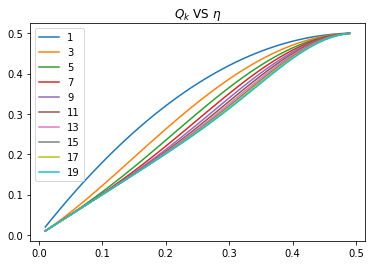

(c)$k=3​$时，注意$\eta \le \frac 1 2 ​$
$$
\begin{aligned}
Q_3(η) 
&=\sum_{i=0}^{1} \binom 3i \Big(\eta^{i+1}(1 - η)^{3-i} + (1 - η)^{i+1}η^{3-i} \Big)\\
&=  \binom 30 \Big(\eta^{1}(1 - η)^{3}+ \eta^{3}(1 - η)^{1} \Big)+ \binom 31\Big( \eta^{2}(1 - η)^{2}+ \eta^{2}(1 - η)^{2} \Big)\\
&= \eta(-\eta^3+3\eta^2-3\eta+1) +\eta^3 -\eta^4 + 6\eta^2(\eta^2-2\eta+1) \\
&=4\eta^4 -8\eta^3+ 3\eta^2 +\eta  \\
&=\eta(4\eta^3-8\eta^2+3\eta+1)  \\
&=6\eta^4-14\eta^3 +9\eta^2-\eta\\
&= \eta(6\eta^3-14\eta^2 +9\eta-1)
\end{aligned}
$$
注意到
$$
\begin{aligned}
4\eta^3-8\eta^2+3\eta+1 \le 1+3\eta &\Leftrightarrow \\
4\eta^3-8\eta^2\le 0&\Leftrightarrow \\
\eta^2(\eta-2)\le 0
\end{aligned}
$$
由$\eta \le \frac 1 2 ​$可知最后一个不等式成立，从而原不等式成立，因此
$$
Q_3(η) \le \eta(1+3\eta) =\eta+3\eta^2
$$
因为$\epsilon_N(x)​$依概率收敛到$0​$，从而有至少$1-\delta​$的概率
$$
\begin{aligned}
E_{\text{out}}(g_N ) &= \mathbb E_x[Q_3(η(x))] +  \mathbb E_x[\epsilon_N (x)]\\
&\le \mathbb E [\eta]+3\mathbb E[\eta^{2}]\\
&=E_{\text{out}}^∗ + 3 \mathbb E [η^2(x)]
\end{aligned}
$$
$k=5$时
$$
\begin{aligned}
Q_5(η) 
&=\sum_{i=0}^{2} \binom 5i \Big(\eta^{i+1}(1 - η)^{5-i} + (1 - η)^{i+1}η^{5-i} \Big)\\
&=  \binom 50  \Big(\eta^{1}(1 - η)^{5}+\eta^{5}(1 - η)^{1} \Big)+
\binom 51 \Big(\eta^{2}(1 - η)^{4} +\eta^{4}(1 - η)^{2} \Big)+ 
\binom 52 \Big( \eta^{3}(1 - η)^{3}+\eta^{3}(1 - η)^{3}  \Big) \\
&=  \eta\Big(\binom 50  (1 - η)^{5}+ \binom 51 \eta(1 - η)^{4} + \binom 52  \eta^{2}(1 - η)^{3} 
+\binom 53\eta^{3}(1 - η)^{2} +\binom 54\eta^{4}(1 - η)^{1}  + \binom 55  \eta^{5} \Big)\\
&\ \ \ \ -\binom 53  \eta^{4}(1 - η)^{2} -\binom 54\eta^{5}(1 - η) -   \eta^{6} +\binom 51 \eta^{4}(1 - η)^{2} +\binom 52 \eta^{3}(1 - η)^{3}+ \binom 50\eta^{5}(1 - η)^{1} \\
&=\eta -10\eta^{4}(1 - η)^{2} -5 \eta^{5}(1 - η) -\eta^6 +5\eta^{4}(1 - η)^{2}
+10 \eta^{3}(1 - η)^{3}+\eta^{5}(1 - η)^{1}\\
&=\eta  - 5\eta^{4}(1 - η)^{2} - \eta^{5}(4-3\eta)+10 \eta^{3}(1 - η)^{3}\\
&=\eta - \eta^4\left(5-10\eta+\eta^2+4\eta-3\eta^2\right)+10 \eta^{3}(1 - η)^{3}\\
&=\eta - \eta^4\left(5-10\eta+\eta^2+4\eta-3\eta^2\right)+10 \eta^{3}(1 - η)^{3}\\
&=\eta - \eta^4\left(-2\eta^2 -6\eta+5 \right)+10 \eta^{3}(1 - η)^{3}\\
&=\eta + \eta^4\left(2\eta^2 +6\eta-5 \right)+10 \eta^{3}(1 - η)^{3} \\
&\le \eta + \eta^4\left(2(\frac 1 2) ^2 +6(\frac 1 2)-5 \right)+10 \eta^{3} \\

&\le \eta+10\eta^{3}
\end{aligned}
$$
因为$\epsilon_N(x)​$依概率收敛到$0​$，从而有至少$1-\delta​$的概率
$$
\begin{aligned}
E_{\text{out}}(g_N ) &= \mathbb E_x[Q_5(η(x))] +  \mathbb E_x[\epsilon_N (x)]\\
&\le \mathbb E [\eta]+10\mathbb E[\eta^{3}]\\
&=E_{\text{out}}^∗ + 10 \mathbb E [η^3(x)]
\end{aligned}
$$
(d)需要利用如下等式
$$
\sum_{k=r+1}^n \binom n k p^k(1-p)^{n-k} = \frac{n!}{r!(n-r-1)!} \int _{0}^p x^r(1-x)^{n-r-1}dx
$$
这个等式证明方法有很多种，最直接的方法就是用分部积分，这里略过该等式的证明，直接利用这个等式。

先对$Q_k(η)$进行变形
$$
\begin{aligned}
Q_k(η) &=\sum_{i=0}^{(k-1)/2} \binom k i \Big(\eta^{i+1}(1 - η)^{k-i} + (1 - η)^{i+1}η^{k-i} \Big)\\
&= \eta  \sum_{i=0}^{(k-1)/2} \binom k i \eta^{i}(1 - η)^{k-i}  +(1-\eta)   \sum_{i=0}^{(k-1)/2} \binom k i(1 - η)^{i}η^{k-i}\\
&=\eta  \sum_{i=0}^{(k-1)/2} \binom k i \eta^{i}(1 - η)^{k-i}  +(1-\eta)   \sum_{i=(k+1)/2}^{k} \binom k iη^i(1 - η)^{k-i}\\
&=\eta  \Big(  \sum_{i=0}^{(k-1)/2} \binom k i \eta^{i}(1 - η)^{k-i} +\sum_{i=(k+1)/2}^{k} \binom k iη^i(1 - η)^{k-i} \Big) +(1-2\eta )\sum_{i=(k+1)/2}^{k} \binom k iη^i(1 - η)^{k-i}\\
&=\eta+(1-2\eta )\sum_{i=(k+1)/2}^{k} \binom k iη^i(1 - η)^{k-i}
\end{aligned}
$$
接下来利用上述等式对$\sum_{i=(k+1)/2}^{k} \binom k iη^i(1 - η)^{k-i}$进行处理，取$r=\frac{k+1}{2},p=\eta$
$$
\sum_{i=(k+1)/2}^{k} \binom k iη^i(1 - η)^{k-i}=  \frac{k!}{(\frac{k-1} 2)!(\frac{k-1} 2)!} \int _{0}^{\eta} x^{\frac{k-1} 2}(1-x)^{\frac{k-1} 2}dx
$$
对积分项进行处理，利用$1-x\le e^{-x}$
$$
\begin{aligned}

x(1-x)&=\frac 1 4(4-4x^2)\\
&=\frac 1 4 (1-(4x^2-4x+1))\\
&=\frac 1 4(1-(2x-1)^2)\\
&\le \frac 1 4 e^{-(2x-1)^2}\\
 x^{\frac{k-1} 2}(1-x)^{\frac{k-1} 2}
 &=\Big(x(1-x)\Big)^{\frac {k-1}{2}}\\
 &\le \frac{1}{2^{k-1} }e^{-\frac{(2x-1)^2(k-1)}{2}}
 \end{aligned}
$$
所以
$$
\\
\int _{0}^{\eta} x^{\frac{k-1} 2}(1-x)^{\frac{k-1} 2}dx \le \frac{1}{2^{k-1}} \int _{0}^{\eta} e^{-\frac{(2x-1)^2(k-1)}{2}} dx 
=   \frac{1}{2^{k-1}}\eta e^{-\frac{(2\epsilon -1)^2(k-1)}{2}}
$$
最后一步是利用了积分中值定理， 其中
$$
\epsilon \in (0,\eta)
$$
因为
$$
\epsilon < \eta\le \frac 1 2
$$
所以
$$
(2\epsilon -1)^2 \neq 0
$$
从而当$k$充分大时
$$
e^{-\frac{(2\epsilon -1)^2(k-1)}{2}} \le \frac 1 k
$$
此时
$$
\int _{0}^{\eta} x^{\frac{k-1} 2}(1-x)^{\frac{k-1} 2}dx  \le \frac{\eta }{k2^{k-1}}
$$
接着使用斯特林公式
$$
n! \approx (\frac{n}{e})^n \sqrt{2\pi n}
$$
那么
$$
k! \approx (\frac{k}{e})^k \sqrt{2\pi k}\\
(\frac{k-1} 2)! \approx  (\frac{\frac{k-1} 2}{e})^{\frac{k-1} 2} \sqrt{2\pi \frac{k-1} 2}=(\frac{\frac{k-1} 2}{e})^{\frac{k-1} 2} \sqrt{\pi{(k-1)} } \\
\begin{aligned}
\frac{k!}{(\frac{k-1} 2)!(\frac{k-1} 2)!} &\approx  \frac{ (\frac{k}{e})^k \sqrt{2\pi k}}{(\frac{\frac{k-1} 2}{e})^{k-1}\pi(k-1)}\\
&= \frac{2^{k-1}} e \frac{\sqrt{2\pi k}}{\pi} (\frac{k}{k-1})^{k}\\
&=\frac{2^{k-1}} e \frac{\sqrt{2\pi k}}{\pi}  (1+\frac 1 {k-1})^{k}\\
&\approx  \frac{2^{k-1}} e \frac{\sqrt{2\pi k}}{\pi}  e\\
&\approx  \frac{2^{k-1}} \pi \sqrt{2\pi k}
\end{aligned}
$$
所以$k$充分大时，
$$
\begin{aligned}
\sum_{i=(k+1)/2}^{k} \binom k iη^i(1 - η)^{k-i}
&=  \frac{k!}{(\frac{k-1} 2)!(\frac{k-1} 2)!} \int _{0}^{\eta} x^{\frac{k-1} 2}(1-x)^{\frac{k-1} 2}dx\\
&\le   \frac{2^{k-1}} \pi \sqrt{2\pi k}  \frac{\eta }{k2^{k-1}} \\
&=C\frac{\eta }{\sqrt k} 
\end{aligned}
$$
从而$k$充分大时，
$$
\begin{aligned}
Q_k(η) 
&=\eta+(1-2\eta )\sum_{i=(k+1)/2}^{k} \binom k iη^i(1 - η)^{k-i}\\
&\le \eta  +C\frac{\eta }{\sqrt k} 
\end{aligned}
$$

因此
$$
Q_k ≤ η(1 + O(k^{-\frac 1 2 }))\\
E_{\text{out}}(g_N ) = \mathbb E_x[Q_k(η(x))] +  \mathbb E_x[\epsilon_N (x)] \approx E^*_{\text{out}}(1+O(k^{-\frac 1 2}))
$$


#### Exercise 6.4 (Page 10) 

Consider the task of selecting a nearest neighbor rule. What’s wrong with the following logic applied to selecting $k$? (Limits are as $N → ∞$.) 

Consider the hypothesis set $\mathcal H_{NN}​$ with $N​$ hypotheses, the $k-NN​$ rules using $k = 1, . . . , N​$. Use the in-sample error to choose a value of $k​$ which minimizes $E_{\text{in}}​$. Using the generalization error bound in Equation (2.1), conclude that $E_{\text{in}} → E_{\text{out}}​$ because $\text{log} N/N → 0​$. Hence conclude that asymptotically, we will be picking the best value of $k​$, based on $E_{\text{in}}​$ alone. 

[Hints: What value of $k​$ will be picked? What will $E_{\text{in}}​$ be? Does your ’hypothesis set’ depend on the data?]

如果取$k=1$，那么离自己最近的点就是本身（距离为$0$），所以$E_{\text{in}}=0$，从而最佳的$k$为$1$，但这个不是模型选择，因为和数据无关，所以这种方式是错误的。


#### Exercise 6.5 (Page 11) 

Consider using validation to select a nearest neighbor rule (hypothesis $g^-$ from $\mathcal H_{\text{train}}$). Let $g_∗^-$ be the hypothesis in $\mathcal H_{\text{train}}$ with minimum $E_{\text{out}}​$. 

(a) Show that if $K/ \text{log}(N - K) → ∞$ then validation chooses a good hypothesis, $E_{\text{out}}(g^{-} ) ≈ E_{\text{out}}(g_*^- ) $. Formally state such a result and show it to be true. [Hint: The statement has to be probabilistic; use the Hoeffding bound and the fact that choosing $g^{-}$ amounts to selecting a hypothesis from among $N - K$ using a data set of size $K​$.] 

(b) If also $N - K → ∞$, then show that $E_{\text{out}}(g^{-} ) →E_{\text{out}}^∗$ (validation results in near optimal performance). [Hint: Use (a) together with Theorem 6.2 which shows that some value of $k$ is good.] 

Note that the selected $g^-​$ is not a nearest neighbor rule on the full data $\mathcal D​$; it is a nearest neighbor rule using data $\mathcal D_{\text{train}}​$, and $k​$ neighbors. Would the performance improve if we used the $k^- -NN​$ rule on the full data set $\mathcal D​$?    

(a)利用Hoeffding不等式
$$
\begin{aligned}
\mathbb P[|E_{\text{out}}(g )-E_{\text{out}}(g_*^- )|>\epsilon] 
&\le 2 (N-K)e^{-2\epsilon^2 K} \\
&= 2e^{\text{log}(N-K)-2\epsilon^2 K}\\
&=2e^{\text{log}(N-K)(1-2\frac{\epsilon^2 K}{\text{log}(N-K)})}
\end{aligned}
$$
因为$K/ \text{log}(N - K) → ∞$，所以$1-2\frac{\epsilon^2 K}{\text{log}(N-K)}\to - \infty$，从而$2e^{\text{log}(N-K)(1-2\frac{\epsilon^2 K}{\text{log}(N-K)})}\to 0$，因此结论成立。

(b)由于$N - K → ∞​$，$K/ \text{log}(N - K) → ∞​$，所以$K\to \infty​$，取$k=\sqrt{K}​$，那么这些数据满足定理6.2的条件，从而
$$
E_{\text{out}}(g_*^- ) \to E_{\text{out}}^∗
$$
结合(a)可知
$$
E_{\text{out}}(g^{-} ) ≈ E_{\text{out}}(g_*^- )  \approx E_{\text{out}}^∗
$$
如果我们在全数据集上使用$k^-  -NN$，那么效果未必会提高，因为该模型只是训练集上效果不错。


#### Exercise 6.6 (Page 12) 

We want to select the value of $k = 1, 3, 5, . . . , 2\lfloor \frac{N+1}2  \rfloor - 1$ using $10$-fold cross validation. Show that the running time is $O(N^3d + N^3 \text{log}N)$

$10​$-fold cross validation相当于有$N​$个测试点，对于一个测试点，计算复杂度为
$$
O(N^2d + N^2 \text{log}k)
$$
所以对于$k = 1, 3, 5, . . . , 2\lfloor \frac{N+1}2  \rfloor - 1$，一共的复杂度为
$$
\sum_{k=1}^{\lfloor \frac{N+1}2  \rfloor } O(N^2d + N^2 \text{log}(2k-1))\le NO(N^2d + N^2 \text{log}N)=O(N^3d + N^3 \text{log}N)
$$


#### Exercise 6.7 (Page 14)

Show the following properties of the $\text{CNN}$ heuristic. Let $S$ be the current set of points selected by the heuristic. 

(a) If $S​$ is not training set consistent, and if $x_∗​$ is a point which is not training set consistent, show that the $\text{CNN}​$ heuristic will always find a point to add to $S​$. 

(b) Show that the point added will ‘help’ with the classification of $x_∗​$ by $S​$; it suffices to show that the new $k​$ nearest neighbors to $x_∗​$ in $S​$ will contain the point added. 

(c) Show that after at most $N - k​$ iterations the $\text{CNN}​$ heuristic must terminate with a training set consistent $S​$.

(a)如果$x_∗​$与训练集不一致，那么
$$
g_S(x_*)\ne g_{\mathcal D}(x_*)
$$
假设${\mathcal D}$中的点按照距离$x_*$的距离远近可以排列为$\{x_1,...,x_N\}$，即
$$
d(x_*,x_1)\le d(x_*,x_2)\le...\le d(x_*,x_N)
$$
因此决定了$ g_{\mathcal D}(x_*)​$的$k​$个点为
$$
x_1,...,x_k
$$
设$S$中决定了$ g_{\mathcal S}(x_*)$的$k$个点为
$$
x_{f_1},...,x_{f_k}
$$
因为$g_S(x_*)\ne g_{\mathcal D}(x_*)$，所以
$$
\{x_1,...,x_k\} \ne \{x_{f_1},...,x_{f_k}\}\\
f_k>k
$$
根据定义可知$x_1,...,x_k​$中至少有大于$\frac k 2​$个点的标记为$g_{\mathcal D}(x_*)​$，$x_{f_1},...,x_{f_k}​$最多有小于$\frac k 2​$个点标记为$g_{\mathcal D}(x_*)​$，考虑如下点集
$$
\{x_1,...,x_{f_k}\}
$$
显然有如下关系
$$
\{x_1,...,x_k\} \subset \{x_1,...,x_{f_k}\}\\
\{x_{f_1},...,x_{f_k}\}\subset \{x_1,...,x_{f_k}\}
$$
结合之前论述，这说明$\{x_1,...,x_{f_k}\}​$中至少有大于$\frac k 2​$个点的标记为$g_{\mathcal D}(x_*)​$，而$\{x_{f_1},...,x_{f_k}\}​$只选择了其中小于$\frac k 2​$个，所以这$f_k​$个点中必然存在标记为$g_{\mathcal D}(x_*)​$的点并且这个点属于$\{x_1,...,x_k\}​$，从而$\text{CNN}​$ heuristic算法可以继续。

(b)根据(a)可知，我们选择的点属于$\{x_1,...,x_k\}​$，为$\mathcal D​$中离$x_*​$最近的$k​$个点之一，这个点也必然属于$S​$中距离$x_*​$最近的$k​$个点，这说明新增加的点会“帮助”$x_*​$的分类。

(c)初始的$S$至少有$k$个点，$S$最多会变为$\mathcal D$，而每一轮增加$1$个点，所以最多经过$N-k$轮迭代。


#### Exercise 6.8 (Page 15) 

(a) Give an algorithmic pseudo code for the recursive branch and bound search for the nearest neighbor, assuming that every cluster with more than $2$ points is split into $2$ sub-clusters. 

(b) Assume the sub-clusters of a cluster are balanced, i.e. contain exactly half the points in the cluster. What is the maximum depth of the recursive search for a nearest neighbor. (Assume the number of data points is a power of $2$). 

(c) Assume balanced sub-clusters and that the bound condition always holds. Show that the time to find the nearest neighbor is $O(d \log N)$. 

(d) How would you apply the branch and bound technique to finding the $k​$-nearest neighbors as opposed to the single nearest neighbor?    

注意$d​$为点集的维度。

(a)

- 如果所属的聚类中点的个数等于$1$，返回该点。
- 如果$||x-\mu_1|| \le ||x-\mu_2|| ​$，那么在$S_1​$上继续这个算法，得到$\hat x_{[1]}​$。
  - 如果$\left\|{x}-\hat{{x}}_{[1]}\right\| \leq\left\|{x}-\mu_{2}\right\|-r_{2}​$，那么返回$\hat x_{[1]}​$。
  - 否则在$S_2​$上继续这个算法，得到$\hat x_{[1]}'​$。
    - 如果$\left\|{x}-\hat{{x}}_{[1]}\right\| \leq\left\|{x}-\hat x_{[1]}'\right\|​$，那么返回$\hat x_{[1]}​$。
    - 否则返回$\hat x_{[1]}' $
- 如果$||x-\mu_2|| \le ||x-\mu_1|| ​$，那么在$S_2​$上继续这个算法，得到$\hat x_{[1]}​$。
  - 如果$\left\|{x}-\hat{{x}}_{[1]}\right\| \leq\left\|{x}-\mu_{1}\right\|-r_{1}$，那么返回$\hat x_{[1]}$。
  - 否则在$S_1​$上继续这个算法，得到$\hat x_{[1]}'​$。
    - 如果$\left\|{x}-\hat{{x}}_{[1]}\right\| \leq\left\|{x}-\hat x_{[1]}'\right\|$，那么返回$\hat x_{[1]}$。
    - 否则返回$\hat x_{[1]}' ​$

(b)因为每次规模减少一半，所以最多递归$\log_2 N$次。

(c)设$n​$个点时上述算法的最坏时间复杂度为$T(n)​$，因为branch bound一直成立，所以每次可以将数据规模缩小一半，因此有以下递推关系
$$
T(n) \le T(\frac n 2) + \theta(d)
$$
因为最多迭代$\log_2 N$次，所以运行时间为
$$
O(d \log_2 N)
$$
(d)推广部分比较复杂，可以查阅相关文献。


#### Exercise 6.9 (Page 20)

With $C$ classes labeled $1, . . . , C$, define $π_c(x) = \mathbb P[c|x]$ (the probability to observe class $c$ given $x$, analogous to $π(x)$). Let $η(x) = 1 - \text{max}_c π_c(x)$. 

(a) Define a target $f(x) = \text{argmax}_c π_c(x)$. Show that, on a test point $x$, $f$ attains the minimum possible error probability of 
$$
e(f(x)) = \mathbb P[f(x) \neq  y] = η(x).
$$
(b) Show that for the nearest neighbor rule $(k = 1)​$, with high probability, the final hypothesis $g_N​$ achieves an error on the test point $x​$ that is 
$$
e(g_N(x)) \overset {N→∞}{\longrightarrow}  \sum_{c=1}^C π_c(x)(1 - π_c(x)).
$$
(c) Hence, show that for large enough $N$, with high probability, 
$$
E_{\text{out}}(g_N) ≤ 2E_{\text{out}}^ ∗ - \frac{C} {C - 1} (E_{\text{out}}^∗ )^2
$$
 [Hint: Show that $\sum_i a^2_i ≥ a^2_1 + \frac{(1-a_1)^2}{C-1}$ for any $a_1 ≥ · · · ≥ a_C ≥ 0$ and $\sum_ia_i = 1$, ]    

(a)
$$
\begin{aligned}
e(f(x)) &= \mathbb P[f(x) \neq  y]\\
&=\sum_{c=1}^C \mathbb P[f(x) \neq  c]  \mathbb P[c|x]\\
&=\sum_{c=1}^C (1- \mathbb P[f(x) =  c] )  π_c(x) \\
&=\sum_{c=1}^Cπ_c(x) - \sum_{c=1 }^C   \mathbb P[f(x) =  c] π_c(x) \\
&=1- \sum_{c=1 }^C   \mathbb P[\text{argmax}_i π_i(x)=  c] π_c(x) \\
&=1- \max_{c} π_c(x)\\
&=\eta(x)
\end{aligned}
$$
(b)
$$
\begin{aligned}
e(g_N(x)) &=\sum_{c=1}^C \mathbb P[g_N(x) \neq  c]  \mathbb P[c|x]\\
&=\sum_{c=1}^C  (1-π_c(x_{[1]}))  π_c(x)
\end{aligned}
$$
当$N→∞​$，有很高的概率，$π_c(x_{[1]})\to π_c(x)​$，所以
$$
e(g_N(x)) \overset {N→∞}{\longrightarrow}  \sum_{c=1}^C π_c(x)(1 - π_c(x)).
$$
(c)先证明题目中给出的辅助结论
$$
\sum_i a^2_i ≥ a^2_1 + \frac{(1-a_1)^2}{C-1} \text{for any }a_1 ≥ · · · ≥ a_C ≥ 0\text{ and }\sum_ia_i = 1
$$
利用柯西不等式即可
$$
\left(\sum_{i=2}^C a^2_i\right) \left(\sum_{i=2}^C 1\right) \ge \left(\sum_{i=2}^C a_i\right)^2=(1-a_1)^2\\
\sum_{i=2}^C a^2_i \ge \frac{(1-a_1)^2}{C-1}
$$
所以
$$
\sum_i a^2_i = a^2_1+\sum_{i=2}^C a^2_i \ge  a^2_1 + \frac{(1-a_1)^2}{C-1}
$$
现在对$  \sum_{c=1}^C  π_c^2(x)$使用上述结论
$$
\sum_{c=1}^C  π_c^2(x) \ge \text{max}_cπ_c^2(x)  + \frac{(1-\text{max}_cπ_c(x) )^2}{C-1}
$$
所以
$$
\begin{aligned}
\sum_{c=1}^C π_c(x)(1 - π_c(x)) 
&=1 -\sum_{c=1}^C  π_c^2(x)\\
&\le 1- \text{max}_cπ_c^2(x) - \frac{(1-\text{max}_cπ_c(x) )^2}{C-1}\\
&\le  1- (1-\eta(x))^2 - \frac{\eta(x)^2}{C-1}\\
&=2\eta(x)-\frac{C}{C-1} \eta(x)^2
\end{aligned}
$$
结合
$$
e(g_N(x)) \overset {N→∞}{\longrightarrow}  \sum_{c=1}^C π_c(x)(1 - π_c(x)).
$$
两边取期望可得
$$
\begin{aligned}
E_{\text{out}}(g_N)
&=\mathbb E[e(g_N(x))] \\
&\le 2\mathbb E[\eta(x)] -\frac{C}{C-1} \mathbb E[\eta(x)^2]\\
&\le  2\mathbb E[\eta(x)] -\frac{C}{C-1} \mathbb E[\eta(x)]^2\\
&=2E_{\text{out}}^ ∗ - \frac{C} {C - 1} (E_{\text{out}}^∗ )^2
\end{aligned}
$$

即
$$
E_{\text{out}}(g_N) ≤  2E_{\text{out}}^ ∗ - \frac{C} {C - 1} (E_{\text{out}}^∗ )^2
$$


#### Exercise 6.10 (Page 23)

You are using $k-\text{NN}$ for regression (Figure 6.7). 

(a) Show that $E_{\text{in}}$ is zero when $k = 1$. 

(b) Why is the final hypothesis not smooth, making step-like jumps?

(c) How does the choice of $k$ control how well $g$ approximates $f$? (Consider the cases $k$ too small and $k$ too large.) 

(d) How does the final hypothesis $g$ behave when $x → ±∞$.    

(a)因为每个点离自己的距离为$0$，所以$k=1$时训练数据的取值即为自己本身的值，从而$E_{\text{in}}=0$

(b)回顾公式
$$
g(x) = \frac 1 k \sum_{i=1}^k y_{[i]}(x)
$$
$y_{[i]}(x)​$表示离$x​$距离第$i​$近的点的取值，随着$x​$的变动，$y_{[i]}(x)​$会跳跃变化，从而$y_{[i]}(x)​$的图像为阶梯函数，因为每个$y_{[i]}(x)​$都是阶梯函数，所以他们的线性组合$g(x)​$也为阶梯函数

(c)$k=1$时，$E_{\text{in}}=0$，过拟合；当$k=N$时，
$$
g(x) = \frac 1 N \sum_{i=1}^N y_{[i]}(x) 
$$
从而$k=N$时，$g(x)=C$，这说明不能取太大或者太小的$k$，应该取大小适中的$k$

(d)当 $x → ±∞$时，离$x$最近的点都是固定的，所以当 $x → ±∞$时，$g(x)$趋近于常数。


#### Exercise 6.11 (Page 24) 

When $r → 0$, show that for the Gaussian kernel, the RBF final hypothesis is $g(x) = y_{[1]}$, the same as the nearest neighbor rule.

[Hint: $g(x) =\frac {\sum_{n=1}^Ny_{[n]}α_{[n]}/α_{[1]}} {\sum_{m=1}^N α_{[m]}/α_{[1]}}$ and show that $α_{[n]}/α_{[1]} → 0$ for $n \ne 1$.]    

原始的式子为
$$
g(x) =\frac {\sum_{n=1}^Ny_{n}α_{n}} {\sum_{m=1}^N α_{m}}
$$
将$||x-x_n||$按从小到大排序为
$$
||x-x_{[1]}||\le  \ldots\le  ||x-x_{[N]}||
$$
将$||x-x_{[n]}||$对应的$\alpha_n,y_n$记为$\alpha_{[n]},y_{[n]}$，所以原式可以改写为
$$
g(x) =\frac {\sum_{n=1}^Ny_{[n]}α_{[n]}} {\sum_{m=1}^N α_{[m]}}
$$
分子分母同除$\alpha_{[1]}​$可得
$$
g(x) =\frac {\sum_{n=1}^Ny_{[n]}α_{[n]}/α_{[1]}} {\sum_{m=1}^N α_{[m]}/α_{[1]}}
$$
回顾$\alpha_n$的计算公式
$$
\alpha_n = \phi \left(\frac{||x-x_n||}{r}\right)
$$
此处为高斯核，将$ \phi(z) =e^{- \frac  1 2 z^2}​$带入可得
$$
\alpha_n = \phi \left(\frac{||x-x_n||}{r}\right) =e^{-\frac{||x-x_n||^2}{2r^2}}
$$
从而
$$
\begin{aligned}
\frac{α_{[n]}}{α_{[1]}} 
&= \frac{\exp \left({-\frac{||x-x_{[n]}||^2}{2r^2}} \right)}
{\exp \left({-\frac{||x-x_{[1]}||^2}{2r^2}}\right)}\\
&=\exp \left({\frac{||x-x_{[1]}||^2-||x-x_{[n]}||^2}{2r^2}}\right)
\end{aligned}
$$
因为$||x-x_{[1]}||< ||x-x_{[n]}||$，所以$||x-x_{[1]}||^2-||x-x_{[n]}||^2 <0$，那么当$r\to 0$时，$\frac{||x-x_{[1]}||^2-||x-x_{[n]}||^2}{2r^2} \to -\infty$，从而
$$
\frac{α_{[n]}}{α_{[1]}} 
=e^{\frac{||x-x_{[1]}||^2-||x-x_{[n]}||^2}{2r^2}} \to 0 (n\ne 1) \\
g(x) =\frac {\sum_{n=1}^Ny_{[n]}α_{[n]}/α_{[1]}} {\sum_{m=1}^N α_{[m]}/α_{[1]}} \to y_{[1]}
$$


#### Exercise 6.12 (Page 27) 

(a) For the Gaussian kernel, what is $g(x)$ as $||x|| → ∞$ for the nonparametric RBF versus for the parametric RBF with fixed $w_n$? 

(b) Let $Z$ be the square feature matrix defined by $Z_{nj} = Φ_j(x_n)$. Assume $Z$ is invertible. Show that $g(x) = w^TΦ(x)$, with $w = Z^{-1}y$ exactly interpolates the data points. That is, $g(x_n) = y_n$, giving $E_{\text{in}}(g) = 0$. 

(c) Does the nonparametric RBF always have $E_{\text{in}}= 0$?    

(a)对于高斯核的非参数RBF，有如下计算公式
$$
g(x) =\frac {\sum_{n=1}^Ny_{n}α_{n}} {\sum_{m=1}^N α_{m}}\\
\alpha_n = \phi\left (\frac{||x-x_n||}{r}\right) =e^{-\frac{||x-x_n||^2}{2r^2}}
$$
因为$||x||\to \infty​$，所以
$$
e^{-\frac{||x-x_n||^2}{2r^2}} \approx e^{-\frac{||x||^2}{2r^2}} \\
g(x) =\frac {\sum_{n=1}^Ny_{n}α_{n}} {\sum_{m=1}^N α_{m}}\approx  \frac {\sum_{n=1}^Ny_{n} e^{-\frac{||x||^2}{2r^2}} } {\sum_{m=1}^N  e^{-\frac{||x||^2}{2r^2}} } =\frac{1 }{N}  \sum_{n=1}^Ny_{n}
$$
对于高斯核的参数RBF，有如下计算公式
$$
g(x) ={\sum_{n=1}^Nw_{n}(x)}\phi \left(\frac{||x-x_n||}{r}\right)  ={\sum_{n=1}^Nw_{n}(x)}e^{-\frac{||x-x_n||^2}{2r^2}}
$$
因为$||x||\to \infty​$，所以
$$
e^{-\frac{||x-x_n||^2}{2r^2}} \to 0 \\
g(x) ={\sum_{n=1}^Nw_{n}(x)}e^{-\frac{||x-x_n||^2}{2r^2}} \to 0
$$
(b)只要求解满足以下条件的$w​$即可
$$
Zw = y
$$
所以$w = Z^{-1}y$。注意
$$
\Phi(x)=\left[ \begin{array}{c}{\Phi_{1}({x})} \\ {\vdots} \\ {\Phi_{N}({x})}\end{array}\right],
Z= \left[ \begin{array}{c}
{\Phi^T(x_1)} \\ 
{\vdots} \\ 
\Phi^T(x_N)
\end{array}\right]
$$
其中
$$
\Phi_{n}({x})=\phi\left(
\frac{\left\|{x}-{x}_{n}\right\|} {r}
\right)
$$
所以
$$
Zw
=\left[ \begin{array}{c}
{\Phi^T(x_1)}w \\ 
{\vdots} \\ 
\Phi^T(x_N)w
\end{array}\right]=\left[ \begin{array}{c}
w^T{\Phi(x_1)} \\ 
{\vdots} \\ 
w^T\Phi(x_N)
\end{array}\right]=\left[ \begin{array}{c}
{y_1} \\ 
{\vdots} \\ 
{y_N}\end{array}\right]
$$
因此
$$
g(x_n) =w^TΦ(x_n)= y_n,  E_{\text{in}}(g) = 0
$$
(c)对于非参数RBF，不能保证$E_{\text{in}}= 0$，因为非参数RBF根本没有考虑$g(x_n)$是否等于$y_n$。


#### Exercise 6.13 (Page 32) 

(a) Fix the clusters to $S_1, . . . , S_k$. Show that the centers which minimize $E_{\text{in}}(S_1, . . . , S_k; \mu_1, . . . , \mu_k)$ are the centroids of the clusters:
$$
\mu _j = \frac 1 {|S_j|} \sum_{x_n∈S_j} x_n
$$
(b) Fix the centers to $\mu_1, . . . , \mu_k$. Show that the clusters which minimize $E_{\text{in}}(S_1, . . . , S_k; \mu_1, . . . , \mu_k)$ are obtained by placing into $S_j$ all points for which the closest center is $\mu_j$, breaking ties arbitrarily: 
$$
S_j = \{x_n : ||x_n - \mu_j|| ≤  ||x_n - \mu_ℓ||\text{ for }ℓ = 1, . . . , k  \}
$$
(a)此时$S_1, . . . , S_k​$固定，对$E_{\text{in}}​$进行改写
$$
\begin{aligned}
E_{\text{in}}(S_1, . . . , S_k; \mu_1, . . . , \mu_k) 
&= \sum_{n=1}^N ||x_n- \mu(x_n)||^2\\
&=\sum_{j=1}^k \sum_{n=1}^{N} ||x_n- \mu_j||^2 I\{ x_n\in  S_j\}
\end{aligned}
$$
现在对于$\sum_{n=1}^{N} ||x_n- \mu_j||^2 I\{ x_n\in  S_j\}​$求最优的$\mu_j​$，
$$
\begin{aligned}
\sum_{n=1}^{N} ||x_n- \mu_j||^2 I\{ x_n\in  S_j\} &= \sum_{n=1}^{N} (x_n- \mu_j)^T (x_n- \mu_j) I\{ x_n\in  S_j\} \\
\nabla  \sum_{n=1}^{N} (x_n- \mu_j)^T (x_n- \mu_j) I\{ x_n\in  S_j\} &= 2  \sum_{n=1}^{N}(x_n- \mu_j) I\{ x_n\in  S_j\}=0\\
\mu _j& = \frac 1 {|S_j|} \sum_{x_n∈S_j} x_n
\end{aligned}
$$
(b)此时$\mu_1, . . . , \mu_k​$固定，直接利用定义即可，回顾计算公式
$$
E_{\text{in}}(S_1, . . . , S_k; \mu_1, . . . , \mu_k)  =  \sum_{n=1}^N ||x_n- \mu(x_n)||^2
$$
所以对于每个$x_n$，找到离自己最近的$\mu(x_n)$可以最小化上式，从而
$$
S_j = \{x_n : ||x_n - \mu_j|| ≤  ||x_n - \mu_ℓ||\text{ for }ℓ = 1, . . . , k  \}
$$


#### Exercise 6.14 (Page 32) 

Show that steps 2 and 3 in Lloyd’s algorithm can never increase $E_{\text{in}}$, and hence that the algorithm must eventually stop iterating. [Hint: There are only a finite number of different partitions]    

steps 2对应上题的(b)，steps 3对应上题的(a)，由上题的讨论知，每迭代一次，$E_{\text{in}}$都不增。此外，由于只有$N$个点，所以分为$k$组的组合只有有限个，从而上述算法相当于在有限中组合中选择$E_{\text{in}}$最小的组合，最终必然会停止。


#### Exercise 6.15 (Page 41)

What would happen in the E-M algorithm described above if you initialized the bump memberships uniformly to $γ_{nj} = 1/k$?    

回顾课本的公式
$$
\begin{aligned}
N_j &=\sum_{n=1}^N \gamma_{nj}\\
w_j&= \frac{N_j}{N}\\
\mu_j&= \frac 1{N_j} \sum_{n=1}^N \gamma_{nj}x_n\\
{\Sigma}_j&= \frac 1{N_j}\sum_{n=1}^N \gamma_{nj}x_nx_n^T - \mu_j\mu_j^T
\end{aligned}
$$
将$γ_{nj} = 1/k​$带入可得
$$
\begin{aligned}
N_j &=\sum_{n=1}^N \frac 1 k =\frac N k\\
w_j&= \frac{N_j}{N}=\frac 1 k \\
\mu_j&= \frac 1{N_j} \sum_{n=1}^N \gamma_{nj}x_n=\frac 1 N \sum_{n=1}^Nx_n\\
{\Sigma}_j &= \frac 1{N_j}\sum_{n=1}^N \gamma_{nj}x_nx_n^T - \mu_j\mu_j^T = \frac 1 N \sum_{n=1}^N x_nx_n^T -\frac 1 {N^2}\left(\sum_{n=1}^Nx_n\right)\left(\sum_{n=1}^Nx_n\right)^T
\end{aligned}
$$
这说明$\mu_j,{\sum}_j ​$为常量。

现在回顾更新公式
$$
γ_{nj}(t+1)= \frac{w_j \mathcal  N(x_n; \mu_j,{\sum}_j)}{\sum_{ℓ}^k w_\mathcal ℓ \mathcal  N(x_n; \mu_\mathcal ℓ,{\sum}_\mathcalℓ)}
$$
注意$\mu_j,{\sum}_j $为常量，所以$N(x_n; \mu_\mathcal ℓ,{\sum}_\mathcalℓ)$为常量，因此
$$
γ_{nj}(t+1)= \frac{\frac 1 k \mathcal  N(x_n; \mu_j,{\sum}_j)}{\sum_{ℓ=1}^k \frac 1 k \mathcal  N(x_n; \mu_\mathcal ℓ,{\sum}_\mathcalℓ)} 
=\frac 1 k
$$
从而更新之后$γ_{nj}(t+1)$依旧为$\frac 1 k$，从而$γ_{nj}$初始值为$\frac 1 k$会导致更新没有效果。


### Part 2: Problems

#### Problem 6.1 (Page 42)

Consider the following data set with $7$ data points. 
$$
\Big( \left[ \begin{matrix}1 \\ 0 \end{matrix}\right] , -1\Big)\Big( \left[ \begin{matrix}0 \\ 1 \end{matrix}\right] , -1\Big)
\Big( \left[ \begin{matrix}0 \\ -1 \end{matrix}\right] , -1\Big)\Big( \left[ \begin{matrix}-1 \\ 0 \end{matrix}\right] , -1\Big)\\
\Big( \left[ \begin{matrix}0 \\ 2 \end{matrix}\right] , +1\Big)\Big( \left[ \begin{matrix}0 \\ -2 \end{matrix}\right] , +1\Big)
\Big( \left[ \begin{matrix}-2 \\0 \end{matrix}\right] , +1\Big)
$$
(a) Show the decision regions for the $1​$-NN and $3​$-NN rules. 

(b) Consider the non-linear transform 
$$
\left[ \begin{matrix}x_1 \\ x_2 \end{matrix}\right] →\left[ \begin{matrix}z_1 \\ z_2 \end{matrix}\right]  = 
\left[ \begin{matrix}\sqrt{x_1^2+x_2^2} \\ \arctan (x_2/x_1) \end{matrix}\right] 
$$
which maps $x$ to $z$. Show the classification regions in the $x$-space for the $1$-NN and $3$-NN rules implemented on the data in the $z$-space.

注意KNN中我们需要计算每个$||x^{(i)} - x^{(j)} ||^2$，这就涉及到计算效率的问题，下面介绍如何使用向量化的方法来实现knn。

我们假设
$$
X = \left[
 \begin{matrix}
  — (x^{(1)})^T— \\
— (x^{(2)})^T— \\
\vdots\\
— (x^{(m)})^T— 
  \end{matrix}
  \right] \in \mathbb R^{m \times d}, Y =  \left[
 \begin{matrix}
  — (y^{(1)})^T— \\
— (y^{(2)})^T— \\
\vdots\\
— (y^{(n)})^T— 
  \end{matrix}
  \right] \in \mathbb R^{n \times d}
$$
其中$x^{(i)} ,y^{(i)} \in \mathbb R^d$，现在的问题是如何高效计算矩阵$D \in \mathbb R^{m\times n}$，其中
$$
D_{i,j} = ||x^{(i)} -y^{(j)} ||^2
$$
首先对$D_{i,j}$进行处理
$$
\begin{aligned}
D_{i,j} &= ||x^{(i)} -y^{(j)} ||^2 \\
&= (x^{(i)} -y^{(j)})^T (x^{(i)} -y^{(j)})\\
&=(x^{(i)})^T x^{(i)} -2(x^{(i)})^Ty^{(j)} +(y^{(j)})^T y^{(j)}
\end{aligned}
$$
那么
$$
\begin{aligned}
D &=  \left[
 \begin{matrix}
   D_{1,1} & ... & D_{1,n} \\
  ... &  ... &  ... \\
   D_{m,1} &  ... & D_{m,n} 
  \end{matrix}
  \right]  \\
  &= \left[
 \begin{matrix}
   (x^{(1)})^T x^{(1)} -2(x^{(1)})^Ty^{(1)} +(y^{(1)})^T y^{(1)} & ... & 
     (x^{(1)})^T x^{(1)} -2(x^{(1)})^Ty^{(n)} +(y^{(n)})^T y^{(n)}\\
  ... &  ... &  ... \\
   (x^{(m)})^T x^{(m)} -2(x^{(m)})^Ty^{(1)} +(y^{(1)})^T y^{(1)}  &  ... & 
    (x^{(m)})^T x^{(m)} -2(x^{(m)})^Ty^{(n)} +(y^{(n)})^T y^{(n)} 
  \end{matrix}
  \right] \\
  &= \left[
 \begin{matrix}
   (x^{(1)})^T x^{(1)} & ... & 
     (x^{(1)})^T x^{(1)} \\
  ... &  ... &  ... \\
   (x^{(m)})^T x^{(m)}  &  ... & 
    (x^{(m)})^T x^{(m)} 
  \end{matrix}
  \right] +\left[
 \begin{matrix}
   (y^{(1)})^T y^{(1)} & ... & 
     (y^{(n)})^T y^{(n)} \\
  ... &  ... &  ... \\
  (y^{(1)})^T y^{(1)} & ... & 
     (y^{(n)})^T y^{(n)}
  \end{matrix}
  \right]-
  2\left[
 \begin{matrix}
   (x^{(1)})^T y^{(1)} & ... & 
     (x^{(1)})^T y^{(n)} \\
  ... &  ... &  ... \\
  (x^{(m)})^T y^{(1)} & ... & 
     (x^{(m)})^T y^{(n)}
  \end{matrix}
  \right]\\
  &=\left[
 \begin{matrix}
   (x^{(1)})^T x^{(1)} \\
  ...  \\
   (x^{(m)})^T x^{(m)}  
  \end{matrix}
  \right]\underbrace{\left[
 \begin{matrix}
1&...&1
  \end{matrix}
  \right]}_{1\times n矩阵}  +\underbrace{\left[
 \begin{matrix}
1\\ 
\vdots \\
1
  \end{matrix}
  \right]}_{m\times 1矩阵} \left[
 \begin{matrix}
   (y^{(1)})^T y^{(1)}  &
  \ldots  &
  (y^{(n)})^T y^{(n)} 
  \end{matrix}
  \right] -2XY^T
\end{aligned}
$$
利用numpy的广播机制上式可以简写如下：

```python
#计算距离矩阵
d1 = np.sum(X ** 2, axis=1).reshape(-1, 1)
d2 = np.sum(Y ** 2, axis=1).reshape(1, -1)
dist = d1 + d2 - 2 * X.dot(Y.T)
```

完整代码如下：

```python
class KNeighborsClassifier_():
    def __init__(self, n_neighbors):
        self.n_neighbors = n_neighbors
        
        
    def fit(self, X, y):
        self.X = X
        self.y = y
        
    def predict(self, X):
        #计算距离矩阵
        d1 = np.sum(X ** 2, axis=1).reshape(-1, 1)
        d2 = np.sum(self.X ** 2, axis=1).reshape(1, -1)
        dist = d1 + d2 - 2 * X.dot(self.X.T)
        
        #找到最近的k个点的索引
        index = np.argsort(dist, axis=1)[:, :self.n_neighbors]
        #计算预测结果
        y = np.sign(np.sum(self.y[index], axis=1))
        
        return y
```

后续作图需要计算每个格子点的预测值，代码如下

```python
def predict(a, b, model):
    """
    预测每个网格点的输出
    输入: a, b为两个m*n的矩阵, model为模型
    输出: 每个(a[i][j], b[i][j])的输出构成的矩阵
    """
    #将网格拉直并拼接
    X = np.c_[a.reshape(-1, 1), b.reshape(-1, 1)]
    #预测
    label = model.predict(X)
    #恢复成网格形状
    label = np.reshape(label, np.shape(a))
    
    return label
```

最后是作图函数：

```python
def draw(X, y, model, n=500, flag=1):
    """
    作图函数, flag=1表示不使用特征转换，其余情况使用特征转换
    """
    # Create color maps
    cmap_light = ListedColormap(['#FFAAAA', '#AAFFAA'])
    cmap_bold = ListedColormap(['#FF0000', '#00FF00'])
    
    x1_min, x1_max = X[:, 0].min() - 2, X[:, 0].max() + 2
    x2_min, x2_max = X[:, 1].min() - 2, X[:, 1].max() + 2
    
    #生成网格数据
    a, b = np.meshgrid(np.linspace(x1_min, x1_max, n),
                       np.linspace(x2_min, x2_max, n))
    if flag==1:
        #计算输出
        c = predict(a, b, model)
    else:
        aa = np.sqrt(a * a + b * b)
        bb = np.arctan(b / (a + 10**(-8)))
        #计算输出
        c = predict(aa, bb, model)
        
    #作图
    plt.pcolormesh(a, b, c, cmap=cmap_light)
    
    plt.scatter(X[:, 0], X[:, 1], edgecolor='k', c=y, cmap=cmap_bold)
    plt.title("2-Class classification (k = %i)" % (model.n_neighbors))
    plt.show()
```

这三个函数由于需要复用，所以均存在helper.py文件中。

(a)

```python
# -*- coding: utf-8 -*-
"""
Created on Sat Apr 20 12:48:23 2019

@author: qinzhen
"""

#(a)
import numpy as np
import helper as hlp

X = np.array([[1, 0], [0, 1], [0, -1], [-1, 0], [0, 2], [0, -2], [-2, 0]])
y = np.array([-1, -1, -1, -1, 1, 1, 1])

knn = hlp.KNeighborsClassifier_(1)
knn.fit(X, y)
hlp.draw(X, y, knn)
```


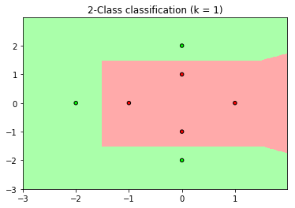

```python
knn = hlp.KNeighborsClassifier_(3)
knn.fit(X, y)
hlp.draw(X, y, knn)
```


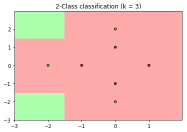

(b)进行特征转换

```python
#(b)
#特征转换
Z = np.c_[np.sqrt(X[:, 0] ** 2 + X[:, 1] ** 2), np.arctan(X[:, 1] / (X[:, 0]  + 10**(-8)))]
knn = hlp.KNeighborsClassifier_(1)
knn.fit(Z, y)
hlp.draw(X, y, knn, flag=0)
```


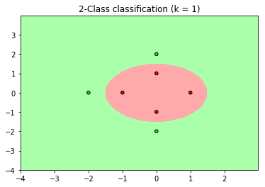

```python
knn = hlp.KNeighborsClassifier_(3)
knn.fit(Z, y)
hlp.draw(X, y, knn, flag=0)
```


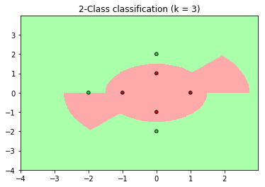

[代码参考地址](http://sklearn.apachecn.org/cn/0.19.0/auto_examples/neighbors/plot_classification.html#sphx-glr-auto-examples-neighbors-plot-classification-py)


#### Problem 6.2 (Page 42)

Use the same data from the previous problem. 

(a) Let the mean of all the $-1$ points be $\mu_{-1}$ and the mean of all the $+1$ points be $\mu_{+1}$. Suppose the data set were condensed into the two prototypes $\{(\mu_{-1}, -1), (\mu_{+1}, +1)\}$ (these points need not be data points, so they are called prototypes). Plot the classification regions for the $1$-NN rule using the condensed data. What is the in-sample error? 

(b) Consider the following approach to condensing the data. At each step, merge the two closest points of the same class as follows: 
$$
(x, c) + (x′, c) → \left( \frac 1 2 (x + x′), c\right)
$$
Again, this method of condensing produces prototypes. Continue con densing until you have two points remaining (of different classes). Plot the $1$-NN rule with the condensed data. What is the in-sample error? 

(a)

```python
# -*- coding: utf-8 -*-
"""
Created on Sat Apr 20 14:00:50 2019

@author: qinzhen
"""

import numpy as np
import helper as hlp
    
X = np.array([[1, 0], [0, 1], [0, -1], [-1, 0], [0, 2], [0, -2], [-2, 0]])
y = np.array([-1, -1, -1, -1, 1, 1, 1])

#(a)
X1 = np.array([[np.mean(X[y>0][:, 0]), np.mean(X[y>0][:, 1])], [np.mean(X[y<0][:, 0]), np.mean(X[y<0][:, 1])]])
y1 = np.array([1, -1])

knn = hlp.KNeighborsClassifier_(1)
knn.fit(X1, y1)
hlp.draw(X, y, knn)
```


可以看出in-sample error为$\frac 3 7$。

(b)写一个处理函数


```python
#(b)
def f(X):
    while(len(X) >1):
        #记录当前距离
        d = float('inf')
        #元素数量
        n = len(X)
        #记录最优元素的下标
        k = 0
        l = 0
        for i in range(n):
            for j in range(i+1, n):
                d1 = np.sum((X[i] - X[j])**2)
                if(d > d1):
                    d = d1
                    k = i
                    l = j
        #生成新的元素
        data = (X[k] + X[l]) / 2
        #删除元素
        X = np.delete(X, l, axis=0)
        X = np.delete(X, k, axis=0)
        #增加新元素
        X = np.append(X, data.reshape(-1, 2), axis=0)
    return X[0]

#划分数据
X_pos = X[y>0]
X_neg = X[y<0]

#新数据
X2 = np.array([f(X_pos), f(X_neg)])
y2 = np.array([1, -1])

knn = hlp.KNeighborsClassifier_(1)
knn.fit(X2, y2)
hlp.draw(X, y, knn)
```


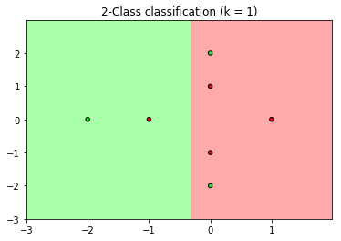

可以看出in-sample error为$\frac 3 7$。


#### Problem 6.3 (Page 42) 

Show that the k-nearest neighbor rule with distance de fined by $d(x, x′) = (x - x′)^TQ(x - x′)​$, where $Q​$ is positive semi-definite, is equivalent to the k-nearest neighbor rule with the standard Euclidean distance in some transformed feature space. Explicitly construct this space. What is the dimension of this space. [Hint: Think about the rank of $Q​$.]

设$Q​$为$n​$阶半正定矩阵，且秩为$r​$，所以$Q​$可以表达为
$$
Q=P^T\text{diag}\{ \lambda_1^2,...,\lambda_r^2,0,...,0\}P\\
P为正交矩阵
$$
记$S= \text{diag}\{ \lambda_1,...,\lambda_r,0,...,0\}$，那么$Q$可以写为如下形式
$$
Q=P^TS^TSP=(SP)^T(SP)
$$
做特征变换
$$
z= SPx
$$
那么
$$
\begin{aligned}
d(z,z^{'})
&=(z-z^{'})^T(z-z^{'})\\
&= (SPx-SPx^{'})^T(SPx-SPx^{'}) \\
&= (x-x^{'})^TP^TS^TSP(x-x^{'})\\
&= (x-x^{'})^T Q(x-x^{'})\\
&=d(x,x^{'})
\end{aligned}
$$
说明特征转换后的欧式距离等价于原空间的距离。


#### Problem 6.4 (Page 42) 

For the double semi-circle problem in Problem 3.1, plot the decision regions for the $1$-NN and $3$-NN rules.

```python
# -*- coding: utf-8 -*-
"""
Created on Sat Apr 20 14:16:19 2019

@author: qinzhen
"""

import helper as hlp

#Step1 产生数据
#参数
rad = 10
thk = 5
sep = 5

#产生数据
X, y = hlp.generatedata(rad, thk, sep, 100)

knn = hlp.KNeighborsClassifier_(1)
knn.fit(X, y)
hlp.draw(X, y, knn)
```


```python
knn = hlp.KNeighborsClassifier_(3)
knn.fit(X, y)
hlp.draw(X, y, knn)
```

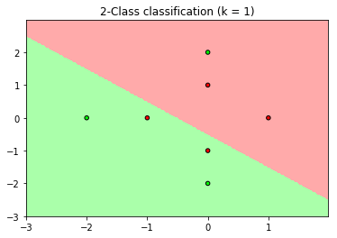

[代码参考地址](http://sklearn.apachecn.org/cn/0.19.0/auto_examples/neighbors/plot_classification.html#sphx-glr-auto-examples-neighbors-plot-classification-py)


#### Problem 6.5 (Page 43) 

Show that each of the Voronoi regions in the Voronoi diagram for any data set is convex. (A set $\mathcal C$ is convex if for any $x, x′ ∈\mathcal  C$ and any $λ ∈ [0, 1], λx + (1 - λ)x′ ∈ \mathcal  C$.)  

这里只对$d(x,x^{'})=(x-x^{'})^T(x-x^{'})$讨论。

设某个Voronoi regions的中心为$x_0​$，记该区域为$\mathcal C​$，其余任意一个Voronoi regions的中心记为$x_1​$，现在任取$\mathcal C​$中一点$x​$，那么必然满足如下条件
$$
d(x_0,x) \le d(x_1,x）
$$
将距离公式带入可得
$$
\begin{aligned}
d(x_0,x) =(x-x_0)^T(x-x_0)&\le d(x_1,x)=(x-x_1)^T(x-x_1)\\
x^Tx-2x_0^Tx+x_0^Tx_0 &\le x^Tx-2x_1^Tx+x_1^Tx_1\\
-2x_0^Tx+x_0^Tx_0&\le -2x_1^Tx+x_1^Tx_1
\end{aligned}
$$
任取$\mathcal C$中两点$x,x'$，计算$d(x_0,λx + (1 - λ)x′),d(x_1,λx + (1 - λ)x′)$
$$
\begin{aligned}
d(x_0,λx + (1 - λ)x')
&=(x_0-λx - (1 - λ)x')^T(x_0-λx - (1 - λ)x')\\

&= x_0^Tx_0 - 2\lambda x_0^Tx-2 (1 - λ)x_0^T{x{'}}+\lambda ^2 x^Tx+(1-\lambda )^2 {x{'}}^Tx{'}+2 λ(1 - λ) x^Tx{'}\\
d(x_1,λx + (1 - λ)x′)&=  x_1^Tx_1 - 2\lambda x_1^Tx-2 (1 - λ)x_1^T{x{'}}+\lambda ^2 x^Tx+(1-\lambda )^2 {x{'}}^Tx{'}+2 λ(1 - λ) x^Tx{'}
\end{aligned}\\
$$
接着计算$d(x_0,λx + (1 - λ)x′)-d(x_1,λx + (1 - λ)x′)​$
$$
\begin{aligned}
d(x_0,λx + (1 - λ)x')-d(x_1,λx + (1 - λ)x')
&=x_0^Tx_0 - 2\lambda x_0^Tx-2 (1 - λ)x_0^T{x'} -   x_1^Tx_1 + 2\lambda x_1^Tx+2 (1 - λ)x_1^T{x'}\\
&=x_0^Tx_0 -x_1^Tx_1+2\lambda( x_1^Tx- x_0^Tx) +2(1-\lambda)(x_1^Tx'-x_0^Tx')
\end{aligned}
$$
现在已有的条件为
$$
\begin{aligned}
-2x_0^Tx+x_0^Tx_0&\le -2x_1^Tx+x_1^Tx_1\\
-2x_0^Tx'+x_0^Tx_0&\le -2x_1^Tx'+x_1^Tx_1
\end{aligned}
$$
所以
$$
\begin{aligned}
2x_1^Tx-2x_0^Tx&\le x_1^Tx_1-x_0^Tx_0\\
 2\lambda(x_1^Tx-x_0^Tx)& \le \lambda( x_1^Tx_1-x_0^Tx_0)\\
 
2x_1^Tx' -2x_0^Tx'&\le x_1^Tx_1-x_0^Tx_0\\
2(1-\lambda)(x_1^Tx' -x_0^Tx') &\le (1-\lambda)(x_1^Tx_1-x_0^Tx_0)
\end{aligned}
$$
带入可得
$$
d(x_0,λx + (1 - λ)x')-d(x_1,λx + (1 - λ)x') \le x_0^Tx_0 -x_1^Tx_1+ \lambda( x_1^Tx_1-x_0^Tx_0)+  (1-\lambda)(x_1^Tx_1-x_0^Tx_0)=0
$$
所以
$$
\\
d(x_0,λx + (1 - λ)x') \le  d(x_1,λx + (1 - λ)x')
$$
这说明$λx + (1 - λ)x′$离$x_0$最近，从而$λx + (1 - λ)x'\in \mathcal C$


#### Problem 6.6 (Page 43) 

For linear regression with weight decay, $g(x) = x^Tw_{\text{reg}}$. Show that 
$$
g(x) = \sum_{n =1}^N x^T(Z^TZ + λΓ^TΓ)^{-1}x_ny_n
$$
A kernel representation of a hypothesis g is a representation of the form 
$$
g(x) =\sum_{n =1}^NK(x, x_n)y_n
$$
where $K(x, x′)​$ is the kernel function. What is the kernel function in this case? One can interpret the kernel representation of the final hypothesis from linear regression as a similarity method, where $g​$ is a weighted sum of the target values $\{y_n\}​$, weighted by the “similarity” $K(x, x_n)​$ between the point $x​$ and the data point $x_n​$. Does this look similar to RBFs?    

构造函数
$$
K(x,x^{'})=x^T (Z^TZ + λΓ^TΓ)^{-1} x{'}
$$
因为$ (Z^TZ + λΓ^TΓ)^{-1}$为半正定对称矩阵，从而$K(x,x^{'})$为kernel。

现在得到的形式
$$
g(x) =\sum_{n =1}^NK(x, x_n)y_n
$$
与RBF的形式
$$
g(x) =\frac {\sum_{n=1}^Ny_{n}α_{n}} {\sum_{m=1}^N α_{m}}=\sum_{n=1}^N\frac {α_{n}} {\sum_{m=1}^N α_{m}}y_{n}
$$
非常接近。


#### Problem 6.7 (Page 43)

Consider the hypothesis set $\mathcal H$ which contains all labeled Voronoi tessellations on $K$ points. Show that $d_{\text{vc}}(\mathcal H) = K$.    

每个Voronoi region可以表示$+1$或者$-1$，相当于一个二进制位，现在有$K$个Voronoi region，相当于$K$个二进制位，从而
$$
d_{\text{vc}}(\mathcal H) = K
$$


#### Problem 6.8 (Page 43)

Suppose the target function is deterministic, so $π(x)=0$ or $π(x) = 1$. The decision boundary implemented by $f$ is defined as follows. The point $x$ is on the decision boundary if every ball of positive radius centered on $x$ contains both positive and negative points. Conversely if $x$ is not on the decision boundary, then some ball around $x$ contains only points of one classification. 

Suppose the decision boundary (a set of points) has probability zero. Show that the simple nearest neighbor rule will asymptotically (in $N$) converge to optimal error $E_{\text{out}}^∗$ (with probability $1$).    

如果$x\notin $边界，那么存在一个半径为$r$的邻域，使得这个邻域内的所有点全部标记为$a,a\in \{+1,-1\}$，所以使用nearest neighbor法则会使得$x$也标记为$a$，因此只要$x$不落在边界上，那么必然有
$$
f(x) =\text{Knn}(x)
$$
因为随着$N$增加，不属于边界的概率$\to  1$，所以
$$
E_{\text{out}} \to E_{\text{out}}^∗
$$


#### Problem 6.9 (Page 43) 

Assume that the support of $P​$ is the unit cube in $d​$ dimensions. Show that for any $\epsilon, δ > 0​$, there is a sufficiently large $N​$ for which, with probability at least $1 - δ​$, 
$$
\underset {x∈\mathcal X} {\text{sup }}  ||x - x_{(k)}(x)|| ≤ \epsilon
$$
这里证明比原题中更强的结论，不采用原题中提示的思路。

$[0,1]^d$中的点服从均匀分布，所以给定一个点$x$，任取一个点$y$
$$
\mathbb P[||x-y||\le \epsilon] =S_d(\epsilon) \triangleq p\\
S_d(r)表示d维空间中半径为r的球的体积
$$
现在考虑事件$||x - x_{(k)}(x)|| ≤ \epsilon$发生的概率，这个事件发生当且仅当$x_1,...,x_N$中至少有$k$个点满足$||x - y|| ≤ \epsilon$，而$\mathbb P[||x - y|| ≤ \epsilon]=p$，所以这个概率可以写为
$$
P=\sum_{i=k}^ Np^i(1-p)^{N-i}=1- \sum_{i=0}^{k-1}p^i(1-p)^{N-i}
$$
因为$k$为固定的数，所以随着$N$增加
$$
\begin{aligned}
p^i(1-p)^{N-i} &\to 0(i=0,...,k-1)\\
\sum_{i=0}^{k-1}p^i(1-p)^{N-i}&\to 0
\end{aligned}
$$
因此
$$
P=\sum_{i=k}^ Np^i(1-p)^{N-i}=1- \sum_{i=0}^{k-1}p^i(1-p)^{N-i} \to 1
$$
所以
$$
\underset {x∈\mathcal X} {\text{sup }}  ||x - x_{(k)}(x)|| ≤ \epsilon 发生的概率趋近于1
$$
结论成立。


#### Problem 6.10 (Page 44)

Let $E_{\text{out}}(k) = \text{lim}_{N→∞} E_{\text{out}}(g_N(k))$, where $g_N(k)$ is the $k$-nearest neighbor rule on a data set of size $N$, where $k$ is odd. Let $E_{\text{out}}^*$ is the optimal out-of-sample probability of error. Show that (with probability $1$), 
$$
E_{\text{out}}^* ≤E_{\text{out}}(k) ≤E_{\text{out}}(k-2) ≤ · · · ≤ E_{\text{out}}(1)≤ 2E_{\text{out}}^*
$$

课本第六页已经说明了
$$
E_{\text{out}}(1) \le 2E_{\text{out}}^*
$$
所以接下来只要证明$E_{\text{out}}(k)$关于$k$单调递减即可，这个证明思路非常巧妙，参考[A Probabilistic Theory of Pattern Recognition](https://book.douban.com/subject/1465496/)第73页。

证明前先介绍加权$k-​$NN，即
$$
g_{w,k}(x) =\text{sign}\left(\sum_{i=1}^k w_iy_{[i]}(x)\right)，其中\sum_{i=1}^kw_{i}=1
$$
不难看出，我们常用的$k-$NN即为上式中$w_i=\frac 1 k $的特殊情形，不仅如此，加权$k -$NN给我们一种看待$(k-j)-$NN的新视角：即$(k-j)-$NN为加权$k-$NN在$w_i = \frac{1}{k-j},i=1,...j$的特殊情形，所以我们要证明的结论相当于$E_{\text{out}}(k) $取最小值当且仅当
$$
g_k(x) =\text{sign}\left (\sum_{i=1}^k\frac 1 k y_{[i]}(x)\right)
$$
下面开始证明：

假设
$$
\mathbb P(y=1|x) = p,\mathbb P(y=-1|x) = 1-p
$$
所以
$$
E_{\text{out}}(g_{w,k}(x)) 
= \mathbb P\left(\sum_{i=1}^k w_iy_{[i]}(x)>0\right)(1-p) + 
\mathbb P\left(\sum_{i=1}^k w_iy_{[i]}(x)\le 0\right) p
$$
如果$p=\frac 1 2$，那么
$$
E_{\text{out}}(g_{w,k}(x)) = \mathbb P\left(\sum_{i=1}^k w_iy_{[i]}(x)>0\right)\times \frac 12  + 
 \mathbb P\left(\sum_{i=1}^k w_iy_{[i]}(x)\le 0\right)\times \frac 12  = \frac 12
$$
此时
$$
E_{\text{out}}(g_{w,k-2i}(x))=E_{\text{out}}(k-2i)=\frac 12 , 1\le k-2i \le k
$$


结论平凡。所以只需要考虑$p\neq \frac 1 2$的情形，又由对称性，我们假设$p < \frac 1 2​$，将上式化为
$$
\begin{aligned}
E_{\text{out}}(g_{w,k}(x))
&= \mathbb P\left(\sum_{i=1}^k w_iy_{[i]}(x)>0\right)(1-p) + 
\mathbb P\left(\sum_{i=1}^k w_iy_{[i]}(x)\le 0\right) p\\
&=  \mathbb P\left(\sum_{i=1}^k w_iy_{[i]}(x)>0\right)(1-p) +  
\left(1- \mathbb P\left(\sum_{i=1}^k w_iy_{[i]}(x)>0\right)\right)p\\
&=p+(1-2p) \mathbb P\left(\sum_{i=1}^k w_iy_{[i]}(x)>0\right)
\end{aligned}
$$
因为边界情形可以忽略，所以我们假设
$$
\mathbb P\left(\sum_{i=1}^k w_iy_{[i]}(x)=0\right)=0
$$
记$N_l$为$\sum I_{y_{[i]}(x)=1}=l$且$\sum_{i=1}^k w_iy_{[i]}(x)>0$的数量，注意到
$$
\begin{aligned}
&\sum I_{y_{[i]}(x)=1}=l,\sum_{i=1}^k w_iy_{[i]}(x)<0 \Leftrightarrow \\
&\sum I_{y_{[i]}(x)=-1}=k-l,\sum_{i=1}^k w_i(-y_{[i]}(x))>0 \Leftrightarrow \\
&\sum I_{-y_{[i]}(x)=1}=k-l,\sum_{i=1}^k w_i(-y_{[i]}(x))>0
\end{aligned}
$$
这说明使得$\sum I_{y_{[i]}(x)=1}=l$且$\sum_{i=1}^k w_iy_{[i]}(x)<0$的数量为$N_{k-l}$，注意到$\sum I_{y_{[i]}(x)=1}=l$的数量为$\binom k l$，所以
$$
N_l + N_{k-l} =\binom k l
$$
特别的，如果$k$为偶数，那么对上式令$l=\frac  k 2$可得
$$
\begin{aligned}
N_{\frac k 2 } + N_{\frac k 2 }&=\binom k {\frac k 2 } \\
 N_{\frac k 2 }& =\frac 1  2\binom k {\frac k 2 }
\end{aligned}
$$
利用该记号对$\mathbb P\left(\sum_{i=1}^k w_iy_{[i]}(x)>0\right)​$进行处理
$$
\begin{aligned}
\mathbb P\left(\sum_{i=1}^k w_iy_{[i]}(x)>0\right)
&= \sum_{l=0}^k  N_l p^{l}(1-p)^{k-l} \\
&= \sum_{l< \frac k 2 }N_l p^{l}(1-p)^{k-l} +
\sum_{l> \frac k 2 }N_l p^{l}(1-p)^{k-l} +
 \frac 1  2\binom k {\frac k 2 }p^{\frac k 2 }(1-p)^{\frac k 2}I_{k为偶数} \\
 &=\sum_{l< \frac k 2 }N_l p^{l}(1-p)^{k-l} +
\sum_{l< \frac k 2 }N_{k-l} p^{k-l}(1-p)^{l} +
 \frac 1  2\binom k {\frac k 2 }p^{\frac k 2 }(1-p)^{\frac k 2}I_{k为偶数}&对第二项令l'=k-l \\
 &=\sum_{l< \frac k 2 }N_l p^{l}(1-p)^{k-l} +
\sum_{l< \frac k 2 }\Big(\binom k l-N_l\Big) p^{k-l}(1-p)^{l} +
 \frac 1  2\binom k {\frac k 2 }p^{\frac k 2 }(1-p)^{\frac k 2}I_{k为偶数}\\
 &=\sum_{l< \frac k 2 }\binom k lp^{k-l}(1-p)^{l} + \sum_{l< \frac k 2 }
 N_l \Big(p^{l}(1-p)^{k-l} -p^{k-l}(1-p)^{l}\Big) +\frac 1  2\binom k {\frac k 2 }p^{\frac k 2 }(1-p)^{\frac k 2}I_{k为偶数} \\
 &=I + II+III
\end{aligned}
$$
注意到$I,III​$和权重$w_i​$无关，所以只要考虑第二项即可，注意$p<\frac 1 2​$，所以
$$
(1-p)^i > p^i
$$
因此
$$
\begin{aligned}
\sum_{l< \frac k 2 }
 N_l \Big(p^{l}(1-p)^{k-l} -p^{k-l}(1-p)^{l}\Big)
 &=\sum_{l< \frac k 2 }
 N_l p^{l}(1-p)^{l}\Big( (1-p)^{k-2l}-p^{k-2l}\Big)\\
 &\ge 0
\end{aligned}
$$
等号成立当且仅当$N_l =0(\forall l<\frac k 2)$，即
$$
\forall l<\frac k 2,\sum I_{y_{[i]}(x)=1}=l且\sum_{i=1}^k w_iy_{[i]}(x)>0的数量为0
$$
注意当$w_i =\frac 1 k,1\le i \le k$时，上述命题成立，所以
$$
\begin{aligned}
E_{\text{out}}(g_{w,k}(x))
&=p+(1-2p) \mathbb P\left(\sum_{i=1}^k w_iy_{[i]}(x)>0\right)\\
&\ge p+(1-2p) \mathbb P\left(\frac 1 k\sum_{i=1}^k y_{[i]}(x)>0\right)\\
&=E_{\text{out}}(k)
\end{aligned}
$$
由之前描述可知$E_{\text{out}}(k-2)$可以理解为$E_{\text{out}}(k)$的加权情形，所以
$$
E_{\text{out}}^* ≤E_{\text{out}}(k) ≤E_{\text{out}}(k-2) ≤ · · · ≤ E_{\text{out}}(1)≤ 2E_{\text{out}}^*
$$


#### Problem 6.11 (Page 44)

For the $1​$-NN rule in two dimensions ($d = 2​$) and data set $(x_1, y_1), . . . , (x_N, y_N)​$, consider the Voronoi diagram and let $V_n​$ be the Voronoi region containing the point $x_n​$. Two Voronoi regions are adjacent if they have a face in common (in this case an edge). Mark a point $x_n​$ if the classification of every Voronoi region neighboring $V_n​$ is the same as $y_n​$. Now condense the data by removing all marked points. 

(a) Show that the condensed data is consistent with the full data for the $1​$-NN rule. 

(b) How does the out-of-sample error for the $1$-NN rule using condensed data compare with the $1$-NN rule on the full data (worst case and on average)?    

(a)假设删除的点为$x_1 ,\ldots ,x_k$，由定义可知删除$x_i$这些点当且仅当$V_i$的邻居和$x_i$的分类一致，而离$x_i$最近的点必然在这些邻居区域内，所以分类结果与原数据的分类结果一致。

(b)回顾课本第$7$页的公式
$$
\begin{aligned}
E_{\text {out}}(g_N) &= 2\mathbb E[\eta(x)] -2 \mathbb E[\eta^2(x)]+  \mathbb E_x[\epsilon_N(x)]\\
\epsilon_N(x)&=(2\pi (x) -1)(\pi (x)-\pi (x_{[1]}))
\end{aligned}
$$
从均值角度考虑，condensed data和原数据应该基本一致，从最坏情况考虑，condensed data减少了$N$，所以$x_{[1]}$和$x$的距离会更大一些，从而$\pi (x)-\pi (x_{[1]})$绝对值会更大，从而condensed data的误差更大（这里我只能这样简单分析，不会严谨证明。）


#### Problem 6.12 (Page 44)

For the 1-NN rule, define the influence set $S_n​$ of point $x_n ​$ as the set of points of the same class as $x_n​$ which are closer to $x_ n ​$ than to a  point of a different class. So $x_m ∈ S_n​$ if
$$
\left\|{x}_{n}-{x}_{m}\right\|<\left\|{x}_{m^{\prime}}-{x}_{m}\right\| \text { for all } m^{\prime} \text { with } y_{m^{\prime}} \neq y_{m}
$$
We do not allow $x_n$ to be in $S_n$. Suppose the largest influence set is $S_{n^∗}$ , the influence set of $x_{n^∗}$ (break ties according to the data point index). Remove all points in $S_{n^∗}$ . Update the remaining influence sets by deleting $x_{n^∗}$ and $S_{n^∗}$ from them. Repeat this process until all the influence sets are empty. The set of points remaining is a condensed subset of $\mathcal  D$.

(a) Show that the remaining condensed set is training set consistent.
(b) Do you think this will give a smaller or larger condensed set than the CNN algorithm discussed in the text. Explain your intuition?
(c) Give an efficient algorithm to implement this greedy condensing. What is your run time.

(a)假设第一步删除的点为$x_1​$，对应的influence set为$S_1​$，$\forall x_{i} \in S_1​$，由定义可知$\forall x_j , y_j \neq y_{i} ​$，我们必然有
$$
\| x_i - x_1 \|<\| x_i - x_j \|, y_i =y_1
$$
由算法步骤，$x_1$会从其他点的influence set集合中删除，所以$x_1$会**一直保留**，因此算法结束后，我们依然有
$$
\| x_i - x_1 \|<\| x_i - x_j \|,y_i =y_1,\forall x_j , y_j \neq y_{i}
$$
所以$x_i$的分类不会变，所以剩余的集合是training set consistent。

(b)我认为这种算法最后的condensed set会更小，因为一次删除的点可能较多。

(c)见下一题的实验部分。


#### Problem 6.13 (Page 45)

Problem 6.13 Construct a data set with 1,000 points as shown. The data are generated from a 4-center GMM.The centers are equally spaced on the unit circle,and covariance matrices all equal to $σI$ with $σ = 0.15$. The weight of each Gaussian bump is $\frac 1 4$.Points generated from the first and third centers have $y_n = +1$ and the other two centers
are $−1$. To generate a point, first determine a bump (each has probability $\frac 14$ ) and then generate a point from the Gaussian for that bump.

(a) Implement the CNN algorithm in the text and the condensing algorithm from the previous problem.
(b) Run your algorithm on your generated data and give a plot of the condensed data in each case.
(c) Repeat this experiment 1,000 times and compute the average sizes of the condensed sets for the two algorithms.

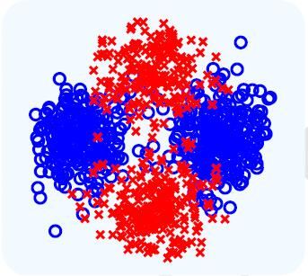

根据课本中的图像，推测标准差应该不是$0.15$，经过尝试后，这里取$\sigma =0.5$。

(a)按照题目要求实现算法，这个算法实现的不够简洁。

```python
# -*- coding: utf-8 -*-
"""
Created on Sun Apr 21 13:19:20 2019

@author: qinzhen
"""

import numpy as np
import matplotlib.pyplot as plt
import helper as hlp


#### (a)
def Data(n, flag=1, scale=0.15):
    """
    生成n个点，flag=1表示圆心固定
    """
    if flag:
        #中心
        center = np.array([[0, 1, 0, -1], [1, 0, -1, 0]]).T
    else:
        #按极坐标方式生成点
        theta = np.random.uniform(0, 2 * np.pi, size=4)
        center = np.c_[np.cos(theta), np.sin(theta)]
    #生成X
    X = np.random.normal(scale=scale, size=(n, 2))
    #生成每个数据对应的分类
    index = np.random.randint(0, 4, size=n)
    #增加中心
    X += center[index] 
    #生成标签
    y = np.copy(index)
    y[y%2==1] = -1
    y[y%2==0] = 1
    
    return X, y

# =============================================================================
# CNN1
# =============================================================================
def CNN1(X, y, k=1):
    n = X.shape[0]
    #初始化
    index = np.random.choice(np.arange(n), size=k, replace=False)
    #condense data
    X_cd = X[index, :]
    y_cd = y[index]
    #剩余的点
    X1 = np.delete(X, index, axis=0)
    y1 = np.delete(y, index, axis=0)
    
    Ein = []
    while True:
        #训练knn
        nn = hlp.KNeighborsClassifier_(1)
        nn.fit(X_cd, y_cd)
        #预测结果
        y_pred = nn.predict(X)
        #错误率
        ein = np.mean(y_pred != y)
        Ein.append(ein)
        
        if ein != 0:
            #找到分类错误的点
            i1 = np.where(y_pred != y)[0][0]
            #找到y1中和y[ii]相同的点的索引
            i2 = np.where(y1 == y[i1])[0][0]
            #添加至condese data
            X_cd = np.r_[X_cd, X1[i2, :].reshape(1, 2)]
            y_cd = np.r_[y_cd, y1[i2]]
            #删除该数据
            X1 = np.delete(X1, i2, axis=0)
            y1 = np.delete(y1, i2, axis=0)
        else:
            break
        
    return X_cd, y_cd

# =============================================================================
# CNN2
# =============================================================================
def dist(X1, X2):
    """
    计算X1, X2每一项之间的距离
    """
    d1 = np.sum(X1 ** 2, axis=1).reshape(-1, 1)
    d2 = np.sum(X2 ** 2, axis=1).reshape(1, -1)
    dist = d1 + d2 - 2 * X1.dot(X2.T)
    
    return dist

def influence_set(d1, d2):
    """
    根据距离生成全体influence_set, 用字典存储
    d1为标签相同的点的距离, d2为标签不同的点的距离
    """
    #计算不同标签的最短距离
    d3 = np.min(d2, axis=1)
    #找到相同标签中小于最短距离的部分
    i1 = d1 < d3
    #找到influence set对应的索引
    u, v = np.where(i1)
    #生成influence set
    influe_set = {}
    for i in np.unique(u):
        #使用集合
        influe_set[i] = set(v[u==i])
        
    return influe_set

def influe_set_helper(i, key, X, influe_set):
    """
    删除元素最多的influence set并返回对应的x
    key为influence set所在字典的键，i为元素最多的influence set的索引，
    X为点集，influe_set为influence set所在字典
    """
    
    index = key[i]
    #需要删除的集合
    x_del = influe_set[index]
    x_del.add(index)
    #influence set所在的字典
    for j in key:
        #如果索引不是influence set对应的x，则更新其influence set
        if j != index:
            #删除公共元素
            influe_set[j] -= x_del
            #如果为空，则删除该influence set
            if influe_set[j] == set():
                influe_set.pop(j)
        #如果索引是influence set对应的x，则删除influence set
        else:
            influe_set.pop(j)
    
    return influe_set, X[index]

def CNN2(X, y):
    #将数据分为两类
    X_pos = X[y==1]
    X_neg = X[y==-1]
    
    #计算距离矩阵
    dist_pos = dist(X_pos, X_pos)
    
    #设置对角线的值
    np.fill_diagonal(dist_pos, np.inf)
    dist_neg = dist(X_neg, X_neg)
    
    #设置对角线的值
    np.fill_diagonal(dist_neg, np.inf)
    dist_pos2neg = dist(X_pos, X_neg)
    
    #influcence set
    influe_set_pos = influence_set(dist_pos, dist_pos2neg) 
    influe_set_neg = influence_set(dist_neg, dist_pos2neg.T)

    #condense data
    X_cd = []
    y_cd = []
    while True:
        #计算influence set非空的数量
        len_pos = np.array([len(influe_set_pos[i]) for i in influe_set_pos])
        len_neg = np.array([len(influe_set_neg[i]) for i in influe_set_neg])
        #得到键
        pos_key = [i for i in influe_set_pos]
        neg_key = [i for i in influe_set_neg]

        
        if (len(len_pos) > 0 and len(len_neg) > 0):
            #找到最多元素的influence set
            i1 = np.argmax(len_pos)
            i2 = np.argmax(len_neg)
            if len_pos[i1] > len_neg[i2]:
                influe_set_pos, x = influe_set_helper(i1, pos_key, X_pos, influe_set_pos)
                X_cd.append(x)
                y_cd.append(1)
            else:
                influe_set_neg, x = influe_set_helper(i2, neg_key, X_neg, influe_set_neg)
                X_cd.append(x)
                y_cd.append(-1)
        elif len(len_pos) > 0:
            i1 = np.argmax(len_pos)
            influe_set_pos, x = influe_set_helper(i1, pos_key, X_pos, influe_set_pos)
            X_cd.append(x)
            y_cd.append(1)
        elif len(len_neg) > 0:
            i2 = np.argmax(len_neg)
            influe_set_neg, x = influe_set_helper(i2, neg_key, X_neg, influe_set_neg)
            X_cd.append(x)
            y_cd.append(-1)
        else:
            break
        
    return np.array(X_cd), np.array(y_cd)
```

(b)首先查看原始数据的分类结果

```python
n = 1000
X, y = Data(n, 1, scale=0.5) 
plt.scatter(X[:, 0], X[:, 1], edgecolor='k', c=y)
plt.show()
#原始数据的分类结果
nn = hlp.KNeighborsClassifier_(1)
nn.fit(X, y)
hlp.draw(X, y, nn, n=500, flag=1)
```

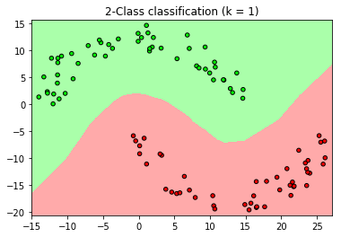

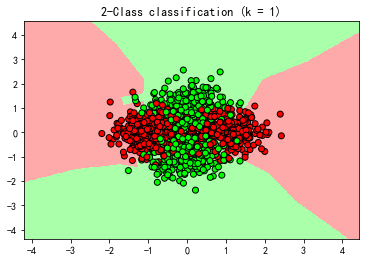

CNN1的算法结果

```python
#### CNN1
#condense data的分类结果
X_cd, y_cd = CNN1(X, y)
nn = hlp.KNeighborsClassifier_(1)
nn.fit(X_cd, y_cd)
hlp.draw(X_cd, y_cd, nn, n=500, flag=1)
```

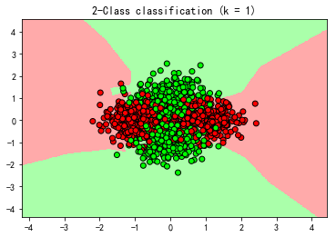

CNN2的算法结果

```python
#### CNN2
#condense data的分类结果
X_cd, y_cd = CNN2(X, y)
nn = hlp.KNeighborsClassifier_(1)
nn.fit(X_cd, y_cd)
hlp.draw(X_cd, y_cd, nn, n=500, flag=1)
```

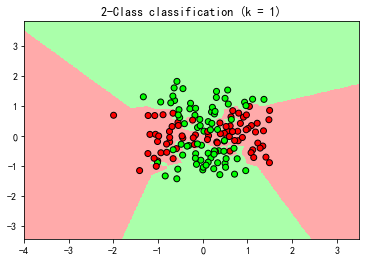

(c)如果取$\sigma  =0.5$，那么这部分运行时间非常长，不建议运行，不过从之前的例子可以看出，算法2的产生condensed sets集合的元素数量要明显小于算法1。

```python
'''
#### 运行时间较长，不建议运行
m = 10
NUM1 = []
NUM2 = []
for i in range(m):
    X, y = Data(n, 1, scale=0.5)
    X_cd1, y_cd1 = CNN1(X, y)
    NUM1.append(len(y_cd1))
    
    X_cd2, y_cd2 = CNN2(X, y)
    NUM2.append(len(y_cd2))
    
plt.hist(NUM1)
plt.title("CNN1")
plt.show()
print("Average sizes of the condensed sets is {}(CNN1)".format(np.mean(NUM1)))

plt.hist(NUM2)
plt.title("CNN2")
plt.show() 
print("Average sizes of the condensed sets is {}(CNN2)".format(np.mean(NUM2)))
'''
```


#### Problem 6.14 (Page 45)

Run the condensed nearest neighbor (CNN) algorithm for $3​$-NN on the digits data. Use all the data for classifying “$1​$” versus “not $1​$”.
(a) Set $N = 500​$ and randomly split your data into a training set of size $N​$ and use the remaining data as a test/validation set.
(b) Use the $3​$-NN algorithm with all the training data and evaluate its performance: report $E_{\text{in}}​$ and $E_{\text{test}}​$.
(c) Use the CNN algorithm to condense the data. Evaluate the performance of the $3​$-NN rule with the condensed data: report $E_{\text{in}}​$ and $E_{\text{out}}​$.
(d) Repeat parts (b) and (c) using $1,000​$ random training-test splits and report the average $E_{\text{in}}​$ and $E_{\text{out}}​$ for the full versus the condensed data.

此题没有给数据，我使用的是课程官网提供的features.train以及features.test数据。

(a)划分数据

```python
# -*- coding: utf-8 -*-
"""
Created on Mon Apr 22 20:19:55 2019

@author: qinzhen
"""

import helper as hlp
import numpy as np

#### (a)
#获得数据
Train = np.genfromtxt("features.train")
Test = np.genfromtxt("features.test")

N = 500
m = 100
y_train, X_train = Train[: N, 0], Train[: N, 1:]
y_train[y_train != 1] = -1
y_test, X_test = Test[: m, 0], Test[: m, 1:]
y_test[y_test != 1] = -1
```

(b)使用3-NN算法：

```python
#### (b)
#训练模型
nn = hlp.KNeighborsClassifier_(3)
nn.fit(X_train, y_train)
y_test_pred = nn.predict(X_test)
y_train_pred = nn.predict(X_train)

#计算错误率
ein = np.mean(y_train != y_train_pred)
etest = np.mean(y_test != y_test_pred)
print("Ein of 3-NN is {}".format(ein))
print("Etest of 3-NN is {}".format(etest))
#作图
hlp.draw(X_train, y_train, nn, n=500, flag=1)
```

```
Ein of 3-NN is 0.008
Etest of 3-NN is 0.03
```

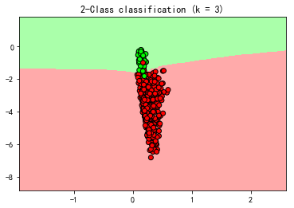

(c)使用C-NN

```python
#### (c)
X_cd, y_cd = hlp.CNN(X_train, y_train, k=3)
#训练模型
nn = hlp.KNeighborsClassifier_(3)
nn.fit(X_cd, y_cd)
y_test_pred = nn.predict(X_test)
y_train_pred = nn.predict(X_train)

#计算错误率
ein = np.mean(y_train != y_train_pred)
etest = np.mean(y_test != y_test_pred)
print("Ein of C-NN is {}".format(ein))
print("Etest of C-NN is {}".format(etest))
#作图
hlp.draw(X_cd, y_cd, nn, n=500, flag=1)
```

```
Ein of C-NN is 0.008
Etest of C-NN is 0.03
```


(d)重复多次试验，查看评价结果：

```python
#%%time
#### (d)
N = 1000
#索引
train_index = np.arange(Train.shape[0])
test_index = np.arange(Test.shape[0])

Ein_KNN = []
Etest_KNN = []
Ein_CNN = []
Etest_CNN = []

for i in range(N):
    #训练数据
    train = Train[np.random.choice(train_index, size=m, replace=False)]
    y_train, X_train = train[:, 0], train[:, 1:]
    y_train[y_train != 1] = -1
    #测试数据
    test = Test[np.random.choice(test_index, size=n, replace=False)]
    y_test, X_test = test[:, 0], test[:, 1:]
    y_test[y_test != 1] = -1
    
    #训练KNN
    nn = hlp.KNeighborsClassifier_(3)
    nn.fit(X_train, y_train)
    y_test_pred = nn.predict(X_test)
    y_train_pred = nn.predict(X_train)

    #计算错误率
    ein = np.mean(y_train != y_train_pred)
    etest = np.mean(y_test != y_test_pred)
    Ein_KNN.append(ein)
    Etest_KNN.append(etest)
    
    #训练CNN
    X_cd, y_cd = hlp.CNN(X_train, y_train, k=3)
    #训练模型
    nn = hlp.KNeighborsClassifier_(3)
    nn.fit(X_cd, y_cd)
    y_test_pred = nn.predict(X_test)
    y_train_pred = nn.predict(X_train)

    #计算错误率
    ein = np.mean(y_train != y_train_pred)
    etest = np.mean(y_test != y_test_pred)
    Ein_CNN.append(ein)
    Etest_CNN.append(etest)
    
print("meanEin of C-NN is {}".format(np.mean(Ein_CNN)))
print("meanEtest of C-NN is {}".format(np.mean(Etest_CNN)))

print("meanEin of K-NN is {}".format(np.mean(Ein_KNN)))
print("meanEtest of K-NN is {}".format(np.mean(Etest_KNN)))
```

```
meanEin of C-NN is 0.05360000000000001
meanEtest of C-NN is 0.05788100000000001
meanEin of K-NN is 0.01168
meanEtest of K-NN is 0.024625000000000005
```


#### Problem 6.15 (Page 45)

This problem asks you to perform an analysis of the branch and bound algorithm in an idealized setting. Assume the data is partitioned and each cluster with two or more points is partitioned into two sub-clusters of exactly equal size. (The number of data points is a power of $2$). 

When you run the branch and bound algorithm for a particular test point $x​$, sometimes the bound condition will hold, and sometimes not. If you generated the test point $x​$ randomly, the bound condition will hold with some probability. Assume the bound condition will hold with probability at least $p ≥ 0​$ at every branch, independently of what happened at other branches. Let $T (N)​$ be the expected time to find the nearest neighbor in a cluster with $N​$ points. Show: $T (N) = O(d \log_2 N + dN^{\log_2(2-p)})​$ (sublinear for $p > 0​$). [Hint: Let $N = 2^k​$; show that $T (N) ≤ 2d + T ( \frac N2 ) + (1 - p)T ( \frac N2 )​$.]    

这里$d$的含义为数据为$d$维。回顾Exercise 6.8中的算法

- 如果所属的聚类中点的个数等于$1$，返回该点。
- 如果$||x-\mu_1|| \le ||x-\mu_2|| $，那么在$S_1$上继续这个算法，得到$\hat x_{[1]}$。
  - 如果$\left\|{x}-\hat{{x}}_{[1]}\right\| \leq\left\|{x}-\mu_{2}\right\|-r_{2}$，那么返回$\hat x_{[1]}$。
  - 否则在$S_2$上继续这个算法，得到$\hat x_{[1]}'$。
    - 如果$\left\|{x}-\hat{{x}}_{[1]}\right\| \leq\left\|{x}-\hat x_{[1]}'\right\|​$，那么返回$\hat x_{[1]}​$。
    - 否则返回$\hat x_{[1]}' $
- 如果$||x-\mu_2|| \le ||x-\mu_1|| $，那么在$S_2$上继续这个算法，得到$\hat x_{[1]}$。
  - 如果$\left\|{x}-\hat{{x}}_{[1]}\right\| \leq\left\|{x}-\mu_{1}\right\|-r_{1}$，那么返回$\hat x_{[1]}$。
  - 否则在$S_1​$上继续这个算法，得到$\hat x_{[1]}'​$。
    - 如果$\left\|{x}-\hat{{x}}_{[1]}\right\| \leq\left\|{x}-\hat x_{[1]}'\right\|$，那么返回$\hat x_{[1]}$。
    - 否则返回$\hat x_{[1]}' $

每次需要计算$||x-\mu_1||,||x-\mu_2||$，需要的时间为$2d$，然后至少对$\frac N 2$的数据使用一次该算法，有$1-p$的概率不满足bound condition，所以有$1-p$的概率要再对$\frac N 2$的数据使用一次该算法，从而
$$
T \left(N\right) ≤ 2d + T \left( \frac N2 \right) + (1 - p)T \left( \frac N2 \right)
$$
假设$N=2^k$，记$f(k)= T(2^k)$，所以上式可以改写为
$$
\begin{eqnarray*}
T(2^k) &&\le 2d +T(2^{k-1}) +(1-p)T(2^{k-1})\Leftrightarrow \\
f(k)&&\le 2d+(2-p)f(k-1) \tag 1
\end{eqnarray*}
$$
并且
$$
d \log_2 N + dN^{\log_2(2-p)} = dk+d(2-p)^k
$$
所以证明的结论等价于
$$
f(k) = O( dk+d(2-p)^k)
$$
递推(1)式可得
$$
\begin{aligned}
f(k)&\le 2d+(2-p)f(k-1)\\
&\le 2d +(2-p)\left(2d+(2-p)f(k-2)\right)\\
&=2d\left(1 +(2-p)\right) + (2-p)^2 f(k-2)\\
&\le \ldots\\
&= 2d\left(\sum_{i=0}^{k-1} (2-p)^i\right) +(2-p)^{k} f(0)\\
&= 2d \frac{(2-p)^k -1}{2-p-1} +(2-p)^{k} f(0) \\
&= O(dk+d(2-p)^k)
\end{aligned}
$$


#### Problem 6.16 (Page 46)

(a) Generate a data set of $10,000$ data points uniformly in the unit square $[0, 1]^2$ to test the performance of the branch and bound method:
	(i) Construct a $10$-partition for the data using the simple greedy heuristic described in the text.
	(ii) Generate $10,000$ random query points and compare the running time of obtaining the nearest neighbor using the partition with branch and bound versus the brute force approach which does not use the partition.
(b) Repeat (a) but instead generate the data from a mixture of $10$ gaussians with centers randomly distributed in $[0, 1]^2$ and identical covariances for each bump equal to $σI$ where $σ = 0.1$.
(c) Explain your observations.
(d) Does your decision to use the branch and bound technique depend on how many test points you will need to evaluate?

略过，等阅读深入的内容再补充。


#### Problem 6.17 (Page 46)

Using Exercise 6.8, assume that $p = \frac12$ (the probability that the bound condition will hold at any branch point). Estimate the asymptotic running time to estimate the out-of-sample error with $10$-fold cross validation to select the value of $k​$, and compare with Exercise 6.6.

略过，等阅读深入的内容再补充。


#### Problem 6.18 (Page 46)

An alternative to the $k$-nearest neighbor rule is the $r$ nearest neighbor rule: classify a test point x using the majority class among all neighbors $x_n$ within distance $r$ of $x$. The $r$-nearest neighbor explicitly enforces that all neighbors contributing to the decision must be close; however, it does not mean that there will be many such neighbors. Assume that the support of $P (x)$ is a compact set. 

(a) Show that the expected number of neighbors contributing to the decision for any particular $x$ is order of $Nr^d$. 

(b) Argue that as $N$ grows, if $Nr^d → ∞$ and $r → 0$, then the classifier approaches optimal. 

(c) Give one example of such a choice for $r$ (as a function of $N, d$).    

这里$d$的含义为数据的维度，$P(x)$为点集的概率密度函数。

这里查阅了论坛，[老师的帖子](http://book.caltech.edu/bookforum/showthread.php?t=4600)。

Compact set的意思是紧集，即有界闭集，所以题目的含义是，存在有界闭集$D​$，使得
$$
P(x)\begin{cases}
\neq 0 & x\in D\\
=0 & x\notin D
\end{cases}
$$
$P(x)​$是概率密度，假设其为连续函数，有界闭集上连续函数必然有界，所以存在$L,U​$，使得
$$
L\le P(x)\le D
$$
设$E$为半径为$r$的球体内点的数量，所以
$$
E= NP(x)V(r)
$$
其中$V(r)$表示$d$维空间中半径为$r$的球的体积，我们知道$V(r)=g(d)r^d$，所以
$$
NL g(d)r^d  \le E \le NU g(d)r^d
$$
从而数学期望为$Nr^d​$数量级的。

(b)$Nr^d → ∞$表示以$x$为球心，半径为$r$的球体内的点数量无限大，而$r → 0$表示球体的半径无限小，由大数定律可知，在这种条件下，$f(x)$会无限接近于实际的$P(x)$，从而结论成立。（注：$f(x)$表示$r$-nearest neighbor分类器）

(c)取$r = N^{-\frac 1 {2d}}$。


#### Problem 6.19 (Page 46) 

For the full RBFN in Equation (6.6) give the details of a 2-stage algorithm to fit the model to the data. The first stage determines the parameters of the bumps (their centers and covariance matrices); and, the second stage determines the weights. [Hint: For the first stage, think about the E-M algorithm to learn a Gaussian mixture model.]    

回顾EM算法，对于下式
$$
\begin{aligned}
l(\theta)
&= \sum_{i=1}^m \log p(x;\theta) \\
&=\sum_{i=1}^m \log \sum_{z}
\log p(x,z;\theta) 
\end{aligned}
$$
求其最大值的方法为：

- 重复直到收敛

  - (E步骤)对每个$i$，令
    $$
    Q_i(z^{(i)})  = p(z^{(i)}|x^{(i)};\theta)
    $$

  - (M步骤)令
    $$
    \theta:=\arg\max_{\theta}  \sum_{i} \sum_{z^{(i)}}{Q_i(z^{(i)})} \log \frac {p(x^{(i)},z^{(i)};\theta)}{Q_i(z^{(i)})}
    $$

此处我们需要最小化的式子为
$$
\begin{aligned}
E_{\text{in}} &= - \text{ln} \prod _{i=1}^N  h(x_i)\\
&= -  \sum_{i=1}^N \text{ln}   h(x_i)\\
&=- \sum_{i=1}^N \text{ln} \Big (\sum_{j=1}^k   w_j e^{− \frac 12
(x_i −  \mu_j)^TΣ_j^{-1}(x_i −  \mu_j)}\Big)
\end{aligned}
$$
这等价于最大化
$$
\ell=\sum_{i=1}^N \text{ln} \Big (\sum_{j=1}^k   w_j e^{− \frac 12
(x_i −  \mu_j)^TΣ_j^{-1}(x_i −  \mu_j)}\Big)\triangleq \sum_{i=1}^N \text{ln} \Big (\sum_{j=1}^k p(x_i,w_j | \mu_j,\Sigma_{j})\Big)
$$
注意此处无法直接使用EM算法，因为
$$
\sum_{j=1}^k p(x_i,w_j | \mu_j,\Sigma_{j})
$$
不是概率密度，但是可以使用原理推导。

首先回顾Jenson不等式：

令$f$为一个凸函数，$X$是一个随机变量，那么：
$$
\mathbb E[f(x)] \ge f(\mathbb E[X])
$$
此外，如果$f$是一个严格凸函数，那么$\mathbb E[f(x)] = f(\mathbb E[X])$当且仅当$X= \mathbb E[X]$以概率$1$成立（即$X$是一个常数）。如果$f$是凹函数，则符号相反。

接着，对每个$i$，令$Q_i$是关于$z$的某个分布（$\sum_{z}Q_i(z)=1,Q_i(z)\ge 0$），考虑下式
$$
\begin{eqnarray*}
\ell 
&&= \sum_{i=1}^N \text{ln} \Big (\sum_{j=1}^k p(x_i,w_j | \mu_j,\Sigma_{j})\Big) \tag 1 \\
&&=\sum_{i=1}^N \text{ln} \Big (\sum_{j=1}^kQ_i(w_j) 
\frac{p(x_i,w_j | \mu_j,\Sigma_{j})}{Q_i(w_j) }\Big)\\
&& \ge \sum_{i=1}^N  \sum_{j=1}^kQ_i(w_j) \ln \frac{p(x_i,w_j | \mu_j,\Sigma_{j})}{Q_i(w_j) }
 \tag 3
\end{eqnarray*}
$$
其中最后一步利用了Jeson不等式。注意等号成立当且仅当
$$
\frac{p(x_i,w_j | \mu_j,\Sigma_{j})}{Q_i(w_j) } = c
$$
因为$\sum_{j=1}^kQ_i(w_j) =1​$，所以
$$
\begin{aligned}
Q_i(w_j)  
&= \frac{p(x_i,w_j | \mu_j,\Sigma_{j})}
{\sum_{j=1}^kp(x_i,w_j | \mu_j,\Sigma_{j})} 
\end{aligned}
$$
记
$$
r_{ij}=Q_i(w_j)  
= \frac{p(x_i,w_j | \mu_j,\Sigma_{j})}
{\sum_{j=1}^kp(x_i,w_j | \mu_j,\Sigma_{j})}
$$
所以接下来的目标是最大化
$$
\begin{aligned}
\sum_{i=1}^N  \sum_{j=1}^kr_{ij} \ln \frac {p(x^{(i)},z^{(i)};\theta)}{r_{ij}}
&= \sum_{i=1}^N  \sum_{j=1}^kr_{ij} \ln \frac {w_j e^{-\frac 12
(x_i −  \mu_j)^TΣ_j^{-1}(x_i −  \mu_j)}}{r_{ij}}\\
&=\sum_{i=1}^N  \sum_{j=1}^k r_{ij}
\left(\ln w_j -\ln r_{ij} - \frac 12
(x_i −  \mu_j)^TΣ_j^{-1}(x_i −  \mu_j)\right)\\
&\triangleq L
\end{aligned}
$$
注意每一轮的$r_{ij}$固定为常数，计算$\mu_j $的梯度
$$
\begin{aligned}


\nabla_{\mu_j } L&= \sum_{i=1}^N r_{ij} Σ_j^{-1}(x_i −  \mu_j)
=Σ_j^{-1}\sum_{i=1}^N r_{ij}(x_i −  \mu_j)
\end{aligned}
$$
令上式为$0​$可得
$$
\mu_j =\frac{\sum_{i=1}^N r_{ij} x_i}{\sum_{i=1}^N r_{ij}}
$$
接着计算$\Sigma_j$的梯度，将关于参数$\Sigma_j$的部分整合起来
$$
- \frac 12\sum_{i=1}^N  \sum_{j=1}^k r_{ij}
(x_i −  \mu_j)^TΣ_j^{-1}(x_i −  \mu_j)
$$
注意到如果求出$\Sigma_j^{-1}$的更新规则，那么就可以得到$\Sigma_j$的更新规则，所以关于$\Sigma_j^{-1}$求梯度可得
$$
\begin{aligned}
&\nabla_{\Sigma_j^{-1}}\left( - \frac 12\sum_{i=1}^N  \sum_{j=1}^k r_{ij}

(x_i −  \mu_j)^TΣ_j^{-1}(x_i −  \mu_j)\right)\\
&= -\nabla_{\Sigma_j^{-1}} \frac 1 2 \sum_{i=1}^N  \sum_{j=1}^k\Big(  r_{ij}\text{trace}\big((x_i −  \mu_j)^TΣ_j^{-1}(x_i −  \mu_j)\big)\Big) \\
&= -\nabla_{\Sigma_j^{-1}} \frac 1 2 \sum_{i=1}^N  \sum_{j=1}^k\Big(  r_{ij}\text{trace}\big(Σ_j^{-1}(x_i −  \mu_j)(x_i −  \mu_j)^T\big)\Big) \\

&=-\frac 1 2 \sum_{i=1}^N
\Big( r_{ij}(x_i −  \mu_j)(x_i −  \mu_j)^T \Big)
\end{aligned}
$$
注意这一步无法解出$\Sigma_j $，根据实际意义，一个合理的估计为
$$
\Sigma_j = \frac{ \sum_{i=1}^N r_{ij} (x_i −  \mu_j)(x_i −  \mu_j)^T}{\sum_{i=1}^N r_{ij} }
$$
最后，我们计算$w_j$的梯度，注意由条件我们有
$$
\sum_{j=1}^k w_j=1 \tag 4
$$
只保留关于$w_j$的项，结合上述条件，构造如下拉格朗日乘子
$$
\mathcal L(w)=\sum_{i=1}^N  \sum_{j=1}^k  r_{ij}\ln w_j
+\beta(\sum_{j=1}^k w_j -1)
$$
求导可得
$$
\frac{\partial}{\partial w_j}\mathcal L(w)=
\sum_{i=1}^N \frac{ r_{ij}}{w_j} +\beta
$$
令导数为$0$解得
$$
w_j = \frac{\sum_{i=1}^N  r_{ij}}{-\beta}
$$
结合(4)可得
$$
\begin{aligned}
-\beta
&=-\beta \sum_{j=1}^k  w_j \\
&=\sum_{j=1}^k \sum_{i=1}^N  r_{ij}\\
&=\sum_{i=1}^ N\sum_{j=1}^k  \frac{p(x_i,w_j | \mu_j,\Sigma_{j})}
{\sum_{j=1}^kp(x_i,w_j | \mu_j,\Sigma_{j})}\\
&=N
\end{aligned}
$$
所以
$$
w_j = \frac{\sum_{i=1}^N  r_{ij}}{N}
$$
最后将内容总结如下：
$$
\begin{aligned}
r_{ij}&= \frac{p(x_i,w_j | \mu_j,\Sigma_{j})}
{\sum_{j=1}^kp(x_i,w_j | \mu_j,\Sigma_{j})} \\
w_j &= \frac{\sum_{i=1}^N  r_{ij}}{N}\\
\mu_j& =\frac{\sum_{i=1}^N r_{ij} x_i}{\sum_{i=1}^N r_{ij}}\\
\Sigma_j&= \frac{ \sum_{i=1}^N r_{ij} (x_i −  \mu_j)(x_i −  \mu_j)^T}{\sum_{i=1}^N r_{ij} }
\end{aligned}
$$


#### Problem 6.20 (Page 47) 

[RBFs from regularization] This problem requires advanced calculus. Let $d = 1$; we wish to minimize a regularized error   
$$
E_{\text{aug}}(h) =\sum_{i=1}^N(h(x_i) − y_i)^2 + λ\sum_{k=0}^\infty
a_k \int _{−∞}^∞ dx \Big(h^{(k)}(x)\Big)^2
$$
where $λ$ is the regularization parameter. Assume $h^{(k)} (x)$ (the $k$th derivative of $h$) decays to to $0$ as $|x| \to \infty$.Let $δ(x) $

be the Dirac delta function.

(a) How would you select $a_k$ to penalize how curvy or wiggly $h$ is?   

(b) [Calculus of Variations] Show that    
$$
E_{\text{aug}}(h) = \int _{−∞}^{∞} dx \Big[ \sum_{i=1}^N (h(x) − y_i)^2δ(x − x_i) + λ\sum_{k=0}^\infty
a_k  \Big(h^{(k)}(x)\Big)^2 \Big]
$$
Now find a stationary point of this functional: perturb $h​$ by $δh​$ and assume that for all $k​$, $δh^{(k)} → 0​$ as $|x| → 0​$. Compute the change $δE_{\text{aug}}(h) = E_{\text{aug}}(h + δh) - E_{\text{aug}}(h)​$ and set it to $0​$. After integrating by parts and discarding all terms of higher order than linear in $δh​$, and setting all boundary terms from the integration by parts to $0​$, derive the following condition for $h​$ to be stationary (since $δh​$ is arbitrary), 
$$
\sum_{i=1}^N (h(x) − y_i)δ(x − x_i) + λ\sum_{k=0}^\infty
(-1)^ka_k h^{(2k)}(x)=0
$$
(c) [Green’s Functions] $L =\sum^∞_{k=0}(-1)^ka_k \frac{d^{2k}} {dx^{2k}}​$ is a linear differential operator. The Green’s function $G(x, x′)​$ for $L​$ satisfies $LG(x, x′) = δ(x - x′)​$. Show that we can satisfy the stationarity condition by choosing 
$$
h(x) = \sum_{i=1}^N w_iG(x, x_i)
$$
with $w = (G + λI)^{-1}y​$, where $G_{ij} = G(x_i, x_j)​$. ($h​$ resembles an RBF with the Green’s function as kernel. If $L​$ is translation and rotation in variant, then $G(x, x′) = G(||x - x′||)​$, and we have an RBF.)     

(d) [Computing the Green’s Function] Solve $LG(x, x′) = δ(x - x′)​$ to get $G​$. Define the Fourier transform and its inverse, 
$$
\begin{aligned}
\hat G(f, x′)&= \int_{-∞}^∞ dx\ e^{2πifx}G(x, x′)\\
\hat G(x, x′)&= \int_{-∞}^∞df\ e^{-2πifx}\hat G(f, x′)
\end{aligned}
$$
Fourier transform both sides of $LG(x, x′) = δ(x -x′)$, integrate by parts, assuming that the boundary terms vanish, and show that 
$$
G(x, x′) =  \int_{-∞}^∞ dx\  \frac{e^{2πif(x^{'}-x)}}{Q(f)}
$$
where $Q(f) = \sum^∞ _{k=0} a_k(2πf)^{2k}$ is an even function whose power series expansion is determined by the $a_k$. If $a_k = 1/(2^kk!)$, what is $Q(f)$?Show that in this case the Green’s function is the Gaussian kernel, 
$$
G(x, x′) = \frac 1 {\sqrt{2π}} e^{- \frac1 2 (x-x′)^2}
$$
(For regularization that penalizes a particular combination of the deriva tives of $h​$, the optimal non-parametric regularized fit is a Gaussian kernel RBF.) [Hint: You may need: $\int_{-∞} ^{∞} dt e^{-at^2+bt} =\sqrt{ \frac πa} e^{b^2/4a}, Re(a) > 0​$.]    

这里积分的写法和习惯上的稍有不同，后续讨论的时候就按常规写法。

(a)选择$a_k$使得$k\to \infty$时，$a_k \to 0$，之所以这样做，是为了让高阶导数的影响尽可能地小，从而曲线更平滑。

(b)Dirac delta function的性质为
$$
\int_{-\infty}^{\infty} \delta(x) dx = 1
$$
所以可以将原式改写为
$$
\begin{aligned}
E_{\text{aug}}(h) 
&=\sum_{i=1}^N(h(x_i) − y_i)^2 + λ\sum_{k=0}^\infty a_k \int _{−∞}^∞ dx \Big(h^{(k)}(x)\Big)^2\\
&= \sum_{i=1}^N(h(x_i) − y_i)^2 \int_{-\infty}^{\infty}δ(x − x_i) dx + λ\sum_{k=0}^\infty a_k \int _{−∞}^∞  \Big(h^{(k)}(x)\Big)^2  dx\\
&= \int _{−∞}^{∞}  \Big[ \sum_{i=1}^N (h(x) − y_i)^2δ(x − x_i) + λ\sum_{k=0}^\infty
a_k  \Big(h^{(k)}(x)\Big)^2 \Big] dx
\end{aligned}
$$
对上式求导
$$
\begin{aligned}
\frac {\partial E_{\text{aug}}(h) }{\partial h}
&= \frac {\partial  }{\partial h}\int _{−∞}^{∞}  \Big[ \sum_{i=1}^N (h(x) − y_i)^2δ(x − x_i) + λ\sum_{k=0}^\infty
a_k  \Big(h^{(k)}(x)\Big)^2 \Big] dx\\
&=\int _{−∞}^{∞}  \Big[ \sum_{i=1}^N 2(h(x) − y_i)δ(x − x_i) + 2λ\sum_{k=0}^\infty
a_k  h^{(k)}(x)h^{(k+1)}(x) \Big] dx\\

\end{aligned}
$$
单独处理第二项
$$
\begin{aligned}
\int _{−∞}^{∞}
  h^{(k)}(x)h^{(k+1)}(x) dx
&=\int _{−∞}^{∞}
 h^{(k+1)}(x) d(h^{(k)}(x)) \\
&= h^{(k+1)}(x)h^{(k)}(x)|_{-\infty}^{\infty} - \int _{−∞}^{∞}
 h^{(k+2)}(x)h^{(k-2)}(x) dx\\
 &=-\int _{−∞}^{∞}
 h^{(k+2)}(x) d(h^{(k-1)}(x))\\
 &=...\\
 &=(-1)^k\int _{−∞}^{∞}
 h^{(2k)}(x) dx
\end{aligned}
$$
所以导数为
$$
\begin{aligned}
\frac {\partial E_{\text{aug}}(h) }{\partial h}

&=2\int _{−∞}^{∞}  \Big[ \sum_{i=1}^N (h(x) − y_i)δ(x − x_i) + λ\sum_{k=0}^\infty
(-1)^k a_k
 h^{(2k)}(x) \Big] dx\\

\end{aligned}
$$
令其为$0​$可得
$$
\int _{−∞}^{∞}  \Big[ \sum_{i=1}^N (h(x) − y_i)δ(x − x_i) + λ\sum_{k=0}^\infty
(-1)^k a_k
 h^{(2k)}(x) \Big] dx = 0
$$
(c)注意题目中的$L$是不对的，论坛里已经有人指出了，这里$L =\sum^∞_{k=0}(-1)^ka_k \frac{d^{2k}} {dx^{2k}}$，将$h(x) = \sum_{i=1}^N w_iG(x, x_i)$带入(b)的等式
$$
\sum_{i=1}^N ( \sum_{j=1}^N w_jG(x, x_j) − y_i)δ(x − x_i) + λ\sum_{k=0}^\infty
(-1)^ka_k\Big ( \sum_{j=1}^N w_jG(x, x_j)\Big ) ^{(2k)}=0\\
\sum_{i=1}^N ( \sum_{j=1}^N w_jG(x, x_j) − y_i)δ(x − x_i)  + λ \sum_{j=1}^N w_j\sum_{k=0}^\infty (-1)^ka_k G ^{(2k)}(x, x_j) =0\\
\sum_{i=1}^N ( \sum_{j=1}^N w_jG(x, x_j) − y_i)δ(x − x_i) +λ \sum_{j=1}^N w_j LG(x,x_j)=0\\
\sum_{i=1}^N ( \sum_{j=1}^N w_jG(x, x_j) − y_i)δ(x − x_i) +λ \sum_{j=1}^N w_j δ(x − x_j) =0
$$
令$x=x_k$可得
$$
( \sum_{j=1}^N w_jG(x_k, x_j) − y_i)δ(0) +λw_k δ(0) =0 \\
 \sum_{j=1}^N w_jG(x_k, x_j) − y_i +λw_k=0
$$
令$k=1,...,N​$，那么上述$N​$个等式可以写为
$$
(G+\lambda I)w = y \\
w= (G+\lambda I)^{-1}y
$$
(d)因为$L =\sum^∞_{k=0}(-1)^ka_k \frac{d^{2k}} {dx^{2k}}​$，所以我们先求$\frac{d^{2k}} {dx^{2k}} G(x,x^{'})​$的傅里叶变换
$$
\begin{aligned}
\int_{-\infty}^{\infty}  e^{-2πifx} \frac{d^{2k}} {dx^{2k}} G(f,x^{'}) df
&=\int_{-\infty}^{\infty}  e^{-2πifx}  d\Big( \frac{d^{2k-1}} {dx^{2k-1}} G(f,x^{'}) \Big) \\
&= e^{-2πifx}  \frac{d^{2k-1}} {dx^{2k-1}} G(f,x^{'})\Big| _{f=-\infty}^{f=\infty} - (-2\pi i x)\int_{-\infty}^{\infty}  e^{-2πifx} \frac{d^{2k-1}} {dx^{2k-1}} G(f,x^{'})df \\
&= (2\pi i x)\int_{-\infty}^{\infty}  e^{-2πifx} \frac{d^{2k-1}} {dx^{2k-1}} G(f,x^{'})df \\
&= (2\pi i x)\int_{-\infty}^{\infty}   e^{-2πifx}  d\Big( \frac{d^{2k-2}} {dx^{2k-2}} G(f,x^{'}) \Big) \\
&= (2\pi i x)\Big(e^{-2πifx}  \frac{d^{2k-2}} {dx^{2k-2}} G(f,x^{'})\Big| _{f=-\infty}^{f=\infty} - (-2\pi i x)\int_{-\infty}^{\infty}  e^{-2πifx} \frac{d^{2k-2}} {dx^{2k-2}} G(f,x^{'})df  \Big)\\
&=(-1)(2\pi x)^{2} \int_{-\infty}^{\infty}  e^{-2πifx} \frac{d^{2k-2}} {dx^{2k-2}} G(f,x^{'})df 
\end{aligned}
$$

这里解释下如下等式
$$
e^{-2πifx}  \frac{d^{k}} {dx^{k}} G(f,x^{'})\Big| _{f=-\infty}^{f=\infty} =0
$$
因为
$$
h(x) = \sum_{i=1}^N w_iG(x, x_i) \\ 
当|x| \to \infty时，h^{(k)} (x) \to 0\\
|e^{-2πifx}| \le 1
$$
所以
$$
|x| \to \infty时,\frac{d^{k}} {dx^{k}} G(x,x_i) \to 0\\
e^{-2πifx}  \frac{d^{k}} {dx^{k}} G(f,x^{'})\Big| _{f=-\infty}^{f=\infty} =0
$$
（上述推理有不严谨的地方，但是应该可以默认这点成立。）

接着递推下去可得
$$
\int_{-\infty}^{\infty}  e^{-2πifx} \frac{d^{2k}} {dx^{2k}} G(f,x^{'}) df = (-1)^k (2\pi x)^{2k} \int_{-\infty}^{\infty}  e^{-2πifx}G(f,x^{'})df
$$
从而$LG(x,x^{'})$的傅里叶变换为
$$
\begin{aligned}
\int_{-\infty}^{\infty}  e^{-2πifx} LG(f,x^{'})df 
&= \sum^∞_{k=0}(-1)^ka_k  (-1)^k (2\pi x)^{2k} \int_{-\infty}^{\infty}  e^{-2πifx}G(f,x^{'})df\\
&=Q(x)\int_{-\infty}^{\infty}  e^{-2πifx}G(f,x^{'})df
\end{aligned}
$$
再对$δ(x - x′)$求傅里叶变换
$$
\begin{aligned}
\int_{-∞}^∞e^{-2πifx}δ(f - x′) df 
&\overset {f_1 = f-x^{'}}= \int_{-∞}^∞e^{-2πi (f_1+x^{'})x}δ(f_1) df_1 \\
&= e^{-2\pi ixx^{'}}\int_{-∞}^∞e^{-2πi f_1x}δ(f_1) df_1\\
&=e^{-2\pi ixx^{'}}
\end{aligned}
$$

$\int_{-∞}^∞e^{-2πi f_1x}δ(f_1) df_1=1$可以参看[维基百科](https://en.wikipedia.org/wiki/Dirac_delta_function)

所以现在有等式
$$
\begin{aligned}
Q(x)\int_{-\infty}^{\infty}  e^{-2πifx}G(f,x^{'})df&= e^{-2\pi ixx^{'}} \\
\int_{-\infty}^{\infty}  e^{-2πifx}G(f,x^{'})df& =\frac{ e^{-2\pi ixx^{'}} }{Q(x)}
\end{aligned}
$$
两边求傅里叶逆变换可得
$$
G(f,x^{'}) =\int_{-\infty}^{\infty}  e^{2\pi i fx }\frac{ e^{-2\pi ixx^{'}} }{Q(x)} dx \\
G(f,x^{'}) =\int_{-\infty}^{\infty}  \frac{ e^{2\pi ix (f- x^{'})} }{Q(x)} dx
$$
将$f,x$位置互换可得
$$
G(x,x^{'}) =\int_{-\infty}^{\infty}  \frac{ e^{2\pi if (x- x^{'})} }{Q(f)} df
$$
这里我和题目的结论
$$
G(x,x^{'}) =\int_{-\infty}^{\infty}  \frac{ e^{2\pi if (x^{'} -x)} }{Q(f)} df
$$
有所不同，暂时不确定谁对谁错，这里先保留这个问题。

现在$a_k=\frac{1}{2^k k!}$，所以
$$
\begin{aligned}
Q(f)
& = \sum^∞ _{k=0} a_k(2πf)^{2k} \\
& = \sum^∞ _{k=0} \frac{1}{2^k k!}(2πf)^{2k} \\
&= \sum^∞ _{k=0} \frac{(2 \pi^2 f^2)^k}{k!}\\
&= e^{ 2 \pi^2 f^2}
\end{aligned}
$$

带入上式，利用$\int_{-∞} ^{∞} e^{-at^2+bt} dt  =\sqrt{ \frac πa} e^{b^2/4a}, Re(a) > 0$，我们有
$$
\begin{aligned}
G(x,x^{'})
&=\int_{-\infty}^{\infty}  \frac{ e^{2\pi if (x -x^{'})} }{Q(f)} df\\
&=\int_{-\infty}^{\infty}  \frac{ e^{2\pi if (x -x^{'})} }{ e^{ 2 \pi^2 f^2}} df\\
&=\int_{-\infty}^{\infty}  e^{-2 \pi^2 f^2 +2\pi if (x -x^{'})} df\\
&=\int_{-\infty}^{\infty}  e^{-2 \pi^2 f^2 +2\pi if (x -x^{'})} df\\
&= \sqrt{\frac {\pi}{2\pi^2}} e^{\frac{- 4\pi^2 (x -x^{'})^2}{8\pi^2}}\\
&=\frac {1}{\sqrt{2\pi}}  e^{{-\frac 1 2  (x -x^{'})^2}}
\end{aligned}
$$


#### Problem 6.21 (Page 48)

Develop a linear programming approach to classification with similarity oracle $d(·, ·)$ (as in Problem 3.6). Assume RBF-like hypotheses: 
$$
h(x) = \text{sign}\Big(w_0 +\sum_{i=1}^Nw_id(x, x_i) \Big)
$$
where $w​$ is the weight parameter to be determined by fitting the data. Pick the weights that fit the data and minimize the sum of weight sizes $\sum_{i=1}^N|w_i|​$ (lasso regularization where we don’t penalize $w_0​$). 

(a) Show that to find the weights, one solves the minimization problem: 
$$
\underset {w}{\text{minimize }} \sum_{i=1}^N|w_i| \text{ s.t.  }y_n \Big(w_0 +\sum_{i=1}^Nw_id(x_n, x_i) \Big)\ge 1
$$
 Do you expect overfitting? 

(b) Suppose we allow some error in the separation, then 
$$
y_n \Big(w_0 +\sum_{i=1}^Nw_id(x_n, x_i) \Big)\ge 1  - ζ_n
$$
 where $ζ_n ≥ 0​$ are slack variables that measure the degree to which the data point $(x_n, y_n)​$ has been misclassified. The total error is $\sum_{i=1}^Nζ_n​$. If you minimize a combination of the total weight sizes and the error with emphasis $C​$ on error, then argue that the optimization problem becomes 
$$
\begin{aligned}
\underset {w}{\text{minimize }}& \sum_{i=1}^N|w_i| +C\sum_{i=1}^Nζ_n\\
\text{ s.t.  }&y_n \Big(w_0 +\sum_{i=1}^Nw_id(x_n, x_i) \Big)\ge 1  - ζ_n\\
&ζ_n \ge 0
\end{aligned}
$$
where the inequalities must hold for $n = 1, . . . , N​$. The minimization trades off sparsity of the weight vector with the extent of misclassification. To encourage smaller in-sample error, one sets $C​$ to be large.    

(a)如果完全fit数据，那么
$$
y_n \Big(w_0 +\sum_{i=1}^Nw_id(x_n, x_i) \Big) >0
$$
同PLA的处理方法，记
$$
M= {\text{min }} y_n \Big(w_0 +\sum_{i=1}^Nw_id(x_n, x_i) \Big) >0
$$
那么
$$
y_n \Big(\frac {w_0} M +\sum_{i=1}^N\frac{w_i}{M}d(x_n, x_i) \Big) \ge 1
$$
所以现在可以把条件改为
$$
y_n \Big(w_0 +\sum_{i=1}^Nw_id(x_n, x_i) \Big)\ge 1 
$$
所以优化问题为
$$
\begin{aligned}
\underset {w}{\text{minimize }}& \sum_{i=1}^N|w_i|\\ 
\text{ s.t.  }&y_n \Big(w_0 +\sum_{i=1}^Nw_id(x_n, x_i) \Big)\ge 1
\end{aligned}
$$
这个算法很容易过拟合，因为$E_{\text{in}}=0​$

(b)为了解决过拟合问题，同SVM的方法，允许一些误差
$$
y_n \Big(w_0 +\sum_{i=1}^Nw_id(x_n, x_i) \Big)\ge 1  - ζ_n\\
ζ_n \ge 0
$$
增加一个惩罚系数$C$，最小化的项为
$$
 \sum_{i=1}^N|w_i| +C\sum_{i=1}^Nζ_n
$$
所以原问题可以转化为
$$
\begin{aligned}
\underset {w}{\text{minimize }}& \sum_{i=1}^N|w_i| +C\sum_{i=1}^Nζ_n\\
\text{ s.t.  }&y_n \Big(w_0 +\sum_{i=1}^Nw_id(x_n, x_i) \Big)\ge 1  - ζ_n\\
&ζ_n \ge 0
\end{aligned}
$$
如果$C​$比较大，那么我们希望$ζ_n​$比较小，即允许较小的误差。


#### Problem 6.22 (Page 49) 

Show that the minimization in (6.10) is a linear program: 
$$
\begin{aligned}
\underset{w,ζ,α} {\text{minimize }}&  \sum_{n=1}^N α_n + C  \sum_{n=1}^N ζ_n, \\
&-α_n ≤ w_n ≤ α_n, \\
\text{s.t. }& y_n \Big(w_0 + \sum_{i=1}^N w_id(x_n, x_i) \Big) ≥ 1 - ζ_n, \\
&ζ_n ≥ 0
\end{aligned}
$$
where the inequalities must hold for $n = 1, . . . , N​$. Formulate this linear program in a standard form as in Problem 3.6. You need to specify what the parameters $A, a, b​$ are and what the optimization variable $z​$ is. [Hint: Use auxiliary variables $α_1, . . . , α_N​$ to rewrite $|w_n|​$ using linear functions.]    

记$\alpha_n =|w_n|$，所以
$$
\begin{aligned}
&\alpha_n = |w_n| \ge w_n \\
&\alpha_n = |w_n| \ge -w_n\\
&-α_n ≤ w_n ≤ α_n
\end{aligned}
$$
原问题可以修改为
$$
\begin{aligned}
\underset{w,ζ,α} {\text{minimize }}&  \sum_{n=1}^N α_n + C  \sum_{n=1}^N ζ_n, \\
&-α_n ≤ w_n ≤ α_n, \\
\text{s.t. }& y_n \Big(w_0 + \sum_{i=1}^N w_id(x_n, x_i) \Big) ≥ 1 - ζ_n, \\
&ζ_n ≥ 0
\end{aligned}
$$
现在要把问题变形为如下形式
$$
\begin{aligned}
\underset {z}{\text{min}}\quad &{c^Tz}\\
{\text{subject to}}\quad & Az\le b
\end{aligned}
$$
给出以下记号
$$
z= [\alpha_1,...,\alpha_N,w_1,...,w_N,\xi_1,..., \xi_N]^T \in \mathbb R^{3N}
$$
注意$-α_n ≤ w_n ≤ α_n$可以化为
$$
\begin{aligned}
-α_n-w_n&\le 0 \\
-α_n +w_n&≤ 0
\end{aligned}
$$
记
$$
A_1=  \left[ \begin{matrix} -I_N & -I_N  &0 \end{matrix}\right] \in \mathbb R^{N\times 3N},
A_2=  \left[ \begin{matrix} -I_N & I_N  &0 \end{matrix}\right]\in \mathbb R^{N\times 3N}
$$
所以上述两个条件可以化为
$$
A_1 z \le 0,A_2z\le 0
$$
接着对$ y_n \Big(w_0 + \sum_{i=1}^N w_id(x_n, x_i) \Big) ≥ 1 - ζ_n$进行处理
$$
y_n \Big(w_0 + \sum_{i=1}^N w_id(x_n, x_i) \Big) ≥ 1 - ζ_n \\
- \sum_{i=1}^N w_iy_nd(x_n, x_i)-ζ_n\le y_nw_0 -1
$$
记
$$
\begin{aligned}
D_n&= y_n\left[ \begin{matrix} d(x_n, x_1)&...&d(x_n, x_N) \end{matrix}\right]
\in \mathbb R^{1\times N}\\
D&= \left[ \begin{matrix} D_1 \\... \\D_N \end{matrix}\right] \in \mathbb R^{N\times N}\\
b_3&= \left[ \begin{matrix} y_1w_0 -1 \\... \\y_Nw_0 -1 \end{matrix}\right] \in \mathbb R^{N}\\
A_3&=  \left[ \begin{matrix} 0 & -D  &-I_N \end{matrix}\right] \in \mathbb R^{N\times 3N}
\end{aligned}
$$
从而上述不等式可以化为
$$
A_3 z \le b_3
$$
最后对$ζ_n ≥ 0$进行处理
$$
\begin{aligned}
ζ_n &≥ 0\\
-ζ_n &\le 0
\end{aligned}
$$
记
$$
A_4=  \left[ \begin{matrix} 0 &0  &-I_N \end{matrix}\right] \in \mathbb R^{N\times 3N}
$$
从而上述不等式可以化为
$$
A_4 z \le 0
$$
综上，约束条件为
$$
\begin{aligned}
A&=  \left[ \begin{matrix} A_1 \\A_2  \\A_3\\A_4 \end{matrix}\right] \in \mathbb R^{4N\times 3N}\\
b&= \left[ \begin{matrix} 0 \\0  \\b_3\\0 \end{matrix}\right] \in \mathbb R^{4N}\\
Az&\le b
\end{aligned}
$$
记
$$
\begin{aligned}
e&=[1,...,1]^T \in \mathbb R^N\\
c&= \left[ \begin{matrix} e \\0  \\Ce \end{matrix}\right] \in \mathbb R^{3N}
\end{aligned}
$$
那么目标函数为
$$
c^Tz
$$
从而现在将问题化为规范的线性规划问题。


#### Problem 6.23 (Page 49) 

Consider a data distribution, $P(x, y)$ which is a mixture of $k$ Gaussian distributions with means $\{\mu_j\}^k_{j=1}$ and covariance matrices $\{\sum_j\}^k_{j=1}$; each Gaussian has probability $p_j > 0$ of being selected, $\sum_{j=1}^k p_j = 1$; each Gaussian generates a positive label with probability $π_j$. To generate $(x, y)$, first select a Gaussians using probabilities $p_1, . . . , p_k$. If Gaussian $ℓ$ is selected, generate $x$ from this Gaussian distribution, with mean $\mu_ℓ$ and covariance $Σ_ℓ$, and $y = +1$ with probability $π_ℓ$ ($y = -1$ otherwise). 

For test point $x$, show that the classifier with minimum error probability is
$$
f(x) = \text{sign}\Big( \sum^k_{ j =1} w_je^{ - \frac 12 (x - \mu_j)^T Σ_j^{ -1}(x - \mu_j)}\Big)
$$
where $w_j = p_j(2π_j - 1)$. [Hint: Show that the optimal decision rule can be written $f(x) = \text{sign}(\mathbb P[+1|x] - \mathbb P[-1|x])$. Use Bayes’ theorem and simplify.] (This is the RBF-network for classification. Since $\mu_j, Σ_j, p_j, π_j$ are unknown, they must be fit to the data. This problem shows the connection between the RBF-network for classification and a very simple probabilistic model of the data. The Bayesians often view the RBF-network through this lens. )  

这里最重要的是说明最优分类器为
$$
f(x) = \text{sign}(\mathbb P[+1|x] - \mathbb P[-1|x])
$$
这一点可以由Exercise 6.2直接得出，因为Exercise 6.2中的$\pi(x)=\mathbb P[+1|x]$，而
$$
\pi(x)\ge \frac 1 2\Leftrightarrow \mathbb P[+1|x]\ge \mathbb P[-1|x]
$$
所以，Exercise 6.2的分类器可以变形为
$$
\begin{aligned}
f(x)&=\begin{cases}
+1, & \mathbb P[+1|x]\ge \mathbb P[-1|x] \\
-1, & \text{otherwise}
\end{cases}\\
f(x) &= \text{sign}(\mathbb P[+1|x] - \mathbb P[-1|x])
\end{aligned}
$$
由Exercise 6.2的结论知$f(x)​$的误差最小，为最优分类器。

现在我们来计算$\mathbb P[+1|x],\mathbb P[-1|x]$，由全概率公式可得
$$
\begin{aligned}
\mathbb P[+1|x] &=  \sum^k_{ j =1} p_ j\pi_je^{ - \frac 12 (x - \mu_j)^T Σ_j^{ -1}(x - \mu_j)}\\
\mathbb P[-1|x] &=  \sum^k_{ j =1} p_ j(1-\pi_j)e^{ - \frac 12 (x - \mu_j)^T Σ_j^{ -1}(x - \mu_j)}
\end{aligned}
$$
所以
$$
\begin{aligned}
\mathbb P[+1|x]- \mathbb P[-1|x] 
  &=   \sum^k_{ j =1} p_ j\pi_je^{ - \frac 12 (x - \mu_j)^T Σ_j^{ -1}(x - \mu_j)} -  \sum^k_{ j =1} p_ j(1-\pi_j)e^{ - \frac 12 (x - \mu_j)^T Σ_j^{ -1}(x - \mu_j)}\\
  &= \sum^k_{ j =1} p_ j(2\pi_j-1)e^{ - \frac 12 (x - \mu_j)^T Σ_j^{ -1}(x - \mu_j)} \\
  &=\sum^k_{ j =1} w_je^{ - \frac 12 (x - \mu_j)^T Σ_j^{ -1}(x - \mu_j)}
  \end{aligned}\\
  其中 w_j = p_j(2π_j - 1)
$$
从而最优分类器为
$$
f(x) = \text{sign}\Big( \sum^k_{ j =1} w_je^{ - \frac 12 (x - \mu_j)^T Σ_j^{ -1}(x - \mu_j)}\Big)
$$


#### Problem 6.24 (Page 49)

[Determining the Number of Clusters $k$] Use the same input data ($x_n$) as in Problem 6.13.

(a) Run Lloyd’s $k​$-means clustering algorithm, for $k = 1, 2, 3, 4, . . .,​$ outputting the value of the $k​$-means objective $E_{\text{in}}(k)​$.
(b) Generate benchmark random data of the same size, uniformly over the smallest axis-aligned square containing the the actual data (this data has no well defined clusters). Run Lloyd’s algorithm on this random data for $k = 1, 2, 3, 4, . . .​$. Repeat for several such random data sets to obtain the average $k​$-means error as a function of $k​$, $E^{\text{rand}}_{\text{in}} (k)​$.

(c) Compute and plot the gap statistic (as a function of $k$)
$$
G(k)= \log E^{\text{rand}}_{\text{in}} (k)-\log E_{\text{in}}(k)
$$
(d) Argue that the maximum of the gap statistic is a reasonable choice for the number of clusters to use. What value for $k$ do you get?
(e) Repeat with different choices for $σ$ in Problem 6.13, and plot the value of $k$ chosen by the gap statistic versus $σ$. Explain your result.

利用Problem 6.1介绍的方法可以向量化实现Kmeans，具体代码如下：

```python
class KMeans_():
    def __init__(self, k, D=1e-5):
        #聚类数量
        self.k = k
        #聚类中心
        self.cluster_centers_ = []
        #聚类结果
        self.labels_ = []
        #设置阈值
        self.D = D
        
    def fit(self, X):
        #数据维度
        n, d = X.shape
        #聚类标签
        labels = np.zeros(n, dtype=int)
        #初始中心点
        index = np.random.randint(0, n, self.k)
        cluster_centers = X[index]
        #记录上一轮迭代的聚类中心
        cluster_centers_pre = np.copy(cluster_centers)
        
        while True:
            #计算距离矩阵
            d1 = np.sum(X ** 2, axis=1).reshape(-1, 1)
            d2 = np.sum(cluster_centers ** 2, axis=1).reshape(1, -1)
            dist = d1 + d2 - 2 * X.dot(cluster_centers.T)
            
            #STEP1:找到最近的中心
            labels = np.argmin(dist, axis=1)
            #STEP2:重新计算中心
            for i in range(self.k):
                #第i类的索引
                index = (labels==i)
                #第i类的数据
                x = X[index]
                #判断是否有点和某聚类中心在一类
                if len(x) != 0:
                    cluster_centers[i] = np.mean(x, axis=0)
                
            #计算误差
            delta = np.linalg.norm(cluster_centers - cluster_centers_pre)
            
            if delta < self.D:
                break
            
            cluster_centers_pre = np.copy(cluster_centers)
            
        self.cluster_centers_ = np.copy(cluster_centers)
        self.labels_ = labels
        
        
    def predict(self, X):
        #计算距离矩阵
        d1 = np.sum(X ** 2, axis=1).reshape(-1, 1)
        d2 = np.sum(self.cluster_centers_ ** 2, axis=1).reshape(1, -1)
        dist = d1 + d2 - 2 * X.dot(self.cluster_centers_.T)
        
        #找到最近的中心
        self.cluster_centers_ = np.argmin(dist, axis=1)
        
        return self.cluster_centers_
```

(a)分别取不同的$k$做Kmeans，比较$E_{\text{in}}$：
$$
E_{\mathrm{in}}\left(S_{1}, \ldots, S_{k} ; \mu_{1}, \ldots, \mu_{k}\right)=
\frac 1 N \sum_{j=1}^{k} E_{j}=\frac 1 N \sum_{n=1}^{N}\left\|{x}_{n}-\mu\left({x}_{n}\right)\right\|^{2}
$$

```python
# -*- coding: utf-8 -*-
"""
Created on Tue Apr 30 11:27:42 2019

@author: qinzhen
"""

import numpy as np
import matplotlib.pyplot as plt
import helper as hlp

#### (a)
n = 1000
X, y = hlp.Data(n, scale=0.5) 
plt.scatter(X[:, 0], X[:, 1], edgecolor='k', c=y)
plt.show()

n = X.shape[0]
K = np.arange(1, 10)
Ein = []
for k in K:
    #训练模型
    kmeans = hlp.KMeans_(k)
    kmeans.fit(X)
    #获得标签
    label = kmeans.labels_
    #获得聚类中心
    center = kmeans.cluster_centers_
    #计算Ein
    ein = 0
    for i in range(k):
        #计算每一类的误差
        ein += np.sum((X[label==i] - center[i]) ** 2)
    #计算均值
    ein /= n
    Ein.append(ein)

#作图
plt.plot(K, Ein)
plt.title("$K$ VS $E_{in}$")
plt.xlabel("$K$")
plt.ylabel("$E_{in}$")
plt.show()
```

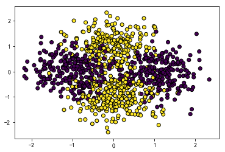

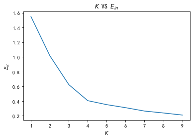

(b)题目的意思是首先找到点集中两个坐标的最大最小值，分别记为$x_{\min},x_{\max},y_{\min},y_{\max}$，于是$[x_{\min},x_{\max}]\times [y_{\min},y_{\max}]$包含全部点，在这个范围内均匀生成和原始点集相同数量的点，然后使用Kmeans算法，计算$E^{\text{rand}}_{\text{in}} (k)$即可：

```python
#### (b)
#记录结果
Ein_rand = []
#试验次数
N = 1000

for k in K:
    ein_k = []
    for _ in range(N):
        X, y = hlp.Data(n, scale=0.5) 
        #计算范围
        X1_min = np.min(X[:, 0])
        X1_max = np.max(X[:, 0])
        X2_min = np.min(X[:, 1])
        X2_max = np.max(X[:, 1])
        #生成点
        X1_rand = np.random.uniform(X1_min, X1_max, size=n)
        X2_rand = np.random.uniform(X2_min, X2_max, size=n)
        #合并
        Xrand = np.c_[X1_rand, X2_rand]
        #训练模型
        kmeans = hlp.KMeans_(k)
        kmeans.fit(Xrand)
        #获得标签
        label = kmeans.labels_
        #获得聚类中心
        center = kmeans.cluster_centers_
        #计算Ein
        ein = 0
        for i in range(k):
            #计算每一类的误差
            ein += np.sum((Xrand[label==i] - center[i]) ** 2)
        #计算均值
        ein /= n
        #存储结果
        ein_k.append(ein)
    Ein_rand.append(np.mean(ein_k))
    
plt.plot(K, Ein_rand)
plt.title("$K$ VS $E^{{rand}}_{{in}} (k)$")
plt.xlabel("$K$")
plt.ylabel("$E^{{rand}}_{{in}} (k)$")
plt.show()
```

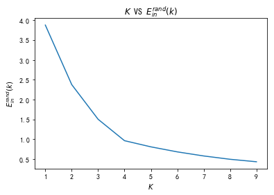

(c)题目的意思是使得$G(k)-G(k-1)$最大的$k$是合适的聚类数，这个比较好理解，因为再增加聚类数量不能显著减少$E_{\text{in}}$，结果如下：

```python
#### (c)
#计算Gk
Gk = np.log(Ein_rand) - np.log(Ein)

#作图
plt.plot(K, Gk)
plt.title("$K$ VS $G(k)$")
plt.xlabel("$K$")
plt.ylabel("$G(k)$")
plt.show()

#最优解
k_opt = K[np.argmin(np.diff(Gk)) + 1]
print("Optimal choice of k is {}".format(k_opt))
```

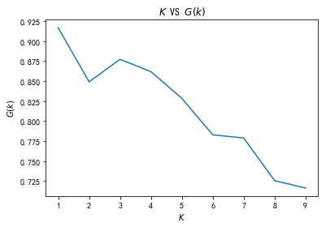

```
Optimal choice of k is 2
```

(d)改变$\sigma $做实验：

```python
#### (d)
#试验次数
N = 100
Sigma = [0.1, 0.3, 0.5, 0.75, 1]
K_opt = []

for sigma in Sigma:
    #记录结果
    Ein_rand_sigma = []
    for k in K:
        ein_k = []
        for _ in range(N):
            X, y = hlp.Data(n, scale=sigma) 
            #计算范围
            X1_min = np.min(X[:, 0])
            X1_max = np.max(X[:, 0])
            X2_min = np.min(X[:, 1])
            X2_max = np.max(X[:, 1])
            #生成点
            X1_rand = np.random.uniform(X1_min, X1_max, size=n)
            X2_rand = np.random.uniform(X2_min, X2_max, size=n)
            #合并
            Xrand = np.c_[X1_rand, X2_rand]
            #训练模型
            kmeans = hlp.KMeans_(k)
            kmeans.fit(Xrand)
            #获得标签
            label = kmeans.labels_
            #获得聚类中心
            center = kmeans.cluster_centers_
            #计算Ein
            ein = 0
            for i in range(k):
                #计算每一类的误差
                ein += np.sum((Xrand[label==i] - center[i]) ** 2)
            #计算均值
            ein /= n
            #存储结果
            ein_k.append(ein)
        Ein_rand_sigma.append(np.mean(ein_k))
    Gk = np.log(Ein_rand_sigma) - np.log(Ein)
    #记录最优k
    k_opt = K[np.argmin(np.diff(Gk)) + 1]
    K_opt.append(k_opt)

#作图
plt.plot(Sigma, K_opt)
plt.title("$\sigma$ VS $k$")
plt.xlabel("$\sigma$")
plt.ylabel("$k$")
plt.show()
```

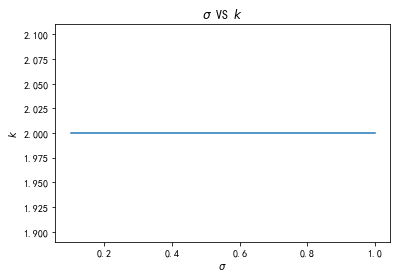


#### Problem 6.25 (Page 50)

[Novelty Detection] Novelty corresponds to the arrival of a new cluster. Use the same input data ($x_n$) as in Problem 6.13.
(a) Use the method of Problem 6.24 to determine the number of clusters.
(b) Add data (one by one) from a $5$th Gaussian centered on the origin with the same covariance matrix as the other four Gaussians. For each new point, recompute the number of clusters using the method of Problem 6.24. Plot the number of clusters versus $ℓ$ the amount of data added.
(c) Repeat (b) and plot, as a function of $ℓ$, the average increase in the number of clusters from adding $ℓ$ data points.
(d) From your plot in (c), estimate $ℓ^∗$, the number of data points needed to identify the existence of this new cluster.
(e) Vary $σ$ (the variance parameter of the Gaussians) and plot $ℓ^∗$ versus $σ$. Explain your results.

略过。


#### Problem 6.26 (Page 50)

Let $V = \{v_1, . . . , v_M \}$ be a universe of objects. Define the distance between two sets $S_1, S_2 ⊆ V$ by 
$$
d(S_1, S_2) = 1 - J(S_1, S_2)
$$
where $J(S_1, S_2) = |S_1 ∩ S_2|/|S_1 ∪ S_2|$ is the Jaccard coefficient. Show that $d(·, ·)​$ is a metric satisfying non-negativity, symmetry and the triangle inequality.    

这题死算了半天，完全做不出来，还上网查阅了资料才有思路

[https://mathoverflow.net/questions/18084/is-the-jaccard-distance-a-distance](https://mathoverflow.net/questions/18084/is-the-jaccard-distance-a-distance)

我们先证明如下度量为距离
$$
d_1(A,B)  = |A\cup B| - | A\cap B|
$$
对称性以及非负性是显然的，这里证明三角不等式
$$
d_1(A,B)\le  d_1(A,C) +d_1(C,B)
$$
利用等价转换来证明
$$
\begin{aligned}
d_1(A,B)&\le  d_1(A,C) +d_1(C,B)  \Leftrightarrow \\
 |A\cup B| - | A\cap B| &\le  |A\cup C| - | A\cap C| + |C\cup B| - | C\cap B| \Leftrightarrow \\
 |A| +|B| - | A\cap B| - | A\cap B| & \le |A|+ |C|- | A\cap C| - | A\cap C| +|C| +|B| - | C\cap B|- | C\cap B|  \Leftrightarrow \\
 -2 | A\cap B|& \le 2|C|-2 | A\cap C| -2 | C\cap B|  \Leftrightarrow \\
 | A\cap C|+| C\cap B|& \le |C|+|A\cup B|
\end{aligned}
$$
这时候画韦恩图其实一目了然，但是还是严格证明一下，思路其实就是受维恩图的启发
$$
\begin{aligned}
| A\cap C|+| C\cap B| &\le |C|+|A\cup B| \Leftrightarrow \\
| A\cap C \cap B^c| +| A\cap C \cap B|  + | A\cap C\cap B| + | A^c\cap C\cap B|
&\le |C| +|A\cup B| 
\end{aligned}
$$
显然 
$$
| A\cap C \cap B| \le |C|
$$
而$| A\cap C \cap B^c|,| A\cap C\cap B| , | A^c\cap C\cap B|$这三个集合两两交集为空且都为$A\cup B$的子集，所以
$$
| A\cap C \cap B^c|+| A\cap C\cap B| + | A^c\cap C\cap B| \le  |A\cup B|
$$
从而
$$
| A\cap C|+| C\cap B| \le |C|+|A\cup B|
$$
成立，即三角不等式成立。

接下来要从这个证明中诱导出题目中的矩阵，首先证明以下引理

Steinhaus Transform:
$$
集合X上定义了距离d，那么对于任意a\in X\\
\delta(x,y) = \frac{2d(x,y)}{d(x,a) + d(y,a) + d(x,y)}构成新的距离
$$
在证明之前，给出如下结论：
$$
p,q,r >0,如果p\le q,那么\frac{p}{q} \le \frac{p+r}{q+r}
$$
证明：

这里取
$$
p=d(x,y),q= d(x,a) + d(y,a) + d(x,y),r=d(x,z)+d(y,z)-d(x,y)
$$
那么
$$
\begin{eqnarray*}
 \delta(x,y)&& = \frac{2d(x,y)}{d(x,a)+d(y,a)+d(x,y)}\\
 && =2 \frac{p}{q}\\
 && \le  2\frac{p+r}{q+r}\\
 && =2 \frac{d(x,y)+d(x,z)+d(y,z)-d(x,y)}{ d(x,a) + d(y,a) + d(x,y)+d(x,z)+d(y,z)-d(x,y)}\\
 &&= \frac{2d(x,z)+2d(y,z)}{d(x,a)+d(y,a)+d(x,z)+d(y,z)}\\
 &&= \frac{2d(x,z)}{d(x,a)+d(x,z)+(d(y,a)+d(y,z))} + \frac{2d(y,z)}{d(y,a)+d(y,z)+(d(x,a)+d(x,z))}\\
 &&\le\frac{2d(x,z)}{d(x,a)+d(x,z)+d(a,z)} + \frac{2d(y,z)}{d(y,a)+d(y,z)+d(a,z)} \tag 1\\
&&= \delta(x,z)+\delta(y,z)
\end{eqnarray*}
$$
其中(1)利用了$d$为距离：
$$
d(y,a) + d(y,z)\ge d(a,z)\\
d(x,z)+d(x,z) \ge d(a,z)
$$
说明$\delta$满足三角不等式，显然$\delta$满足对称性以及非负性，从而$\delta$为距离。

现在取$a=\varnothing,d=d_1​$，那么
$$
\begin{aligned}
\delta(x,y) 
&=\frac{2d_1(x,y)}{d_1(x,a)+d_1(y,a)+d_1(x,y)}\\
&=\frac{2(|x\cup y|-|x\cap y|)}{|x\cup \varnothing |-|x\cap  \varnothing |+|y\cup  \varnothing |-|y\cap  \varnothing |+|x\cup y|-|x\cap y|}\\
&=\frac{2(|x\cup y|-|x\cap y|)}{|x|+|y|+|x\cup y|-|x\cap y|}\\
&=\frac{2(|x\cup y|-|x\cap y|)}{2|x\cup y|}\\
&=1-\frac{|x\cap y|}{|x\cup y|}\\
&=1-J(x,y)
\end{aligned}
$$

说明我们定义的$d_1$诱导出了题目中的距离，由引理可得该距离满足非负性，对称性，以及三角不等式。


#### Problem 6.27 (Page 50)

Consider maximum likelihood estimation of the parameters of a GMM in one dimension from data $x_1, . . . , x_N$. The probability density is
$$
P(x)=\sum_{k=1}^{K} \frac{w_{k}}{\sqrt{2 \pi \sigma_{k}^{2}}} \exp \left(-\frac{\left(x-\mu_{k}\right)^{2}}{2 \sigma_{k}^{2}}\right)
$$
(a) If $K = 1$ what are the maximum likelihood estimate of $μ_1$ and $σ^2_1$
(b) If $K > 1$, show that the maximum likelihood estimate is not well defined; specifically that the maximum of the likelihood function is infinite.
(c) How does the E-M algorithm perform? Under what conditions does the E-M algorithm converge to a well defined estimator?

(d)To address the problem in (b), define the “regularized” likelihood: For each $x_n$, define the $2\epsilon$-interval $B_n = [x_n − \epsilon, x_n + \epsilon ]$. The $\epsilon $-regularized likelihood is the probability that each $x_n ∈ B_n$. Intuitively, one does not
measure $x_n$, but rather a $2\epsilon$-interval in which $x_ n$ lies.

​	(i) Show that
$$
\mathbb{P}\left[x_{n} \in B_{n}\right]=\sum_{k=1}^{K} w_{k}\left(F_{\mathcal{N}}\left(\frac{x_{n}+\epsilon-\mu_{k}}{\sigma_{k}}\right)-F_{\mathcal{N}}\left(\frac{x_{n}+\epsilon-\mu_{k}}{\sigma_{k}}\right)\right)
$$
​	where $F_{\mathcal N}(·)$ is the standard normal distribution function.

​	(ii) For fixed $\epsilon  $, show that the maximum likelihood estimator is now well defined. What about in the limit as $\epsilon → 0$?
​	(iii) Give an E-M algorithm to maximize the $\epsilon  $-regularized likelihood.

题目有误，概率密度应该为
$$
P(x)=\sum_{k=1}^{K} \frac{w_{k}}{\sqrt{2 \pi \sigma_{k}^{2}}} \exp \left(-\frac{\left(x-\mu_{k}\right)^{2}}{2 \sigma_{k}^{2}}\right)
$$
(a)如果$K=1$，此时$w_k=1$，那么似然函数为
$$
L = \prod_{i=1}^n \frac{1}{\sqrt{2\pi \sigma_1^2}} \exp\Big(-\frac{(x_i-\mu_1)^2}{2\sigma_1^2}\Big)
=\frac{1}{(2\pi \sigma_1^2)^{\frac n2}}\exp\Big(-\sum_{i=1}^n\frac{(x_i-\mu_1)^2}{2\sigma_1^2}\Big)
$$
从而对数似然函数$l=\ln(L)​$为
$$
l = -\frac n2\ln(2\pi) - \frac n2\ln \sigma_1^2  -\sum_{i=1}^n\frac{(x_i-\mu_1)^2}{2\sigma_1^2}
$$
求偏导可得
$$
\begin{aligned}
\frac{\partial l}{\partial \sigma_1^2} &= -\frac n {2\sigma_1^2} +
\sum_{i=1}^n\frac{(x_i-\mu_1)^2}{2\sigma_1^4}\\
\frac{\partial l}{\partial \mu_1}  &= -\sum_{i=1}^n\frac{(\mu_1-x_i)}{\sigma_1^2}
\end{aligned}
$$
令偏导数等于$0$可得
$$
\begin{aligned}
\hat \sigma_1^2 &=  \frac 1 {n} \sum_{i=1}^n(x_i-\mu_1)^2 \\
\hat \mu_1 &=\frac 1 n \sum_{i=1}^n  x_i
\end{aligned}
$$


(b)当$K>1​$时，似然函数为
$$
L = \prod_{i=1}^n\sum_{k=1}^K \frac{w_k}{{\sqrt{2 \pi \sigma_{k}^{2}}} } \exp\Big(-\frac{(x_i-\mu_k)^2}{2\sigma_k^2}\Big)
$$
取$\mu_1 =x_1​$，那么有如下不等式
$$
L\ge \prod_{i=1}^n \frac{w_1}{{\sqrt{2 \pi \sigma_{1}^{2}}} }
$$
如果$\sigma_1 \to 0$，右边$\to \infty$，这说明$L\to \infty$，所以$L$没有最大值。

(c)这题不是特别确定，给出一些自己的理解。

回顾上题不难发现，只有存在$\mu_k = x_i$，且$\sigma_i^2 \to 0$两个条件同时成立时，$L$才会趋于正无穷，回顾40页的估计式
$$
\begin{aligned}
\mu_j&= \frac 1 {N_j}\sum_{n=1}^N \gamma_{nj} x_n \\
\sigma^2_j&= \frac{1}{N_j} \sum_{n=1}^N \gamma_{nj} x_n x_n^T- \mu_j \mu_j^T
\end{aligned}
$$
只要右边的估计式不产生上述结果即可。

(d)

(i)题目有误，正确的应该是
$$
\mathbb P(x_n \in B_n) =\sum_{k=1}^K w_k 
\Big(F_{\mathcal N}\Big(\frac{x_n +\epsilon -\mu_k}{\sigma_k}\Big)-
F_{\mathcal N}\Big(\frac{x_n -\epsilon -\mu_k}{\sigma_k}\Big) \Big)
$$
我们来计算右边的概率，利用全概率公式
$$
\begin{aligned}
\mathbb P(x_n \in B_n) 
&=  \mathbb P(x_n -\epsilon \le x \le x_n +\epsilon) \\
&=  \sum_{n=1}^K\mathbb P(x_n -\epsilon \le x \le x_n +\epsilon|
x \sim \mathcal N(\mu_k, \sigma_k^2))w_k \\
&=  \sum_{n=1}^K\mathbb P(x_n -\epsilon \le x \le x_n +\epsilon|
x \sim \mathcal N(\mu_k, \sigma_k^2))w_k \\
&=  \sum_{n=1}^K\mathbb 
P(\frac{x_n -\epsilon -\mu_k}{\sigma_k} \le \frac{x-\mu_k}{\sigma_k} \le \frac{x_n +\epsilon -\mu_k}{\sigma_k}
|x \sim \mathcal N(\mu_k, \sigma_k^2))w_k \\
&=  \sum_{k=1}^K w_k
\int_{\frac{x_n -\epsilon -\mu_k}{\sigma_k}}^{\frac{x_n +\epsilon -\mu_k}{\sigma_k}} 
\frac 1 {\sqrt{2\pi}} e^{-\frac {t^2} {2}} dt\\
&=  \sum_{k=1}^K w_k 
\Big(F_{\mathcal N}\Big(\frac{x_n +\epsilon -\mu_k}{\sigma_k}\Big)-
F_{\mathcal N}\Big(\frac{x_n -\epsilon -\mu_k}{\sigma_k}\Big) \Big)
\end{aligned}
$$
(ii)注意上面倒数第二个式子，我们有
$$
\int_{\frac{x_n -\epsilon -\mu_k}{\sigma_k}}^{\frac{x_n +\epsilon -\mu_k}{\sigma_k}} 
\frac 1 {\sqrt{2\pi}} e^{-\frac {t^2} {2}} dt \le 1
$$
从而
$$
\mathbb P(x_n \in B_n)  \le \sum_{k=1}^K w_k  =1
$$
似然函数如下
$$
L = \prod_{n=1}^ N \mathbb P(x_n \in B_n)  \le 1
$$
这说明似然函数是良定义的，如果$\epsilon \to 0​$，那么
$$
F_{\mathcal N}\Big(\frac{x_n +\epsilon -\mu_k}{\sigma_k}\Big)-
F_{\mathcal N}\Big(\frac{x_n -\epsilon -\mu_k}{\sigma_k}\Big) \to 0
$$
此时$L \to 0$。

(iii)这里给出启发式的算法，定义课本40页一样的参数，除了$\gamma$的更新公式以外保持不变，$\gamma$的更新公式修改为
$$
\begin{aligned}
\gamma _{nj}(t+1)&= \mathbb P(x\sim \mathcal N (\mu_j,\sigma_j^2)|x\in B_n)\\
&=\frac{\mathbb P(x\sim \mathcal N (\mu_j,\sigma_j^2),x\in B_n)}{\mathbb P(x\in B_n) } \\
&=\frac{w_k 
\Big(F_{\mathcal N}\Big(\frac{x +\epsilon -\mu_k}{\sigma_k}\Big)-
F_{\mathcal N}\Big(\frac{x -\epsilon -\mu_k}{\sigma_k}\Big) \Big)}
{ \sum_{k=1}^K w_k 
\Big(F_{\mathcal N}\Big(\frac{x +\epsilon -\mu_k}{\sigma_k}\Big)-
F_{\mathcal N}\Big(\frac{x -\epsilon -\mu_k}{\sigma_k}\Big) \Big)}
\end{aligned}
$$


#### Problem 6.28 (Page 51)

Probability density estimation is a very general task in that supervised learning can be posed as probability density estimation. In supervised learning, the task is to learn $f(x)$ from $(x_1, y_1), . . . , (x_N, y_N)$.

(a) Let $P(x, y)$ be the joint distribution of $(x, y)$. For the squared error, $E_{\mathrm{out}}(h)=\mathbb{E}_{P({x}, y)}\left[(h({x})-y)^{2}\right]$. Show that among all functions, the one which minimizes $E_{\mathrm{out}}$ is $f(\mathbf{x})=\mathbb{E}_{P(\mathbf{x}, y)}[y | \mathbf{x}]$.

(b)To estimate $f​$, first estimate $P(x, y)​$ and then compute $\mathbb E[y|x]​$. Treat the $N​$ data points as $N​$ “unsupervised” points $z_1, . . . , z_N​$ in $\mathbb R^{d+1}​$, where ${z}_{n}^{\mathrm{T}}=\left[{x}_{n}^{\mathrm{T}}, y_{n}\right]​$. Suppose that you use a GMM to estimate $P(z)​$, so the parameters $w_{k}, {\mu}_{k}, \Sigma_{k}​$ have been estimated ($w_{k} \geq 0, \sum_{k} w_{k}=1​$), and
$$
P({z})=\sum_{k=1}^{K} \frac{w_{k}\left|S_{k}\right|^{1 / 2}}{(2 \pi)^{(d+1) / 2}} e^{-\frac{1}{2}\left({z}-{\mu}_{k}\right)^{\top} {S}_{k}\left({z}-{\mu}_{k}\right)}
$$
where $\mathrm{S}_{k}=\Sigma_{k}^{-1}​$. Let $\mathrm{S}_{k}=\left[ \begin{array}{ll}{{A}_{k}} & {{b}_{k}} \\ {{b}_{k}^{\mathrm{T}}} & {c_{k}}\end{array}\right]​$ and ${\mu}_{k}=\left[ \begin{array}{c}{{\alpha}_{k}} \\ {\beta_{k}}\end{array}\right]​$. Show that 
$$
g( {x})=\mathbb{E}[y |  {x}]=
\frac{\sum_{k=1}^{K} \hat{w}_{k} e^{-\frac{1}{2}\left( {x}- {\alpha}_{k}\right)^{\mathrm{T}} \Omega_{ {k}}\left( {x}- {\alpha}_{ {k}}\right)}\left(\beta_{ {k}}+\frac{1}{c_{k}}  {b}_{{k}}^{\top}\left({x}-{\alpha}_{k}\right)\right)}
{\sum_{k=1}^{K} \hat{w}_{k} e^{\left(-\frac{1}{2}\left({x}-\alpha_{k}\right)^{\top} \Omega_{k}\left({x}-\alpha_{k}\right)\right)}}
$$
where $\Omega_{k}=A_{k}-\mathbf{b}_{k} {b}_{k}^{{T}} / c_{k}$ and $\hat{w}_{k}=w_{k} \sqrt{\left|\mathrm{S}_{k}\right| / c_{k}}$.Interpret this functional form in terms of Radial Basis Functions.

(c)If you non-parametric Parzen windows with spherical Gaussian kernel to estimate $P(x,y)$, show that $g(x)$ is an RBF,
$$
g( {x})=\mathbb{E}[y |  {x}]=\frac{\sum_{n=1}^{N} e^{-\frac{1}{2 r^{2}}\left\| {x}- {x}_{n}\right\|^{2}} y_{n}}{\sum_{n=1}^{N} e^{-\frac{1}{2 r^{2}}\left\| {x}- {x}_{n}\right\|^{2}}}
$$
[Hint: This is a special case of the previous part: what are $K, w_{k}, \mu_{k}, {S}_{k}$?]

(a)将$\mathbb E_{P(x,y)}$记为$\mathbb E$
$$
\begin{aligned}
E_{\text{out}}(h) &=\mathbb E[(h(x)-y)^2] \\
&=\mathbb E[(h(x)-\mathbb E[y|x]+\mathbb E[y|x]-y)^2] \\
&=\mathbb E[(h(x)-\mathbb E[y|x])^2]+ \mathbb E[(\mathbb E[y|x]-y)^2]
+2\mathbb E[(h(x)-\mathbb E[y|x])(\mathbb E[y|x]-y)]\\
&=\mathbb E[(h(x)-\mathbb E[y|x])^2]+ \mathbb E[(\mathbb E[y|x]-y)^2]
+2\mathbb E[\mathbb E [(h(x)-\mathbb E[y|x])(\mathbb E[y|x]-y)]|x]\\
&=\mathbb E[(h(x)-\mathbb E[y|x])^2]+ \mathbb E[(\mathbb E[y|x]-y)^2]
+2\mathbb E[(h(x)-\mathbb E[y|x]) \mathbb E [(\mathbb E[y|x]-y)]|x]\\
&=\mathbb E[(h(x)-\mathbb E[y|x])^2]+ \mathbb E[(\mathbb E[y|x]-y)^2]
+2\mathbb E[(h(x)-\mathbb E[y|x]) \mathbb (\mathbb E[y|x] -\mathbb E[y|x])]\\
&=\mathbb E[(h(x)-\mathbb E[y|x])^2]+ \mathbb E[(\mathbb E[y|x]-y)^2]\\
&\ge \mathbb E[(h(x)-\mathbb E[y|x])^2]
\end{aligned}
$$
当且仅当$y=\mathbb E[y|x]​$时等式成立。

(b)首先证明一个引理：

假设我们有一个向量值随机变量
$$
x=\left[
 \begin{matrix}
   x_1 \\
   x_2
  \end{matrix}
  \right],
$$
其中$x_1\in \mathbb R^r, x_2 \in \mathbb R^s$，因此$x\in \mathbb R^{r+s}$。如果$x\sim \mathcal N(\mu, \Sigma)$，其中
$$
\mu=\left[
 \begin{matrix}
   \mu_1 \\
   \mu_2
  \end{matrix}
  \right] ,
 \Sigma= \left[
 \begin{matrix}
   \Sigma_{11} &   \Sigma_{12} \\
   \Sigma_{21} &\Sigma_{22} 
  \end{matrix}
  \right]
$$
其中，$\mu_1\in \mathbb R^r$，$\mu_2\in \mathbb R^s$，$\Sigma_{11}=\mathbb R^{r\times r}$，$\Sigma_{12}\in \mathbb R^{r\times s}$，那么
$$
\begin{aligned}
&(1)x_1 \sim  \mathcal N (\mu_1, {\Sigma}_{11})\\
&(2) x_1 |x_2 \sim \mathcal N(\mu_{1|2},\Sigma_{1|2})
\end{aligned}\\
其中 \mu_{1|2} = \mu_1 + \Sigma_{12}\Sigma_{22}^{-1}(x_2 -\mu_2) \\
\Sigma_{1|2} = \Sigma_{11}- \Sigma_{12}\Sigma_{22}^{-1}\Sigma_{21}
$$
下面证明上述结论。

令
$$
B = \left[
 \begin{matrix}
   I_r & -{\Sigma}_{12}{\Sigma}_{22}^{-1}\\
   0 &  I_{s}  
  \end{matrix}
  \right], y=\left[
 \begin{matrix}
   y_1 \\
   y_2
  \end{matrix}
  \right] 
  
  = B\left[
 \begin{matrix}
   x_1 \\
   x_2
  \end{matrix}
  \right] = \left[
 \begin{matrix}
   x_1-{\Sigma}_{12}{\Sigma}_{22}^{-1}x_2 \\
   x_2
  \end{matrix}
  \right]
$$
那么
$$
\begin{aligned}
B\Sigma B^T&=\left[
 \begin{matrix}
   I_r & -{\Sigma}_{12}{\Sigma}_{22}^{-1}\\
   0 &  I_{s}  
  \end{matrix}
  \right]
    \left[
 \begin{matrix}
   \Sigma_{11} &   \Sigma_{12} \\
   \Sigma_{21} &\Sigma_{22} 
  \end{matrix}
  \right]
  
 \left[
 \begin{matrix}
   I_r & 0\\
    -{\Sigma}_{22}^{-1}{\Sigma}_{21} &  I_{s}  
  \end{matrix}
  \right]\\
  &=
  \left[
 \begin{matrix}
 \Sigma_{11} -{\Sigma}_{12}{\Sigma}_{11}^{-1}{\Sigma}_{21} &  0 \\
   {\Sigma}_{21} &\Sigma_{22}
  \end{matrix}
  \right]
   \left[
 \begin{matrix}
   I_r & 0\\
    -{\Sigma}_{22}^{-1}{\Sigma}_{21} &  I_{s}  
  \end{matrix}
  \right]\\
  &=\left[
 \begin{matrix}
   \Sigma_{11} -{\Sigma}_{12}{\Sigma}_{11}^{-1}{\Sigma}_{21}  &  0 \\
   0 &\Sigma_{22}
  \end{matrix}
  \right]\\
  
  B\left[
 \begin{matrix}
   \mu_1 \\
   \mu_2
  \end{matrix}
  \right]  &=\left[
 \begin{matrix}
   I_r & -{\Sigma}_{12}{\Sigma}_{22}^{-1}\\
   0 &  I_{s}  
  \end{matrix}
  \right] \left[
 \begin{matrix}
   \mu_1 \\
   \mu_2
  \end{matrix}
  \right]
  = \left[
 \begin{matrix}
   \mu_1- {\Sigma}_{12}{\Sigma}_{22}^{-1}\mu_2\\
   \mu_2 
  \end{matrix}
  \right]
\end{aligned}
$$
从而
$$
y=\left[
 \begin{matrix}
   y_1 \\
   y_2
  \end{matrix}
  \right]= \left[
 \begin{matrix}
   x_1-{\Sigma}_{12}{\Sigma}_{22}^{-1}x_2 \\
   x_2
  \end{matrix}
  \right]\sim \mathcal N(\mu', \Sigma')
$$
其中
$$
\mu' =\left[ \begin{matrix}  \mu_1'\\   \mu_2'   \end{matrix}  \right]
= B\mu= \left[ \begin{matrix}   \mu_1- {\Sigma}_{12}{\Sigma}_{22}^{-1}\mu_2\\   \mu_2   \end{matrix}  \right],\\
\Sigma' = B\Sigma B^T=\left[
 \begin{matrix}
   \Sigma_{11} -{\Sigma}_{12}{\Sigma}_{11}^{-1}{\Sigma}_{21}  &  0 \\
   0 &\Sigma_{22}
  \end{matrix}
  \right]
$$
因此可以看出$y_1, y_2​$独立，且
$$
y_2=x_2 \sim \mathcal N(\mu_2, \Sigma_{22})
$$
由对称性类似可得
$$
x_1\sim \mathcal N(\mu_1, \Sigma_{11})
$$
备注：这里求$x_2$的边际分布而不是$x_1$的边际分布是为了方便求出条件分布。

接下来考虑$ x_1 |x_2$的分布，
$$
f( x_1 |x_2)= \frac{f(x_1,x_2)}{f(x_2)}
$$
这里要利用到$B​$为正交矩阵，且
$$
|\Sigma|=|\Sigma'|=  |\Sigma_{11} -{\Sigma}_{12}{\Sigma}_{11}^{-1}{\Sigma}_{21}|
 |\Sigma_{22}|,\\
 \Sigma'^{-1}=\left[
 \begin{matrix}
   (\Sigma_{11} -{\Sigma}_{12}{\Sigma}_{11}^{-1}{\Sigma}_{21})^{-1}  &  0 \\
   0 &\Sigma_{22}^{-1}
  \end{matrix}
  \right]
$$
首先计算分子
$$
\begin{aligned}
f(x_1,x_2)
&= \frac{1}{(2\pi)^{\frac {s+r} 2} |\Sigma|^{\frac 1 2}} \exp(-\frac{1}{2}(x-\mu)^T \Sigma^{-1}(x-\mu)) \\
&=\frac{1}{(2\pi)^{\frac {s+r} 2}|\Sigma_{11} -{\Sigma}_{12}{\Sigma}_{11}^{-1}{\Sigma}_{21}|^{\frac 1 2}
 |\Sigma_{22}|^{\frac 1 2}}
 \exp(-\frac{1}{2}(x-\mu)^T B^T (B\Sigma B^T)^{-1}B(x-\mu)) \\
 &=\frac{1}{(2\pi)^{\frac {s+r} 2}|\Sigma_{11} -{\Sigma}_{12}{\Sigma}_{11}^{-1}{\Sigma}_{21}|^{\frac 1 2}
 |\Sigma_{22}|^{\frac 1 2}}
 \exp(-\frac{1}{2}(B(x-\mu))^T (B\Sigma B^T)^{-1}(B(x-\mu))) \\
 &=\frac{1}{(2\pi)^{\frac {s+r} 2}|\Sigma_{11} -{\Sigma}_{12}{\Sigma}_{11}^{-1}{\Sigma}_{21}|^{\frac 1 2}
 |\Sigma_{22}|^{\frac 1 2}}
 \exp(-\frac{1}{2}(y-\mu')^T {\Sigma'}^{-1}(y-\mu'))\\
 &=\frac{1}{(2\pi)^{\frac {s+r} 2}|\Sigma_{11} -{\Sigma}_{12}{\Sigma}_{11}^{-1}{\Sigma}_{21}|^{\frac 1 2}
 |\Sigma_{22}|^{\frac 1 2}}\exp(-\frac{1}{2}(y_1-\mu_1')^T {(\Sigma_{11} -{\Sigma}_{12}{\Sigma}_{11}^{-1}{\Sigma}_{21})}^{-1}(y_1-\mu_1') -\frac 1 2 (y_2-\mu_2')^T \Sigma_{22}^{-1} (y_2-\mu_2'))
\end{aligned}
$$
接着计算分母，之前已经计算过了
$$
f(x_2)= \frac{1}{ (2\pi)^{\frac s2} |\Sigma_{22}|^{\frac 1 2 }} \exp(-\frac 1 2 x_2^T \Sigma_{22}^{-1} x_2)=
\frac{1}{ (2\pi)^{\frac s2}|\Sigma_{22}|^{\frac 1 2 }} \exp(-\frac 1 2 (y_2-\mu_2')^T \Sigma_{22}^{-1} (y_2-\mu_2'))
$$
因此
$$
\begin{aligned}
f( x_1 |x_2)
&=\frac{f(x_1, x_2)}{f(x_2)} \\
&=\frac{1}{(2\pi)^{\frac {r} 2}|\Sigma_{11} -{\Sigma}_{12}{\Sigma}_{11}^{-1}{\Sigma}_{21}|^{\frac 1 2}}
\exp(-\frac{1}{2}(y_1-\mu_1')^T {(\Sigma_{11} -{\Sigma}_{12}{\Sigma}_{11}^{-1}{\Sigma}_{21})}^{-1}(y_1-\mu_1') ) 
\end{aligned}
$$
注意到
$$
\begin{aligned}
y_1-\mu_1'
&= x_1-{\Sigma}_{12}{\Sigma}_{22}^{-1}x_2-  \mu_1+ {\Sigma}_{12}{\Sigma}_{22}^{-1}\mu_2\\
&= x_1 -\mu_1 -{\Sigma}_{12}{\Sigma}_{22}^{-1}(x_2 -\mu_2)
\end{aligned}
$$
从而
$$
 x_1 |x_2 \sim \mathcal N(\mu_{1|2},\Sigma_{1|2})\\
其中 \mu_{1|2} = \mu_1 + \Sigma_{12}\Sigma_{22}^{-1}(x_2 -\mu_2)\\
\Sigma_{1|2} = \Sigma_{11}- \Sigma_{12}\Sigma_{22}^{-1}\Sigma_{21}
$$


回到原题，记$Z_k \sim \mathcal N(\mu_k, S_k^{-1})$，其中
$$
{Z}_{k}^{\mathrm{T}}=\left[{X}_{k}^{\mathrm{T}},Y_{k}\right]
$$
那么
$$
f_Z(z) = \sum_{k=1}^K \frac{w_k |S_k|^{\frac 1 2 }}{(2\pi)^{\frac{d+1}{2}}}
\exp\left(-\frac 1 2 (z-\mu_k)^T S_k (z-\mu_k)\right)=\sum_{k=1}^K 
w_k f_{Z_k}(z)
$$
由引理的第一部分可知
$$
f_X(x)  = \sum_{k=1}^K \frac{w_k |A_k|^{\frac 1 2 }}{(2\pi)^{\frac{d}{2}}}
\exp\left(-\frac 1 2 (x-\alpha_k)^T A_k (x-\alpha_k)\right)
= \sum_{k=1}^K w_k f_{X_k}(x)
$$
所以
$$
f_{Y|X}(y|x) =\frac{\sum_{k=1}^K w_k f_{X_k}(x)f_{Y_k|X_k}(y|x)}{f_X(x)} \tag 1
$$
由引理的第二部分可知
$$
f_{Y_k|X_k}(y|x) \sim \mathcal N(\beta_k+\frac 1 {c_k}b_k^T(x-\mu_k) , S_k^* )\\
S_k^*可由引理计算出来
$$
对上式取期望可得
$$
\mathbb E_{Y_k|X_k}[y|x] = \beta_k+\frac 1 {c_k}b_k^T(x-\mu_k)
$$
对(1)式关于$y$取期望可得
$$
\begin{aligned}
g(x) &=\mathbb E[y|x]\\
&= \frac{\sum_{k=1}^K w_k f_{X_k}(x)\mathbb E_{Y_k|X_k}[y|x]}{f_X(x)}\\
&= \frac{\sum_{k=1}^K \frac{w_k |A_k|^{\frac 1 2 }}{(2\pi)^{\frac{d}{2}}}
\exp \left(-\frac 1 2 (x-\alpha_k)^T A_k (x-\alpha_k)\right)(\beta_k+\frac 1 {c_k}b_k^T(x-\mu_k))}{\sum_{k=1}^K \frac{w_k |A_k|^{\frac 1 2 }}{(2\pi)^{\frac{d}{2}}}
\exp\left(-\frac 1 2 (x-\alpha_k)^T A_k (x-\alpha_k)\right)} \\
&=\frac{\sum_{k=1}^K {w_k |A_k|^{\frac 1 2 }}
\exp(-\frac 1 2 (x-\alpha_k)^T A_k (x-\alpha_k))(\beta_k+\frac 1 {c_k}b_k^T(x-\mu_k))}{\sum_{k=1}^K {w_k |A_k|^{\frac 1 2 }}
\exp(-\frac 1 2 (x-\alpha_k)^T A_k (x-\alpha_k))}
\end{aligned}
$$
注意这里我和题目的答案不同。

(c)此时为(b)的特殊情形
$$
K= N,w_k =\frac 1 K ,\alpha_k= x_k,\beta_k =y_k,S_k =r^2 I
$$
因为
$$
{S}_{k}=\left[ \begin{array}{ll}{{A}_{k}} & {{b}_{k}} \\ {{b}_{k}^{\mathrm{T}}} & {c_{k}}\end{array}\right]
$$
所以
$$
b_k=\vec 0
$$
带入上式可得
$$
\begin{aligned}
g(x) &=\mathbb E[y|x]\\
&=\frac{\sum_{n=1}^N \exp({-\frac 1 {2r^2}||x-x_n||^2  })y_n}{\sum_{n=1}^N \exp({-\frac 1 {2r^2}||x-x_n||^2  })}
\end{aligned}
$$

