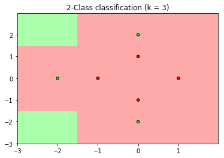
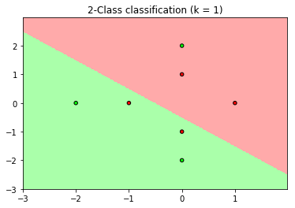
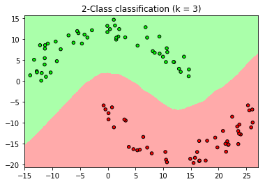

#### Exercise 6.1 (Page 3) 

(a) Give two vectors with very high cosine similarity but very low Euclidean distance similarity. Similarly, give two vectors with very low cosine similarity but very high Euclidean distance similarity. 

(b) If the origin of the coordinate system changes, which measure of similarity changes? How will this affect your choice of features? 

(a)取$a=(1,1),b=(3,3)$，那么
$$
\text{CosSim}(a, b) =\frac{a.b}{|a||b|}=\frac{6}{\sqrt 2 \sqrt {18}}=1\\
d(a,b)=2\sqrt 2
$$
这说明$a,b$的欧式距离相似性很小，余弦距离相似性很大。

取$a=(0,0.1),b=(0.1,0)$，那么
$$
\text{CosSim}(a, b) =\frac{a.b}{|a||b|}=0\\
d(a,b)=\frac{\sqrt 2 }{10}
$$
这说明$a,b$的欧式距离相似性很大，余弦距离相似性很小。

(b)如果原点变为$a$，原来任取两点$x_1,x_2$，那么在新的坐标系下，这两点的坐标为$a+x_1,a+x_2$，所以
$$
d(a+x_1,a+x_2)=|a+x_1-a-x_2 |=|x_1-x_2 |=d(x_1,x_2)\\
\text{CosSim}(a+x_1, a+x_2) =\frac{(a+x_1).(a+x_2)}{|a+x_1||a+x_2|}
$$
可以看到欧式距离相似性是不变的，然而余弦距离相似性会改变，例如取$a=0,a=-x_1$，得到的结果不相同。所以如果使用欧式距离相似性，那么不会影响特征选择，如果采用余弦距离相似性，那么会影响特征的选择。


#### Exercise 6.2 (Page 6) 

Let 
$$
f(x)=\begin{cases}
+1, & \text{if   } \pi(x)\ge \frac 1 2 \\
-1, & \text{otherwise}
\end{cases}
$$
Show that the probability of error on a test point $x$ is 
$$
e(f(x)) = \mathbb P[f(x) \neq  y] = \text{min}\{π(x), 1 - π(x)\}
$$
 and $e(f(x)) ≤ e(h(x))$ for any other hypothesis $h$ (deterministic or not).    

回顾$\pi(x)$的定义
$$
\pi(x) =\mathbb  P[y=+1| x]
$$
如果$\pi (x)\ge \frac 1 2 $，那么$f(x)=1$，所以此时
$$
e(f(x)) = \mathbb P[f(x) \neq  y]=\mathbb P[y\ne 1]=\mathbb P[y=-1] = 1-\pi(x) \le \pi(x)\\
说明e(f(x)) =\text{min}\{π(x), 1 - π(x)\}
$$
如果$\pi (x)<\frac 1 2 $，那么$f(x)=-1$，所以此时
$$
e(f(x)) = \mathbb P[f(x) \neq  y]=\mathbb P[y\ne -1]=\mathbb P[y=+1] = \pi(x) \le 1 -  \pi(x) \\
说明e(f(x)) =\text{min}\{π(x), 1 - π(x)\}
$$
综上，无论$\pi (x)$的大小如何
$$
e(f(x)) = \mathbb P[f(x) \neq  y] = \text{min}\{π(x), 1 - π(x)\}
$$
现在证明第二个结论
$$
对于任意的假设h,e(f(x)) ≤ e(h(x))
$$
任取$h$，我们来计算$e(h(x))$，记$\mathbb P (h(x) = -1)=p,\mathbb P (h(x) = 1)=1-p$
$$
\begin{aligned}
e(h(x)) 
&=\mathbb P (h(x) = -1)\mathbb  P[y=1| x]+\mathbb P (h(x) = 1)\mathbb  P[y=-1| x]\\
&=p\pi(x)+(1-p)(1-\pi(x))\\
&\ge p \times  \text{min}\{π(x), 1 - π(x)\}+(1-p)\times \text{min}\{π(x), 1 - π(x)\}\\
&=\text{min}\{π(x), 1 - π(x)\}\\
&=e(f(x))
\end{aligned}
$$
从而结论成立。


#### Exercise 6.3 (Page 9) 

Fix an odd $k ≥ 1$. For $N = 1, 2, . . .$ and data sets ${\mathcal D_N }$ of size $N$, let $g_N$ be the $k-NN$ rule derived from ${\mathcal D_N }$, with out-of-sample error $E_{out}(g_N)$. 

(a) Argue that $E_{out}(g_N ) = \mathbb E_x[Q_k(η(x))] +  \mathbb E_x[\epsilon_N (x)]$ for some error term $\epsilon_N (x)$ which converges to zero, and where
$$
Q_k(η) =\sum_{i=0}^{(k-1)/2} \binom k i \Big(\eta^{i+1}(1 - η)^{k-i} + (1 - η)^{i+1}η^{k-i} \Big)
$$
and $η(x) = \text{min}\{π(x), 1 - π(x)\}$. 

(b) Plot $Q_k(η)$ for $η ∈ [0, \frac1 2 ]$ and $k = 1, 3, 5$. 

(c) Show that for large enough $N$, with probability at least $1 - δ$, 
$$
k = 3 : E_{out}(g_N) ≤ E_{out}^∗ + 3 \mathbb E [η^2(x)] \\
k = 5 : E_{out}(g_N) ≤ E_{out}^∗ + 10\mathbb E [η^3(x)].
$$
(d) [Hard] Show that $E_{out}(g_N)$ is asymptotically $E_{out}^∗ (1 + O(k^{-1/2}))$. [Hint: Use your plot of $Q_k$ to argue that there is some $a(k)$ such that $Q_k ≤ η(1 + a(k))$, and show that the best such $a(k)$ is $O(1/\sqrt k)$.]

(a)将点集重新排列为$x_1,...,x_N$，满足以下条件
$$
d(x,x_1)\le ...\le d(x,x_N)
$$
那么$P[g_N(x)= -1] $等价于
$$
x_1,...,x_k中最多有\frac{k-1}{2}个标记为+1\\
记A_i=\{j_0,...,j_i\},\overline A_i=\{1,...,N\}-A_i\\
那么该事件发生的概率为 \sum_{i=0}^{\frac{k-1}{2}} \sum_{j_0,...,j_i} \prod_{k\in A_i}  \pi(x_k)\prod_{k\notin A_i} (1- \pi(x_k))
$$
注意随着$N$增加，$x_k$和$x$会无限接近，从而
$$
\pi(x_k) =\pi(x)+f_N(x,x_k) ,随着N增加，f_N(x,x_k)依概率收敛到0
$$
而$ \sum_{j_0,...,j_i}$一共有$ \binom k i $项，所以带入上式可得事件发生的概率为
$$
\sum_{i=0}^{\frac{k-1}{2}} \binom k i  \pi(x)^i(1- \pi(x))^{k-i} +F_N(x,x_1,...,x_N)\\
随着N增加，F_N(x,x_1,...,x_N)依概率收敛到0
$$
同理$P[g_N(x)= +1] ​$发生的概率为
$$
\sum_{i=0}^{\frac{k-1}{2}}\binom k i(1- \pi(x))^{i}   \pi(x)^{k-i}+G_N(x,x_1,...,x_N)\\
随着N增加，G_N(x,x_1,...,x_N)依概率收敛到0
$$
记$η(x) = \text{min}\{π(x), 1 - π(x)\}$，从而犯错的概率为
$$
\begin{aligned}
\mathbb P[g_N(x)\ne y] 
&=\mathbb P(y=+1|x)P[g_N(x)= -1] +\mathbb P(y=-1|x)P[g_N(x)= +1]\\
&=\pi(x)\sum_{i=0}^{\frac{k-1}{2}} \binom k i  \pi(x)^i(1- \pi(x))^{k-i} +
(1- \pi(x))\sum_{i=0}^{\frac{k-1}{2}}\binom k i(1- \pi(x))^{i}   \pi(x)^{k-i}+\epsilon_N(x) \\
&=\sum_{i=0}^{\frac{k-1}{2}}  \binom k i \Big(\pi(x)^{i+1}(1- \pi(x))^{k-i} +(1- \pi(x))^{i+1}   \pi(x)^{k-i}\Big)+\epsilon_N(x)\\
&=\sum_{i=0}^{\frac{k-1}{2}}  \binom k i \Big(\eta^{i+1}(1- \eta)^{k-i} +(1- \eta)^{i+1}   \eta^{k-i}\Big) +\epsilon_N(x)
\end{aligned}\\
随着N增加，\epsilon_N(x)依概率收敛到0
$$

两边取极限可得
$$
E_{out}(g_N ) = \mathbb E_x[Q_k(η(x))] +  \mathbb E_x[\epsilon_N (x)]\\
Q_k(η) =\sum_{i=0}^{(k-1)/2} \binom k i \Big(\eta^{i+1}(1 - η)^{k-i} + (1 - η)^{i+1}η^{k-i} \Big)
$$
(c)$k=3$时，注意$\eta \le \frac 1 2 $
$$
\begin{aligned}
Q_3(η) 
&=\sum_{i=0}^{1} \binom 3i \Big(\eta^{i+1}(1 - η)^{3-i} + (1 - η)^{i+1}η^{3-i} \Big)\\
&=  \binom 30 \Big(\eta^{1}(1 - η)^{3}+ \eta^{3}(1 - η)^{1} \Big)+ \binom 31\Big( \eta^{2}(1 - η)^{2}+ \eta^{2}(1 - η)^{2} \Big)\\
&\le \Big(\eta(1 - η)+ \eta^{2} \Big)+3\eta^{2}\\
&=\eta+3\eta^{2}
\end{aligned}
$$
因为$\epsilon_N(x)$依概率收敛到$0$，从而有至少$1-\delta$的概率
$$
\begin{aligned}
E_{out}(g_N ) &= \mathbb E_x[Q_3(η(x))] +  \mathbb E_x[\epsilon_N (x)]\\
&\le \mathbb E [\eta]+3\mathbb E[\eta^{2}]\\
&=E_{out}^∗ + 3 \mathbb E [η^2(x)]
\end{aligned}
$$
$k=5$时
$$
\begin{aligned}
Q_5(η) 
&=\sum_{i=0}^{2} \binom 5i \Big(\eta^{i+1}(1 - η)^{5-i} + (1 - η)^{i+1}η^{5-i} \Big)\\
&=  \binom 50  \Big(\eta^{1}(1 - η)^{5}+\eta^{5}(1 - η)^{1} \Big)+
\binom 51 \Big(\eta^{2}(1 - η)^{4} +\eta^{4}(1 - η)^{2} \Big)+ 
\binom 52 \Big( \eta^{3}(1 - η)^{3}+\eta^{3}(1 - η)^{3}  \Big) \\
&=  \eta\Big(\binom 50  (1 - η)^{5}+ \binom 51 \eta(1 - η)^{4} + \binom 52  \eta^{2}(1 - η)^{3} 
+\binom 53\eta^{3}(1 - η)^{2} +\binom 54\eta^{4}(1 - η)^{1}  + \binom 55  \eta^{5} \Big)\\
&\ \ \ \ -\binom 53  \eta^{4}(1 - η)^{2} -\binom 54\eta^{4}(1 - η)^{2} -   \eta^{6} +\binom 51 \eta^{4}(1 - η)^{2} +\binom 52 \eta^{3}(1 - η)^{3}+ \binom 50\eta^{5}(1 - η)^{1} \\
&=\eta  - 5\eta^{4}(1 - η)^{2} + \eta^{5}(1-2\eta)+10 \eta^{3}(1 - η)^{3}\\
&= \eta  -\eta^{4}(5-10\eta +5\eta^2 -\eta +2\eta^2)+10 \eta^{3}(1 - η)^{3}\\
&= \eta  -\eta^{4}(7\eta^2 -11\eta +5)+10 \eta^{3}(1 - η)^{3}\\
&\le \eta+10\eta^{3}
\end{aligned}
$$
因为$\epsilon_N(x)$依概率收敛到$0$，从而有至少$1-\delta$的概率
$$
\begin{aligned}
E_{out}(g_N ) &= \mathbb E_x[Q_5(η(x))] +  \mathbb E_x[\epsilon_N (x)]\\
&\le \mathbb E [\eta]+10\mathbb E[\eta^{3}]\\
&=E_{out}^∗ + 10 \mathbb E [η^3(x)]
\end{aligned}
$$
(d)需要利用如下等式
$$
\sum_{k=r+1}^n \binom n k p^k(1-p)^{n-k} = \frac{n!}{r!(n-r-1)!} \int _{0}^p x^r(1-x)^{n-r-1}dx
$$
这个等式证明方法有很多种，最直接的方法就是用分部积分，这里略过该等式的证明，直接利用这个等式。

先对$Q_k(η)$进行变形
$$
\begin{aligned}
Q_k(η) &=\sum_{i=0}^{(k-1)/2} \binom k i \Big(\eta^{i+1}(1 - η)^{k-i} + (1 - η)^{i+1}η^{k-i} \Big)\\
&= \eta  \sum_{i=0}^{(k-1)/2} \binom k i \eta^{i}(1 - η)^{k-i}  +(1-\eta)   \sum_{i=0}^{(k-1)/2} \binom k i(1 - η)^{i}η^{k-i}\\
&=\eta  \sum_{i=0}^{(k-1)/2} \binom k i \eta^{i}(1 - η)^{k-i}  +(1-\eta)   \sum_{i=(k+1)/2}^{k} \binom k iη^i(1 - η)^{k-i}\\
&=\eta  \Big(  \sum_{i=0}^{(k-1)/2} \binom k i \eta^{i}(1 - η)^{k-i} +\sum_{i=(k+1)/2}^{k} \binom k iη^i(1 - η)^{k-i} \Big) +(1-2\eta )\sum_{i=(k+1)/2}^{k} \binom k iη^i(1 - η)^{k-i}\\
&=\eta+(1-2\eta )\sum_{i=(k+1)/2}^{k} \binom k iη^i(1 - η)^{k-i}
\end{aligned}
$$
接下来利用上述等式对$\sum_{i=(k+1)/2}^{k} \binom k iη^i(1 - η)^{k-i}$进行处理，取$r=\frac{k+1}{2},p=\eta$
$$
\sum_{i=(k+1)/2}^{k} \binom k iη^i(1 - η)^{k-i}=  \frac{k!}{(\frac{k-1} 2)!(\frac{k-1} 2)!} \int _{0}^{\eta} x^{\frac{k-1} 2}(1-x)^{\frac{k-1} 2}dx
$$
对积分项进行处理，利用$1-x\le e^{-x}$
$$
x(1-x)=\frac 1 4(4-4x^2)=\frac 1 4 (1-(4x^2-4x+1))=\frac 1 4(1-(2x-1)^2) \le \frac 1 4 e^{-(2x-1)^2}\\
 x^{\frac{k-1} 2}(1-x)^{\frac{k-1} 2} =\Big(x(1-x)\Big)^{\frac {k-1}{2}} \le \frac{1}{2^{k-1} }e^{-\frac{(2x-1)^2(k-1)}{2}}\\
\int _{0}^{\eta} x^{\frac{k-1} 2}(1-x)^{\frac{k-1} 2}dx \le \frac{1}{2^{k-1}} \int _{0}^{\eta} e^{-\frac{(2x-1)^2(k-1)}{2}} dx 
=   \frac{1}{2^{k-1}}\eta e^{-\frac{(2\epsilon -1)^2(k-1)}{2}}\\
这一步是利用了积分中值定理， \epsilon \in (0,\eta)\\
因为\epsilon < \eta\le \frac 1 2，所以(2\epsilon -1)^2 \neq 0\\
从而当k充分大时，e^{-\frac{(2\epsilon -1)^2(k-1)}{2}} \le \frac 1 k,\\
所以当k充分大时\int _{0}^{\eta} x^{\frac{k-1} 2}(1-x)^{\frac{k-1} 2}dx  \le \frac{\eta }{k2^{k-1}}
$$
接着使用斯特林公式
$$
n! \approx (\frac{n}{e})^n \sqrt{2\pi n}
$$
那么
$$
k! \approx (\frac{k}{e})^k \sqrt{2\pi k}\\
(\frac{k-1} 2)! \approx  (\frac{\frac{k-1} 2}{e})^{\frac{k-1} 2} \sqrt{2\pi \frac{k-1} 2}=(\frac{\frac{k-1} 2}{e})^{\frac{k-1} 2} \sqrt{\pi{(k-1)} } \\
\begin{aligned}
\frac{k!}{(\frac{k-1} 2)!(\frac{k-1} 2)!} &\approx  \frac{ (\frac{k}{e})^k \sqrt{2\pi k}}{(\frac{\frac{k-1} 2}{e})^{k-1}\pi(k-1)}\\
&= \frac{2^{k-1}} e \frac{\sqrt{2\pi k}}{\pi} (\frac{k}{k-1})^{k}\\
&=\frac{2^{k-1}} e \frac{\sqrt{2\pi k}}{\pi}  (1+\frac 1 {k-1})^{k}\\
&\approx  \frac{2^{k-1}} e \frac{\sqrt{2\pi k}}{\pi}  e\\
&\approx  \frac{2^{k-1}} \pi \sqrt{2\pi k}
\end{aligned}
$$
所以$k$充分大时，
$$
\begin{aligned}
\sum_{i=(k+1)/2}^{k} \binom k iη^i(1 - η)^{k-i}
&=  \frac{k!}{(\frac{k-1} 2)!(\frac{k-1} 2)!} \int _{0}^{\eta} x^{\frac{k-1} 2}(1-x)^{\frac{k-1} 2}dx\\
&\le   \frac{2^{k-1}} \pi \sqrt{2\pi k}  \frac{\eta }{k2^{k-1}} \\
&=C\frac{\eta }{\sqrt k} 
\end{aligned}
$$
从而$k$充分大时，
$$
\begin{aligned}
Q_k(η) 
&=\eta+(1-2\eta )\sum_{i=(k+1)/2}^{k} \binom k iη^i(1 - η)^{k-i}\\
&\le \eta  +C\frac{\eta }{\sqrt k} 
\end{aligned}
$$

因此
$$
Q_k ≤ η(1 + O(k^{-\frac 1 2 }))\\
E_{out}(g_N ) = \mathbb E_x[Q_k(η(x))] +  \mathbb E_x[\epsilon_N (x)] \approx E^*_{out}(1+O(k^{-\frac 1 2}))
$$


#### Exercise 6.4 (Page 10) 

Consider the task of selecting a nearest neighbor rule. What’s wrong with the following logic applied to selecting $k$? (Limits are as $N → ∞$.) 

Consider the hypothesis set $\mathcal H_{NN}$ with $N$ hypotheses, the $k-NN$ rules using $k = 1, . . . , N$. Use the in-sample error to choose a value of $k$ which minimizes $E_{in}$. Using the generalization error bound in Equation (2.1), conclude that $E_{in} → E_{out}$ because $\text{log} N/N → 0$. Hence conclude that asymptotically, we will be picking the best value of $k$, based on $E_{in}$ alone. 

[Hints: What value of $k$ will be picked? What will $E_{in}$ be? Does your ’hypothesis set’ depend on the data?]

如果取$k=1$，那么离自己最近的点就是本身（距离为$0$），所以$E_{in}=0$，从而最佳的$k$为$1$，但这个不是模型选择，因为和数据无关，所以这种方式是错误的。


#### Exercise 6.5 (Page 11) 

Consider using validation to select a nearest neighbor rule (hypothesis $g^-$ from $\mathcal H_{\text{train}}$). Let $g_∗^-$ be the hypothesis in $\mathcal H_{\text{train}}$ with minimum $E_{\text{out}}$. 

(a) Show that if $K/ \text{log}(N - K) → ∞$ then validation chooses a good hypothesis, $E_{\text{out}}(g^{-} ) ≈ E_{\text{out}}(g_*^- ) $. Formally state such a result and show it to be true. [Hint: The statement has to be probabilistic; use the Hoeffding bound and the fact that choosing $g^{-}$ amounts to selecting a hypothesis from among $N - K$ using a data set of size $K$.] 

(b) If also $N - K → ∞$, then show that $E_{\text{out}}(g^{-} ) →E_{\text{out}}^∗$ (validation results in near optimal performance). [Hint: Use (a) together with Theorem 6.2 which shows that some value of $k$ is good.] 

Note that the selected $g^-$ is not a nearest neighbor rule on the full data $\mathcal D$; it is a nearest neighbor rule using data $\mathcal D_{\text{train}}$, and $k$ neighbors. Would the performance improve if we used the $k^- \text{-NN}$ rule on the full data set $\mathcal D$?    

(a)利用Hoeffding不等式
$$
\begin{aligned}
\mathbb P[|E_{\text{out}}(g )-E_{\text{out}}(g_*^- )|>\epsilon] 
&\le 2 (N-K)e^{-2\epsilon^2 K} \\
&= 2e^{\text{log}(N-K)-2\epsilon^2 K}\\
&=2e^{\text{log}(N-K)(1-2\frac{\epsilon^2 K}{\text{log}(N-K)})}
\end{aligned}
$$
因为$K/ \text{log}(N - K) → ∞$，所以$1-2\frac{\epsilon^2 K}{\text{log}(N-K)}\to - \infty$，从而$2e^{\text{log}(N-K)(1-2\frac{\epsilon^2 K}{\text{log}(N-K)})}\to 0$，因此结论成立。

(b)由于$N - K → ∞$，$K/ \text{log}(N - K) → ∞$，所以$K\to \infty$，取$k=\sqrt{K}$，那么这些数据满足定理6.2的条件，从而
$$
E_{\text{out}}(g_*^- ) \to E_{\text{out}}^∗
$$
结合(a)可知
$$
E_{\text{out}}(g^{-} ) ≈ E_{\text{out}}(g_*^- )  \approx E_{\text{out}}^∗
$$
如果我们在全数据集上使用$k^- \text{-NN}$，那么效果未必会提高，因为我们的$k^-$只是训练集上效果不错。


#### Exercise 6.6 (Page 12) 

We want to select the value of $k = 1, 3, 5, . . . , 2\lfloor \frac{N+1}2  \rfloor - 1$ using $10$-fold cross validation. Show that the running time is $O(N^3d + N^3 \text{log}N)$

$10​$-fold cross validation相当于有$N​$个测试点，对于一个测试点，计算复杂度为
$$
O(N^2d + N^2 \text{log}k)
$$
所以对于$k = 1, 3, 5, . . . , 2\lfloor \frac{N+1}2  \rfloor - 1$，一共的复杂度为
$$
\sum_{k=1}^{\lfloor \frac{N+1}2  \rfloor } O(N^2d + N^2 \text{log}(2k-1))\le NO(N^2d + N^2 \text{log}N)=O(N^3d + N^3 \text{log}N)
$$


#### Exercise 6.7 (Page 14)

Show the following properties of the $\text{CNN}$ heuristic. Let $S$ be the current set of points selected by the heuristic. 

(a) If $S$ is not training set consistent, and if $x_∗$ is a point which is not training set consistent, show that the $\text{CNN}$ heuristic will always find a point to add to $S$. 

(b) Show that the point added will ‘help’ with the classification of $x_∗$ by $S$; it suffices to show that the new $k$ nearest neighbors to $x_∗$ in $S$ will contain the point added. 

(c) Show that after at most $N - k$ iterations the $\text{CNN}$ heuristic must terminate with a training set consistent $S$.

(a)如果$x_∗$与训练集不一致，那么
$$
g_S(x_*)\ne g_{\mathcal D}(x_*)
$$
假设${\mathcal D}$中的点按照距离$x_*$的距离远近可以排列为$\{x_1,...,x_N\}$，即
$$
d(x_*,x_1)\le d(x_*,x_2)\le...\le d(x_*,x_N)
$$
因此决定了$ g_{\mathcal D}(x_*)​$的$k​$个点为
$$
x_1,...,x_k
$$
设$S$中距离$x_*$最近的$k$个点为
$$
x_{f_1},...,x_{f_k}
$$
这$k$个点决定了$g_S(x_*)$。

因为$g_S(x_*)\ne g_{\mathcal D}(x_*)$，所以
$$
\{x_1,...,x_k\} \ne \{x_{f_1},...,x_{f_k}\}\\
f_k>k
$$
根据定义可知$x_1,...,x_k$中至少有大于$\frac k 2$个点的标记为$g_{\mathcal D}(x_*)$，$x_{f_1},...,x_{f_k}$最多有小于$\frac k 2$个点标记为$g_{\mathcal D}(x_*)$，考虑如下点集
$$
\{x_1,...,x_{f_k}\}
$$
显然有如下关系
$$
\{x_1,...,x_k\} \subset \{x_1,...,x_{f_k}\}\\
\{x_{f_1},...,x_{f_k}\}\subset \{x_1,...,x_{f_k}\}
$$
结合之前论述，这说明$\{x_1,...,x_{f_k}\}$中至少有大于$\frac k 2$个点的标记为$g_{\mathcal D}(x_*)$，而$\{x_{f_1},...,x_{f_k}\}$只选择了其中小于$\frac k 2$个，所以这$f_k$个点中必然存在标记为$g_{\mathcal D}(x_*)$的点并且这个点属于$\{x_1,...,x_k\}$，从而$\text{CNN}$ heuristic算法可以继续。

(b)根据(a)可知，我们选择的点属于$\{x_1,...,x_k\}$，为$\mathcal D$中离$x_*$最近的$k$个点之一，这个点也必然属于$S$中距离$x_*$最近的$k$个点，这说明新增加的点会“帮助”$x_*$的分类。

(c)初始的$S$至少有$k$个点，$S$最多会变为$\mathcal D$，而每一轮增加$1$个点，所以最多经过$N-k$轮迭代。


#### Exercise 6.8 (Page 15) 

(a) Give an algorithmic pseudo code for the recursive branch and bound search for the nearest neighbor, assuming that every cluster with more than $2$ points is split into $2$ sub-clusters. 

(b) Assume the sub-clusters of a cluster are balanced, i.e. contain exactly half the points in the cluster. What is the maximum depth of the recursive search for a nearest neighbor. (Assume the number of data points is a power of $2$). 

(c) Assume balanced sub-clusters and that the bound condition always holds. Show that the time to find the nearest neighbor is $O(d log N)$. 

(d) How would you apply the branch and bound technique to finding the $k$-nearest neighbors as opposed to the single nearest neighbor?    

注意$d$为点集的维度

(a)

- 如果所属的cluster中点的个数小于等于$1$，终止。
- 如果$||x-\mu_1|| \le ||x-\mu_2|| $，那么在$S_1$上继续这个算法。
- - 如果$||x-\mu_1|| +r_1 > ||x-\mu_2|| -r_2$，那么在$S_2$上继续这个算法。
- 如果$||x-\mu_1|| > ||x-\mu_2|| $，那么在$S_2$上继续这个算法。
- - 如果$||x-\mu_2|| +r_2 > ||x-\mu_1|| -r_1$，那么在$S_1$上继续这个算法

(b)设$n$个点时上述算法的平均时间为$T(n)$，所以如果是平衡的，那么
$$
T(n) \le 2 T(\frac n 2) + \theta(d)\\
这里\theta(d)表示的是计算||x-\mu_1||, ||x-\mu_2|| 的时间
$$
做树状图，可知上述递推关系最多迭代的次数为
$$
\sum_{i=1}^{\log_2 n} 2^i =2(2^{\log_2 n}-1)=2(n-1)
$$
(c)因为branch bound一直成立，所以每次可以将数据规模缩小一半，有以下递推关系
$$
T(n) \le T(\frac n 2) + \theta(d)
$$
这样最多迭代$\log_2 N$次，运行时间为
$$
O(d \log N)
$$
(d)如果要使用$k$-nearest neighbors，那么可以将终止条件由所属的cluster中点的个数小于等于$1$修改为所属的cluster中点的个数小于等于$k$


#### Exercise 6.9 (Page 20)

With $C$ classes labeled $1, . . . , C$, define $π_c(x) = \mathbb P[c|x]$ (the probability to bserve class $c$ given $x$, analogous to $π(x)$). Let $η(x) = 1 - \text{max}_c π_c(x)$. 

​(a) Define a target $f(x) = \text{argmax}_c π_c(x)$. Show that, on a test point $x$, $f$ attains the minimum possible error probability of 
$$
e(f(x)) = \mathbb P[f(x) \neq  y] = η(x).
$$
(b) Show that for the nearest neighbor rule $(k = 1)$, with high probability, the final hypothesis $g_N$ achieves an error on the test point $x$ that is 
$$
e(g_N(x)) \overset {N→∞}{\longrightarrow}  \sum_{c=1}^C π_c(x)(1 - π_c(x)).
$$
(c) Hence, show that for large enough $N$, with high probability, 
$$
E_{\text{out}}(g_N) ≤ 2E_{\text{out}}^ ∗ - \frac{C} {C - 1} (E_{\text{out}}^∗ )^2
$$
 [Hint: Show that $\sum_i a^2_i ≥ a^2_1 + \frac{(1-a_1)^2}{C-1}$ for any $a_1 ≥ · · · ≥ a_C ≥ 0$ and $\sum_ia_i = 1$, ]    

(a)
$$
\begin{aligned}
e(f(x)) &= \mathbb P[f(x) \neq  y]\\
&=\sum_{c=1}^C \mathbb P[f(x) \neq  c]  \mathbb P[c|x]\\
&=\sum_{c=1}^C (1- \mathbb P[f(x) =  c] )  π_c(x) \\
&=\sum_{c=1}^Cπ_c(x) - \sum_{c=1 }^C   \mathbb P[f(x) =  c] π_c(x) \\
&=1- \sum_{c=1 }^C   \mathbb P[\text{argmax}_i π_i(x)=  c] π_c(x) \\
&=1- \sum_{c=1 }^C   \mathbb P[\text{argmax}_i π_i(x)=  c] π_c(x)
\end{aligned}
$$
(b)
$$
\begin{aligned}
e(g_N(x)) &=\sum_{c=1}^C \mathbb P[g_N(x) \neq  c]  \mathbb P[c|x]\\
&=\sum_{c=1}^C  (1-π_c(x))  π_c(x_{[1]})
\end{aligned}
$$
当$N→∞$，有很高的概率，$π_c(x_{[1]})\to π_c(x)$，所以
$$
e(g_N(x)) \overset {N→∞}{\longrightarrow}  \sum_{c=1}^C π_c(x)(1 - π_c(x)).
$$
(c)先证明题目中给出的辅助结论
$$
\sum_i a^2_i ≥ a^2_1 + \frac{(1-a_1)^2}{C-1} \text{for any }a_1 ≥ · · · ≥ a_C ≥ 0\text{ and }\sum_ia_i = 1
$$
利用柯西不等式即可
$$
\sum_{i=2}^C a^2_i \sum_{i=2}^C 1 \ge (\sum_{i=2}^C a_i)^2=(1-a_1)^2\\
\sum_{i=2}^C a^2_i \ge \frac{(1-a_1)^2}{C-1}
$$
所以
$$
\sum_i a^2_i = a^2_1+\sum_{i=2}^C a^2_i \ge  a^2_1 + \frac{(1-a_1)^2}{C-1}
$$
现在对$  \sum_{c=1}^C  π_c^2(x)$使用上述结论
$$
\sum_{c=1}^C  π_c^2(x) \ge \text{max}_cπ_c^2(x)  + \frac{(1-\text{max}_cπ_c(x) )^2}{C-1}
$$
所以
$$
\begin{aligned}
\sum_{c=1}^C π_c(x)(1 - π_c(x)) 
&=1 -\sum_{c=1}^C  π_c^2(x)\\
&\le 1- \text{max}_cπ_c^2(x) - \frac{(1-\text{max}_cπ_c(x) )^2}{C-1}\\
&\le  1- (1-\eta(x))^2 - \frac{\eta(x)^2}{C-1}\\
&=2\eta(x)-\frac{C}{C-1} \eta(x)^2
\end{aligned}
$$
结合
$$
e(g_N(x)) \overset {N→∞}{\longrightarrow}  \sum_{c=1}^C π_c(x)(1 - π_c(x)).
$$
两边取期望可得
$$
E_{\text{out}}(g_N) ≤ 2E_{\text{out}}^ ∗ - \frac{C} {C - 1} (E_{\text{out}}^∗ )^2
$$


#### Exercise 6.10 (Page 23)

You are using $k-\text{NN}$ for regression (Figure 6.7). 

(a) Show that $E_{\text{in}}$ is zero when $k = 1$. 

(b) Why is the final hypothesis not smooth, making step-like jumps?

(c) How does the choice of $k$ control how well $g$ approximates $f$? (Consider the cases $k$ too small and $k$ too large.) 

(d) How does the final hypothesis $g$ behave when $x → ±∞$.    

(a)因为每个点离自己的距离为$0$，所以$k=1$时训练数据的取值即为自己本身的值，从而$E_{\text{in}}=0$

(b)回顾公式
$$
g(x) = \frac 1 k \sum_{i=1}^k y_{[i]}(x)
$$
$y_{[i]}(x)​$表示离$x​$距离第$i​$近的点的取值，随着$x​$的变动，$y_{[i]}(x)​$会跳跃变化，从而$y_{[i]}(x)​$的图像为阶梯函数，因为每个$y_{[i]}(x)​$都是阶梯函数，所以他们的线性组合$g(x)​$也为阶梯函数

(c)$k=1$时，$E_{\text{in}}=0$，过拟合；当$k=N$时，
$$
g(x) = \frac 1 N \sum_{i=1}^N y_{[i]}(x) 
$$
从而$k=N$时，$g(x)=C$，这说明不能取太大或者太小的$k$，应该取大小适中的$k$

(d)当 $x → ±∞$时，离$x$最近的点都是固定的，所以当 $x → ±∞$时，$g(x)$趋近于常数。


#### Exercise 6.11 (Page 24) 

When $r → 0$, show that for the Gaussian kernel, the RBF final hypothesis is $g(x) = y_{[1]}$, the same as the nearest neighbor rule.

[Hint: $g(x) =\frac {\sum_{n=1}^Ny_{[n]}α_{[n]}/α_{[1]}} {\sum_{m=1}^N α_{[m]}/α_{[1]}}$ and show that $α_{[n]}/α_{[1]} → 0$ for $n \ne 1$.]    

原有的式子为
$$
g(x) =\frac {\sum_{n=1}^Ny_{n}α_{n}} {\sum_{m=1}^N α_{m}}
$$
将$||x-x_n||$按从小到大排序为
$$
||x-x_{[1]}|| < ...< ||x-x_{[N]}||
$$
$||x-x_{[n]}||$对应的$\alpha_n,y_n$记为$\alpha_{[n]},y_{[n]}$，所以原式可以改写为
$$
g(x) =\frac {\sum_{n=1}^Ny_{[n]}α_{[n]}} {\sum_{m=1}^N α_{[m]}}
$$
分子分母同除$\alpha_{[1]}​$可得
$$
g(x) =\frac {\sum_{n=1}^Ny_{[n]}α_{[n]}/α_{[1]}} {\sum_{m=1}^N α_{[m]}/α_{[1]}}
$$
回顾$\alpha_n$的计算公式
$$
\alpha_n = \phi (\frac{||x-x_n||}{r})
$$
此处为高斯核，将$ \phi(z) =e^{- \frac  1 2 z^2}$带入可得
$$
\alpha_n = \phi (\frac{||x-x_n||}{r}) =e^{-\frac{||x-x_n||^2}{2r^2}}
$$
从而
$$
\begin{aligned}
\frac{α_{[n]}}{α_{[1]}} 
&= \frac{e^{-\frac{||x-x_{[n]}||^2}{2r^2}} }{e^{-\frac{||x-x_{[1]}||^2}{2r^2}}}\\
&=e^{\frac{||x-x_{[1]}||^2-||x-x_{[n]}||^2}{2r^2}}
\end{aligned}
$$
由于$||x-x_{[1]}||< ||x-x_{[n]}||​$，所以$||x-x_{[1]}||^2-||x-x_{[n]}||^2 <0​$，从而当$r\to 0​$时，$\frac{||x-x_{[1]}||^2-||x-x_{[n]}||^2}{2r^2} \to -\infty​$，从而
$$
\frac{α_{[n]}}{α_{[1]}} 
=e^{\frac{||x-x_{[1]}||^2-||x-x_{[n]}||^2}{2r^2}} \to 0 (n\ne 1) \\
g(x) =\frac {\sum_{n=1}^Ny_{[n]}α_{[n]}/α_{[1]}} {\sum_{m=1}^N α_{[m]}/α_{[1]}} \to y_{[1]}
$$


#### Exercise 6.12 (Page 27) 

(a) For the Gaussian kernel, what is $g(x)$ as $||x|| → ∞$ for the nonparametric RBF versus for the parametric RBF with fixed $w_n$? 

(b) Let $Z$ be the square feature matrix defined by $Z_{nj} = Φ_j(x_n)$. Assume $Z$ is invertible. Show that $g(x) = w^TΦ(x)$, with $w = Z^{-1}y$ exactly interpolates the data points. That is, $g(x_n) = y_n$, giving $E_{\text{in}}(g) = 0$. 

(c) Does the nonparametric RBF always have $E_{\text{in}}= 0$?    

(a)对于高斯核的非参数RBF，有如下计算公式
$$
g(x) =\frac {\sum_{n=1}^Ny_{n}α_{n}} {\sum_{m=1}^N α_{m}}\\
\alpha_n = \phi (\frac{||x-x_n||}{r}) =e^{-\frac{||x-x_n||^2}{2r^2}}
$$
因为$||x||\to \infty$，所以
$$
e^{-\frac{||x-x_n||^2}{2r^2}} \approx e^{-\frac{||x||^2}{2r^2}} \\
g(x) =\frac {\sum_{n=1}^Ny_{n}α_{n}} {\sum_{m=1}^N α_{m}}\approx  \frac {\sum_{n=1}^Ny_{n} e^{-\frac{||x||^2}{2r^2}} } {\sum_{m=1}^N  e^{-\frac{||x||^2}{2r^2}} } =\frac{1 }{N}  \sum_{n=1}^Ny_{n}
$$
对于高斯核的参数RBF，有如下计算公式
$$
g(x) ={\sum_{n=1}^Nw_{n}(x)α_{n}}\phi (\frac{||x-x_n||}{r})  ={\sum_{n=1}^Nw_{n}(x)}e^{-\frac{||x-x_n||^2}{2r^2}}
$$
因为$||x||\to \infty$，所以
$$
e^{-\frac{||x-x_n||^2}{2r^2}} \to 0 \\
g(x) ={\sum_{n=1}^Nw_{n}(x)}e^{-\frac{||x-x_n||^2}{2r^2}} \to 0
$$
(b)只要求解满足以下条件的$w$即可
$$
Zw = y
$$
所以$w = Z^{-1}y$，因此
$$
g(x_n) =w^TΦ(x_n)= y_n,  E_{\text{in}}(g) = 0
$$
(c)对于非参数RBF，不能保证$E_{\text{in}}= 0$，因为非参数RBF根本没有考虑$g(x_n)$是否等于$y_n$


#### Exercise 6.13 (Page 32) 

(a) Fix the clusters to $S_1, . . . , S_k$. Show that the centers which minimize $E_{\text{in}}(S_1, . . . , S_k; \mu_1, . . . , \mu_k)$ are the centroids of the clusters:
$$
\mu _j = \frac 1 {|S_j|} \sum_{x_n∈S_j} x_n
$$
(b) Fix the centers to $\mu_1, . . . , \mu_k$. Show that the clusters which minimize $E_{\text{in}}(S_1, . . . , S_k; \mu_1, . . . , \mu_k)$ are obtained by placing into $S_j$ all points for which the closest center is $\mu_j$, breaking ties arbitrarily: 
$$
S_j = \{x_n : ||x_n - \mu_j|| ≤  ||x_n - \mu_ℓ||\text{ for }ℓ = 1, . . . , k  \}
$$
(a)此时$S_1, . . . , S_k​$固定，对$E_{\text{in}}​$进行改写
$$
\begin{aligned}
E_{\text{in}}(S_1, . . . , S_k; \mu_1, . . . , \mu_k) 
&= \sum_{n=1}^N ||x_n- \mu(x_n)||^2\\
&=\sum_{j=1}^k \sum_{n=1}^{N} ||x_n- \mu_j||^2 I\{ x_n\in  S_j\}
\end{aligned}
$$
现在对于$\sum_{n=1}^{N} ||x_n- \mu_j||^2 I\{ x_n\in  S_j\}$求最优的$\mu_j$，
$$
\sum_{n=1}^{N} ||x_n- \mu_j||^2 I\{ x_n\in  S_j\} = \sum_{n=1}^{N} (x_n- \mu_j)^T (x_n- \mu_j) I\{ x_n\in  S_j\} \\
\nabla  \sum_{n=1}^{N} (x_n- \mu_j)^T (x_n- \mu_j) I\{ x_n\in  S_j\} = 2  \sum_{n=1}^{N}(x_n- \mu_j) I\{ x_n\in  S_j\}=0\\
\mu _j = \frac 1 {|S_j|} \sum_{x_n∈S_j} x_n
$$
(b)此时$\mu_1, . . . , \mu_k$固定，直接利用定义即可，回顾计算公式
$$
E_{\text{in}}(S_1, . . . , S_k; \mu_1, . . . , \mu_k)  =  \sum_{n=1}^N ||x_n- \mu(x_n)||^2
$$
所以对于每个$x_n$，找到离自己最近的$\mu(x_n)$可以最小化上式，从而
$$
S_j = \{x_n : ||x_n - \mu_j|| ≤  ||x_n - \mu_ℓ||\text{ for }ℓ = 1, . . . , k  \}
$$


#### Exercise 6.14 (Page 32) 

Show that steps 2 and 3 in Lloyd’s algorithm can never increase $E_{\text{in}}$, and hence that the algorithm must eventually stop iterating. [Hint: There are only a finite number of different partitions]    

steps 2对应上题的(b)，steps 3对应上题的(a)，由上题的讨论知，每迭代一次，$E_{\text{in}}$都不增。此外，由于只有$N$个点，所以分为$k$组的组合只有有限个，从而上述算法相当于在有限中组合中选择$E_{\text{in}}$最小的组合，最终必然会停止。


#### Exercise 6.15 (Page 41)

What would happen in the E-M algorithm described above if you initialized the bump memberships uniformly to $γ_{nj} = 1/k$?    

回顾课本的公式
$$
N_j =\sum_{n=1}^N \gamma_{nj}\\
w_j= \frac{N_j}{N}\\
\mu_j= \frac 1{N_j} \sum_{n=1}^N \gamma_{nj}x_n\\
{\sum}_j = \frac 1{N_j}\sum_{n=1}^N \gamma_{nj}x_nx_n^T - \mu_j\mu_j^T
$$
将$γ_{nj} = 1/k$带入可得
$$
N_j =\sum_{n=1}^N \frac 1 k =\frac N k\\
w_j= \frac{N_j}{N}=\frac 1 k \\
\mu_j= \frac 1{N_j} \sum_{n=1}^N \gamma_{nj}x_n=\frac 1 N \sum_{n=1}^Nx_n\\
{\sum}_j = \frac 1{N_j}\sum_{n=1}^N \gamma_{nj}x_nx_n^T - \mu_j\mu_j^T = \frac 1 N \sum_{n=1}^N x_nx_n^T -\frac 1 {N^2}(\sum_{n=1}^Nx_n)^2
$$
这说明$\mu_j,{\sum}_j $为常量。

现在回顾更新公式
$$
γ_{nj}(t+1)= \frac{w_j \mathcal  N(x_n; \mu_j,{\sum}_j)}{\sum_{ℓ}^k w_\mathcal ℓ \mathcal  N(x_n; \mu_\mathcal ℓ,{\sum}_\mathcalℓ)}
$$
注意$\mu_j,{\sum}_j $为常量，所以$N(x_n; \mu_\mathcal ℓ,{\sum}_\mathcalℓ)$为常量，因此
$$
γ_{nj}(t+1)= \frac{\frac 1 k \mathcal  N(x_n; \mu_j,{\sum}_j)}{\sum_{ℓ=1}^k \frac 1 k \mathcal  N(x_n; \mu_\mathcal ℓ,{\sum}_\mathcalℓ)} 
=\frac 1 k
$$
从而更新之后$γ_{nj}(t+1)$依旧为$\frac 1 k$，从而$γ_{nj}$初始值为$\frac 1 k$会导致更新没有效果。


#### Problem 6.1 (Page 42)

Consider the following data set with $7$ data points. 
$$
\Big( \left[ \begin{matrix}1 \\ 0 \end{matrix}\right] , -1\Big)\Big( \left[ \begin{matrix}0 \\ 1 \end{matrix}\right] , -1\Big)
\Big( \left[ \begin{matrix}0 \\ -1 \end{matrix}\right] , -1\Big)\Big( \left[ \begin{matrix}-1 \\ 0 \end{matrix}\right] , -1\Big)\\
\Big( \left[ \begin{matrix}0 \\ 2 \end{matrix}\right] , +1\Big)\Big( \left[ \begin{matrix}0 \\ -2 \end{matrix}\right] , +1\Big)
\Big( \left[ \begin{matrix}-2 \\0 \end{matrix}\right] , +1\Big)
$$
(a) Show the decision regions for the $1$-NN and $3$-NN rules. 

(b) Consider the non-linear transform 
$$
\left[ \begin{matrix}x_1 \\ x_2 \end{matrix}\right] →\left[ \begin{matrix}z_1 \\ z_2 \end{matrix}\right]  = 
\left[ \begin{matrix}\sqrt{x_1^2+x_2^2} \\ \arctan (x_2/x_1) \end{matrix}\right] 
$$
which maps $x$ to $z$. Show the classification regions in the $x$-space for the $1$-NN and $3$-NN rules implemented on the data in the $z$-space.

(a)利用sklearn的函数包

```python
import numpy as np
import matplotlib.pyplot as plt
from matplotlib.colors import ListedColormap
from sklearn import neighbors, datasets
from numpy import pi

def knn(X, y, k):
    # Create color maps
    cmap_light = ListedColormap(['#FFAAAA', '#AAFFAA'])
    cmap_bold = ListedColormap(['#FF0000', '#00FF00'])
    
    h = .02  # step size in the mesh
    
    # we create an instance of Neighbours Classifier and fit the data.
    clf = neighbors.KNeighborsClassifier(k, weights='uniform')
    clf.fit(X, y)

    # Plot the decision boundary. For that, we will assign a color to each
    # point in the mesh [x_min, x_max]x[y_min, y_max].
    x_min, x_max = X[:, 0].min() - 1, X[:, 0].max() + 1
    y_min, y_max = X[:, 1].min() - 1, X[:, 1].max() + 1
    xx, yy = np.meshgrid(np.arange(x_min, x_max, h),
                         np.arange(y_min, y_max, h))
    #将meshgrid转换为[x,y]的坐标
    Z = clf.predict(np.c_[xx.ravel(), yy.ravel()])

    # Put the result into a color plot
    Z = Z.reshape(xx.shape)
    plt.figure()
    plt.pcolormesh(xx, yy, Z, cmap=cmap_light)

    # Plot also the training points
    plt.scatter(X[:, 0], X[:, 1], c=y, cmap=cmap_bold,
                edgecolor='k', s=20)
    plt.xlim(xx.min(), xx.max())
    plt.ylim(yy.min(), yy.max())
    plt.title("2-Class classification (k = %i)"
              % (k))
    
    plt.show()
    
X = np.array([[1, 0], [0, 1], [0, -1], [-1, 0], [0, 2], [0, -2], [-2, 0]])
y = np.array([-1, -1, -1, -1, 1, 1, 1])
```


```python
knn(X, y, 1)
```


```python
knn(X, y, 3)
```




(b)进行特征转换，注意$\arctan(1,0)$我取了$\frac \pi 2$

```python
def knn_with_transform(X, Xtrans, y, k):
    # Create color maps
    cmap_light = ListedColormap(['#FFAAAA', '#AAFFAA'])
    cmap_bold = ListedColormap(['#FF0000', '#00FF00'])
    
    h = .02  # step size in the mesh
    
    # we create an instance of Neighbours Classifier and fit the data.
    clf = neighbors.KNeighborsClassifier(k, weights='uniform')
    clf.fit(Xtrans, y)

    # Plot the decision boundary. For that, we will assign a color to each
    # point in the mesh [x_min, x_max]x[y_min, y_max].
    x_min, x_max = X[:, 0].min() - 2, X[:, 0].max() + 2
    y_min, y_max = X[:, 1].min() - 2, X[:, 1].max() + 2
    xx, yy = np.meshgrid(np.arange(x_min, x_max, h),
                         np.arange(y_min, y_max, h))
    xx1 = np.sqrt(xx*xx + yy*yy)
    yy1 = np.arctan(yy//(xx + 10**(-8)))
    #将meshgrid转换为[x,y]的坐标
    Z = clf.predict(np.c_[xx1.ravel(), yy1.ravel()])

    # Put the result into a color plot
    Z = Z.reshape(xx.shape)
    plt.figure()
    plt.pcolormesh(xx, yy, Z, cmap=cmap_light)

    # Plot also the training points
    plt.scatter(X[:, 0], X[:, 1], c=y, cmap=cmap_bold,
                edgecolor='k', s=20)
    #plt.xlim(xx.min() , xx.max() )
    #plt.ylim(yy.min() , yy.max() )
    plt.title("2-Class classification (k = %i)"
              % (k))
    
    plt.show()
Z = np.array([[1, 0], [1, pi/2], [1, -pi/2], [1, 0], [2, pi/2], [2, -pi/2], [2, 0]])
```


```python
knn_with_transform(X, Z, y, 1)
```


```python
knn_with_transform(X, Z, y, 3)
```


[代码参考地址](http://sklearn.apachecn.org/cn/0.19.0/auto_examples/neighbors/plot_classification.html#sphx-glr-auto-examples-neighbors-plot-classification-py)


#### Problem 6.2 (Page 42)

Use the same data from the previous problem. 

(a) Let the mean of all the $-1$ points be $\mu_{-1}$ and the mean of all the $+1$ points be $\mu_{+1}$. Suppose the data set were condensed into the two prototypes $\{(\mu_{-1}, -1), (\mu_{+1}, +1)\}$ (these points need not be data points, so they are called prototypes). Plot the classification regions for the $1$-NN rule using the condensed data. What is the in-sample error? 

(b) Consider the following approach to condensing the data. At each step, merge the two closest points of the same class as follows: 
$$
(x, c) + (x′, c) → ( \frac 1 2 (x + x′), c)
$$
Again, this method of condensing produces prototypes. Continue con densing until you have two points remaining (of different classes). Plot the $1$-NN rule with the condensed data. What is the in-sample error? 

(a)

```python
def knn_condense(X, X1, y, y1, k):
    # Create color maps
    cmap_light = ListedColormap(['#FFAAAA', '#AAFFAA'])
    cmap_bold = ListedColormap(['#FF0000', '#00FF00'])
    
    h = .02  # step size in the mesh
    
    # we create an instance of Neighbours Classifier and fit the data.
    clf = neighbors.KNeighborsClassifier(k, weights='uniform')
    clf.fit(X, y)

    # Plot the decision boundary. For that, we will assign a color to each
    # point in the mesh [x_min, x_max]x[y_min, y_max].
    x_min, x_max = X1[:, 0].min() - 1, X1[:, 0].max() + 1
    y_min, y_max = X1[:, 1].min() - 1, X1[:, 1].max() + 1
    xx, yy = np.meshgrid(np.arange(x_min, x_max, h),
                         np.arange(y_min, y_max, h))
    #将meshgrid转换为[x,y]的坐标
    Z = clf.predict(np.c_[xx.ravel(), yy.ravel()])

    # Put the result into a color plot
    Z = Z.reshape(xx.shape)
    plt.figure()
    plt.pcolormesh(xx, yy, Z, cmap=cmap_light)

    # Plot also the training points
    plt.scatter(X1[:, 0], X1[:, 1], c=y1, cmap=cmap_bold,
                edgecolor='k', s=20)
    plt.xlim(xx.min(), xx.max())
    plt.ylim(yy.min(), yy.max())
    plt.title("2-Class classification (k = %i)"
              % (k))
    
    plt.show()
    
X = np.array([[1, 0], [0, 1], [0, -1], [-1, 0], [0, 2], [0, -2], [-2, 0]])
Y = np.array([-1, -1, -1, -1, 1, 1, 1])

x = np.array([[np.mean(X[Y>0][:, 0]), np.mean(X[Y>0][:, 1])], [np.mean(X[Y<0][:, 0]), np.mean(X[Y<0][:, 1])]])
y = np.array([1, -1])
```


```python
knn_condense(x, X, y, Y, 1)
```


可以看出in-sample error为$\frac 3 7$

(b)写一个处理函数


```python
def f(x):
    while(len(x) >1):
        d = float('inf')
        n = len(x)
        k = 0
        l = 0
        for i in range(n):
            for j in range(i+1, n):
                d1 = np.sum((x[i] - x[j])**2)
                if(d > d1):
                    d = d1
                    k = i
                    l = j
        data = (x[k] + x[l])/2
        x = np.delete(x, k, axis = 0)
        x = np.delete(x, l-1, axis = 0)
        x = np.append(x, data.reshape(-1, 2), axis = 0)
    return x[0]

x1 = X[Y>0]
x2 = X[Y<0]

data = np.array([f(x1), f(x2)])
label = [1, -1]

knn_condense(data, X, label, Y, 1)
```


可以看出in-sample error为$\frac 3 7$

[代码参考地址](http://sklearn.apachecn.org/cn/0.19.0/auto_examples/neighbors/plot_classification.html#sphx-glr-auto-examples-neighbors-plot-classification-py)


#### Problem 6.3 (Page 42) 

Show that the k-nearest neighbor rule with distance de fined by $d(x, x′) = (x - x′)^TQ(x - x′)$, where $Q$ is positive semi-definite, is equivalent to the k-nearest neighbor rule with the standard Euclidean distance in some transformed feature space. Explicitly construct this space. What is the dimension of this space. [Hint: Think about the rank of $Q$.]

设$Q$为$n$阶半正定矩阵，且秩为$r$，所以$Q$可以表达为
$$
Q=P^T\text{diag}\{ \lambda_1^2,...,\lambda_r^2,0,...,0\}P\\
P为正交矩阵
$$
记$S= \text{diag}\{ \lambda_1,...,\lambda_r,0,...,0\}$，那么$Q$可以写为如下形式
$$
Q=P^TS^TSP=(SP)^T(SP)
$$
做特征变换
$$
z= SPx
$$
那么
$$
\begin{aligned}
d(z,z^{'})
&=(z-z^{'})^T(z-z^{'})\\
&= (SPx-SPx^{'})^T(SPx-SPx^{'}) \\
&= (x-x^{'})^TP^TS^TSP(x-x^{'})\\
&= (x-x^{'})^T Q(x-x^{'})\\
&=d(x,x^{'})
\end{aligned}
$$
说明特征转换后的欧式距离等价于原空间的距离。


#### Problem 6.4 (Page 42) 

For the double semi-circle problem in Problem 3.1, plot the decision regions for the $1$-NN and $3$-NN rules.

```python
#Step1 产生数据
#参数
rad=10
thk=5
sep=5

#n为产生点的个数,x1,y1为上半个圆环的坐标
def generatedata(rad,thk,sep,n,x1=0,y1=0):
    #上半个圆的圆心
    X1=x1
    Y1=y1

    #下半个圆的圆心
    X2=X1+rad+thk/2
    Y2=Y1-sep
    
    #上半个圆环的点
    top=[]
    #下半个圆环的点
    bottom=[]
    
    #后面要用到的参数
    r1=rad+thk
    r2=rad
    
    cnt=1
    while(cnt<=n):
        #产生均匀分布的点
        x=np.random.uniform(-r1,r1)
        y=np.random.uniform(-r1,r1)
        
        d=x**2+y**2
        if(d>=r2**2 and d<=r1**2):
            if (y>0):
                top.append([X1+x,Y1+y])
                cnt+=1
            else:
                bottom.append([X2+x,Y2+y])
                cnt+=1
        else:
            continue

    return top,bottom

#产生数据
top, bottom = generatedata(rad,thk,sep,100)
X = np.append(top, bottom, axis = 0)
y = np.array([1]*len(top) + [-1] * len(bottom))

knn(X, y, 1)
knn(X, y, 3)
```







[代码参考地址](http://sklearn.apachecn.org/cn/0.19.0/auto_examples/neighbors/plot_classification.html#sphx-glr-auto-examples-neighbors-plot-classification-py)


#### Problem 6.5 (Page 43) 

Show that each of the Voronoi regions in the Voronoi diagram for any data set is convex. (A set $\mathcal C$ is convex if for any $x, x′ ∈\mathcal  C$ and any $λ ∈ [0, 1], λx + (1 - λ)x′ ∈ \mathcal  C$.)  

这里只对$d(x,x^{'})=(x-x^{'})^T(x-x^{'})$讨论。

设某个Voronoi regions的中心为$x_0$，记该区域为$\mathcal C$，其余任意一个Voronoi regions的中心记为$x_1$，现在任取$\mathcal C$中一点$x$，那么必然满足如下条件
$$
d(x_0,x) \le d(x_1,x）
$$
将距离公式带入可得
$$
d(x_0,x) =(x-x_0)^T(x-x_0)\le d(x_1,x）=(x-x_1)^T(x-x_1)\\
x^Tx-2x_0^Tx+x_0^Tx_0 \le x^Tx-2x_1^Tx+x_1^Tx_1\\
-2x_0^Tx+x_0^Tx_0\le -2x_1^Tx+x_1^Tx_1
$$
任取$\mathcal C​$中两点$x,x^{'}​$，计算$d(x_0,λx + (1 - λ)x′),d(x_1,λx + (1 - λ)x′)​$
$$
\begin{aligned}
d(x_0,λx + (1 - λ)x′)
&=(x_0-λx - (1 - λ)x′)^T(x_0-λx - (1 - λ)x′)\\
&= x_0^Tx_0 -2\lambda x^T x_0 -2 (1 - λ){x^{'}}^Tx_0+\lambda ^2 x^Tx+ (1-\lambda )^2 {x^{'}}^Tx^{'} +2 λ(1 - λ) x^Tx^{'}\\
&= x_0^Tx_0 - 2\lambda x_0^Tx-2 (1 - λ)x_0^T{x^{'}}+\lambda ^2 x^Tx+(1-\lambda )^2 {x^{'}}^Tx^{'}+2 λ(1 - λ) x^Tx^{'}
\end{aligned}\\
d(x_1,λx + (1 - λ)x′)=  x_1^Tx_1 - 2\lambda x_1^Tx-2 (1 - λ)x_1^T{x^{'}}+\lambda ^2 x^Tx+(1-\lambda )^2 {x^{'}}^Tx^{'}+2 λ(1 - λ) x^Tx^{'}
$$
接着计算$d(x_0,λx + (1 - λ)x′)-d(x_1,λx + (1 - λ)x′)​$
$$
\begin{aligned}
d(x_0,λx + (1 - λ)x′)-d(x_1,λx + (1 - λ)x′)
&=x_0^Tx_0 - 2\lambda x_0^Tx-2 (1 - λ)x_0^T{x^{'}} -   x_1^Tx_1 + 2\lambda x_1^Tx+2 (1 - λ)x_1^T{x^{'}}\\
&=x_0^Tx_0 -x_1^Tx_1+2\lambda( x_1^Tx- x_0^Tx) +2(1-\lambda)(x_1^Tx^{'}-x_0^Tx^{'})
\end{aligned}
$$
现在已有的条件为
$$
-2x_0^Tx+x_0^Tx_0\le -2x_1^Tx+x_1^Tx_1\\
-2x_0^Tx^{'}+x_0^Tx_0\le -2x_1^Tx^{'}+x_1^Tx_1
$$
所以
$$
2x_1^Tx-2x_0^Tx\le x_1^Tx_1-x_0^Tx_0\\
 2\lambda(x_1^Tx-x_0^Tx) \le \lambda( x_1^Tx_1-x_0^Tx_0)\\
 
2x_1^Tx^{'} -2x_0^Tx^{'}\le x_1^Tx_1-x_0^Tx_0\\
2(1-\lambda)(x_1^Tx^{'} -x_0^Tx^{'}) \le (1-\lambda)(x_1^Tx_1-x_0^Tx_0)
$$
带入可得
$$
d(x_0,λx + (1 - λ)x′)-d(x_1,λx + (1 - λ)x′) \le x_0^Tx_0 -x_1^Tx_1+ \lambda( x_1^Tx_1-x_0^Tx_0)+  (1-\lambda)(x_1^Tx_1-x_0^Tx_0)=0 \\
d(x_0,λx + (1 - λ)x′) \le  d(x_1,λx + (1 - λ)x′)
$$
这说明$λx + (1 - λ)x′$离$x_0$最近，从而$λx + (1 - λ)x′ \in \mathcal C$


#### Problem 6.6 (Page 43) 

For linear regression with weight decay, $g(x) = x^Tw_{\text{reg}}$. Show that 
$$
g(x) = \sum_{n =1}^N x^T(Z^TZ + λΓ^TΓ)^{-1}x_ny_n
$$
A kernel representation of a hypothesis g is a representation of the form 
$$
g(x) =\sum_{n =1}^NK(x, x_n)y_n
$$
where $K(x, x′)$ is the kernel function. What is the kernel function in this case? One can interpret the kernel representation of the final hypothesis from linear regression as a similarity method, where $g$ is a weighted sum of the target values $\{y_n\}$, weighted by the “similarity” $K(x, x_n)$ between the point $x$ and the data point $x_n$. Does this look similar to RBFs?    

构造函数
$$
K(x,x^{'})=x^T (Z^TZ + λΓ^TΓ)^{-1} x^{'}
$$
$ (Z^TZ + λΓ^TΓ)^{-1}$为半正定对称矩阵，从而$K(x,x^{'})$为kernel

现在得到的形式
$$
g(x) =\sum_{n =1}^NK(x, x_n)y_n
$$
与RBF的形式
$$
g(x) =\frac {\sum_{n=1}^Ny_{n}α_{n}} {\sum_{m=1}^N α_{m}}
$$
非常接近


#### Problem 6.7 (Page 43)

Consider the hypothesis set $\mathcal H$ which contains all labeled Voronoi tessellations on $K$ points. Show that $d_{\text{vc}}(\mathcal H) = K$.    

每个Voronoi region可以表示$+1$或者$-1$，相当于一个二进制位，现在有$K$个Voronoi region，相当于$K$个二进制位，从而
$$
d_{\text{vc}}(\mathcal H) = K
$$


#### Problem 6.8 (Page 43)

Suppose the target function is deterministic, so $π(x)=0$ or $π(x) = 1$. The decision boundary implemented by $f$ is defined as follows. The point $x$ is on the decision boundary if every ball of positive radius centered on $x$ contains both positive and negative points. Conversely if $x$ is not on the decision boundary, then some ball around $x$ contains only points of one classification. 

Suppose the decision boundary (a set of points) has probability zero. Show that the simple nearest neighbor rule will asymptotically (in $N$) converge to optimal error $E_{\text{out}}^∗$ (with probability $1$).    

如果$x\notin 边界$，那么存在一个半径为$r$的邻域，使得这个邻域内的所有点全部标记为$a,a\in \{+1,-1\}$，无论那种情形，使用nearest neighbor法则会使得$x$也标记为$a$，这种分类方法对应了一个函数$f$，从而
$$
E_{\text{out}}^∗ = E_x [f(x)\ne y]
$$
随着$N$增加，不属于边界的概率$\to  1$，从而
$$
E_{\text{out}} \to E_{\text{out}}^∗
$$


#### Problem 6.9 (Page 43) 

Assume that the support of $P$ is the unit cube in $d$ dimensions. Show that for any $\epsilon, δ > 0$, there is a sufficiently large $N$ for which, with probability at least $1 - δ$, 
$$
\underset {x∈\mathcal X} {\text{sup }}  ||x - x_{(k)}(x)|| ≤ \epsilon
$$
这里证明比原题中更强的结论，不采用原题中提示的思路。

$[0,1]^d$中的点服从均匀分布，所以给定一个点$x$，任取一个点$y$
$$
P[||x-y||\le \epsilon] =S_d(\epsilon) \overset {记为}=p\\
S_d(r)表示d维空间中半径为r的球的体积
$$
现在考虑事件$||x - x_{(k)}(x)|| ≤ \epsilon$发生的概率，这个事件发生当且仅当$x_1,...,x_N$中至少有$k$个点满足$||x - y|| ≤ \epsilon$，而$P[||x - y|| ≤ \epsilon]=p$，所以这个概率可以写为
$$
P=\sum_{i=k}^ Np^i(1-p)^{N-i}=1- \sum_{i=0}^{k-1}p^i(1-p)^{N-i}
$$
$k$为固定的数，所以随着$N$增加
$$
p^i(1-p)^{N-i} \to 0(i=0,...,k-1)\\
\sum_{i=0}^{k-1}p^i(1-p)^{N-i}\to 0\\
P=\sum_{i=k}^ Np^i(1-p)^{N-i}=1- \sum_{i=0}^{k-1}p^i(1-p)^{N-i} \to 1
$$
所以
$$
\underset {x∈\mathcal X} {\text{sup }}  ||x - x_{(k)}(x)|| ≤ \epsilon 发生的概率趋近于1
$$
结论成立。


#### Problem 6.10 (Page 44)

Let $E_{\text{out}}(k) = \text{lim}_{N→∞} E_{\text{out}}(g_N(k))$, where $g_N(k)$ is the $k$-nearest neighbor rule on a data set of size $N$, where $k$ is odd. Let $E_{\text{out}}^*$ is the optimal out-of-sample probability of error. Show that (with probability $1$), 
$$
E_{\text{out}}^* ≤E_{\text{out}}(k) ≤E_{\text{out}}(k-2) ≤ · · · ≤ E_{\text{out}}(1)≤ 2E_{\text{out}}^*
$$


#### Problem 6.11 (Page 44)

For the $1$-NN rule in two dimensions ($d = 2$) and data set $(x_1, y_1), . . . , (x_N, y_N)$, consider the Voronoi diagram and let $V_n$ be the Voronoi region containing the point $x_n$. Two Voronoi regions are adjacent if they have a face in common (in this case an edge). Mark a point $x_n$ if the classification of every Voronoi region neighboring $V_n$ is the same as $y_n$. Now condense the data by removing all marked points. 

(a) Show that the condensed data is consistent with the full data for the $1$-NN rule. 

(b) How does the out-of-sample error for the $1$-NN rule using condensed data compare with the $1$-NN rule on the full data (worst case and on average)?    

(a)假设被condense的区域为$V_1,...,V_k$，现在任取一点$x$，如果$x \notin V_i,(i=1,...,k)$，那么和原数据的分类结果显然一致，如果$x \in V_i,(i=1,...,k)$，那么离$x$最近的点必然为$V_i$的邻居，由定义可知，$V_i$的邻居的分类和$V_i$一致，所以$x​$的分类结果与原数据的分类结果一致，从而结论成立。

(b)回顾课本第$7$页的公式
$$
E_{\text {out}}(g_N) = 2\mathbb E[\eta(x)] -2 \mathbb E[\eta^2(x)]+  \mathbb E_x[\epsilon_N(x)]\\
\epsilon_N(x)=(2\pi (x) -1)(\pi (x)-\pi (x_{[1]}))
$$
从均值角度考虑，condensed data和原数据应该基本一致（能力有限，严谨证明不大会），从最坏情况考虑，condensed data减少了$N$，所以$x_{[1]}$和$x$的距离会更大一些，从而$\pi (x)-\pi (x_{[1]})$绝对值会更大，从而condensed data的误差更大（这里我只能这样简单分析，不会严谨证明）


#### Problem 6.15 (Page 45)

This problem asks you to perform an analysis of the branch and bound algorithm in an idealized setting. Assume the data is partitioned and each cluster with two or more points is partitioned into two sub-clusters of exactly equal size. (The number of data points is a power of $2$). 

When you run the branch and bound algorithm for a particular test point $x$, sometimes the bound condition will hold, and sometimes not. If you generated the test point $x$ randomly, the bound condition will hold with some probability. Assume the bound condition will hold with probability at least $p ≥ 0$ at every branch, independently of what happened at other branches. Let $T (N)$ be the expected time to find the nearest neighbor in a cluster with $N$ points. Show: $T (N) = O(d \log N + dN^{\log_2(2-p)})$ (sublinear for $p > 0$). [Hint: Let $N = 2^k$; show that $T (N) ≤ 2d + T ( \frac N2 ) + (1 - p)T ( \frac N2 )$.]    

这里$d$的含义为数据为$d$维。回顾Exercise 6.8中的算法

- 如果所属的cluster中点的个数小于等于$1​$，终止。
- 如果$||x-\mu_1|| \le ||x-\mu_2|| $，那么在$S_1$上继续这个算法。
- - 如果$||x-\mu_1|| +r_1 > ||x-\mu_2|| -r_2$，那么在$S_2$上继续这个算法。
- 如果$||x-\mu_1|| > ||x-\mu_2|| $，那么在$S_2$上继续这个算法。
- - 如果$||x-\mu_2|| +r_2 > ||x-\mu_1|| -r_1$，那么在$S_1$上继续这个算法

每次需要计算$||x-\mu_1||,||x-\mu_2||$，需要的时间为$2d$，然后至少对$\frac N 2$的数据使用一次该算法，有$1-p$的概率不满足bound condition，所以有$1-p$的概率要再对$\frac N 2$的数据使用一次该算法，从而
$$
T (N) ≤ 2d + T ( \frac N2 ) + (1 - p)T ( \frac N2 )
$$
假设$N=2^k$，记$f(k)= T(2^k)$所以上式可以改写为
$$
T(2^k) \le 2d +T(2^{k-1}) +(1-p)T(2^{k-1}) \\
f(k)\le 2d+(2-p)f(k-1)
$$
$d \log N + dN^{\log_2(2-p)}$可以改写为
$$
d \log N + dN^{\log_2(2-p)} = dk+d(2-p)^k
$$
证明的结论可以等价于
$$
f(k) = O( dk+d(2-p)^k)
$$
假设对于$n \le k-1$，
$$
f(k-1) = O( d(k-1)+d(2-p)^{k-1})
$$
那么
$$
\begin{aligned}
f(k) 
&\le 2d+(2-p)f(k-1) \\
&\le 2d +(2-p)C(d(k-1)+d(2-p)^{k-1})\\
&=d(2+C(2-p)(k-1)) +Cd(2-p)^k\\
& \le C d(\frac 2 C+(k-1))+Cd(2-p)^k \\
&\le C^{'}d(k+(2-p)^k)
\end{aligned}
$$
所以$n=k$时结论也成立，命题得证。


#### Problem 6.18 (Page 46)

An alternative to the $k$-nearest neighbor rule is the $r$ nearest neighbor rule: classify a test point x using the majority class among all neighbors $x_n$ within distance $r$ of $x$. The $r$-nearest neighbor explicitly enforces that all neighbors contributing to the decision must be close; however, it does not mean that there will be many such neighbors. Assume that the support of $P (x)$ is a compact set. 

(a) Show that the expected number of neighbors contributing to the decision for any particular $x$ is order of $Nr^d$. 

(b) Argue that as $N$ grows, if $Nr^d → ∞$ and $r → 0$, then the classifier approaches optimal. 

(c) Give one example of such a choice for $r$ (as a function of $N, d$).    

这里$d$的含义为数据的维度，$P(x)$为点集的概率密度函数。

这里查阅了论坛，[老师的帖子](http://book.caltech.edu/bookforum/showthread.php?t=4600)

$P (x)$ is a compact set的意思是存在常数$L,U$，使得
$$
L\le P(x) \le U
$$
所以所求的期望为
$$
E= NP(x)V(r)
$$
其中$V(r)$表示$d$维空间中半径为$r$的球的体积，我们知道$V(r)=f(d)r^d$，所以
$$
NL f(d)r^d  \le E \le NU f(d)r^d
$$
从而数学期望为$Nr^d$数量级的

(b)$Nr^d → ∞$表示以$x$为球心，半径为$r$的球体内的点数量无限大，而$r → 0$表示球体的半径无限小，由大数定律可知，在这种条件下，$f(x)$会无限接近于实际的$P(x)$，从而结论成立。（注：$f(x)$表示$r$-nearest neighbor分类器）

(c)取$r = N^{-\frac 1 {2d}}$


#### Problem 6.19 (Page 46) 

For the full RBFN in Equation (6.6) give the details of a 2-stage algorithm to fit the model to the data. The first stage determines the parameters of the bumps (their centers and covariance matrices); and, the second stage determines the weights. [Hint: For the first stage, think about the E-M algorithm to learn a Gaussian mixture model.]    

首先回顾公式6.6，在34页
$$
h(x) = \sum_{j=1}^k w_j e^{− \frac 12
(x − \mu_j)^TΣ_j^{-1}(x −  \mu_j)}
$$
对这个式子进行改写
$$
\begin{aligned}
h(x) 
&= \sum_{j=1}^k w_j(2\pi)^{\frac d 2 } |Σ_j|^{\frac 1 2 }\frac{1}{(2\pi)^{\frac d 2 } |Σ_j|^{\frac 1 2 }}e^{− \frac 12(x − \mu_j)^TΣ_j^{-1}(x −  \mu_j)}\\
&= \sum_{j=1}^k w_j ^{'} \frac{1}{(2\pi)^{\frac d 2 } |Σ_j|^{\frac 1 2 }}e^{− \frac 12(x − \mu_j)^TΣ_j^{-1}(x −  \mu_j)}
\end{aligned}
$$
从而将这个式子视为GMM，利用40页的公式计算即可。

（注：个人感觉这样不是很严谨，但暂时只能照着提示这样做）


我们要优化的式子为
$$
\begin{aligned}
E_{\text{in}} &= - \text{ln} \prod _{i=1}^N  h(x_i)\\
&=- \sum_{i=1}^N \text{ln} \Big (\sum_{j=1}^k   w_j e^{− \frac 12
(x_i −  \mu_j)^TΣ_j^{-1}(x_i −  \mu_j)}\Big)
\end{aligned}
$$
接着利用EM算法，令$\gamma_{nj}$为第$n$个点落入第$j$类的概率，由定义可知
$$
\sum_{j=1}^k \gamma_{nj} =1
$$
由EM算法可知
$$
N_j =\sum_{n=1}^N \gamma_{nj} \\
w_j = \frac{N_j }N \\
\sum_{j=1}^k w_j = \frac{\sum_{j=1}^k N_j}{N}=1
$$
由EM算法，现在要最小化如下式子
$$
\begin{aligned}
L&=- \sum_{i=1}^N\sum_{j=1}^k    \gamma_{ij} \text{ln} \Big ( e^{− \frac 12
(x_i −  \mu_j)^TΣ_j^{-1}(x_i −  \mu_j)}\Big)\\
&=- \sum_{i=1}^N\sum_{j=1}^k  \gamma_{ij} { \Big (− \frac 12
(x_i −  \mu_j)^TΣ_j^{-1}(x_i −  \mu_j)\Big)}\\
&=\frac 1 2  \sum_{i=1}^N\sum_{j=1}^k \gamma_{ij} { 
(x_i −  \mu_j)^TΣ_j^{-1}(x_i −  \mu_j)}
\end{aligned}
$$
先关于$\mu_j$求梯度
$$
\nabla _{\mu_m}L = \frac 1 2  \sum_{i=1}^N\sum_{j=1}^k  \gamma_{ij} { 
(x_i −  \mu_j)^TΣ_j^{-1}(x_i −  \mu_j)} =\frac 1 2   \sum_{i=1}^N  \gamma_{im} Σ_m^{-1}(x_i − \mu_m)=0\\
 \mu_m= \frac{\sum_{i=1}^N  \gamma_{im} x_i}{ \sum_{i=1}^N  \gamma_{im}} =\frac 1 {N_m} \sum_{i=1}^N  \gamma_{im}x_i
$$
再关于$Σ_m^{-1}$求梯度，利用$\frac{\partial}{\partial S}(z^TSz)=zz^T$
$$
\nabla _{Σ_m^{-1}}L = \frac 1 2  \sum_{i=1}^N \gamma_{im} { 
(x_i −  \mu_m)(x_i −  \mu_m)^T}
$$


#### Problem 6.20 (Page 47) 

[RBFs from regularization] This problem requires advanced calculus. Let $d = 1$; we wish to minimize a regularized error   
$$
E_{\text{aug}}(h) =\sum_{i=1}^N(h(x_i) − y_i)^2 + λ\sum_{k=0}^\infty
a_k \int _{−∞}^∞ dx \Big(h^{(k)}(x)\Big)^2
$$
where $λ$ is the regularization parameter. Assume $h^{(k)} (x)$ (the $k$th derivative of $h$) decays to to $0$ as $|x| \to \infty$.Let $δ(x) $

be the Dirac delta function

(a) How would you select $a_k$ to penalize how curvy or wiggly $h$ is?   

(b) [Calculus of Variations] Show that    
$$
E_{\text{aug}}(h) = \int _{−∞}^{∞} dx \Big[ \sum_{i=1}^N (h(x) − y_i)^2δ(x − x_i) + λ\sum_{k=0}^\infty
a_k  \Big(h^{(k)}(x)\Big)^2 \Big]
$$
Now find a stationary point of this functional: perturb $h$ by $δh$ and assume that for all $k$, $δh^{(k)} → 0$ as $|x| → 0$. Compute the change $δE_{\text{aug}}(h) = E_{\text{aug}}(h + δh) - E_{\text{aug}}(h)$ and set it to $0$. After integrating by parts and discarding all terms of higher order than linear in $δh$, and setting all boundary terms from the integration by parts to $0$, derive the following condition for $h$ to be stationary (since $δh$ is arbitrary), 
$$
\sum_{i=1}^N (h(x) − y_i)δ(x − x_i) + λ\sum_{k=0}^\infty
(-1)^ka_k h^{(2k)}(x)=0
$$
(c) [Green’s Functions] $L =\sum^∞_{k=0}(-1)^ka_k \frac{d^{2k}} {dx^{2k}}​$ is a linear differential operator. The Green’s function $G(x, x′)​$ for $L​$ satisfies $LG(x, x′) = δ(x - x′)​$. Show that we can satisfy the stationarity condition by choosing 
$$
h(x) = \sum_{i=1}^N w_iG(x, x_i)
$$
with $w = (G + λI)^{-1}y$, where $G_{ij} = G(x_i, x_j)$. ($h$ resembles an RBF with the Green’s function as kernel. If $L$ is translation and rotation in variant, then $G(x, x′) = G(||x - x′||)$, and we have an RBF.)     

(d) [Computing the Green’s Function] Solve $LG(x, x′) = δ(x - x′)$ to get $G$. Define the Fourier transform and its inverse, 
$$
\hat G(f, x′) = \int_{-∞}^∞ dx\ e^{2πifx}G(x, x′)\\
\hat G(x, x′) = \int_{-∞}^∞df\ e^{-2πifx}\hat G(f, x′)
$$
Fourier transform both sides of $LG(x, x′) = δ(x -x′)$, integrate by parts, assuming that the boundary terms vanish, and show that 
$$
G(x, x′) =  \int_{-∞}^∞ dx\  \frac{e^{2πif(x^{'}-x)}}{Q(f)}
$$
where $Q(f) = \sum^∞ _{k=0} a_k(2πf)^{2k}$ is an even function whose power series expansion is determined by the $a_k$. If $a_k = 1/(2^kk!)$, what is $Q(f)$?Show that in this case the Green’s function is the Gaussian kernel, 
$$
G(x, x′) = \frac 1 {\sqrt{2π}} e^{- \frac1 2 (x-x′)^2}
$$
(For regularization that penalizes a particular combination of the deriva tives of $h$, the optimal non-parametric regularized fit is a Gaussian kernel RBF.) [Hint: You may need: $\int_{-∞} ^{∞} dt e^{-at^2+bt} =\sqrt{ \frac πa} e^{b^2/4a}, Re(a) > 0$.]    

这里积分的写法和习惯上的稍有不同，后续讨论的时候就按常规写法。

(a)选择$a_k$使得$k\to \infty$时，$a_k \to 0$，之所以这样做，是为了让高阶导数尽可能地小，从而曲线更平滑。

(b)Dirac delta function的性质为
$$
\int_{-\infty}^{\infty} \delta(x) dx = 1
$$
所以可以将原式改写为
$$
\begin{aligned}
E_{\text{aug}}(h) 
&=\sum_{i=1}^N(h(x_i) − y_i)^2 + λ\sum_{k=0}^\infty a_k \int _{−∞}^∞ dx \Big(h^{(k)}(x)\Big)^2\\
&= \sum_{i=1}^N(h(x_i) − y_i)^2 \int_{-\infty}^{\infty}δ(x − x_i) dx + λ\sum_{k=0}^\infty a_k \int _{−∞}^∞  \Big(h^{(k)}(x)\Big)^2  dx\\
&= \int _{−∞}^{∞}  \Big[ \sum_{i=1}^N (h(x) − y_i)^2δ(x − x_i) + λ\sum_{k=0}^\infty
a_k  \Big(h^{(k)}(x)\Big)^2 \Big] dx
\end{aligned}
$$
(c)注意文档上的$L$是不对的，论坛里已经有人指出了，这里$L =\sum^∞_{k=0}(-1)^ka_k \frac{d^{2k}} {dx^{2k}}$，将$h(x) = \sum_{i=1}^N w_iG(x, x_i)$带入(b)中求得等式
$$
\sum_{i=1}^N ( \sum_{j=1}^N w_jG(x, x_j) − y_i)δ(x − x_i) + λ\sum_{k=0}^\infty
(-1)^ka_k\Big ( \sum_{j=1}^N w_jG(x, x_j)\Big ) ^{(2k)}=0\\
\sum_{i=1}^N ( \sum_{j=1}^N w_jG(x, x_j) − y_i)δ(x − x_i)  + λ \sum_{j=1}^N w_j\sum_{k=0}^\infty (-1)^ka_k G ^{(2k)}(x, x_j) =0\\
\sum_{i=1}^N ( \sum_{j=1}^N w_jG(x, x_j) − y_i)δ(x − x_i) +λ \sum_{j=1}^N w_j LG(x,x_j)=0\\
\sum_{i=1}^N ( \sum_{j=1}^N w_jG(x, x_j) − y_i)δ(x − x_i) +λ \sum_{j=1}^N w_j δ(x − x_j) =0
$$
令$x=x_k$可得
$$
( \sum_{j=1}^N w_jG(x_k, x_j) − y_i)δ(0) +λw_k δ(0) =0 \\
 \sum_{j=1}^N w_jG(x_k, x_j) − y_i +λw_k=0
$$
令$k=1,...,N$，那么上述$N$个等式可以写为
$$
(G+\lambda I)w = y \\
w= (G+\lambda I)^{-1}y
$$
(d)因为$L =\sum^∞_{k=0}(-1)^ka_k \frac{d^{2k}} {dx^{2k}}$，所以我们先求$\frac{d^{2k}} {dx^{2k}} G(x,x^{'})$的傅里叶变换
$$
\begin{aligned}
\int_{-\infty}^{\infty}  e^{-2πifx} \frac{d^{2k}} {dx^{2k}} G(f,x^{'}) df
&=\int_{-\infty}^{\infty}  e^{-2πifx}  d\Big( \frac{d^{2k-1}} {dx^{2k-1}} G(f,x^{'}) \Big) \\
&= e^{-2πifx}  \frac{d^{2k-1}} {dx^{2k-1}} G(f,x^{'})\Big| _{f=-\infty}^{f=\infty} - (-2\pi i x)\int_{-\infty}^{\infty}  e^{-2πifx} \frac{d^{2k-1}} {dx^{2k-1}} G(f,x^{'})df \\
&= -(-2\pi i x)\int_{-\infty}^{\infty}  e^{-2πifx} \frac{d^{2k-1}} {dx^{2k-1}} G(f,x^{'})df \\
&= -(-2\pi i x)\int_{-\infty}^{\infty}   e^{-2πifx}  d\Big( \frac{d^{2k-2}} {dx^{2k-2}} G(f,x^{'}) \Big) \\
&= -(-2\pi i x)\Big(e^{-2πifx}  \frac{d^{2k-2}} {dx^{2k-2}} G(f,x^{'})\Big| _{f=-\infty}^{f=\infty} - (-2\pi i x)\int_{-\infty}^{\infty}  e^{-2πifx} \frac{d^{2k-2}} {dx^{2k-2}} G(f,x^{'})df  \Big)\\
&=(-1)(2\pi x)^{2} \int_{-\infty}^{\infty}  e^{-2πifx} \frac{d^{2k-2}} {dx^{2k-2}} G(f,x^{'})df 
\end{aligned}
$$

这里解释下如下等式
$$
e^{-2πifx}  \frac{d^{k}} {dx^{k}} G(f,x^{'})\Big| _{f=-\infty}^{f=\infty} =0
$$
因为
$$
h(x) = \sum_{i=1}^N w_iG(x, x_i) \\ 
当|x| \to \infty时，h^{(k)} (x) \to 0\\
|e^{-2πifx}| \le 1
$$
所以
$$
|x| \to \infty时,\frac{d^{k}} {dx^{k}} G(x,x_i) \to 0\\
e^{-2πifx}  \frac{d^{k}} {dx^{k}} G(f,x^{'})\Big| _{f=-\infty}^{f=\infty} =0
$$
接着递推下去可得
$$
\int_{-\infty}^{\infty}  e^{-2πifx} \frac{d^{2k}} {dx^{2k}} G(f,x^{'}) df = (-1)^k (2\pi x)^{2k} \int_{-\infty}^{\infty}  e^{-2πifx}G(f,x^{'})df
$$
从而$LG(x,x^{'})$的傅里叶变换为
$$
\begin{aligned}
\int_{-\infty}^{\infty}  e^{-2πifx} LG(f,x^{'})df 
&= \sum^∞_{k=0}(-1)^ka_k  (-1)^k (2\pi x)^{2k} \int_{-\infty}^{\infty}  e^{-2πifx}G(f,x^{'})df\\
&=Q(x)\int_{-\infty}^{\infty}  e^{-2πifx}G(f,x^{'})df
\end{aligned}
$$
再对$δ(x - x′)$求傅里叶变换
$$
\begin{aligned}
\int_{-∞}^∞e^{-2πifx}δ(f - x′) df 
&\overset {f_1 = f-x^{'}}= \int_{-∞}^∞e^{-2πi (f_1+x^{'})x}δ(f_1) df_1 \\
&= e^{-2\pi ixx^{'}}\int_{-∞}^∞e^{-2πi f_1x}δ(f_1) df_1\\
&=e^{-2\pi ixx^{'}}
\end{aligned}
$$

$\int_{-∞}^∞e^{-2πi f_1x}δ(f_1) df_1=1$可以参看[维基百科](https://en.wikipedia.org/wiki/Dirac_delta_function)

所以现在有等式
$$
Q(x)\int_{-\infty}^{\infty}  e^{-2πifx}G(f,x^{'})df= e^{-2\pi ixx^{'}} \\
\int_{-\infty}^{\infty}  e^{-2πifx}G(f,x^{'})df =\frac{ e^{-2\pi ixx^{'}} }{Q(x)}
$$
两边求傅里叶逆变换可得
$$
G(f,x^{'}) =\int_{-\infty}^{\infty}  e^{2\pi i fx }\frac{ e^{-2\pi ixx^{'}} }{Q(x)} dx \\
G(f,x^{'}) =\int_{-\infty}^{\infty}  \frac{ e^{2\pi ix (f- x^{'})} }{Q(x)} dx
$$
将$f,x$位置互换可得
$$
G(x,x^{'}) =\int_{-\infty}^{\infty}  \frac{ e^{2\pi if (x- x^{'})} }{Q(f)} df
$$
这里我和题目的结论
$$
G(x,x^{'}) =\int_{-\infty}^{\infty}  \frac{ e^{2\pi if (x^{'} -x^{'})} }{Q(f)} df
$$
有所不同，暂时不确定谁对谁错，这里先保留这个问题。

现在$x_k=\frac{1}{2^k k!}$，所以
$$
\begin{aligned}
Q(f)
& = \sum^∞ _{k=0} a_k(2πf)^{2k} \\
& = \sum^∞ _{k=0} \frac{1}{2^k k!}(2πf)^{2k} \\
&= \sum^∞ _{k=0} \frac{(2 \pi^2 f^2)^k}{k!}\\
&= e^{ 2 \pi^2 f^2}
\end{aligned}
$$

带入上式，利用$\int_{-∞} ^{∞} e^{-at^2+bt} dt  =\sqrt{ \frac πa} e^{b^2/4a}, Re(a) > 0$
$$
\begin{aligned}
G(x,x^{'})
&=\int_{-\infty}^{\infty}  \frac{ e^{2\pi if (x -x^{'})} }{Q(f)} df\\
&=\int_{-\infty}^{\infty}  \frac{ e^{2\pi if (x -x^{'})} }{ e^{ 2 \pi^2 f^2}} df\\
&=\int_{-\infty}^{\infty}  e^{-2 \pi^2 f^2 +2\pi if (x -x^{'})} df\\
&=\int_{-\infty}^{\infty}  e^{-2 \pi^2 f^2 +2\pi if (x -x^{'})} df\\
&= \sqrt{\frac {\pi}{2\pi^2}} e^{\frac{- 4\pi^2 (x -x^{'})^2}{8\pi^2}}\\
&= \sqrt{\frac {1}{2\pi}}  e^{{-\frac 1 2  (x -x^{'})^2}}
\end{aligned}
$$


#### Problem 6.21 (Page 48)

Develop a linear programming approach to classification with similarity oracle $d(·, ·)$ (as in Problem 3.6). Assume RBF-like hypotheses: 
$$
h(x) = \text{sign}\Big(w_0 +\sum_{i=1}^Nw_id(x, x_i) \Big)
$$
where $w​$ is the weight parameter to be determined by fitting the data. Pick the weights that fit the data and minimize the sum of weight sizes $\sum_{i=1}^N|w_i|​$ (lasso regularization where we don’t penalize $w_0​$). 

(a) Show that to find the weights, one solves the minimization problem: 
$$
\underset {w}{\text{minimize }} \sum_{i=1}^N|w_i| \text{ s.t.  }y_n \Big(w_0 +\sum_{i=1}^Nw_id(x_n, x_i) \Big)\ge 1
$$
 Do you expect overfitting? 

(b) Suppose we allow some error in the separation, then 
$$
y_n \Big(w_0 +\sum_{i=1}^Nw_id(x_n, x_i) \Big)\ge 1  - ζ_n
$$
 where $ζ_n ≥ 0​$ are slack variables that measure the degree to which the data point $(x_n, y_n)​$ has been misclassified. The total error is $\sum_{i=1}^Nζ_n​$. If you minimize a combination of the total weight sizes and the error with emphasis $C​$ on error, then argue that the optimization problem becomes 
$$
\underset {w}{\text{minimize }} \sum_{i=1}^N|w_i| +C\sum_{i=1}^Nζ_n\\
\text{ s.t.  }y_n \Big(w_0 +\sum_{i=1}^Nw_id(x_n, x_i) \Big)\ge 1  - ζ_n\\
ζ_n \ge 0
$$
where the inequalities must hold for $n = 1, . . . , N$. The minimization trades off sparsity of the weight vector with the extent of misclassification. To encourage smaller in-sample error, one sets $C$ to be large.    

(a)如果完全fit数据，那么
$$
y_n \Big(w_0 +\sum_{i=1}^Nw_id(x_n, x_i) \Big) >0
$$
同PLA的处理方法，记
$$
M= {\text{min }} y_n \Big(w_0 +\sum_{i=1}^Nw_id(x_n, x_i) \Big) >0
$$
那么
$$
y_n \Big(\frac {w_0} M +\sum_{i=1}^N\frac{w_i}{M}d(x_n, x_i) \Big) \ge 1
$$
所以现在可以把条件改为
$$
y_n \Big(w_0 +\sum_{i=1}^Nw_id(x_n, x_i) \Big)\ge 1 
$$
所以优化问题为
$$
\underset {w}{\text{minimize }} \sum_{i=1}^N|w_i| \text{ s.t.  }y_n \Big(w_0 +\sum_{i=1}^Nw_id(x_n, x_i) \Big)\ge 1
$$
这个算法很容易过拟合，因为$E_{in}=0$

(b)为了解决过拟合问题，同SVM的方法，允许一些误差
$$
y_n \Big(w_0 +\sum_{i=1}^Nw_id(x_n, x_i) \Big)\ge 1  - ζ_n\\
ζ_n \ge 0
$$
增加一个惩罚系数$C$，最小化的项为
$$
 \sum_{i=1}^N|w_i| +C\sum_{i=1}^Nζ_n
$$
所以原问题可以转化为
$$
\underset {w}{\text{minimize }} \sum_{i=1}^N|w_i| +C\sum_{i=1}^Nζ_n\\
\text{ s.t.  }y_n \Big(w_0 +\sum_{i=1}^Nw_id(x_n, x_i) \Big)\ge 1  - ζ_n\\
ζ_n \ge 0
$$
如果$C$比较大，那么我们希望$ζ_n$比较小，即允许较小的误差。


#### Problem 6.22 (Page 49) 

Show that the minimization in (6.10) is a linear program: 
$$
\underset{w,ζ,α} {\text{minimize }}  \sum_{n=1}^N α_n + C  \sum_{n=1}^N ζ_n, \\
-α_n ≤ w_n ≤ α_n, \\
\text{s.t.} y_n \Big(w_0 + \sum_{i=1}^N w_id(x_n, x_i) \Big) ≥ 1 - ζ_n, \\
ζ_n ≥ 0
$$
where the inequalities must hold for $n = 1, . . . , N​$. Formulate this linear program in a standard form as in Problem 3.6. You need to specify what the parameters $A, a, b​$ are and what the optimization variable $z​$ is. [Hint: Use auxiliary variables $α_1, . . . , α_N​$ to rewrite $|w_n|​$ using linear functions.]    

记$\alpha_n =|w_n|$，所以
$$
\alpha_n = |w_n| \ge w_n \\
\alpha_n = |w_n| \ge -w_n\\
-α_n ≤ w_n ≤ α_n
$$
原问题可以修改为
$$
\underset{w,ζ,α} {\text{minimize }}  \sum_{n=1}^N α_n + C  \sum_{n=1}^N ζ_n, \\
-α_n ≤ w_n ≤ α_n, \\
\text{s.t.} y_n \Big(w_0 + \sum_{i=1}^N w_id(x_n, x_i) \Big) ≥ 1 - ζ_n, \\
ζ_n ≥ 0
$$
现在要把问题变形为如下形式
$$
\underset {z}{\text{min}}\quad {c^Tz}\\
{\text{subject to}}\ \quad Az\le b
$$
给出以下记号
$$
z= [\alpha_1,...,\alpha_N,w_1,...,w_N,\xi_1,..., \xi_N]^T \in R^{3N}
$$
那么$-α_n ≤ w_n ≤ α_n​$可以化为
$$
-α_n-w_n\le 0 \\
-α_n +w_n≤ 0
$$
记
$$
A_1=  \left[ \begin{matrix} -I_N & -I_N  &0 \end{matrix}\right] \in R^{N\times 3N},
A_2=  \left[ \begin{matrix} -I_N & I_N  &0 \end{matrix}\right]\in R^{N\times 3N}
$$
所以上述两个条件可以化为
$$
A_1 z \le 0,A_2z\le 0
$$
接着对$ y_n \Big(w_0 + \sum_{i=1}^N w_id(x_n, x_i) \Big) ≥ 1 - ζ_n$进行处理
$$
y_n \Big(w_0 + \sum_{i=1}^N w_id(x_n, x_i) \Big) ≥ 1 - ζ_n \\
- \sum_{i=1}^N w_iy_nd(x_n, x_i)-ζ_n\le y_nw_0 -1\\
D_n= y_n\left[ \begin{matrix} d(x_n, x_1)&...&(x_n, x_N) \end{matrix}\right]\\
D= \left[ \begin{matrix} D_1 \\... \\D_N \end{matrix}\right] \in R^{N\times N}\\
b_3= \left[ \begin{matrix} y_1w_0 -1 \\... \\y_Nw_0 -1 \end{matrix}\right] \in R^{N}\\
A_3=  \left[ \begin{matrix} 0 & -D  &-I_N \end{matrix}\right] \in R^{N\times 3N}
$$
从而上述不等式可以化为
$$
A_3 z \le b_3
$$
最后对$ζ_n ≥ 0$进行处理
$$
ζ_n ≥ 0\\
-ζ_n \le 0\\
A_4=  \left[ \begin{matrix} 0 &0  &-I_N \end{matrix}\right] \in R^{N\times 3N}
$$
从而上述不等式可以化为
$$
A_4 z \le 0
$$
所以限制条件为
$$
A=  \left[ \begin{matrix} A_1 \\A_2  \\A_3\\A_4 \end{matrix}\right] \in R^{4N\times 3N}\\
b= \left[ \begin{matrix} 0 \\0  \\b_3\\0 \end{matrix}\right] \in R^{4N}\\
Az\le b
$$
记
$$
e=[1,...,1]^T \in R^N\\
c= \left[ \begin{matrix} e \\0  \\Ce \end{matrix}\right] \in R^{3N}
$$
那么目标函数为
$$
c^Tz
$$
从而现在将问题化为规范的线性规划问题。


#### Problem 6.23 (Page 49) 

Consider a data distribution, $P(x, y)$ which is a mixture of $k$ Gaussian distributions with means $\{\mu_j\}^k_{j=1}$ and covariance matrices $\{\sum_j\}^k_{j=1}$; each Gaussian has probability $p_j > 0$ of being selected, $\sum_{j=1}^k p_j = 1$; each Gaussian generates a positive label with probability $π_j$. To generate $(x, y)$, first select a Gaussians using probabilities $p_1, . . . , p_k$. If Gaussian $ℓ$ is selected, generate $x$ from this Gaussian distribution, with mean $\mu_ℓ$ and covariance $Σ_ℓ$, and $y = +1$ with probability $π_ℓ$ ($y = -1$ otherwise). 

For test point $x$, show that the classifier with minimum error probability is
$$
f(x) = \text{sign}\Big( \sum^k_{ j =1} w_je^{ - \frac 12 (x - \mu_j)^T Σ_j^{ -1}(x - \mu_j)}\Big)
$$
where $w_j = p_j(2π_j - 1)$. [Hint: Show that the optimal decision rule can be written $f(x) = \text{sign}(P[+1|x] - P[-1|x])$. Use Bayes’ theorem and simplify.] (This is the RBF-network for classification. Since $\mu_j, Σ_j, p_j, π_j$ are unknown, they must be fit to the data. This problem shows the connection between the RBF-network for classification and a very simple probabilistic model of the data. The Bayesians often view the RBF-network through this lens. )  

这里最重要的是说明最优分类器为
$$
f(x) = \text{sign}(P[+1|x] - P[-1|x])
$$
这一点可以由Exercise 6.2直接得出，因为Exercise 6.2中的$\pi(x)=P[+1|x]$，所以
$$
\pi(x)\ge \frac 1 2\Leftrightarrow P[+1|x]\ge P[-1|x]
$$
Exercise 6.2的分类器可以变形为
$$
f(x)=\begin{cases}
+1, & P[+1|x]\ge P[-1|x] \\
-1, & \text{otherwise}
\end{cases}\\
f(x) = \text{sign}(P[+1|x] - P[-1|x])
$$
由Exercise 6.2的结论知$f(x)​$的误差最小，为最优分类器。

现在我们来计算$P[+1|x],P[-1|x]$，由全概率公式可得
$$
P[+1|x] =  \sum^k_{ j =1} p_ j\pi_je^{ - \frac 12 (x - \mu_j)^T Σ_j^{ -1}(x - \mu_j)}\\
P[+1|x] =  \sum^k_{ j =1} p_ j(1-\pi_j)e^{ - \frac 12 (x - \mu_j)^T Σ_j^{ -1}(x - \mu_j)}
$$
所以
$$
\begin{aligned}
P[+1|x]- P[-1|x] 
  &=   \sum^k_{ j =1} p_ j\pi_je^{ - \frac 12 (x - \mu_j)^T Σ_j^{ -1}(x - \mu_j)} -  \sum^k_{ j =1} p_ j(1-\pi_j)e^{ - \frac 12 (x - \mu_j)^T Σ_j^{ -1}(x - \mu_j)}\\
  &= \sum^k_{ j =1} p_ j(2\pi_j-1)e^{ - \frac 12 (x - \mu_j)^T Σ_j^{ -1}(x - \mu_j)} \\
  &=\sum^k_{ j =1} p_ jw_je^{ - \frac 12 (x - \mu_j)^T Σ_j^{ -1}(x - \mu_j)}
  \end{aligned}\\
  其中 w_j = p_j(2π_j - 1)
$$
从而最优分类器为
$$
f(x) = \text{sign}\Big( \sum^k_{ j =1} w_je^{ - \frac 12 (x - \mu_j)^T Σ_j^{ -1}(x - \mu_j)}\Big)
$$


#### Problem 6.26 (Page 50)

Let $V = \{v_1, . . . , v_M \}$ be a universe of objects. Define the distance between two sets $S_1, S_2 ⊆ V$ by 
$$
d(S_1, S_2) = 1 - J(S_1, S_2)
$$
where $J(S_1, S_2) = |S_1 ∩ S_2|/|S_1 ∪ S_2|$ is the Jaccard coefficient. Show that $d(·, ·)$ is a metric satisfying non-negativity, symmetry and the triangle inequality.    

这题死算了半天，完全做不出来，还上网查阅了资料才有思路

[https://mathoverflow.net/questions/18084/is-the-jaccard-distance-a-distance](https://mathoverflow.net/questions/18084/is-the-jaccard-distance-a-distance)

我们先证明如下度量为距离
$$
d_1(A,B)  = |A\cup B| - | A\cap B|
$$
对称性以及非负性是显然的，这里证明三角不等式
$$
d_1(A,B)\le  d_1(A,C) +d_1(C,B)
$$
利用等价转换来证明
$$
d_1(A,B)\le  d_1(A,C) +d_1(C,B)  \Leftrightarrow \\
 |A\cup B| - | A\cap B| \le  |A\cup C| - | A\cap C| + |C\cup B| - | C\cap B| \Leftrightarrow \\
 |A| +|B| - | A\cap B| - | A\cap B|  \le |A|+ |C|- | A\cap C| - | A\cap C| +|C| +|B| - | C\cap B|- | C\cap B|  \Leftrightarrow \\
 -2 | A\cap B| \le 2|C|-2 | A\cap C| -2 | C\cap B|  \Leftrightarrow \\
 | A\cap C|+| C\cap B| \le |C|+|A\cup B|
$$
这时候画韦恩图其实一目了然，但是还是严格证明一下，思路其实就是受维恩图的启发
$$
| A\cap C|+| C\cap B| \le |C|+|A\cup B| \Leftrightarrow \\
| A\cap C \cap B^c| +| A\cap C \cap B|  + | A\cap C\cap B| + | A^c\cap C\cap B|
\le |C| +|A\cup B|  \\
显然 | A\cap C \cap B| \le |C|\\
而| A\cap C \cap B^c|,| A\cap C\cap B| , | A^c\cap C\cap B|这三个集合两两交集为空且都为A\cup B的子集\\
所以| A\cap C \cap B^c|+| A\cap C\cap B| + | A^c\cap C\cap B| \le  |A\cup B|\\
从而| A\cap C|+| C\cap B| \le |C|+|A\cup B|成立，即三角不等式成立
$$
接下来要从这个证明中诱导出题目中的矩阵，证明以下引理

Steinhaus Transform:
$$
集合X上定义了距离d，那么对于任意a\in X\\
\delta(x,y) = \frac{2D(x,y)}{d(x,a) + d(y,a) + d(x,y)}构成新的距离
$$
证明：
$$
\begin{aligned}
 \delta(x,y)& = \frac{2d(x,y)}{d(x,a)+d(y,a)+d(x,y)}\\
 &\le \frac{2d(x,z)+2d(y,z)}{d(x,a)+d(y,a)+d(x,z)+d(y,z)}\\
 &= \frac{2d(x,z)}{d(x,a)+d(x,z)+(d(y,a)+d(y,z))} + \frac{2d(y,z)}{d(y,a)+d(y,z)+(d(x,a)+d(x,z))}\\
 &\le\frac{2d(x,z)}{d(x,a)+d(x,z)+d(a,z)} + \frac{2d(y,z)}{d(y,a)+d(y,z)+d(a,z)}\\
&= \delta(x,z)+\delta(y,z)
\end{aligned}
$$
证明中利用了$d$为距离，从而
$$
d(x,y) \le d(x,z) + d(y,z)\\
d(y,a) + d(y,z)\ge d(a,z)\\
d(x,z)+d(x,z) \ge d(a,z) 
$$
说明$\delta$满足三角不等式，显然$\delta$满足对称性以及非负性，从而$\delta$为距离。

现在取$a=\empty,d=d_1$，那么
$$
\begin{aligned}
\delta(x,y) 
&=\frac{2d_1(x,y)}{d_1(x,a)+d_1(y,a)+d_1(x,y)}\\
&=\frac{2(|x\cup y|-|x\cap y|)}{|x\cup \empty|-|x\cap \empty|+|y\cup \empty|-|y\cap \empty|+|x\cup y|-|x\cap y|}\\
&=\frac{2(|x\cup y|-|x\cap y|)}{|x|+|y|+|x\cup y|-|x\cap y|}\\
&=\frac{2(|x\cup y|-|x\cap y|)}{2|x\cup y|}\\
&=1-\frac{|x\cap y|}{|x\cup y|}\\
&=1-J(x,y)
\end{aligned}
$$

说明我们定义的$d_1$诱导出了题目中的距离，由引理可得该距离满足非负性，对称性，以及三角不等式。


#### Problem 6.27 (Page 50)

(a)如果$K=1$，此时$w_k=1$，那么似然函数为
$$
L = \prod_{i=1}^n \frac{1}{2\pi \sigma_1^2} \exp\Big(-\frac{(x_i-\mu_1)^2}{2\sigma_1^2}\Big)
=\frac{1}{(2\pi \sigma_1^2)^n}\exp\Big(-\sum_{i=1}^n\frac{(x_i-\mu_1)^2}{2\sigma_1^2}\Big)
$$
从而对数似然函数$l=\ln(L)$为
$$
l = -n\ln(2\pi) - n\ln \sigma_1^2  -\sum_{i=1}^n\frac{(x_i-\mu_1)^2}{2\sigma_1^2}
$$
求偏导可得
$$
\frac{\partial l}{\partial \sigma_1^2} = -\frac n {\sigma_1^2} +
\sum_{i=1}^n\frac{(x_i-\mu_1)^2}{2\sigma_1^4}\\
\frac{\partial l}{\partial \mu_1} = -\sum_{i=1}^n\frac{(\mu_1-x_i)}{\sigma_1^2}
$$
令偏导数等于$0$可得
$$
\hat \sigma_1^2 =  \frac 1 n \sum_{i=1}^n(x_i-\mu_1)^2 \\
\hat \mu_1  =\frac 1 n \sum_{i=1}^n  x_i
$$


(b)当$K>1$时，似然函数为
$$
L = \prod_{i=1}^n\sum_{k=1}^K \frac{w_k}{2\pi \sigma_k^2} \exp\Big(-\frac{(x_i-\mu_k)^2}{2\sigma_k^2}\Big)
$$
取$\mu_1 =x_1$，那么有如下不等式
$$
L\ge \prod_{i=1}^n \frac{w_1}{2\pi \sigma_1^2}
$$
如果$\sigma_1 \to 0$，右边$\to \infty$，这说明$L\to \infty$，所以$L$没有最大值

(c)这题不是特别确定，给出一些自己的理解。

回顾上题不难发现，只有存在$\mu_k = x_i$，且$\sigma_i^2 \to 0$两个条件同时成立时，$L$才会趋于正无穷，回顾40页的估计式
$$
\mu_j= \frac 1 {N_j}\sum_{n=1}^N \gamma_{nj} x_n \\
\sigma^2_j = \frac{1}{N_j} \sum_{n=1}^N \gamma_{nj} x_n x_n^T- \mu_j \mu_j^T
$$
只要右边的估计式不产生上述结果即可。

(d)

(i)题目有误，正确的应该是
$$
\mathbb P(x_n \in B_n) =\sum_{k=1}^K w_k 
\Big(F_{\mathcal N}\Big(\frac{x_n +\epsilon -\mu_k}{\sigma_k}\Big)-
F_{\mathcal N}\Big(\frac{x_n -\epsilon -\mu_k}{\sigma_k}\Big) \Big)
$$
我们来计算左边的概率，利用全概率公式
$$
\begin{aligned}
\mathbb P(x_n \in B_n) 
&=  \mathbb P(x_n -\epsilon \le x \le x_n +\epsilon) \\
&=  \sum_{n=1}^K\mathbb P(x_n -\epsilon \le x \le x_n +\epsilon|
x \sim \mathcal N(\mu_k, \sigma_k^2))w_k \\
&=  \sum_{n=1}^K\mathbb P(x_n -\epsilon \le x \le x_n +\epsilon|
x \sim \mathcal N(\mu_k, \sigma_k^2))w_k \\
&=  \sum_{n=1}^K\mathbb 
P(\frac{x_n -\epsilon -\mu_k}{\sigma_k} \le \frac{x-\mu_k}{\sigma_k} \le \frac{x_n +\epsilon -\mu_k}{\sigma_k}
|x \sim \mathcal N(\mu_k, \sigma_k^2))w_k \\
&=  \sum_{k=1}^K w_k
\int_{\frac{x_n -\epsilon -\mu_k}{\sigma_k}}^{\frac{x_n +\epsilon -\mu_k}{\sigma_k}} 
\frac 1 {\sqrt{2\pi}} e^{-\frac {t^2} {2}} dt\\
&=  \sum_{k=1}^K w_k 
\Big(F_{\mathcal N}\Big(\frac{x_n +\epsilon -\mu_k}{\sigma_k}\Big)-
F_{\mathcal N}\Big(\frac{x_n -\epsilon -\mu_k}{\sigma_k}\Big) \Big)
\end{aligned}
$$
(ii)注意上面倒数第二个式子，我们有
$$
\int_{\frac{x_n -\epsilon -\mu_k}{\sigma_k}}^{\frac{x_n +\epsilon -\mu_k}{\sigma_k}} 
\frac 1 {\sqrt{2\pi}} e^{-\frac {t^2} {2}} dt \le 1 
$$
从而
$$
\mathbb P(x_n \in B_n)  \le \sum_{k=1}^K w_k  =1
$$
似然函数如下
$$
L = \prod_{n=1}^ N \mathbb P(x_n \in B_n)  \le 1
$$
这说明似然函数是良定义的，如果$\epsilon \to 0$，那么
$$
F_{\mathcal N}\Big(\frac{x_n +\epsilon -\mu_k}{\sigma_k}\Big)-
F_{\mathcal N}\Big(\frac{x_n -\epsilon -\mu_k}{\sigma_k}\Big) \to 0
$$
此时$L \to 0$

(iii)这里给出启发式的算法，定义课本40页一样的参数，除了$\gamma$的更新公式以外保持不变，$\gamma$的更新公式修改为
$$
\gamma _{nj}(t+1)= \mathbb P[j|x_n] =\frac{w_k 
\Big(F_{\mathcal N}\Big(\frac{x_n +\epsilon -\mu_k}{\sigma_k}\Big)-
F_{\mathcal N}\Big(\frac{x_n -\epsilon -\mu_k}{\sigma_k}\Big) \Big)}{P(x_n)}
$$


