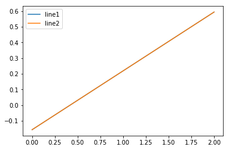
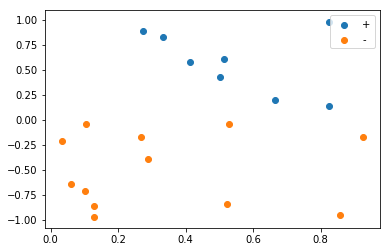
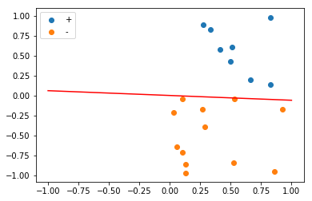
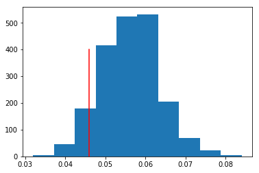
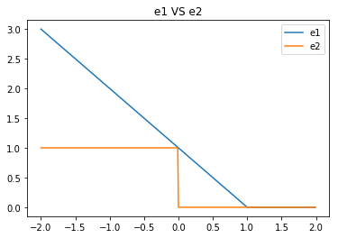
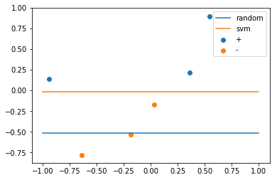
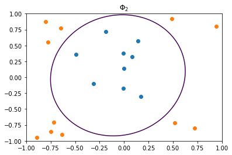
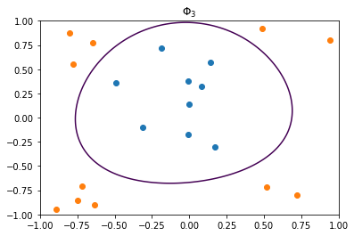
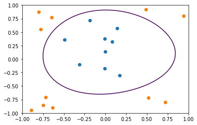

大家好，这篇是有关Learning from data第八章习题的详解，这一章主要介绍了支持向量机。

我的github地址：  
https://github.com/Doraemonzzz

个人主页：  
http://doraemonzzz.com/

参考资料:  
https://blog.csdn.net/a1015553840/article/details/51085129  
http://www.vynguyen.net/category/study/machine-learning/page/6/  
http://book.caltech.edu/bookforum/index.php  
http://beader.me/mlnotebook/


## Chapter8 Support Vector Machines


### Part 1: Exercise

#### Exercise 8.1 (Page 3)

Assume $\mathcal D$ contains two data points $(x_+, +1)$ and $(x_-, -1)$. Show that: 

(a) No hyperplane can tolerate noise radius greater than $\frac 1 2 ||x_+ - x_-||$. 

(b) There is a hyperplane that tolerates a noise radius $\frac 1 2 ||x_+ - x_-||$.    

假设平面为$w^Tx+b=0$，那么任意一点$x^{'}$到该平面的距离为$\frac {|w^Tx^{'}+b|}{||w||}$，接下来考虑这两个问题。

(a)记$x_+$到该平面的距离为$d_+$，$x_-$到该平面的距离为$d_-$
$$
d_++d_-=\frac {|w^Tx_++b|}{||w||}+\frac {|w^Tx_-+b|}{||w||}
$$
因为$x_+$标记为$1$，所以$w^Tx_++b>0$，同理$w^Tx_-+b<0$，所以距离之和为
$$
\begin{aligned}
d_++d_-&=\frac {|w^Tx_++b|}{||w||}+\frac {|w^Tx_-+b|}{||w||}\\
&=\frac {w^Tx_++b}{||w||}+\frac {-w^Tx_--b}{||w||}\\
&=\frac{w^T(x_+-x_-)}{||w||}
\end{aligned}
$$
由柯西不等式可知
$$
d_++d_-=\frac{w^T(x_+-x_-)}{||w||}\le \frac{||w^T||||x_+-x_-||}{||w||}=||x_+-x_-||
$$
因为$\text {radius=min}\{d_+,d_-\}​$，所以
$$
2\text{radius}\le d_++d_-\le ||x_+-x_-||\\
\text{radius}\le \frac 1 2||x_+-x_-||
$$
(b)从几何意义我们可知，只要取$x_+,x_-$的“中垂线”即可，联系二维情形，该平面为
$$
(x_+-x_-)^T(x-\frac 1 2(x_++x_-))=0
$$
$x_+$到该平面的距离为
$$
\begin{aligned}
d_+
&=\frac {|(x_+-x_-)^T(x_+-\frac 1 2(x_++x_-))|}{||x_+-x_-||}\\
&=\frac 1 2\frac {|(x_+-x_-)^T(x_+-x_-)|}{||x_+-x_-||}\\
&=\frac 1 2 ||x_+-x_-||
\end{aligned}
$$
$x_-$到该平面的距离为
$$
\begin{aligned}
d_-
&=\frac {|(x_+-x_-)^T(x_- -\frac 1 2(x_++x_-))|}{||x_+-x_-||}\\
&=\frac 1 2\frac {|(x_+-x_-)^T(x_+-x_-)|}{||x_+-x_-||}\\
&=\frac 1 2 ||x_+-x_-||
\end{aligned}
$$
所以存在一个平面满足条件。


#### Exercise 8.2 (Page 5) 

Consider the data below and a ‘hyperplane’ $(b, w)$ that separates the data. 
$$
X= \left[
 \begin{matrix}
 0 & 0 \\
2 & 2 \\
2 &0
  \end{matrix}
  \right],
  y= \left[
 \begin{matrix}
 -1  \\
-1  \\
+1 
  \end{matrix}
  \right],
  w=\left[
 \begin{matrix}
 1.2  \\
-3.2  
  \end{matrix}
  \right],
  b=-0.5
$$
(a) Compute $ρ = \underset {n=1,...,N} {\text{min}}  y_n(w^Tx_n + b)$. 

(b) Compute the weights $\frac 1 ρ (b, w)$ and show that they satisfy (8.2). 

(c) Plot both hyperplanes to show that they are the same separator    

(a)计算即可
$$
y_1(w^Tx_1 + b)=(-1)\times(0-0.5)=0.5\\
y_2(w^Tx_2 + b)=(-1)\times(2.4-6.4-0.5)=4.5\\
y_3(w^Tx_3+ b)=(1)\times(2.4-0.5)=1.9\\
ρ = 0.5
$$
(b)(8.2)为
$$
\underset {n=1,...,N} {\text{min}}  y_n(w^Tx_n + b)=1
$$
利用$\frac 1 ρ (b, w)$重新计算可得
$$
y_1(w^Tx_1+ b)=1\\
y_2(w^Tx_2+ b)=9\\
y_3(w^Tx_3+ b)=3.8
$$
所以条件满足

(c)
$$
\frac w ρ
=\frac{ \left[
 \begin{matrix}
 1.2  \\
-3.2  
  \end{matrix}
  \right]}{0.5}
  = \left[
 \begin{matrix}
 2.4  \\
-6.4  
  \end{matrix}
  \right],
 \frac  b ρ=-1
$$

最后作图看下

```python
import matplotlib.pyplot as plt
import numpy as np
w=np.array([1.2,-3.2])
b=-0.5
w1=w/0.5
b1=b/0.5

x=np.array([0,2])
y=-(w[0]*x+b)/w[1]
y1=-(w1[0]*x+b1)/w1[1]

plt.plot(x,y,label='line1')
plt.plot(x,y1,label='line2')
plt.legend()
plt.show()
```




#### Exercise 8.3 (Page 8)

For separable data that contain both positive and negative examples, and a separating hyperplane $h$, define the positive-side margin $ρ_+(h)$ to be the distance between $h$ and the nearest data point of class $+1$. Similarly, define the negative-side margin $ρ_-(h)$ to be the distance between $h$ and the nearest data point of class $-1$. Argue that if $h$ is the optimal hyperplane, then $ρ_+(h) = ρ_-(h)$. That is, the thickness of the cushion on either side of the optimal $h$ is equal    

设$ρ_+(h)$ 对应的点为$X_+=\{x_{1+},...,x_{n+}\}$，$ρ_-(h)$ 对应的点为$X_-=\{x_{1-},...,x_{m-}\}$，由8.1可知
$$
ρ_+(h)\le \frac 1 2 ||x_{i+}-x_{j-}||\\
ρ_-(h)\le \frac 1 2 ||x_{i+}-x_{j-}||\\
x_{i+}\in X_+,x_{j-}\in X_- \\
$$
记$d=\underset {x_{i+}\in X_+,x_{j-}\in X_-}{\text{min}} \{\frac 1 2 ||x_{i+}-x_{j-}||\}$，且当$x_{i+}=x_{+}^*,x_{i-}=x_{-}^*$时，$\frac 1 2 ||x_{i+}-x_{j-}||$取最小值，结合8.1可知
$$
ρ_+(h)\le d\\
ρ_-(h)\le d \\
当超平面为(x_+^*-x_-^*)^T(x-\frac 1 2(x_+^*+x_-^*))=0时，等号同时成立
$$
我们知道最优超平面为使得$ρ_+(h),ρ_-(h)$最大的超平面，由上述结论知最优超平面为$(x_+^*-x_-^*)^T(x-\frac 1 2(x_+^*+x_-^*))=0$，此时$ρ_+(h) = ρ_-(h)$，所以结论成立。


#### Exercise 8.4 (Page 10) 

Let $Y$ be an $N × N$ diagonal matrix with diagonal entries $Y_{nn} = y_n$ (a matrix version of the target vector y). Let $X$ be the data matrix augmented with a column of 1s. Show that $A = YX$.    
$$
Y=\text{diag}\{y_1,...,y_N\}\\
X= \left[
 \begin{matrix}
   1 & x_1^T \\
 ... & ... \\
   1 &  x_N^T
  \end{matrix}
  \right]\\
  YX= \left[
 \begin{matrix}
   y_1 & y_1x_1^T \\
 ... & ... \\
   y_N &  y_Nx_N^T
  \end{matrix}
  \right]
$$
回顾课本第10页$A​$的定义可知
$$
A=YX
$$


#### Exercise 8.5 (Page 11)

Show that the matrix $Q$ described in the linear hard-margin SVM algorithm above is positive semi-definite (that is $u^TQu ≥ 0$ for any $u$). 

The result means that the QP-problem is convex. Convexity is useful be cause this makes it ‘easy’ to find an optimal solution. In fact, standard QP-solvers can solve our convex QP-problem in $O((N + d)^3)$.    

回顾课本第10页定义
$$
Q= \left[
 \begin{matrix}
   0 & 0_d^T \\
    0_d^T & I_d
  \end{matrix}
  \right] 
$$
令$x=(x_0,x_1,...,x_d)$，那么
$$
x^TQx=\sum_{i=1}^{d}x_i^2\ge 0
$$
所以$Q$半正定，结论成立。


#### Exercise 8.6 (Page 12)

Construct a toy data set with $N = 20$ using the method in Example 8.4. 

(a) Run the SVM algorithm to obtain the maximum margin separator $(b, w)$ SVM and compute its $E_{out}$ and margin. 

(b) Construct an ordering of the data points that results in a hyperplane with bad $E_{out}$ when PLA is run on it. [Hint: Identify a positive and negative data point for which the perpendicular bisector separating these two points is a bad separator. Where should these two points be in the ordering? How many iterations will PLA take?] 

(c) Create a plot of your two separators arising from SVM and PLA.    

回顾Example 8.4，$x_1 ∈ [0, 1] $, $x_2 ∈ [-1, 1]$,$f(x) = \text{sign}(x_2)$，下面做实验即可。

(a)首先作图

```python
import numpy as np
import matplotlib.pyplot as plt

N=20
x1=np.random.uniform(0,1,N)
x2=np.random.uniform(-1,1,N)
x=[]
for i in range(N):
    x.append([x1[i],x2[i]])
x=np.array(x)
y=np.sign(x2)

plt.scatter(x1[y>0],x2[y>0],label="+")
plt.scatter(x1[y<0],x2[y<0],label="-")
plt.legend()
plt.show()
```



接着使用svm算法，这里好像没有看到hard margin，所以取惩罚系数C为很大的一个数来代替。

```python
from sklearn import svm
clf=svm.SVC(kernel ='linear',C=1e10)
clf.fit(x,y)

#获得超平面
w=clf.coef_[0]
b=clf.intercept_[0]

#作图
xx=np.array([-1,1])
yy=-(b+w[0]*xx)/w[1]
plt.scatter(x1[y>0],x2[y>0],label="+")
plt.scatter(x1[y<0],x2[y<0],label="-")
plt.plot(xx,yy,'r')
plt.legend()
plt.show()
```


计算margin，以及$E_{out}$，注意这里我$E_{out}$都是采用模拟的方法求得，没有采用积分的方法。

```python
margin = 1 / np.sqrt(np.sum(clf.coef_ ** 2))
margin
```

```
0.16046516483775644
```

```python
def Eout(w,b,N=1000):
    x1=np.random.uniform(0,1,N)
    x2=np.random.uniform(-1,1,N)
    x=[]
    for i in range(N):
        x.append([x1[i],x2[i]])
    x=np.array(x)
    y=np.sign(x2)
    y1=np.sign(x.dot(w)+b)
    return np.sum(y!=y1)/N
e=Eout(w,b)
print(e)
```

```
0.022
```

(b)这部分没有理解题目的意思，这里略过

(c)打乱数据，多次采用PLA，然后计算$E_{out}$，作图

```python
from sklearn.linear_model import Perceptron
clf=Perceptron()
clf.fit(x,y)

w1=clf.coef_[0]
b1=clf.intercept_[0]

xx=np.array([-1,1])
yy=-(b1+w1[0]*xx)/w1[1]
plt.scatter(x1[y>0],x2[y>0],label="+")
plt.scatter(x1[y<0],x2[y<0],label="-")
plt.plot(xx,yy,'r')
plt.legend()
plt.show()
```




做多次实验，然后作图

```python
result=np.array([])
for i in range(2000):
    np.random.shuffle(x)
    y=np.sign(x[:,1])
    clf.fit(x,y)
    w1=clf.coef_[0]
    b1=clf.intercept_[0]
    result=np.append(result,Eout(w1,b1))
```

```python
plt.hist(result)
plt.plot([e]*400,range(400),'r')
plt.show()
```




#### Exercise 8.7 (Page 15)

Assume that the data is restricted to lie in a unit sphere. 

(a) Show that $d_{vc}(ρ)$ is non-increasing in $ρ$. 

(b) In $2$ dimensions, show that $d_{vc}(ρ) < 3$ for $ρ > \frac{\sqrt {3}}{2}$ . [Hint: Show that for any 3 points in the unit disc, there must be two that are within distance $\sqrt{3}$ of each other. Use this fact to construct a dichotomy that cannot be implemented by any ρ-thick separator.] 

(a)如果$\rho <\rho^{'}$，由几何意义可知
$$
H(\rho^{'}) \subset H(\rho)
$$
从而$d_{vc}(ρ^{'})<d_{vc}(ρ)$

所以结论成立。

(b)如果能证明单位圆内任意三个点至少有两个点的距离大于等于$\sqrt 3$，那么当$ρ > \frac{\sqrt {3}}{2}$ 时，$d_{vc}(ρ) < 3$，接下来证明单位圆内任意三个点至少有两个点的距离大于等于$\sqrt 3$。

假设单位圆圆心为$O$，圆内三个点为$A,B,C$，那么三角形$ABC$内至少有个一个角小于等于$\frac \pi 3$，不妨设为$\angle A$，所以$\angle BOC$小于等于$\frac {2\pi} 3$，$cos(\angle BOC) \ge -\frac 1 2$。在三角形BOC内利用余弦定理计算$BC$，注意$OB\le1,OC\le 1$
$$
BC=\sqrt{OB^2+OC^2-2OB\times OCcos(\angle BOC)}\le \sqrt{OB^2+OC^2+OB\times OC}\le  \sqrt{1^2+1^2+1\times 1}=\sqrt{3}
$$
从而结论成立。


#### Exercise 8.8 (Page 18)

(a) Evaluate the bound in (8.8) for the data in Figure 8.5. 

(b) If one of the four support vectors in a gray box are removed, does the classifier change? 

(c) Use your answer in (b) to improve your bound in (a). 

The support vectors in gray boxes are non-essential and the support vector in the black box is essential. One can improve the bound in (8.8) to use only essential support vectors. The number of support vectors is unbounded, but the number of essential support vectors is at most $d+1$ (usually much less).    

首先回顾公式(8.8)
$$
E_{cv}(SVM) = \frac 1 N \sum_{n=1}^{N}e_n ≤
\frac {\text{# support vectors}}N
$$
接着看图片8.5


(a)图中${\text{# support vectors}}=5,N=23$，所以
$$
E_{cv}(SVM)  ≤ \frac 5 {23}
$$
(b)如果在灰色box中的某一个点被删除，是不会影响这个分类器的，因为margin没有变，且直线的方向向量没有变。

(c)如果按照b的操作，那么${\text{# support vectors}}=4,N=22$，所以
$$
E_{cv}(SVM)  ≤ \frac4 {22}
$$


#### Exercise 8.9 (Page 23)

Let $u_0$ be optimal for (8.10), and let $u_1$ be optimal for (8.11). 

(a) Show that $\underset {α≥0} {\max} α (c - a^Tu_0) = 0$. [Hint: $c - a^Tu_0 ≤ 0$.] 

(b) Show that $u_1$ is feasible for (8.10). To show this, suppose to the contrary that $c - a^Tu_1 > 0$. Show that the objective in (8.11) is infinite, whereas $u_0$ attains a finite objective of $\frac 1 2u_0^TQu_0 + p^Tu_0$, which contradicts the optimality of $u_1$. 

(c) Show that $\frac 1 2u_1^TQu_1 + p^Tu_1=\frac 1 2u_0^TQu_0 + p^Tu_0$, and hence that $u_1$ is optimal for (8.10) and $u_0$ is optimal for (8.11). 

(d) Let $u^∗$ be any optimal solution for (8.11) with $\underset {α≥0} {\max} α (c - a^Tu^*) $ attained at $α^∗$. Show that 
$$
α^∗(c - a^Tu^∗) = 0
$$
Either the constraint is exactly satisfied with $c-a^Tu^∗ = 0​$, or $α^∗ = 0​$.    

首先回顾8.10与8.11

8.10
$$
\underset{u∈R^L} {\text{minimize}} : \frac 1 2u^TQu+p^Tu\\
\text{subject to}: a^Tu \ge c,
$$
8.11
$$
\underset{u∈R^L} {\text{minimize}} : \frac 1 2u^TQu+p^Tu+
\underset{\alpha \ge0}{\text{max}}\ \alpha(c-a^Tu)
$$
此题是证明问题8.10与问题8.11的等价性

(a)
$$
c - a^Tu_0\le0,α≥0\\
α (c - a^Tu_0)\le 0\\
所以\underset {α≥0} {\max} α (c - a^Tu_0) = 0
$$
(b)下面证明$u_1$也是8.10的解，首先证明$c - a^Tu_1 \le 0$，利用反证法：如果$c - a^Tu_1 > 0$，那么
$$
\alpha(c-a^Tu_1)\ge0,\underset {α≥0} {\max} α (c - a^Tu_1) = +\infty \\
\frac 1 2u_1^TQu_1+p^Tu_1+\underset{\alpha \ge0}{\text{max}}\ \alpha(c-a^Tu_1)=+\infty
$$
但是
$$
\frac 1 2u_0^TQu_0+p^Tu_0+\underset{\alpha \ge0}{\text{max}}\ \alpha(c-a^Tu_0)=\frac 1 2u_0^TQu_0+p^Tu_0<+\infty
$$
这就与$u_1$为8.11的最优解矛盾，所以$c - a^Tu_1 \le 0$，从而$u_1$也是8.10的可行解。

(c)证明两个方向的不等式即可，先证明$\frac 1 2u_1^TQu_1 + p^Tu_1\ge \frac 1 2u_0^TQu_0 + p^Tu_0$，注意由上题可知$c-a^Tu_1\le0$。
$$
因为c-a^Tu_1\le0，所以\underset{\alpha \ge0}{\text{max}}\ \alpha(c-a^Tu_1)=0\\
\frac 1 2u_1^TQu_1+p^Tu_1+\underset{\alpha \ge0}{\text{max}}\ \alpha(c-a^Tu_1)
=\frac 1 2u_1^TQu_1+p^Tu_1
\ge \frac 1 2u_0^TQu_0+p^Tu_0\\
最后一个不等式是由于u_0为8.10的解
$$
再证明$\frac 1 2u_1^TQu_1 + p^Tu_1\le \frac 1 2u_0^TQu_0 + p^Tu_0$
$$
\frac 1 2u_0^TQu_0+p^Tu_0+\underset{\alpha \ge0}{\text{max}}\ \alpha(c-a^Tu_0)\ge 
\frac 1 2u_1^TQu_1+p^Tu_1+\underset{\alpha \ge0}{\text{max}}\ \alpha(c-a^Tu_1)\\
该不等式是由于u_1为8.11的解\\
注意\frac 1 2u_0^TQu_0+p^Tu_0+\underset{\alpha \ge0}{\text{max}}\ \alpha(c-a^Tu_0)=\frac 1 2u_0^TQu_0+p^Tu_0\\
\frac 1 2u_1^TQu_1+p^Tu_1+\underset{\alpha \ge0}{\text{max}}\ \alpha(c-a^Tu_1)=\frac 1 2u_1^TQu_1+p^Tu_1\\
从而\frac 1 2u_0^TQu_0+p^Tu_0 \ge \frac 1 2u_1^TQu_1+p^Tu_1
$$
结合两个不等式可得
$$
\frac 1 2u_1^TQu_1 + p^Tu_1=\frac 1 2u_0^TQu_0 + p^Tu_0
$$
(d)由之前推导过程我们知道，如果$u^*$为8.11的解，必然有
$$
α^∗(c - a^Tu^∗) = 0
$$
所以结论成立。


#### Exercise 8.10 (Page 24)

Do the algebra. Derive (∗) and plug it into $\mathcal L(u, α) $ to obtain $\mathcal L(α) $.   

$u_1=\frac{\alpha_1+\alpha_2}{2},u_1=\frac{2\alpha_1+\alpha_3}{2}$，将这两式带入$\mathcal L(u, α) $
$$
\begin{aligned}
\mathcal L(u, α) 
&= u_1^2 + u_2^2 + α_1(2 − u_1 − 2u_2) − α_2u_1 − α_3u_2\\
&=(\frac{\alpha_1+\alpha_2}{2})^2+(\frac{2\alpha_1+\alpha_3}{2})^2+
α_1(2 − \frac{\alpha_1+\alpha_2}{2} − 2\frac{2\alpha_1+\alpha_3}{2})-
α_2(\frac{\alpha_1+\alpha_2}{2})-α_3(\frac{2\alpha_1+\alpha_3}{2})\\
&=\frac 1 4 \alpha_1^2+\frac 1 2 \alpha_1\alpha_2+ \frac 1 4 \alpha_2^2+
\alpha_1^2+ \alpha_1\alpha_3+\frac 1 4\alpha_3^2+α_1(2-\frac 5 2 \alpha_1-\frac1 2\alpha_2-\alpha_3)-
\frac 1 2 \alpha_1\alpha_2-\frac 1 2 \alpha_2^2-\alpha_1\alpha_3-\frac 1 2 \alpha_3^2\\
&=(1+\frac 1 4-\frac 52)\alpha_1^2+(\frac 1 4-\frac 1 2)\alpha_2^2+(\frac 1 4-\frac 1 2)\alpha_3^2+
(\frac 1 2 -\frac 1 2-\frac 1 2)\alpha_1\alpha_2+(1-1-1)\alpha_1\alpha_3+2\alpha_1\\
&=-\frac 54\alpha_1^2-\frac 1 4\alpha_2^2-\frac 1 4\alpha_3^2
-\frac 1 2\alpha_1\alpha_2-\alpha_1\alpha_3+2\alpha_1
\end{aligned}
$$


#### Exercise 8.11 (Page 28)

(a) Show that the problem in (8.21) is a standard QP-problem: 
$$
\underset{\alpha∈R^N} {\text{minimize}} : \frac 1 2\alpha^TQ_D\alpha-1_N^T\alpha\\
\text{subject to}: A_D\alpha\ge 0_{N+2},
$$
where $Q_D$ and $A_D$ ($D$ for dual) are given by:
$$
Q_D=\left[
 \begin{matrix}
  y_1y_1x^T_1x_1 & ... &   y_1y_Nx^T_1x_N \\
    y_2y_1x^T_2x_1 & ... &   y_2y_Nx^T_2x_N \\
   ... & ... & ...  \\
  y_Ny_1x^T_Nx_1 & ... &   y_Ny_Nx^T_Nx_N 
  \end{matrix}
  \right]
  \text{ and }
  A_D=\left[
 \begin{matrix}
  y^T \\
-  y^T\\
I_{N\times N} 
  \end{matrix}
  \right]
$$
[Hint: Recall that an equality corresponds to two inequalities.] 

(b) The matrix $Q_D$ of quadratic coefficients is $[Q_D]_{mn}= y_my_nx^T_mx_n$. Show that $Q_D = X_sX^T_s$, where $X_s$ is the ‘signed data matrix’, 
$$
X_s =  \left[
 \begin{matrix}
   -y_1x_1^T-  \\
   -y_2x_2^T-  \\
   ... \\
      -y_Nx_N^T-  \\
  \end{matrix}
  \right]
$$
Hence, show that $Q_D$ is positive semi-definite. This implies that the QP-problem is convex.     

回顾问题8.21
$$
\underset{\alpha∈R^N} {\text{minimize}} : \frac 1 2\sum_{m=1}^{N}\sum_{n=1}^{N}y_ny_m\alpha_n\alpha_mx_n^Tx_m-\sum_{n=1}^{N}\alpha_n\\
\text{subject to}: \sum_{n=1}^N y_n\alpha_n=0,\alpha_n\ge0(n=1,...,N)
$$
(a)看到这个最小化的式子可以想到二次型，所以可以很自然的构造出$Q_D​$，带入验证可得
$$
\frac 1 2\alpha^TQ_D\alpha+1_N^T\alpha=\frac 1 2\sum_{m=1}^{N}\sum_{n=1}^{N}y_ny_m\alpha_n\alpha_mx_n^Tx_m-\sum_{n=1}^{N}\alpha_n
$$
接着看限制条件，将等式转化为两个不等式
$$
\sum_{n=1}^N y_n\alpha_n=0 \Leftrightarrow  \sum_{n=1}^N y_n\alpha_n\ge0 ,\sum_{n=1}^N y_n\alpha_n\le0
\Leftrightarrow y^T\alpha\ge0,-y^T\alpha\ge0
$$
再看不等式限制条件
$$
\alpha_n\ge0(n=1,...,N) \Leftrightarrow I_{N\times N}  \alpha\ge0
$$
从而$A_D \alpha\ge0$等价于原来的约束条件

(b)直接根据定义验证即可
$$
\begin{aligned}
(X_sX^T_s)_{mn}
&=X_s第m行点积X_s^T第n列\\
&=X_s第m行点积X_s第n行\\
&=(y_mx_m^T)^T(y_nx_n^T)\\
&=y_my_nx_mx_n^T\\
&=y_my_nx^T_mx_n
\end{aligned}
$$


#### Exercise 8.12 (Page 29) 

If all the data is from one class, then $α^∗_n = 0$ for $n = 1, . . . , N$. 

(a) What is $w^∗$? 

(b) What is $b^∗$?    

我们先来证明题目中的结论，如果所有数据都属于一类，那么$\alpha_n=0,n=1,...,N$。

因为所有数据都属于一类，$y_1=y_2=...=y_N=t$，结合27页问题8.21的限制条件
$$
\sum_{n=1}^N y_n\alpha_n=t(\sum_{n=1}^N \alpha_n)=0,\alpha_n\ge0(n=1,...,N)
$$
可得
$$
\sum_{n=1}^N \alpha_n=0,\alpha_n\ge0(n=1,...,N)
$$
所以$\alpha_n=0,n=1,...,N$

(a)因为$\alpha_n^*=0,n=1,...,N$，那么
$$
w^*=\sum_{n=1}^N y_n\alpha_n^*x_n=0\\
$$
(b)将$w^*=0$带入限制条件$y_n(w^Tx_n+b)\ge1$
$$
y_n(w^Tx_n+b)=y_nb\ge1\\
$$
因为所有数据都属于一类，所以$y_1=y_2=...=y_N=1$或$y_1=y_2=...=y_N=-1$。

如果$y_1=y_2=...=y_N=1$
$$
y_nb=b\ge1
$$
如果$y_1=y_2=...=y_N=-1$
$$
y_nb=-b\ge1\\
b\le-1
$$


#### Exercise 8.13 (Page 31) 

KKT complementary slackness gives that if $α^∗_n > 0$, then $(x_n, y_n)$ is on the boundary of the optimal fat-hyperplane and $y_n (w^{∗t}x_n + b^∗) = 1$. Show that the reverse is not true. Namely, it is possible that $α^∗_n = 0$ and yet $(x_n, y_n)$ is on the boundary satisfying $y_n (w^{∗t}x_n + b^∗) = 1$. [Hint: Consider a toy data set with two positive examples at (0, 0) and (1, 0), and one negative example at (0, 1).]    

这题想要说明的是，即使$α^∗_n = 0$，也有可能$y_n (w^{∗t}x_n + b^∗) = 1$，说明我们找到的支持向量只是边界点的子集。

现在来看本题，考虑题目中给出的三个点$(0, 0), (1, 0),(0, 1)$，其中$(0,0),(1,0)$标记为$+1$，$(0, 1)$标记为$-1$。回忆之前的优化问题
$$
\underset{\alpha∈R^N} {\text{minimize}} : \frac 1 2\sum_{m=1}^{N}\sum_{n=1}^{N}y_ny_m\alpha_n\alpha_mx_n^Tx_m-\sum_{n=1}^{N}\alpha_n\\
\text{subject to}: \sum_{n=1}^N y_n\alpha_n=0,\alpha_n\ge0(n=1,...,N)
$$
我们的条件为$N=3,y_1=y_2=1,y_3=-1,x_1=(0,0),x_2=(1,0),x_3=(0,1)$，从而
$$
x_1^Tx_1=0,x_1^Tx_2=0,x_1^Tx_3=0,x_2^Tx_2=1,x_2^Tx_3=0,x_3^Tx_3=1
$$
带入可得
$$
\underset{\alpha∈R^N} {\text{minimize}} : \frac 1 2 (\alpha_2^2+\alpha_3^2)-(\alpha_1+\alpha_2+\alpha_3)\\
\text{subject to}: \alpha_1+\alpha_2-\alpha_3=0,\alpha_1\ge0,\alpha_2\ge0,\alpha_3\ge0
$$
将$\alpha_3=\alpha_1+\alpha_2$带入可得
$$
\begin{aligned}
 \frac 1 2 (\alpha_2^2+\alpha_3^2)-(\alpha_1+\alpha_2+\alpha_3)
 &=\frac 1 2[\alpha_2^2+(\alpha_1+\alpha_2)^2]-2(\alpha_1+\alpha_2)\\
 &=\frac 1 2(\alpha_1^2+2\alpha_1\alpha_2+2\alpha_2^2)-2\alpha_1-2\alpha_2\\
 &=\alpha_2^2+(\alpha_1-2)\alpha_2+\frac 1 2\alpha_1^2-2\alpha_1\\
 &=[\alpha_2+\frac 1 2(\alpha_1-2)]^2+\frac 1 2\alpha_1^2-2\alpha_1-\frac 1 4(\alpha_1-2)^2\\
 &=[\alpha_2+\frac 1 2(\alpha_1-2)]^2+\frac 1 4(2\alpha_1^2-8\alpha_1-\alpha_1^2+4\alpha_1-4)\\
 &=[\alpha_2+\frac 1 2(\alpha_1-2)]^2+\frac 1 4(\alpha_1^2-4\alpha_1-4)\\
 &=[\alpha_2+\frac 1 2(\alpha_1-2)]^2+\frac 1 4(\alpha_1-2)^2-2
 \end{aligned}
$$
所以当
$$
\alpha_2+\frac 1 2(\alpha_1-2)=0,\alpha_1-2=0\\
\alpha_1=2,\alpha_2=0时，上式取最小值，此时\alpha_3=\alpha_1+\alpha_2=2
$$
结合$w,b$的公式
$$
w^*=\sum_{n=1}^N y_n\alpha_n^*x_n\\
对于\alpha_s\neq0,b^*=y_s-w^{*T}x_s
$$
带入可得
$$
w=2x_1-2x_3=2(0,0)-2(0,1)=(0,-2)\\
取s=1,b=y_1-w^{T}x_1=1-(0,-2)^T(0,0)=1
$$
注意$\alpha_2=0$，我们来看$x_2$的位置
$$
w^Tx_2+b=(0,-2)^T(1,0)+1=1
$$
所以$x_2$满足$w^Tx+b=1$，结论成立。


#### Exercise 8.14 (Page 32) 

Suppose that we removed a data point $(x_n, y_n)$ with $α^∗_n = 0$. 

(a) Show that the previous optimal solution $α^∗$ remains feasible for the new dual problem (8.21) (after removing $α^∗_n$) .

(b) Show that if there is any other feasible solution for the new dual that has a lower objective value than $α^∗$, this would contradict the optimality of $α^∗$ for the original dual problem. 

(c) Hence, show that $α^∗$ (minus $α^∗_n$) is optimal for the new dual. 

(d) Hence, show that the optimal fat-hyperplane did not change. 

(e) Prove the bound on $E_{cv}$ in (8.27).    

首先回顾对偶问题
$$
\underset{\alpha∈R^N} {\text{minimize}} : \frac 1 2\sum_{m=1}^{N}\sum_{n=1}^{N}y_ny_m\alpha_n\alpha_mx_n^Tx_m-\sum_{n=1}^{N}\alpha_n\\
\text{subject to}: \sum_{n=1}^N y_n\alpha_n=0,\alpha_n\ge0(n=1,...,N)
$$
这题想要说明的是去除$\alpha_n=0$的点并不影响该问题，不失一般性，不妨设$(x_N, y_N)$对应的$α^∗_N = 0$，那么删除$(x_N, y_N)$之后对偶问题变为
$$
\underset{\alpha∈R^{N-1}} {\text{minimize}} : \frac 1 2\sum_{m=1}^{N-1}\sum_{n=1}^{N-1}y_ny_m\alpha_n\alpha_mx_n^Tx_m-\sum_{n=1}^{N-1}\alpha_n\\
\text{subject to}: \sum_{n=1}^{N-1} y_n\alpha_n=0,\alpha_n\ge0(n=1,...,N-1)
$$
接着定义以下符号
$$
f(\alpha_1,...,\alpha_N)= \frac 1 2\sum_{m=1}^{N}\sum_{n=1}^{N}y_ny_m\alpha_n\alpha_mx_n^Tx_m-\sum_{n=1}^{N}\alpha_n
$$
所以对偶问题可以写成如下形式
$$
\underset{\alpha∈R^N} {\text{minimize}} :f(\alpha_1,...,\alpha_N)\\
\text{subject to}: \sum_{n=1}^N y_n\alpha_n=0,\alpha_n\ge0(n=1,...,N)
$$
注意到
$$
\frac 1 2\sum_{m=1}^{N-1}\sum_{n=1}^{N-1}y_ny_m\alpha_n\alpha_mx_n^Tx_m-\sum_{n=1}^{N-1}\alpha_n=f(\alpha_1,...\alpha_{N-1},0)
$$
所以删除$(x_N, y_N)$之后对偶问题变为
$$
\underset{\alpha∈R^{N-1}} {\text{minimize}} :f(\alpha_1,...\alpha_{N-1},0)\\
\text{subject to}: \sum_{n=1}^{N-1} y_n\alpha_n=0,\alpha_n\ge0(n=1,...,N-1)
$$
(a)因为$f(\alpha_1,...,\alpha_N)$表示的范围比$f(\alpha_1,...\alpha_{N-1},0)$更大，所以
$$
\underset{\alpha∈R^N} {\text{minimize}} :f(\alpha_1,...,\alpha_N) \le \underset{\alpha∈R^{N-1}} {\text{minimize}} :f(\alpha_1,...\alpha_{N-1},0)
$$
原问题的最优解为$α^∗$，且$\alpha_N^*=0$，从而
$$
f(\alpha_1^*,...,\alpha_{N-1}^*,0)=\underset{\alpha∈R^N} {\text{minimize}} :f(\alpha_1,...,\alpha_N) \le \underset{\alpha∈R^{N-1}} {\text{minimize}} :f(\alpha_1,...\alpha_{N-1},0)
$$
显然
$$
f(\alpha_1^*,...,\alpha_{N-1}^*,0)\ge  \underset{\alpha∈R^{N-1}} {\text{minimize}} :f(\alpha_1,...\alpha_{N-1},0)
$$
结合以上两点可知
$$
f(\alpha_1^*,...,\alpha_{N-1}^*,0)=  \underset{\alpha∈R^{N-1}} {\text{minimize}} :f(\alpha_1,...\alpha_{N-1},0)
$$
从而$\alpha_1^*,...,\alpha_{N-1}^*$为删除$x_N,y_N$之后的对偶问题的解。

(b)如果存在$\alpha^{'}=(\alpha_1^{'},...,\alpha_{N-1}^{'})$使得
$$
f(\alpha_1^{'},...,\alpha_{N-1}^{'},0)<f(\alpha_1^*,...,\alpha_{N-1}^*,0)=\underset{\alpha∈R^N} {\text{minimize}} :f(\alpha_1,...,\alpha_N)
$$
这就与$\alpha^*$为原问题的最优解相矛盾。

(c)(a)说明原问题的解一定是新问题的解，(b)说明新问题解不会比原问题更优，从而$\alpha_1^*,...,\alpha_{N-1}^*$为删除$x_N,y_N$之后的对偶问题的解。

（补充，个人感觉应该从(a)的部分就足够得出这个结论了。）

(d)回顾公式
$$
w^*=\sum_{n=1}^N y_n\alpha_n^*x_n\\
对于\alpha_s\neq0,b^*=y_s-w^{*T}x_s
$$
所以删除$\alpha_n^*=0$的点不会改变$w^*$，也不会改变$b^*$，所以超平面没有变，结论成立。

(e)回顾下公式
$$
E_{cv} = \frac 1 N \sum_{n=1}^{N}e_n ≤
\frac {\text{# number of }\alpha_n^*>0}N
$$
回顾之前结论可知，我们删除$\alpha_n^*=0$的点不改变超平面，所以$E_{cv}$不会变，只有删除$\alpha_n^*>0$的点才会改变超平面，所以
$$
\sum_{n=1}^{N}e_n\le{\text{# number of }\alpha_n^*>0} \\
E_{cv} = \frac 1 N \sum_{n=1}^{N}e_n ≤
\frac {\text{# number of }\alpha_n^*>0}N
$$


#### Exercise 8.15 (Page 38)

Consider two finite-dimensional feature transforms $Φ_1$ and $Φ_2$ and their corresponding kernels $K_1$ and $K_2$. 

(a) Define $Φ(x) = (Φ_1(x), Φ_2(x))$. Express the corresponding kernel of $Φ$ in terms of $K_1$ and $K_2$. 

(b) Consider the matrix $Φ_1(x)Φ_2(x)^T$ and let $Φ(x)$ be the vector representation of the matrix (say, by concatenating all the rows). Express the corresponding kernel of $Φ$ in terms of $K_1$ and $K_2$. 

(c) Hence, show that if $K_1$ and $K_2$ are kernels, then so are $K_1 + K_2$ and $K_1K_2$. 

The results above can be used to construct the general polynomial kernels and (when extended to the infinite-dimensional transforms) to construct the general Gaussian-RBF kernels.    

直接根据定义验证即可

(a)
$$
Φ(x) ^TΦ(x^{'})= (Φ_1(x), Φ_2(x))^T(Φ_1(x^{'}), Φ_2(x^{'}))=Φ_1(x)^TΦ_1(x^{'})+Φ_2(x)^TΦ_2(x^{'})=K_1(x,x^{'})+K_2(x,x^{'})
$$
所以$Φ(x) = (Φ_1(x), Φ_2(x))​$的kernel为$K_1+K_2​$

(b)$\Phi(x)$是$Φ_1(x)Φ_2(x)^T$每一行拼接而成的向量，设$Φ_1(x),Φ_2(x)\in R^n$，给出以下记号
$$
\Phi^i(x)=Φ_1^{i}(x)Φ_2(x)^T\in R^n\\
Φ^{i}_1(x)为Φ_1(x)的第i个分量
$$
那么
$$
\Phi(x) =(Φ^i(x),...,Φ^n(x))^T \in R^{n^2}\\
$$

$$
\Phi^i(x)=Φ_1^{i}(x)Φ_2(x)^T\in R^n\\
\Phi(x) =(Φ^i(x),...,Φ^n(x))^T \in R^{n^2}\\
Φ^{i}_1(x)为Φ_1(x)的第i个分量
$$

接着计算$\Phi(x) \Phi^T(x) $，注意$\Phi^i(x)$为行向量
$$
\begin{aligned}
(Φ(x) Φ(x^{'})^T)
&=\sum_{i=1}^n  (Φ^i(x))Φ^i(x^{'})^T\\
&=\sum_{i=1}^n (Φ_1^{i}(x)Φ_2(x)^T)(Φ_1^{i}(x^{'})Φ_2(x^{'})^T)^T\\
&=\sum_{i=1}^nΦ_1^{i}(x)Φ_1^{i}(x^{'})Φ_2(x)^TΦ_2(x^{'})\\
&=\sum_{i=1}^nΦ_1^{i}(x)Φ_1^{i}(x^{'})K_2(x,x^{'})\\
&=K_2(x,x^{'})\sum_{i=1}^nΦ_1^{i}(x)Φ_1^{i}(x^{'})\\
&=K_2(x,x^{'})K_1(x,x^{'})
\end{aligned}
$$
所以$Φ(x)$的kernel为$K_1(x,x^{'})K_2(x,x^{'})$

(c)由(a),(b)可以直接推出


#### Exercise 8.16 (Page 42)

Show that the optimization problem in (8.30) is a QP-problem. 

(a) Show that the optimization variable is $u = \left[ \begin{matrix}  b\\w\\ξ \end{matrix} \right] $ , where $ξ = \left[ \begin{matrix} ξ_1\\...\\ξ_N  \end{matrix}\right] $ . 

(b) Show that $u^∗ ← QP(Q, p, A, c)$, where 
$$
Q= \left[
 \begin{matrix}
 0 & 0_d^T & 0_N^T \\
  0_d & I_d & 0_{d\times N} \\
  0_N & 0_{N\times d } & 0_{N\times N }
  \end{matrix}
  \right],
 p=\left[
 \begin{matrix}
0_{d+1} \\
   C1_N
  \end{matrix}
  \right],
  A= \left[
 \begin{matrix}
   YX & I_N  \\
   0_{N\times{(d+1)}} & I_N
  \end{matrix}
  \right],
  c= \left[
 \begin{matrix}
   1 _N \\
0_N
  \end{matrix}
  \right]
$$
and YX is the signed data matrix from Exercise 8.4. 

(c) How do you recover $b^∗$, $w^∗$ and $ξ^∗$ from $u^∗$? 

(d) How do you determine which data points violate the margin, which data points are on the edge of the margin and which data points are correctly separated and outside the margin?    

首先回顾8.30
$$
\underset{w,b,ξ} {\text{minimize}} : \frac 1 2w^Tw+C\sum_{n=1}^{N}ξ_n\\
\text{subject to}: y_n(w^Tx_n+b)\ge 1- ξ_n,ξ_n\ge0\ (n=1,2,...,N)
$$
Q-P问题的标准形式为
$$
\underset{u∈R^L} {\text{minimize}} : \frac 1 2u^TQu+p^Tu\\
\text{subject to}:Au\ge c,
$$
接下来验证结论。

(a)查看标准形式之后可以发现$u$为变量，8.30中的变量为$w,b,ξ_1,...,ξ_N$

所以可以记$u = \left[ \begin{matrix}  b\\w\\ξ \end{matrix} \right] $ , 其中 $ξ = \left[ \begin{matrix} ξ_1\\...\\ξ_N  \end{matrix}\right] $ 

(b)分别验证即可，首先验证目标函数
$$
\frac 1 2 u^TQu=
\frac 1 2\left[ \begin{matrix}  b\\w\\ξ \end{matrix} \right] ^T
\left[
 \begin{matrix}
 0 & 0_d^T & 0_N^T \\
  0_d & I_d & 0_{d\times N} \\
  0_N & 0_{N\times d } & 0_{N\times N }
  \end{matrix}
  \right]
  \left[ \begin{matrix}  b\\w\\ξ \end{matrix} \right]
  =\frac 1 2w^Tw  \\
  p^Tu=\left[
 \begin{matrix}
0_{d+1} \\
   C1_N
  \end{matrix}
  \right]^T\left[ \begin{matrix}  b\\w\\ξ \end{matrix} \right]
  =C1_N^Tξ=C\sum_{n=1}^{N}ξ_n\\
$$
接着验证限制条件
$$
YX= \left[
 \begin{matrix}
   y_1 & y_1x_1^T \\
 ... & ... \\
   y_N &  y_Nx_N^T
  \end{matrix}
  \right],
  \left[
 \begin{matrix}
   YX & I_N  
  \end{matrix}
 \right] 
 \left[ \begin{matrix}  b\\w\\ξ \end{matrix} \right]
 = \left[
 \begin{matrix}
   y_1b+y_1x_1^Tw+ξ_1 \\
 ...  \\
  y_Nb+y_Nx_N^Tw+ξ_N
  \end{matrix}
  \right]\\
 \left[
 \begin{matrix}
   0_{N\times{(d+1)}} & I_N
  \end{matrix}
  \right] \left[ \begin{matrix}  b\\w\\ξ \end{matrix} \right]
  =\left[
 \begin{matrix}
  ξ_1\\
  ...\\
  ξ_N
  \end{matrix}
  \right]
$$
所以$Au\ge c$可以化为
$$
Au=\left[
 \begin{matrix}
   YX & I_N  \\
   0_{N\times{(d+1)}} & I_N
  \end{matrix}
  \right]\left[ \begin{matrix}  b\\w\\ξ \end{matrix} \right]
  =\left[
 \begin{matrix}
   y_1b+y_1x_1^Tw+ξ_1 \\
 ...  \\
  y_Nb+y_Nx_N^Tw+ξ_N\\
   ξ_1\\
  ...\\
  ξ_N
  \end{matrix}
  \right]\ge c=
   \left[
 \begin{matrix}
   1 _N \\
0_N
  \end{matrix}
  \right]
$$
可以看出这就是题目中的条件。

(c)如果计算出了$u^*$，那么$b^∗=u^*_0,w^*=(u_1^*,...,u_d^*),ξ^*=(u_{d+1}^*,...,u_{N+d}^*)$

(d)先看$ξ_i$，$ξ_i>0$表示误分，所以分类正确的点一定由$ξ_i=0$。对于$ξ_i=0$的点，如果$y_i(w^Tx_i+b)=1$，那么该点在边界上，否则该点不在边界上。


#### Exercise 8.17 (Page 45)

Show that $E_{svm}(b, w)$ is an upper bound on the $E_{in}(b, w)$, where $E_{in}$ is the classification 0/1 error.    

回顾两种误差的定义
$$
E_{svm}(b, w)=\frac 1 N\sum_{n=1}^N\text{max}(1-y_n(w^Tx_n+b),0)\\
E_{in}(b, w)=\frac 1 N\sum_{n=1}^N [\![\text{sign}(w^Tx_n+b)\neq y_n]\!]
$$
所以只要比较
$$
e_1=\text{max}(1-y(w^Tx+b),0),e_2= [\![\text{sign}(w^Tx+b)\neq y]\!]
$$
由于$y\in \{+1,-1\}$，对$e_2$进行变形
$$
\begin{aligned}
e_2
&= [\![\text{sign}(w^Tx+b)\neq y]\!]\\
&= [\![y\text{ sign}(w^Tx+b)\neq 1]\!]\\
&= [\![\text{ sign}[y(w^Tx+b)]\neq 1]\!]
\end{aligned}
$$
设$t=y(w^Tx+b)$，所以$e_1,e_2$可以化为
$$
e_1=\text{max}(1-t,0)=\begin{cases}
1-t & \text{如果 $t\le1$ }\\
0& \text{如果 $t>1$ }
\end{cases}\\
e_2= [\![\text{ sign}(t)\neq 1]\!]
=\begin{cases}
1 & \text{如果 $t<0 $}\\
0& \text{如果 $t\ge0$ }
\end{cases}
$$
当$t>1$时，$e_1=e_2=0$，当$0\le t\le1$时，$e_1>0=e_2$，当$t<0$时，$e_1>1=e_2$，所以


$$
e_1\ge e_2
$$

从而
$$
E_{in}(b, w)\le E_{svm}(b, w)
$$
最后再从图像角度看一下这个结论。

```python
import matplotlib.pyplot as plt
import numpy as np

def e1(t):
    return max(1-t,0)

def e2(t):
    if t>=0:
        return 0
    else:
        return 1
    
x=np.arange(-2,2,0.01)
y1=[e1(i) for i in x]
y2=[e2(i) for i in x]

plt.plot(x,y1,label='e1')
plt.plot(x,y2,label='e2')
plt.legend()
plt.title('e1 VS e2')
plt.show()
```




### Part 2:Problems

#### Problem 8.1 (Page 46) 

Consider a data set with two data points $x_± ∈ R^d$ having class $±1$ respectively. Manually solve (8.4) by explicitly minimizing $||w||^2$ subject to the two separation constraints. 

Compute the optimal (maximum margin) hyperplane $(b^∗, w^∗)$ and its margin. Compare with your solution to Exercise 8.1.    

(8.4)在第7页，为原始的优化问题，来看下这里的条件
$$
(w^Tx_{+}+b)\ge1,-(w^Tx_{-}+b)\ge1
$$
两式相加可得
$$
w^T(x_{+}-x_{-})\ge 2
$$
由柯西不等式可知
$$
2\le w^T(x_{+}-x_{-})\le ||w||||x_{+}-x_{-}||，\\
当且仅当(w^Tx_{+}+b)=1,-(w^Tx_{-}+b)=1时等号成立
$$
所以
$$
||w||\ge \frac{2}{||x_{+}-x_{-}||}
$$
因此最优解为
$$
||w^*||= \frac{2}{||x_{+}-x_{-}||}\\
w^*满足({w^*}^Tx_{+}+b)=1,-({w^*}^Tx_{-}+b)=1,{w^*}^T(x_{+}-x_{-})= 2
$$
接下来来求解$(b^∗, w^∗)​$
$$
{w^{*}}^T(x_{+}-x_{-})= ||w^{*}||||x_{+}-x_{-}||cos(\theta)= \frac{2}{||x_{+}-x_{-}||}||x_{+}-x_{-}||cos(\theta)
=2cos(\theta)=2\\
cos(\theta)=1
$$
从而$w^{*}$与$x_{+}-x_{-}$同向，可以设$w^{*}=k(x_{+}-x_{-}),k>0$，两边取模
$$
||w^*||= \frac{2}{||x_{+}-x_{-}||}=k||x_{+}-x_{-}||\\
k=\frac{2}{||x_{+}-x_{-}||^2}\\
w^*=2\frac{x_{+}-x_{-}}{||x_{+}-x_{-}||^2}
$$
带入$({w^*}^Tx_{+}+b^*)=1$可得
$$
2(\frac{x_{+}-x_{-}}{||x_{+}-x_{-}||^2})^Tx_++b^*=1\\
b^*=1-2\frac{x_{+}^Tx_+-x_{-}^Tx_+}{||x_{+}-x_{-}||^2}
=1-\frac{2x_{+}^Tx_+-2x_{-}^Tx_+}{x_{+}^Tx_{+}+x_{-}^Tx_{-}-2x_+^Tx_-}
=\frac{x_-^Tx_--x_+^Tx_+}{x_{+}^Tx_{+}+x_{-}^Tx_{-}-2x_+^Tx_-}
=\frac{||x_-||^2-||x_+||^2}{||x_+-x_-||^2}
$$
所以
$$
(b^∗, w^∗)=(\frac{||x_-||^2-||x_+||^2}{||x_+-x_-||^2},2\frac{x_{+}-x_{-}}{||x_{+}-x_{-}||^2})\\
\text{margin}为\frac 1 {||w^*||}=\frac {||x_{+}-x_{-}||}{2}
$$
最后验证Exercise 8.1的结论：$x_+,x_-$中至少有一点到超平面的距离为$\frac {||x_{+}-x_{-}||}{2}$
$$
由等号成立的条件可知，({w^*}^Tx_{+}+b)=1,-({w^*}^Tx_{-}+b)=1\\
所以d_+=\frac {|{w^*}^Tx_++b^*|}{||w^*||}=\frac{1}{||w^*||}=\frac {||x_{+}-x_{-}||}{2},
d_-=\frac {|{w^*}^Tx_-+b^*|}{||w^*||}=\frac{1}{||w^*||}=\frac {||x_{+}-x_{-}||}{2}
$$


#### Problem 8.2 (Page 46)

Consider a data set with three data points in $R^2$:
$$
\begin{aligned}
X= \left[
 \begin{matrix}
   0 & 0  \\
   0 & -1  \\
   -2 & 0 
  \end{matrix}
  \right],
  y= \left[
 \begin{matrix}
   -1 \\
   -1  \\
   +1 
  \end{matrix}
  \right]
\end{aligned}
$$
Manually solve (8.4) to get the optimal hyperplane $(b^∗, w^∗)$ and its margin.    

来看下此时的限制条件
$$
-b\ge1,-(-w_2+b)\ge1,(-2w_1+b)\ge1
$$
第一个不等式和第三个不等式相加可得
$$
-2w_1\ge2,w_1\le-1
$$
对第二个式子进行变形
$$
w_2\ge 1+b
$$
所以
$$
\frac 1 2w^Tw=\frac12(w_1^2+w_2^2)\ge\frac12(1+0)\\
当且仅当w_1=-1,w_2=0时等号成立
$$
将这两个条件带入第三个不等式可得
$$
b+2\ge1,b\ge-1
$$
结合第一个不等式我们知道
$$
b=-1
$$
从而
$$
(b^∗, w^∗)=(-1,(-1,0))\\
\text{margin}=\frac 1 {||w^*||}=1
$$


#### Problem 8.3 (Page 46) 

Manually solve the dual optimization from Example 8.8 to obtain the same $α^∗$ that was obtained in the text using a QP-solver. Use the following steps. 

(a) Show that the dual optimization problem is to minimize 
$$
\mathcal L(α) = 4α_2^2 +2α^2_3 + \frac 9 2 α^2_4 -4α_2α_3 -6α_2α_4 +6α_3α_4 -α_1 -α_2 -α_3 -α_4
$$
subject to the constraints.
$$
α_1 + α_2 = α_3 + α_4\\ 
α_1, α_2, α_3, α_4 ≥ 0.
$$
(b) Use the equality constraint to replace $α_1$ in $\mathcal L(α)$ to get
$$
\mathcal L(α) = 4α_2^2 +2α^2_3 + \frac 9 2 α^2_4 -4α_2α_3 -6α_2α_4 +6α_3α_4 -2α_3 -2α_4
$$
(c) Fix $α_3, α_4 ≥ 0$ and minimize $\mathcal L(α)$ in (b) with respect to $α_2$ to show that 
$$
α_2 = \frac{α_3} 2 + \frac{3α_4} 4\text{ and }α_1 = α_3 + α_4 - α_2 = \frac {α_3} 2 + \frac {α_4}4
$$
Are these valid solutions for $α_1, α_2$? 

(d) Use the expressions in (c) to reduce the problem to minimizing 
$$
\mathcal L(α) = α^2_3 + \frac 9 4 α^2_4 + 3α_3α_4 - 2α_3 - 2α_4
$$
subject to $α_3, α_4 ≥ 0$. Show that the minimum is attained when $α_3 = 1$ and $α_4 = 0$. What are $α_1, α_2$? It’s a relief to have QP-solvers for solving such problems in the general case!    

(a)根据28页的4个矩阵，可以计算出原问题化为
$$
\text{minmize: }\mathcal L(α) = 4α_2^2 +2α^2_3 + \frac 9 2 α^2_4 -4α_2α_3 -6α_2α_4 +6α_3α_4 -α_1 -α_2 -α_3 -α_4\\
\text{subject to: }α_1 + α_2 = α_3 + α_4\\ 
α_1, α_2, α_3, α_4 ≥ 0.
$$
(b)将$α_1 + α_2 = α_3 + α_4$带入可得
$$
\begin{aligned}
 \mathcal L(α) &= 4α_2^2 +2α^2_3 + \frac 9 2 α^2_4 -4α_2α_3 -6α_2α_4 +6α_3α_4 -α_1 -α_2 -α_3 -α_4\\
 &=4α_2^2 +2α^2_3 + \frac 9 2 α^2_4 -4α_2α_3 -6α_2α_4 +6α_3α_4-(α_3 +α_4)-α_3 -α_4\\
 &=4α_2^2 +2α^2_3 + \frac 9 2 α^2_4 -4α_2α_3 -6α_2α_4 +6α_3α_4 -2α_3 -2α_4
 \end{aligned}
$$
(c)固定$\alpha_3,\alpha_4$，求$ \mathcal L(α) $的最小值，当成二次函数处理即可
$$
\begin{aligned}
\mathcal L(α) 
&=4α_2^2 +2α^2_3 + \frac 9 2 α^2_4 -4α_2α_3 -6α_2α_4 +6α_3α_4 -2α_3 -2α_4\\
&=4α_2^2-(4α_3+6α_4)α_2+2α^2_3 + \frac 9 2 α^2_4+6α_3α_4 -2α_3 -2α_4\\
&=4(α_2-\frac {4α_3+6α_4}{8})^2+2α^2_3 + \frac 9 2 α^2_4+6α_3α_4 -2α_3 -2α_4-\frac{(2\alpha_3+3\alpha_4)^2}{4}
\end{aligned}
$$
利用二次函数的性质可知，当$\alpha_2=\frac {4α_3+6α_4}{8}= \frac{α_3} 2 + \frac{3α_4} 4$时，$ \mathcal L(α) $取最小值。

再来看下$\alpha_1$, $α_1 = α_3 + α_4 - α_2 = \frac {α_3} 2 + \frac {α_4}4$。由于$α_3, α_4 ≥ 0$，所以
$$
\alpha_2= \frac{α_3} 2 + \frac{3α_4} 4\ge0,α_1 = \frac {α_3} 2 + \frac {α_4}4\ge0
$$
从而这两个表达式是合理的解。

(d)将$\alpha_2=\frac {4α_3+6α_4}{8}$带入，然后再进行配方
$$
\begin{aligned}
\mathcal L(α) 
&=2α^2_3 + \frac 9 2 α^2_4+6α_3α_4 -2α_3 -2α_4-\frac{(2\alpha_3+3\alpha_4)^2}{4}\\
&=2α^2_3 + \frac 9 2 α^2_4+6α_3α_4 -2α_3 -2α_4-\alpha_3^2-3\alpha_3\alpha_4-\frac 9{4} \alpha_4^2\\
&=α^2_3+ \frac 9 4 α^2_4+3α_3α_4-2α_3 -2α_4\\
&=α_3^2+(3\alpha_4-2)\alpha_3+\frac 9 4 α^2_4-2α_4\\
&=(α_3+\frac {3\alpha_4-2}{2})^2+\frac 9 4 α^2_4-2α_4-\frac{(3\alpha_4-2)^2}{4}\\
&=(α_3+\frac {3\alpha_4-2}{2})^2+α_4-1
\end{aligned}
$$
由于$\alpha_4\ge0$可得
$$
(α_3+\frac {3\alpha_4-2}{2})^2+α_4-1\ge-1\\
当且仅当α_4=0,α_3+\frac {3\alpha_4-2}2=0时等号成立,\\
此时α_4=0,α_3=1,\alpha_2=\frac {4α_3+6α_4}{8}=\frac 1 2,
\alpha_1  = α_3 + α_4- α_2=\frac 1 2
$$
实际上一般的二次规划问题都可以按照这个方式求解。


#### Problem 8.4 (Page 47)

Set up the dual problem for the toy data set in Exercise 8.2. Then, solve the dual problem and compute $α^∗$, the optimal Lagrange multipliers.    

首先看下数据
$$
X= \left[
 \begin{matrix}
 0 & 0 \\
2 & 2 \\
2 &0
  \end{matrix}
  \right],
  y= \left[
 \begin{matrix}
 -1  \\
-1  \\
+1 
  \end{matrix}
  \right],
  w=\left[
 \begin{matrix}
 1.2  \\
-3.2  
  \end{matrix}
  \right],
  b=-0.5
$$
所以
$$
x_1^Tx_j=0,x_2^Tx_2=8,x_2^Tx_3=4,x_3^Tx_3=4\\
y_1=y_2=-1,y_3=1
$$
所以最小化的式子为
$$
f=\frac 1 2 (8\alpha_2^2-4\alpha_2\alpha_3+4\alpha_3^2)-(\alpha_1+\alpha_2+\alpha_3)\\
条件为-\alpha_1-\alpha_2+\alpha_3=0
$$
将$\alpha_3=\alpha_1+\alpha_2$带入可得
$$
\begin{aligned}
f&=4\alpha_2^2-2\alpha_2\alpha_3+2\alpha_3^2-(\alpha_1+\alpha_2+\alpha_3)\\
&=4\alpha_2^2-2\alpha_2(\alpha_1+\alpha_2)+2(\alpha_1+\alpha_2)^2-2(\alpha_1+\alpha_2)\\
&=4\alpha_2^2-2\alpha_2\alpha_1-2\alpha_2^2+2\alpha_1^2+4\alpha_1\alpha_2+2\alpha_2^2-2\alpha_1-2\alpha_2\\
&=4\alpha_2^2+2(\alpha_1-1)\alpha_2+2\alpha_1^2-2\alpha_1\\
&=4[\alpha_2+\frac 1 4(\alpha_1-1)]^2+2\alpha_1^2-2\alpha_1-\frac 1 4(\alpha_1-1)^2\\
&=4[\alpha_2+\frac 1 4(\alpha_1-1)]^2+\frac 1 4(8\alpha_1^2-8\alpha_1-\alpha_1^2+2\alpha_1-1)\\
&=4[\alpha_2+\frac 1 4(\alpha_1-1)]^2+\frac 1 4(7\alpha_1^2-6\alpha_1-1)\\
\end{aligned}
$$
由二次函数性质可知，
$$
当\alpha_1=\frac 3 7,\alpha_2+\frac 1 4(\alpha_1-1)=0,\alpha_2=\frac 1 7时\\
上式取最小值，此时,\alpha_3=\alpha_1+\alpha_2=\frac 4 7
$$
可以计算超平面的$w,b$，带入可得
$$
w=\sum_{n=1}^N\alpha_ny_nx_n=-\frac 1 7 x_2+\frac 4 7 x_3=-\frac 1 7(2,2)+\frac 4 7(2,0)=(\frac 6 7,-\frac 27)\\
b=y_2-w^Tx_2=-1-(\frac 6 7,-\frac 27)^T(2,2)=-1-\frac{12}{7}+\frac 4 7=-\frac{15}{7}
$$


#### Problem 8.5 (Page 47)

[Bias and Variance of the Optimal Hyperplane] In this problem, you are to investigate the bias and variance of the optimal hyperplane in a simple setting. The input is $(x_1, x_2) ∈ [-1, 1]^2$ and the target function is $f(x) = \text{sign}(x_2)$. 

The hypothesis set $\mathcal H$ contains horizontal linear separators $h(x) = \text{sign}(x_2 -a)$, where $-1 ≤ a ≤ 1$. Consider two algorithms: 

**Random**: Pick a random separator from $\mathcal H$. 

**SVM**: Pick the maximum margin separator from $\mathcal H$. 

(a) Generate $3$ data point uniformly in the upper half of the input-space and $3$ data points in the lower half, and obtain $g_{\text{Random}}$ and $g_{\text{SVM}}$. 

(b) Create a plot of your data, and your two hypotheses.

(c) Repeat part (a) for a million data sets to obtain one million Random and SVM hypotheses.

(d) Give a histogram of the values of $a_{\text{Random}}$ resulting from the random algorithm and another histogram of $a_{\text{SVM}}$ resulting from the optimal separators. Compare the two histograms and explain the differences.

(e) Estimate the bias and var for the two algorithms. Explain your findings, in particular which algorithm is better for this toy problem.    

8.5(a)(b)

首先构造产生数据集的函数

```python
import numpy as np
from sklearn import svm
import matplotlib.pyplot as plt

def generate(n = 3):
    """生成n个点"""
    X1 = np.array([])
    Y1 = np.array([])
    X2 = np.array([])
    Y2 = np.array([])
    for i in range(n):
        x1 = np.random.uniform(-1,1)
        y1 = np.random.uniform(0,1)
        x2 = np.random.uniform(-1,1)
        y2 = np.random.uniform(-1,0)
        X1 = np.append(X1,x1)
        X2 = np.append(X2,x2)
        Y1 = np.append(Y1,y1)
        Y2 = np.append(Y2,y2)
    return X1,Y1,X2,Y2
```

生成数据

```python
X1,Y1,X2,Y2 = generate()
plt.scatter(X1,Y1)
plt.scatter(X2,Y2)
plt.show()
```


下面分别利用随机算法和svm产生判别函数，注意这里判别函数的的形式$h(x) = \text{sign}(x_2 -a)$的形式
决定了我们使用SVM时只要考虑纵坐标即可，只要找到+1类中纵坐标最小的点$(x_1,y_1)$，以及-1类中横坐标最大的点$(x_2,y_2)$，然后取$a=\frac{y_1+y_2}{2}$即可

```python
def mysvm(Y1,Y2):
    """找到+1类中纵坐标最小的点，-1类中纵坐标最大的点"""
    y1 = Y1.copy()
    y2 = Y2.copy()
    y1.sort()
    y2.sort()
    return (y1[0] + y2[-1])/2

a_random = np.random.uniform(-1,1)
a_svm = mysvm(Y1,Y2)

plt.scatter(X1,Y1,label = "+")
plt.scatter(X2,Y2,label = "-")
plt.plot([-1,1],[a_random,a_random],label = "random")
plt.plot([-1,1],[a_svm,a_svm],label = "svm")
plt.legend()
plt.show()

print("a_random =",a_random)
print("a_svm =",a_svm)
```



```
a_random = -0.5179507983635909
a_svm = -0.0170019377144
```

(c)题目中要求重复(a)100万次，我这里重复少一些

```python
N = 100000
A_random = []
A_svm = []
for i in range(N):
    X1,Y1,X2,Y2 = generate()
    a_random = np.random.uniform(-1,1)
    a_svm = mysvm(Y1,Y2)
    A_random.append(a_random)
    A_svm.append(a_svm)
```

(d)画出直方图。

```python
plt.hist(A_random,label = 'random')
plt.hist(A_svm,label = 'svm')
plt.legend()
plt.show()
```


比较直方图可以发现，$a_{\text{Random}}$是均匀分布于$[-1,+1]$，而$a_{\text{SVM}}$集中在$0$附近，呈现钟形图。$a_{\text{Random}}$产生这样的直方图是因为本来就是在$[-1,+1]$上随机取的，所以每个值的呈现次数应该大体一致，而$a_{\text{SVM}}$是取最大间隔分类器，因为我们的数据一半$x$轴上方，令一半在$x$轴下方，且$y$的绝对值范围一致，所以总体来说在大部分$a_{\text{SVM}}$集中在$0$附近。

(e)首先我们需要计算
$$
\overline a_{\text{Random}}=\frac 1 K \sum_{n=1}^Ka_{\text{Random}},\overline a_{\text{SVM}}=\frac 1 K \sum_{n=1}^Ka_{\text{SVM}}
$$
这部分利用上题的数据计算即可。接着回忆方差，偏差公式
$$
\text{bias}(x) = (\overline g(x) - f(x))^2,\text{bias}=\mathbb E[\text{bias}(x)]\\
\text{var}(x) = \mathbb E_{\mathcal D}[(g^{(\mathcal D)} (x) - \overline g(x))^2] ,\text{var}=\mathbb E[\text{var}(x)]
$$
这里计算积分比较麻烦，我使用
$$
\frac 1 N \sum_{i=1}^N\text{bias}(x_i)
$$
模拟$\text{bias}$

```python
#计算a_random_mean,a_svm_mean
A_random = np.array(A_random)
A_svm = np.array(A_svm)
a_random_mean = np.mean(A_random)
a_svm_mean = np.mean(A_svm)

X_2 = np.random.uniform(-1,1,100000)
Y = np.sign(X_2)
Y_random_mean = np.sign(X_2 - a_random_mean)
Y_svm_mean = np.sign(X_2 - a_svm_mean)

bias_random = np.mean(Y != Y_random_mean)
bias_svm = np.mean(Y != Y_svm_mean)
print("bias_random =",bias_random)
print("bias_svm =",bias_svm)
```

```
bias_random = 0.00089
bias_svm = 0.00022
```

可以看到两者都是非常小的，再来看下$\text{var}$，这部分相对麻烦一点，我们根据(a)的方法生成一组数据，对这组数据求出$g^{(\mathcal D)} (x) $，然后利用
$$
\frac 1 N \sum_{i=1}^N(g^{(\mathcal D)} (x_i) - \overline g(x_i))^2
$$
计算$\mathcal D$固定的$\text{var}$。我们重复这个方法多次，取不同的$\mathcal D$，就可以模拟$\text{var}$

```python
var_random = np.array([])
var_svm = np.array([])
for i in range(1000):
    X1,Y1,X2,Y2 = generate()
    a_random = np.random.uniform(-1,1)
    a_svm = mysvm(Y1,Y2)
    X = np.random.uniform(-1,1,1000)
    Y_random = np.sign(X - a_random)
    Y_svm = np.sign(X - a_svm)
    Y_random_mean = np.sign(X - a_random_mean)
    Y_svm_mean = np.sign(X - a_svm_mean)
    var_random = np.append(var_random,np.mean(Y_random_mean != Y_random))
    var_svm = np.append(var_svm,np.mean(Y_svm_mean != Y_svm))
    
print("var_svm =",np.mean(var_svm))
print("var_random =",np.mean(var_random))
```

```
var_svm = 0.054517
var_random = 0.25052
```

可以看到，SVM的var很小，这也符合我们刚刚看到的直方图。


#### Problem 8.6 (Page 47)

Show that $\sum_{n=1}^N||x_n - \mu||^2$ is minimized at $\mu =\frac 1 N\sum_{n=1}^Nx_n$

直接求梯度即可，记$f(\mu)=\sum_{n=1}^N||x_n - \mu||^2$
$$
\begin{aligned}
\nabla f(\mu)
&=\nabla \sum_{n=1}^N||x_n - \mu||^2\\
&=\nabla \sum_{n=1}^N (x_n - \mu)^T (x_n - \mu)\\
&=\nabla (\sum_{n=1}^N x_n^Tx_n-2x_n^T\mu+\mu^T\mu)\\
&=2N\mu-2\sum_{n=1}^Nx_n
\end{aligned}
$$
显然$f(\mu)$有最小值，所以当
$$
2N\mu-2\sum_{n=1}^Nx_n=0\\
\mu =\frac 1 N\sum_{n=1}^Nx_n时取最小值
$$


#### Problem 8.7 (Page 47)

For any $x_1, . . . , x_N$ with $||x_n|| ≤ R$ and $N$ even, show that there exists a balanced dichotomy $y_1, . . . , y_n$ that satisfies
$$
\sum_{n=1}^Ny_n=0\\
||\sum_{n=1}^{N}y_nx_n||\le \frac{NR}{\sqrt{N-1}}
$$
(This is the geometric lemma that is need to bound the VC-dimension of $ρ​$-fat hyperplanes by $ \lceil {R^2/ρ^2} \rceil  + 1​$.) The following steps are a guide for the proof. Suppose you randomly select $N/2​$ of the labels $y_1, . . . , y_N​$ to be $+1​$, the others being $-1​$. By construction, $\sum_{n=1}^N y_n = 0​$. 

(a) Show $||\sum_{n=1}^Ny_nx_n||^2 = \sum_{n=1}^N\sum_{m=1}^N y_ny_m x_n^T x_m$.

(b) When $n = m$, what is $y_ny_m$? Show that $\mathbb P[y_ny_m = 1] = ( \frac N2 -1)/(N -1) $

when $n \neq m$. Hence show that 
$$
\mathbb E[y_ny_m] 
=\begin{cases}
1& m=n\\
-\frac 1 {N-1}, & m\neq n
\end{cases}
$$
(c) Show that 
$$
\mathbb E[||\sum_{n=1}^Ny_nx_n||^2]=\frac {N}{N-1}\sum_{n=1}^N ||x_n-\overline x||^2
$$
where the average vector $\overline x=\frac 1 N \sum_{n=1}^N x_n​$. [Hint: Use linearity of expec tation in (a), and consider the cases $m = n​$ and $m\neq n​$ separately.] 

(d) Show that $\sum_{n=1}^N ||x_n-\overline x||^2 ≤ \sum_{n=1}^N ||x_n||^2 ≤ NR^2$ [Hint: Problem 8.6.] 

(e) Conclude that 
$$
\mathbb E[||\sum_{n=1}^Ny_nx_n||^2]\le\frac {N^2R^2}{N-1}
$$
and hence that 
$$
\mathbb P[||\sum_{n=1}^{N}y_nx_n||\le \frac{NR}{\sqrt{N-1}} ]>0
$$
This means for some choice of $y_n,||\sum_{n=1}^{N}y_nx_n||\le \frac{NR}{\sqrt{N-1}}​$ 

This proof is called a probabilistic existence proof: if some random process can generate an object with positive probability, then that object must exist. Note that you prove existence of the required dichotomy without actually constructing it. In this case, the easiest way to construct a desired dichotomy is to randomly generate the balanced dichotomies until you have one that works.        

(a)
$$
\begin{aligned}
||\sum_{n=1}^Ny_nx_n||^2 
&=(\sum_{n=1}^Ny_nx_n)^T\sum_{n=1}^Ny_nx_n\\
&=(\sum_{n=1}^Ny_nx_n^T)\sum_{m=1}^Ny_mx_m\\
&= \sum_{n=1}^N\sum_{m=1}^N y_ny_m x_n^T x_m
\end{aligned}
$$
(b)因为$y_i\in\{1,-1\}$，所以当$m=n$时，$y_ny_m=1$，$\mathbb E[y_ny_m] =1$。当$m\neq n$时，计算$\mathbb P[y_ny_m = 1] $
$$
\begin{aligned}
\mathbb P[y_ny_m = 1] 
&=P[y_n=1,y_m=1]+P[y_n=-1,y_m=-1]\\
&=2\frac {N/2}{N}\frac{N/2-1}{N-1}\\
&=\frac{N/2-1}{N-1}
\end{aligned}
$$
所以
$$
P[y_ny_m =-1] =1-P[y_ny_m = 1] =\frac{N/2}{N-1}\\
\mathbb E[y_ny_m] =\frac{N/2-1}{N-1}-\frac{N/2}{N-1}=-\frac 1{N-1}\\
\mathbb E[y_ny_m] 
=\begin{cases}
1& m=n\\
-\frac 1 {N-1}, & m\neq n
\end{cases}
$$
(c)结合(a),(b)的结论一起即可
$$
\begin{aligned}
\mathbb E[||\sum_{n=1}^Ny_nx_n||^2]
&=\mathbb E[\sum_{n=1}^N\sum_{m=1}^N y_ny_m x_n^T x_m]\\
&=\sum_{n=1}^N\sum_{m=1}^N\mathbb E[y_ny_m x_n^T x_m]\\
&=\sum_{n=1}^Nx_n^Tx_n-\frac 1{N-1}\sum_{n=1}^N\sum_{m\neq n}x_n^Tx_m\\
&=\frac 1{N-1}[(N-1)\sum_{n=1}^Nx_n^Tx_n-\sum_{n=1}^N\sum_{m\neq n}x_n^Tx_m]\\
&=\frac 1{N-1}[N\sum_{n=1}^Nx_n^Tx_n-\sum_{n=1}^N\sum_{m=1}^Nx_n^Tx_m]
\end{aligned}
$$
注意$\overline x=\frac 1 N \sum_{n=1}^N x_n$，所以
$$
\overline x^T\overline x=\frac 1 {N^2}(\sum_{n=1}^N x_n)^T\sum_{n=1}^N x_n=\frac 1 {N^2}\sum_{n=1}^N\sum_{m=1}^Nx_n^Tx_m
$$
接着处理等式右边
$$
\begin{aligned}
\frac {N}{N-1}\sum_{n=1}^N ||x_n-\overline x||^2
&=\frac {N}{N-1} \sum_{n=1}^N(x_n-\overline x)^T(x_n-\overline x)\\
&=\frac {N}{N-1}\sum_{n=1}^N(x_n^Tx_n-2x_n^T\overline x+\overline x^T\overline x)\\
&=\frac {N}{N-1}[\sum_{n=1}^Nx_n^Tx_n-2(\sum_{n=1}^Nx_n)^T\overline x+N\overline x^T\overline x]\\
&=\frac {N}{N-1}[\sum_{n=1}^Nx_n^Tx_n-2N\overline x^T\overline x+N\overline x^T\overline x]\\
&=\frac {N}{N-1}[\sum_{n=1}^Nx_n^Tx_n-N\overline x^T\overline x]\\
&=\frac {1}{N-1}[N\sum_{n=1}^Nx_n^Tx_n-N^2\overline x^T\overline x]\\
&=\frac {1}{N-1}[N\sum_{n=1}^Nx_n^Tx_n-N^2(\frac 1 {N^2}\sum_{m=1}^N\sum_{n=1}^Nx_n^Tx_m)]\\
&=\frac {1}{N-1}[N\sum_{n=1}^Nx_n^Tx_n-\sum_{m=1}^N\sum_{n=1}^Nx_n^Tx_m]
\end{aligned}
$$
结合之前的论述可知，左边=右边，即
$$
\mathbb E[||\sum_{n=1}^Ny_nx_n||^2]=\frac {N}{N-1}\sum_{n=1}^N ||x_n-\overline x||^2
$$
(d)由8.6可知
$$
\sum_{n=1}^N ||x_n-\overline x||^2 ≤ \sum_{n=1}^N ||x_n||^2
$$
注意$||x_n||\le R$，所以
$$
\sum_{n=1}^N ||x_n-\overline x||^2 ≤ \sum_{n=1}^N ||x_n||^2\le NR^2
$$
(e)结合(c),(d)可知
$$
\mathbb E[||\sum_{n=1}^Ny_nx_n||^2]=\frac {N}{N-1}\sum_{n=1}^N ||x_n-\overline x||^2\le 
\frac{N}{N-1} \sum_{n=1}^N ||x_n||^2\le \frac{N^2R^2}{N-1}
$$
由概率知识可知$\mathbb P[||\sum_{n=1}^{N}y_nx_n||\le \frac{NR}{\sqrt{N-1}} ]>0​$，因为如果上式不成立，那么
$$
\mathbb P[||\sum_{n=1}^{N}y_nx_n||\le \frac{NR}{\sqrt{N-1}} ]=0,
\mathbb P[||\sum_{n=1}^{N}y_nx_n||> \frac{NR}{\sqrt{N-1}} ]=1\\
\mathbb E[||\sum_{n=1}^Ny_nx_n||^2]> E[( \frac{NR}{\sqrt{N-1}})^2]
\ge \frac{N^2R^2}{N-1}
$$
这就与(d)矛盾


#### Problem 8.8 (Page 48)

We showed that if $N$ points in the ball of radius $R$ are shattered by hyperplanes with margin $ρ$, then $N ≤ R^2/ρ^2 + 1$ when $N$ is even. Now consider $N$ odd, and $x_1, . . . , x_N$ with $||x_n|| ≤ R $shattered by hyperplanes with margin $ρ$. Recall that $(w, b)$ implements $y_1, . . . , y_N$ with margin $ρ$ if
$$
ρ||w|| ≤ y_n(w^Tx_n + b), \text{for } n = 1, . . . , N \tag{8.31}
$$
Show that for $N = 2k + 1$ (odd), $N ≤ R^2/ρ^2 +\frac 1 N + 1$ as follows: Consider random labelings $y_1, . . . , y_N$ of the $N$ points in which $k$ of the labels are $+1$ and $k + 1$ are $-1$. Define $ℓ_n = \frac 1 k$ if $y_n = +1$ and $ℓ_n =\frac 1 {k+1}$ if $y_n = -1$. 

(a) For any labeling with $k$ labels being $+1$, show, by summing (8.31) and using the Cauchy-Schwarz inequality, that 
$$
2ρ ≤|| \sum_{n=1}^Nℓ_ny_nx_n ||
$$
(b) Show that there exists a labeling, with $k$ labels being $+1$, for which 
$$
||\sum_{n =1}^N ℓ_ny_nx_n|| ≤ \frac{2NR }{(N - 1)\sqrt{N + 1}}
$$
​	(i) Show $||\sum_{n =1}^N ℓ_ny_nx_n||^2=\sum_{n =1}^N\sum_{m =1}^Nℓ_nℓ_my_ny_mx^T_ nx_m$. 

​	(ii) For $m = n$, show $\mathbb E[ℓ_nℓ_my_ny_m] = \frac1 {k(k + 1)}$ 

​	(iii) For $m \neq n$, show $\mathbb E[ℓ_nℓ_my_ny_m] = - \frac1 {(N - 1)k(k + 1) }$ 

​	[Hint: $\mathbb P[ℓ_nℓ_my_ny_m=1/{k^2}] = k(k - 1)/N(N - 1)$] 

​	(iv) Show $\mathbb E[||\sum_{n=1}^Ny_nx_n||^2]=\frac {N}{(N-1)k(k+1)}\sum_{n=1}^N ||x_n-\overline x||^2$

 	(v) Use Problem 8.6 to conclude the proof as in Problem 8.7. 

(c) Use (a) and (b) to show that $N ≤ R^2/ρ^2 +\frac 1 N + 1$


(a)注意$N=2k+1$，现在假设$y_1,...,y_k=1,y_{k+1},...,y_{2k+1}=-1$

回顾(8.31)式
$$
ρ||w|| ≤ y_n(w^Tx_n + b)
$$
关于$y_i=1,y_j=-1$分别累加可得
$$
kρ||w||=\sum_{n=1}^kρ||w|| ≤\sum_{n=1}^k y_n(w^Tx_n + b)=\sum_{n=1}^k y_nw^Tx_n+kb\\
(k+1)ρ||w||=\sum_{n=k+1}^{2k+1}ρ||w|| ≤\sum_{n=k+1}^{2k+1} y_n(w^Tx_n + b)=\sum_{n=k+1}^{2k+1} y_nw^Tx_n -(k+1) b
$$
我们现在的任务是消去$b$，第一行的不等式乘以$k+1$加上第二行的不等式乘以$k$可得
$$
\begin{aligned}
2k(k+1)ρ||w||
&=(k+1)kρ||w||+k(k+1)ρ||w||\\
&\le (k+1)(\sum_{n=1}^k y_nw^Tx_n+kb)+k(\sum_{n=k+1}^{2k+1} y_nw^Tx_n -(k+1) b)\\
&=(k+1)\sum_{n=1}^k y_nw^Tx_n+k\sum_{n=k+1}^{2k+1} y_nw^Tx_n
\end{aligned}
$$
现在对$2(k+1)kρ||w||\le(k+1)\sum_{n=1}^k y_nw^Tx_n+k\sum_{n=k+1}^{2k+1} y_nw^Tx_n​$两边同除$(k+1)k​$可得
$$
\begin{aligned}
2ρ||w||
&\le\frac 1 k\sum_{n=1}^k y_nw^Tx_n+\frac 1 {k+1}\sum_{n=k+1}^{2k+1} y_nw^Tx_n\\
&=\sum_{n=1}^k ℓ_ny_nw^Tx_n+\sum_{n=k+1}^{2k+1}ℓ_n y_nw^Tx_n\\
&=\sum_{n=1}^N ℓ_ny_nw^Tx_n(注意N=2k+1)\\
&=w^T\sum_{n=1}^N ℓ_ny_nx_n
\end{aligned}
$$
由Cauchy-Schwarz不等式可知
$$
w^T\sum_{n=1}^N ℓ_ny_nx_n\le ||w||||\sum_{n=1}^N ℓ_ny_nx_n||
$$
所以
$$
2ρ||w||\le ||w|||\sum_{n=1}^N ℓ_ny_nx_n||\\
2ρ\le||\sum_{n=1}^N ℓ_ny_nx_n||
$$
(b)

(i)直接打开计算即可
$$
\begin{aligned}
||\sum_{n =1}^N ℓ_ny_nx_n||^2
&=(\sum_{n =1}^N ℓ_ny_nx_n)^T(\sum_{n =1}^N ℓ_ny_nx_n)\\
&=\sum_{n =1}^N\sum_{m =1}^Nℓ_nℓ_my_ny_mx^T_ nx_m
\end{aligned}
$$
(ii)当$m=n$时，$y_ny_m=1$，注意$N=2k+1$，所以
$$
\begin{aligned}
\mathbb E[ℓ_nℓ_my_ny_m] 
&=\mathbb E[ℓ_nℓ_n]\\
&=\frac 1 {k^2} \frac k N+\frac 1 {(k+1)^2} \frac {(k+1)} N\\
&=\frac 1 {kN}+ \frac 1 {(k+1)N}\\
&=\frac {2k+1}{k(k+1)(2k+1)}\\
&= \frac1 {k(k + 1)}
\end{aligned}
$$
(iii)当$m\neq n$时，我们来计算$\mathbb P[ℓ_nℓ_my_ny_m=1/{k^2}],\mathbb P[ℓ_nℓ_my_ny_m=1/{(k+1)^2}],\mathbb P[ℓ_nℓ_my_ny_m=-1/{k(k+1)}]$
$$
\begin{aligned}
\mathbb P[ℓ_nℓ_my_ny_m=1/{k^2}]
&=\mathbb P[y_n=1,y_m=1,n\ne m]\\
&=\mathbb P[y_n=1]\mathbb P[y_m=1,n\ne m|y_n=1]\\
&=\frac kN\frac {k-1}{N-1}\\
&=\frac {k(k - 1)}{N(N - 1)}
\end{aligned}
$$

$$
\begin{aligned}
\mathbb P[ℓ_nℓ_my_ny_m=1/{(k+1)^2}]
&=\mathbb P[y_n=-1,y_m=-1,n\ne m]\\
&=\mathbb P[y_n=-1]\mathbb P[y_m=-1,n\ne m|y_n=1]\\
&=\frac {k+1}N\frac {k}{N-1}\\
&=\frac {k(k + 1)}{N(N - 1)}
\end{aligned}
$$

$$
\begin{aligned}
\mathbb P[ℓ_nℓ_my_ny_m=-1/{k(k+1)}]
&=1-\mathbb P[ℓ_nℓ_my_ny_m=1/{k^2}]-\mathbb P[ℓ_nℓ_my_ny_m=1/{(k+1)^2}]\\
&=1-\frac {k(k - 1)}{N(N - 1)}-\frac {k(k + 1)}{N(N - 1)}\\
&=1-\frac {2k^2}{N(N - 1)}(注意N=2k+1,2k=N-1)\\
&=1-\frac {k}{N}\\
&=\frac {k+1}{N}
\end{aligned}
$$

所以
$$
\begin{aligned}
\mathbb E[ℓ_nℓ_my_ny_m] 
&=\frac 1{k^2}\mathbb P[ℓ_nℓ_my_ny_m=1/{k^2}]
+\frac 1{(k+1)^2}\mathbb P[ℓ_nℓ_my_ny_m=1/{(k+1)^2}]
-\frac 1{(k+1)k}\mathbb P[ℓ_nℓ_my_ny_m=-1/{k(k+1)}]\\
&=\frac 1{k^2}\frac {k(k - 1)}{N(N - 1)}+\frac 1{(k+1)^2}\frac {k(k + 1)}{N(N - 1)}-\frac 1{(k+1)k}\frac {k+1}{N}\\
&=\frac{1}{N(N-1)}(\frac{k-1}{k}+\frac{k}{k+1}-\frac{N-1}{k})(注意N-1=2k)\\
&=\frac{1}{N(N-1)}(1-\frac 1 k+1-\frac 1 {k+1}-2)\\
&=-\frac{1}{N(N-1)}\frac{2k+1}{k(k+1)}\\
&=- \frac1 {(N - 1)k(k + 1) }
\end{aligned}
$$
(iv)将(i)(ii)(iii)带入
$$
\begin{aligned}
\mathbb E[||\sum_{n=1}^Ny_nx_n||^2]
&= \mathbb E[\sum_{n =1}^N\sum_{m =1}^Nℓ_nℓ_my_ny_mx^T_ nx_m]\\
&= \frac1 {k(k + 1)}\sum_{n=1}^Nx_n^Tx_n- \frac1 {(N - 1)k(k + 1) }\sum_{n=1}^N\sum_{m\ne n}x_m^Tx_n\\
&=\frac1{k(k+1)(N-1)}[(N-1)\sum_{n=1}^Nx_n^Tx_n-\sum_{n=1}^N\sum_{m\ne n}x_m^Tx_n]\\
&=\frac1{k(k+1)(N-1)}[N\sum_{n=1}^Nx_n^Tx_n-\sum_{n=1}^N\sum_{m=1}^Nx_m^Tx_n]\\
\end{aligned}
$$
同8.7(c)的证明过程可知
$$
\frac {N}{(N-1)k(k+1)}\sum_{n=1}^N ||x_n-\overline x||^2=\frac1{k(k+1)(N-1)}[N\sum_{n=1}^Nx_n^Tx_n-\sum_{n=1}^N\sum_{m=1}^Nx_n^Tx_m]
$$
所以左边等于右边，即
$$
\mathbb E[||\sum_{n=1}^Ny_nx_n||^2]=\frac {N}{(N-1)k(k+1)}\sum_{n=1}^N ||x_n-\overline x||^2
$$
(v)利用8.6可知
$$
\begin{aligned}
\mathbb E[||\sum_{n=1}^Ny_nx_n||^2]
&=\frac {N}{(N-1)k(k+1)}\sum_{n=1}^N ||x_n-\overline x||^2\\
&\le\frac {N}{(N-1)k(k+1)}\sum_{n=1}^N ||x_n||^2\\
&\le \frac {N^2R^2}{(N-1)k(k+1)}
\end{aligned}
$$
同8.7(e)的讨论我们知道，存在一种label，使得
$$
||\sum_{n =1}^N ℓ_ny_nx_n|| \le \sqrt{ \frac {N^2R^2}{(N-1)k(k+1)}}
=\frac {NR}{\sqrt{k(k+1)(N-1)}}
$$
因为$N=2k+1$，所以
$$
k(k+1)=\frac {N-1}{2}\frac {N+1}{2}=\frac{(N-1)(N+1)}{4}\\
\sqrt{k(k+1)(N-1)}=\sqrt{\frac{(N-1)(N+1)(N-1)}{4}}=\frac{N-1}{2}\sqrt{N+1}\\
\frac {NR}{\sqrt{k(k+1)(N-1)}}=\frac{2NR}{(N-1)\sqrt{N+1}}\\
||\sum_{n =1}^N ℓ_ny_nx_n|| \le \frac {NR}{\sqrt{k(k+1)(N-1)}}=\frac{2NR}{(N-1)\sqrt{N+1}}
$$
所以结论成立。

(c)结合(a)(b)可知
$$
2ρ ≤|| \sum_{n=1}^Nℓ_ny_nx_n ||\le\frac{2NR}{(N-1)\sqrt{N+1}}\\
\frac{R}{\rho}\ge \frac{(N-1)\sqrt{N+1}}{N}\\
\frac{R^2}{\rho^2}\ge \frac{(N-1)^2(N+1)}{N^2}=\frac{N^3-N^2-N+1}{N^2}=N-1-\frac 1 N+\frac{1}{N^2}>N-1-\frac 1 N\\
即N ≤ R^2/ρ^2 +\frac 1 N + 1
$$
所以结论成立。


#### Problem 8.9 (Page 49)

Prove that for the separable case, if you remove a data point that is not a support vector, then the maximum margin classifier does not change. You may use the following steps are a guide. Let $g$ be the maximum margin classifier for all the data, and $g^{-}$ the maximum margin classifier after removal of a data point that is not a support vector. 

(a) Show that $g$ is a separator for $\mathcal D^{-}$ , the data minus the non-support vector. 

(b) Show that the maximum margin classifier is unique. 

(c) Show that if $g^-$ has larger margin than $g$ on $\mathcal D^{-}$, then it also has larger margin on $\mathcal D$, a contradiction. Hence, conclude that $g$ is the maximum margin separator for $\mathcal D^{-}$.    

删除非支持向量相当于删除$\alpha_i=0$的点，所以这题和Exercise 8.14一致


#### Problem 8.10 (Page 49)

An essential support vector is one whose removal from the data set changes the maximum margin separator. For the separable case, show that there are at most $d + 1$ essential support vectors. Hence, show that for the separable case, 
$$
E_{cv} ≤ \frac {d + 1}{N} 
$$
回顾第9,10页，我们求解SVM最后转化为一个二次规划问题
$$
\underset{u∈R^L} {\text{minimize}} : \frac 1 2u^TQu+p^Tu\\
\text{subject to}: Au\ge c \\
其中A \in R^{N\times (d+1)}
$$
假设这个问题的解为$u^*= \left[ \begin{matrix}b^* & w^*\end{matrix} \right] ^T\in R^{d+1}​$，求解的过程我们知道，$u^*​$必然满足条件
$$
A_iu^*=c,A_i表示A的第i个行向量
$$
将满足这个等式的行向量构成的子矩阵记为$A^* \in R^{n\times (d+1)}$，那么必然有
$$
A^*u^*=c
$$
设$\text {rank}(A^*)=r\le d+1$，所以求解该方程组最多需要$r$个方程即可，即只需要$r$个$A_i$就可以确定$u^*$，删除其余的$A_j$不影响$u^*$的值，从而对应的$e_j=0$。所以
$$
E_{cv}(SVM) = \frac 1 N \sum_{n=1}^{N}e_n \le
\frac {r}N\le \frac{d+1}N
$$


#### Problem 8.11 (Page 50)

Consider the version of the PLA that uses the misclassified data point $x_n$ with lowest index $n$ for the weight update. Assume the data is separable and given in some fixed but arbitrary order, and when you remove a data point, you do not alter this order. In this problem, prove that
$$
E_{cv}(\text{PLA}) ≤\frac{R^2}{ Nρ^2 }
$$
where $ρ​$ is the margin (half the width) of the maximum margin separating hyperplane that would (for example) be returned by the SVM. The following steps are a guide for the proof. 

(a) Use the result in Problem 1.3 to show that the number of updates $T$ that the PLA makes is at most
$$
T ≤ \frac{R^2}{ ρ^2 }
$$
(b) Argue that this means that PLA only ‘visits’ at most $\frac{R^2}{ ρ^2 }​$ different points during the course of its iterations. 

(c) Argue that after leaving out any point $(x_n, y_n)$ that is not ‘visited’, PLA will return the same classifier. 

(d) What is the leave-one-out error $e_n$ for these points that were not visited? Hence, prove the desired bound on $E_{cv}(\text{PLA})$

(a) Problem 1.3的结论为

$$
T\le \frac {R^2||w^*||^2} {{\rho^*}^2}\\
其中 R = \text {max}_{1\le n\le N} ||x_n ||,w^*为任意一个分离数据的权重,\rho^* = \text {min}_{1\le n\le N} y_n(w^{*T} x_n ),T为迭代次数
$$
所以，这里我们取$w$为SVM算法的解，那么此处$||w||=1,\rho^*=\rho$，带入可得
$$
\frac {R^2||w^*||^2} {{\rho^*}^2}=\frac {R^2} {{\rho}^2}\ge T
$$
(b)根据(a)可知，最多更新$ \frac{R^2}{ ρ^2 }$次，所以最多访问$ \frac{R^2}{ ρ^2 }$个不同的点。

(c)由PLA的更新过程可知，最后的解$w^*$为访问过的点的线性组合，所以删除没访问过的点不会影响最终的解。

(d)由于删除没访问过的点不会影响最终的解，所以对应的$e_i=0$，从而
$$
E_{cv}(\text{PLA}) =\frac {\# 访问过的点}{N}\le \frac{R^2}{ Nρ^2 }
$$


#### Problem 8.12 (Page 50)

Show that optimal solution for soft-margin optimal hyperplane (solving optimization problem (8.30)) with $C → ∞$ will be the same solution that was developed using linear programming in Problem 3.6(c).    

先分别回顾下这两个问题。

8.30
$$
\min_{w,b,\xi}\quad \frac 1 2 w^Tw+C\sum_{n=1}^{N}\xi_n \\
\text{subject to} \quad y_n (w^Tx_n+b) \ge1-\xi_n
\\\xi_n\ge0
$$
Problem 3.16(c)
$$
\min_{w,\xi_n}\quad\sum_{n=1}^{N}\xi_n \\
\text{subject  to}\quad y_n (w^Tx_n) \ge1-\xi_n
\\\xi_n\ge0
$$
注意这两个问题的$w$含义是不一样的，Problem 3.16(c)的$w=({w^*},b),x_n=(1,x_n^*)$，这样转化之后两个问题的条件就一致了。现在开始考虑题目中的问题，如果8.30的$C → ∞$，那么如果我们要最小化$\frac 1 2 w^Tw+C\sum_{n=1}^{N}\xi_n$，必然要最小化$\sum_{n=1}^{N}\xi_n$，这就将问题转化为3.16(c)


#### Problem 8.13 (Page 50)

The data for Figure 8.6(b) are given below: Use the data on the left with the 2nd and 3rd order polynomial transforms $Φ_2, Φ_3$ and the pseudo-inverse algorithm for linear regression from Chapter 3 to get weights $\tilde w$ for your final final hypothesis in $\mathcal Z$-space. The final hypothesis in $\mathcal X$-space is: 
$$
g(x) = \text{sign}(\tilde w^TΦ(x) +\tilde b)
$$
(a) Plot the classification regions for your final hypothesis in $\mathcal X$-space. Your results should look something like:    

(b) Which of fits in part (a) appears to have overfitted? 

(c) Use the pseudo-inverse algorithm with regularization parameter $λ = 1$ to address the overfitting you identified in part (c). Give a plot of the resulting classifier.    

首先看下图像

```python
import numpy as np
from sklearn import svm
import matplotlib.pyplot as plt
from numpy.linalg import inv

X = np.array([(-0.494, 0.363),(-0.311, -0.101),(-0.0064, 0.374),(-0.0089, -0.173),
              (0.0014, 0.138),(-0.189, 0.718),(0.085, 0.32208),(0.171, -0.302),(0.142, 0.568),
             (0.491, 0.920),(-0.892, -0.946),(-0.721, -0.710),(0.519, -0.715),
              (-0.775, 0.551),(-0.646, 0.773),(-0.803, 0.878),(0.944, 0.801),
              (0.724, -0.795),(-0.748, -0.853),(-0.635, -0.905)])
Y = np.array([1]*9+[-1]*11)

x1 = X[Y>0][:,0]
y1 = X[Y>0][:,1]
x2 = X[Y<0][:,0]
y2 = X[Y<0][:,1]

plt.scatter(x1,y1)
plt.scatter(x2,y2)
plt.show()
```


接下来计算$\Phi_2$的参数

```python
clf = svm.SVC(kernel='poly',degree=2,coef0=1,gamma=1,C=1e10)
clf.fit(X,Y)

def g(x):
    r = np.sqrt(2)
    return np.array([1,r*x[0],r*x[1],x[0]**2,x[0]*x[1],x[1]*x[0],x[1]**2])

support = clf.support_
#y_n*a_n
x = np.array([g(i) for i in X])
coef = clf.dual_coef_[0]

#取第一个支持向量
s = support[0]

#获得系数
b = Y[s] - coef.dot(x[support].dot(x[s]))
k = (coef).dot(x[support])
```

作图

```python
#构造等高线函数
def g(x,y,k,b):
    r = np.sqrt(2)
    return k[0]+k[1]*r*x+k[2]*r*y+k[3]*(x**2)+(k[4]+k[5])*x*y+k[6]*(y**2)+b

#点的数量
n = 1000
r = 1

#作点
p = np.linspace(-r,r,n)
q = np.linspace(-r,r,n)

#构造网格
P,Q = np.meshgrid(p,q)

#绘制等高线
plt.contour(P,Q,g(P,Q,k,b),0)
plt.scatter(x1,y1)
plt.scatter(x2,y2)
plt.title('$\Phi_2$')
plt.show()
```



计算$\Phi_3$的参数

```python
clf = svm.SVC(kernel='poly',degree=3,coef0=1,gamma=1,C=1e10)
clf.fit(X,Y)

def g2(x):
    r = np.sqrt(3)
    return np.array([1,r*x[0],r*x[1],r*x[0]**2,r*x[0]*x[1],r*x[1]*x[0],r*x[1]**2,
                     x[0]**3,r*x[0]**2*x[1],r*x[0]*x[1]**2,x[1]**3])

support = clf.support_
x = np.array([g2(i) for i in X])
coef = clf.dual_coef_[0]

#取第一个支持向量
s = support[0]

b = Y[s] - coef.dot(x[support].dot(x[s]))
k = (coef).dot(x[support])
```

作图

```python
#构造等高线函数
def g(x,y,k,b):
    r = np.sqrt(3)
    return k[0]+k[1]*r*x+k[2]*r*y+k[3]*r*x**2+k[4]*r*x*y+k[5]*r*y*x+k[6]*r*y**2+\
                     k[7]*x**3+k[8]*r*x**2*y+k[9]*r*x*y**2+k[10]*y**3+b

#点的数量
n = 1000
r = 1

#作点
p = np.linspace(-r,r,n)
q = np.linspace(-r,r,n)

#构造网格
P,Q = np.meshgrid(p,q)

#绘制等高线
plt.contour(P,Q,g(P,Q,k,b),0)
plt.scatter(x1,y1)
plt.scatter(x2,y2)
plt.title('$\Phi_3$')
plt.show()
```



(b)这部分我和课本的图像不大一致，暂时没找到原因。

(c)直接利用
$$
w=(X^TX+\lambda I)^{-1}X^Ty
$$
计算即可，这里转换成3次多项式

```python
#转换数据
def h(x):
    x1 = x[0]
    x2 = x[1]
    return np.array([1,x1,x2,x1*x2,x1**2,x2**2,x1**3,(x1**2)*x2,x1*(x2**2),x2**3])

x3 = np.array([h(i) for i in X])

k = 1
size = x3.shape[1]
w = inv(x3.T.dot(x3)+k*np.eye(size)).dot(x3.T.dot(Y))

#作图
def s(x,y,w):
    return w[0]+w[1]*x+w[2]*y+w[3]*x*y+w[4]*(x**2)+w[5]*(y**2)+w[6]*(x**3)+w[7]*(x**2)*y+w[8]*x*(y**2)+w[9]*y**3

#点的数量
n = 1000
r = 1

#作点
p = np.linspace(-r,r,n)
q = np.linspace(-r,r,n)

#构造网格
P,Q = np.meshgrid(p,q)

#绘制等高线
plt.contour(P,Q,s(P,Q,w),0)

plt.scatter(x1,y1)
plt.scatter(x2,y2)
plt.show()
```




#### Problem 8.14 (Page 51)

The kernel trick can be used with any model as long as fitting the data and the final hypothesis only require the computation of dot-products in the $\mathcal Z$-space. Suppose you have a kernel $K$, so 
$$
Φ(x)^TΦ(x′) = K(x, x′)
$$
Let $Z$ be the data in the $\mathcal Z$-space. The pseudo-inverse algorithm for regularized regression computes optimal weights $\tilde w^∗$ (in the $\mathcal Z$-space) that minimize 
$$
E_{\text{aug}}(\tilde w ) = ||Z\tilde w - y||^2+ λ\tilde w^T\tilde w
$$
The final hypothesis is $g(x) = \text{sign}(\tilde w^TΦ(x))$. Using the representor theorem, the optimal solution can be written $\tilde w^∗ = \sum_{n=1}^Nβ_n^∗z_n = Z^Tβ^∗$ 

(a) Show that $β^∗$ minimizes 
$$
E(β) = ||Kβ - y||^2+ λβ^TKβ
$$
where $K$ is the $N ×N$ Kernel-Gram matrix with entries $K_{ij }= K(x_i, x_j)$. 

(b) Show that $K$ is symmetric. 

(c) Show that the solution to the minimization problem in part (a) is: 
$$
β^∗ = (K + λI)^{-1}y
$$
Can $β^∗$ be computed without ever ‘visiting’ the $\mathcal Z$-space? 

(d) Show that the final hypothesis is
$$
g(x) = \text{sign} (\sum_{n=1}^N β_n^∗K(x_n, x))
$$
(a)将$\tilde w = \sum_{n=1}^Nβ_nz_n = Z^Tβ$带入可得
$$
\begin{aligned}
E_{\text{aug}}(\tilde w ) = E(\beta)
&=||Z\tilde w - y||^2+ λ\tilde w^T\tilde w\\
&=||ZZ^Tβ-y||^2+λ(Z^Tβ)^T(Z^Tβ)\\
&=||ZZ^Tβ-y||^2+λβ^{T}ZZ^Tβ\\
&=||Kβ-y||^2+λβ^{T}Kβ
\end{aligned}
$$
所以$β^∗$最小化
$$
E(β) = ||Kβ - y||^2+ λβ^TKβ
$$
(b)记$Z=(\Phi(x_1),...,\Phi(x_N))$，那么$K=ZZ^T$，所以
$$
K^T=(ZZ^T)^T=ZZ^T\\
xKx^T=xZZ^Tx^T=(xZ)(xZ)^T=||xZ||^2\ge0
$$
所以$K$半正定。

(c)求梯度即可，注意$K$对称
$$
\begin{aligned}
\nabla {E(\beta)}&={\nabla ( ||Kβ-y||^2+λβ^{T}Kβ)}\\
&={\nabla ( β^TK^TKβ-2y^TKβ+y^Ty+λβ^{T}Kβ)}\\
&=2K^TKβ-2K^Ty+2\lambda K\beta\\
&=2KKβ-2Ky+2\lambda K\beta\\
&=2K[(K+\lambda I)\beta-y]
\end{aligned}
$$
所以如果
$$
(K+\lambda I)\beta-y=0,\beta =(K+\lambda I)^{-1}y
$$
那么
$$
\frac{\partial E(\beta)}{\partial \beta}=0
$$
所以最优解为
$$
β^∗ = (K + λI)^{-1}y
$$
因为$K=ZZ^T,Z=(\Phi(x_1),...,\Phi(x_N))$，所以不访问$\mathcal Z$也能计算出$\beta^*$

(d)将$\tilde w^∗ = \sum_{n=1}^Nβ_n^∗z_n = Z^Tβ^∗$代入
$$
\begin{aligned}
g(x) 
&= \text{sign}(\tilde w^{*T}Φ(x))\\
&= \text{sign}((\sum_{n=1}^Nβ_n^∗z_n)^TΦ(x))\\
&=\text{sign}(\sum_{n=1}^Nβ_n^∗z_n^TΦ(x))\\
&=\text{sign}(\sum_{n=1}^Nβ_n^∗Φ(x_n)^TΦ(x))\\
&=\text{sign}(\sum_{n=1}^Nβ_n^∗K(x_n, x))
\end{aligned}
$$


后续几个题目在看完第九章之后再做。