大家好，这篇是有关Learning from data第九章习题的详解，这一章主要介绍了一些学习技巧。

我的github地址：  
https://github.com/Doraemonzzz

个人主页：  
http://doraemonzzz.com/

参考资料:  
https://blog.csdn.net/a1015553840/article/details/51085129  
http://www.vynguyen.net/category/study/machine-learning/page/6/  
http://book.caltech.edu/bookforum/index.php  
http://beader.me/mlnotebook/


## Chapter 9 Learning Aides


### SVD补充

课本中$11​$页的SVD和平常见到的不大一样，这里做下注解，常见的SVD形式如下
$$
A=U \left[
 \begin{matrix}
\sigma_1 &&  &  \\
   & \ddots &&  \\
   &&\sigma_r&  \\
      &&&0
  \end{matrix}
  \right] V^T=U\Sigma V^T\\
  A\in \mathbb R^{N\times d} , U\in \mathbb R^{N\times N} ,\Sigma \in \mathbb R^{N\times d},
  V\in \mathbb R^{d\times d}
$$
课本中假设$N\ge d$，所以$N\ge d\ge r$，我们补充$\sigma_{r+1},...,\sigma_d=0$，那么
$$
U\Sigma=
(\sigma_1 u_1,...,\sigma_d u_d)=
(u_1,...,u_d)\left[
 \begin{matrix}
\sigma_1   \\
   & \ddots   \\
   &&\sigma_d  \\
  \end{matrix}
  \right]=U_1 {\Sigma}_1\\
  U_1 \in \mathbb R^{N\times d} ,{\Sigma}_{1} \in \mathbb R^{d\times d},U_1 ^T U_1 = I_d
$$
于是
$$
A=U_1 {\Sigma}_1 V^T
$$
为课本第10页的形式。


### Part 1: Exercise

#### Exercise 9.1 (Page 1)

The Bank of Learning (BoL) gave Mr. Good and Mr. Bad credit cards based on their (Age, Income) input vector.

|                                          | Mr. Good | Mr. Bad |
| ---------------------------------------- | -------- | ------- |
| (Age in years, Income in thousands of $) | (47,35)  | (22,40) |

Mr. Good paid off his credit card bill, but Mr. Bad defaulted. Mr. Unknown who has ‘coordinates’ (21yrs,$36K) applies for credit. Should the BoL give him credit, according to the nearest neighbor algorithm? If income is measured in dollars instead of in “K” (thousands of dollars), what is your answer? 

分别计算距离
$$
\begin{aligned}
d_1 &= \sqrt{(47 -21)^2 + (36-35)^2} = \sqrt{677} \\
d_2 &= \sqrt{(22 -21)^2 + (40-35)^2} =\sqrt{26}
\end{aligned}
$$
所以
$$
d_1 > d_2
$$
根据KNN算法可得，应该不批准。

如果收入的单位换为K，那么
$$
\begin{aligned}
d_1 &= \sqrt{(47 -21)^2 + (36-35)^2 \times 1000^2} = \sqrt{1000676} \\
d_2 &= \sqrt{(22 -21)^2 + (40-35)^2 \times 1000^2} =\sqrt{25000001} 
\end{aligned}
$$
所以
$$
d_2 > d_1
$$
根据KNN算法可得，应该批准。

这个例子告诉我们，使用KNN之前应该把数据归一化，这也是本章介绍的内容。


#### Exercise 9.2 (Page 3)

Define the matrix $γ =I- \frac 1 N 11^T$. Show that $Z = γX$. ($γ$ is called the centering operator (see Appendix B.3) which projects onto the space orthogonal to $1$.)

因为
$$
Z = X − 1\overline x^T, \overline x =\frac 1 N X^T 1
$$

所以
$$
Z = ( I - \frac 1 N 1 1^T) X = \gamma X
$$


#### Exercise 9.3 (Page 3)

Consider the data matrix $X$ and the transformed data matrix $Z$. Show that $Z = XD$ and $Z^TZ = DX^TXD$.  
根据课本我们有
$$
z_n = D x_n,D=\text{diag}\{\frac 1 {\sigma_1},..., \frac 1 {\sigma_d}\}
$$

所以
$$
z_n^T = x_n ^TD^T =x_n^T D
$$
注意
$$
Z =  \left[
 \begin{matrix}
z_1^T \\
  ... \\
z_n^T \\
  \end{matrix}
  \right] ,
  X= \left[
 \begin{matrix}
x_1^T \\
  ... \\
x_n^T \\
  \end{matrix}
  \right]
$$
所以
$$
Z=\left[
 \begin{matrix}
x_1^TD \\
  ... \\
x_n^TD \\
  \end{matrix}
  \right] =XD
$$
因此
$$
Z^TZ=D^TX^T XD = DX^T XD
$$


#### Exercise 9.4 (Page 4)

Let $\hat x_1$ and $\hat x_2$ be independent with zero mean and unit variance. You measure inputs $x_1 = \hat x_1$ and $x_2 =\sqrt{1- \epsilon^2 }\hat x_1 + \epsilon \hat x_2$.
(a) What are variance($x_1$), variance($x_2$) and covariance($x_1, x_2$)?
(b) Suppose $f(\hat x) = \hat w_1 \hat x_1 + \hat w_2 \hat x_2$ (linear in the independent variables).Show that $f$ is linear in the correlated inputs, $f(x) = w_1x_1 + w_2x_2$.(Obtain $w_1, w_2$ as functions of $\hat w_1, \hat w_2$.)
(c) Consider the ‘simple’ target function $f(\hat x) = \hat x_1 + \hat x_2$. If you perform regression with the correlated inputs $x$ and regularization constraint $w_1^2 +w_2^2 ≤ C$, what is the maximum amount of regularization you can use (minimum value of $C$) and still be able to implement the target?
(d) What happens to the minimum $C$ as the correlation increases ($\epsilon → 0$).
(e) Assuming that there is significant noise in the data, discuss your results in the context of bias and var. 

(a)
$$
\begin{aligned}
\text{Var}(x_1) &= 1\\
\mathbb E [x_1] &= 0\\
\text{Var}(x_2) &= \text{Var}\left(\sqrt{1- \epsilon^2 }\hat x_1 + \epsilon \hat x_2\right)\\
&= 1- \epsilon^2 + \epsilon^2 = 1\\
\mathbb E [x_2] &= 0 \\
\text{Cov}(x_1,x_2) 
&= \mathbb E[x_1x_2] - \mathbb E [x_1]\mathbb E [x_2] \\
&=\mathbb E[(\sqrt{1- \epsilon^2 }\hat x_1 + \epsilon \hat x_2)\hat x_1] 
-\mathbb E[\sqrt{1- \epsilon^2 }\hat x_1 + \epsilon \hat x_2] \mathbb E[x_1]\\
&= \sqrt {1- \epsilon^2} \mathbb E[\hat x_1^2]+ \epsilon \mathbb E [\hat x_1 \hat x_2]\\
&=\sqrt {1- \epsilon^2}
\end{aligned}
$$
(b)解出$x_1, x_2​$
$$
\begin{aligned}
\hat x_1 &=  x_1 \\
\hat x_2 &= \frac{x_2 -\sqrt{1- \epsilon^2 }\hat x_1}{\epsilon} =\frac{x_2 -\sqrt{1- \epsilon^2 } x_1}{\epsilon}
\end{aligned}
$$
带入原式可得
$$
\begin{aligned}
f(\hat x)& = \hat w_1 \hat x_1 + \hat w_2 \hat x_2 \\
&=  \hat w_1 x_1 + \hat w_2 \frac{x_2 -\sqrt{1- \epsilon^2 } x_1}{\epsilon} \\
&= (\hat w_1 -\frac{\sqrt{1- \epsilon^2 }}{\epsilon}\hat w_2 )x_1 +
\frac{\hat w_2}{\epsilon} x_2
\end{aligned}
$$
因此
$$
\begin{aligned}
w_1& = \hat w_1 -\frac{\sqrt{1- \epsilon^2 }}{\epsilon}\hat w_2 \\
w_2&= \frac{\hat w_2}{\epsilon}
\end{aligned}
$$
(c)将$\hat w_1 = 1,\hat w_2=1​$带入上式可得

$$
\begin{aligned}
w_1&= 1 - \frac{\sqrt{1- \epsilon^2 }}{\epsilon} \\
w_2&= \frac{1}{\epsilon}
\end{aligned}
$$
因此
$$
\begin{aligned}
w_1^2 + w_2 ^2 
&=\left( 1 - \frac{\sqrt{1- \epsilon^2 }}{\epsilon} \right)^2 + \frac{1}{\epsilon^2} \\
&=1 +  \frac{{1- \epsilon^2 }}{\epsilon^2} -\frac{2\sqrt{1- \epsilon^2 }}{\epsilon} +\frac{1}{\epsilon^2} \\
&=\frac{2}{\epsilon^2} -\frac{2\sqrt{1- \epsilon^2 }}{\epsilon}
\end{aligned}
$$
令$\epsilon = \cos {\theta},\theta \in [0, \frac \pi 2]​$，带入可得
$$
\begin{aligned}
w_1^2 + w_2 ^2 
&= 2\sec^2 \theta  - 2 \tan \theta \\
&= 2(1 +\tan^2 \theta)  -2 \tan \theta\\
&=2(\tan \theta -\frac 1 2 )^2  +\frac 3 2\\
&\ge  \frac 3 2
\end{aligned}
$$
所以$C$的最小值为$\frac 3 2$

(d)当$\epsilon \to 0$时，因为$\epsilon = \cos {\theta}$，所以$\theta \to \frac \pi 2 $，从而$\tan \theta \to \infty $，因此
$$
w_1^2 + w_2 ^2 =2(\tan \theta -\frac 1 2 )^2  +\frac 3 2 \to \infty
$$
这说明当$\epsilon \to 0$时，$C$的最小值会趋于无穷，从而正则化没有效果。

(e)如果数据中有噪音，那么偏差方差都会变大。


#### Exercise 9.5 (Page 6)
Consider a data set with two examples,
$$
(x^T_1 = [-1, a_1, . . . , a_d], y_1 = +1); (x^T_2 = [1, b_1, . . . , b_d], y_2 = -1),
$$
where $a_i, b_i$ are independent random $±1$ variables. Let $x^T_{\text{test}} =[-1, -1, . . . , -1]$. Assume that only the first component of $x$ is relevant to $f$. However, the actual measured $x$ has additional random components in the additional $d$ dimensions. If the nearest neighbor rule is used, show, either mathematically or with an experiment, that the probability of classifying $x_{\text{test}}$ correctly is $\frac 1 2 +O( \frac{1}{\sqrt d} )$ ($d$ is the number of irrelevant dimensions).
What happens if there is a third data point ($x^T_3 = [1, c_1, . . . , c_d], y_3 = -1$)?

由nearest neighbor方法可知，分类正确当且仅当
$$
\begin{aligned}
d(x_1, x_{\text {test}}) &< d(x_2,  x_{\text {test}}) \\
\sum_{i=1}^d(a_i +1)^2 &< 4+  \sum_{i=1}^d(b_i +1)^2
\end{aligned}
$$
因为$a_i, b_i \in \{1,-1\}​$，所以$(a_i+1)^2, (b_i+1)^2 \in \{0,4\}​$，所以上式成立当且仅当$b_i​$中取$1​$的个数大于等于$a_i​$中取$1​$的个数，因为取$1,-1​$的概率相同，所以该事件发生的概率为：
$$
\sum_{j=0}^d\sum_{i=0}^j C_{d}^i \frac 1 {2^d} C_d^j \frac 1 {2^d} 
= \frac{1}{4^d}\sum_{j=0}^d\sum_{i=0}^j C_{d}^i  C_d^j
$$
考虑如下$(d+1)\times (d+1)$矩阵，第$i,j$个元素为$C_{d}^{i-1}  C_d^{j-1}$
$$
\left[
 \begin{matrix}
   C_{d}^0  C_d^0 &  C_{d}^0  C_d^1 & ...& C_{d}^0  C_d^d \\
   ... & ... & ...& ... \\
      C_{d}^d  C_d^0 &  C_{d}^d  C_d^1 & ...& C_{d}^d  C_d^d
  \end{matrix}
  \right]
$$
注意该矩阵所有元素的和为
$$
\sum_{i=1}^{d+1}\sum_{j=1}^{d+1}C_{d}^{i-1}  C_d^{j-1} 
= \sum_{i=1}^{d+1}C_{d}^{i-1}  2^d = 2^{2d}
$$
我们要计算的是对角线及其上方元素的和，由对称性可知，对角线下方以及对角线上方的元素和相等，而对角线上元素和为
$$
\sum_{i=1}^{d+1}C_{d}^{i-1}  C_d^{i-1}  
= \sum_{i=1}^{d+1}C_{d}^{i-1}  C_d^{d-i+1} 
=C_{2d}^d
$$
该公式只要下式两边$x^d$系数即可
$$
(1+x)^d (1+x)^d  = (1+x)^{2d}
$$
从而对角线上方元素的和为
$$
\frac{2^{2d} - C_{2d}^d}{2}
$$
从而$\sum_{j=0}^d\sum_{i=0}^j C_{d}^i  C_d^j$为
$$
\sum_{j=0}^d\sum_{i=0}^j C_{d}^i  C_d^j 
=\frac{2^{2d} - C_{2d}^d}{2} +   C_{2d}^d = \frac {4^d} 2 +\frac{C_{2d}^d}{2}
$$
概率为
$$
P= \frac 1 {4^d}\left(\frac {4^d} 2 +\frac{C_{2d}^d}{2}\right) =\frac 1 2 + \frac{{C_{2d}^d}}{2\times4^d }
$$
由斯特林公式$n!\approx \sqrt{2\pi n}(\frac{n}{e})^n​$
$$
{C_{2d}^d} =\frac{(2d)!}{d! d!} \approx\frac{\sqrt{2\pi \times2d} \times(\frac{2d}{e})^{2d}}
{2\pi d \times(\frac{d}{e})^{2d}}= \frac{4^d  }{\sqrt{\pi d}}
$$

从而
$$
P\approx  \frac{1} 2  + \frac{1}{2\sqrt{\pi d}} = \frac 1 2 +O( \frac{1}{\sqrt d} )
$$
如果还有$x_3$，则分类正确当且仅当
$$
\sum_{i=1} ^d (a_i+1)^2 < 4 +\sum_{i=1} ^d (b_i+1)^2 \\
\sum_{i=1} ^d (a_i+1)^2 < 4 +\sum_{i=1} ^d (c_i+1)^2
$$
由独立性，概率为
$$
P= \left(\frac 1 2 + \frac{{C_{2d}^d}}{2\times4^d }\right)^2 =\frac 1 4 +O( \frac{1}{\sqrt d} )
$$


#### Exercise 9.6 (Page 8)

Try to build some intuition for what the rotation is doing by using the illustrations in Figure 9.1 to qualitatively answer these questions.
(a) If there is a large offset (or bias) in both measured variables, how will this affect the ‘natural axes’, the ones to which the data will be rotated? Should you perform input centering before doing PCA?


(b) If one dimension (say $x_1$) is inflated disproportionately (e.g., income is measured in dollars instead of thousands of dollars). How will this affect the ‘natural axes’, the ones to which the data should be rotated?Should you perform input normalization before doing PCA?
(c) If you do input whitening, what will the ‘natural axes’ for the inputs be? Should you perform input whitening before doing PCA? 

(a)PCA相当于旋转坐标轴，如果有较大的偏差，中心就不在原点，则旋转坐标轴之后无法使得数据落在坐标轴上，没有达到PCA的目的。

(b)如果数据不成比例的膨胀，例如$x_1$非常大，那么$x_1$就会占主导成分。如果PCA之前使用了input whitening，那么每个维度的方差相同，就无法萃取有效信息，无法达到PCA的目的，所以我认为PCA之前不应该进行input whitening。

(c)如果做了input whitening，图像对应一个圆，无论如何旋转坐标轴结果都不变，无法达到PCA的效果，所以PCA之前不应该使用input whitening。


#### Exercise 9.7 (Page 10)
(a) Show that $z$ is a linear transformation of $x$, $z = V^Tx$. What are the dimensions of the matrix $V$ and what are its columns?
(b) Show that the transformed data matrix is $Z = XV$.
(c) Show that $\sum_{ i=1}^d z_i^2 = \sum_{ i=1}^d x_i^2$  and hence that $\|z\| ≤ \|x\|$.

(a)因为
$$
\begin{aligned}
z_i&= x^T v_i = v_i^T x\in \mathbb R
\end{aligned}
$$
记
$$
V=[v_1,\ldots, v_k]\in \mathbb R^{d\times k}, v_i,x \in \mathbb R^d
$$
那么
$$
\begin{aligned}
z&=  \left[
 \begin{matrix}
z_1 \\
 \vdots \\
   z_d
  \end{matrix}
  \right]\\
&= \left[
 \begin{matrix}
v_1^T x \\
 \vdots \\
  v_d^T x
  \end{matrix}
  \right]\\
&=\left[
 \begin{matrix}
v_1^T  \\
 \vdots \\
  v_d^T 
  \end{matrix}
  \right]x \\
  &=V^T x
\end{aligned}
$$
注意$v_i $是正交向量，所以
$$
\text{rank} (V) =  k
$$
(b)
$$
Z =  \left[
 \begin{matrix}
z_1^T \\
  ... \\
z_n^T \\
  \end{matrix}
  \right] ,
  X= \left[
 \begin{matrix}
x_1^T \\
  ... \\
x_n^T \\
  \end{matrix}
  \right]
$$
注意
$$
z_i = V^T x_i, z_i^T =x_i^T V
$$
则
$$
Z =  \left[
 \begin{matrix}
z_1^T \\
  ... \\
z_n^T \\
  \end{matrix}
  \right] =
  \left[
 \begin{matrix}
x_1^TV \\
  ... \\
x_n^TV \\
  \end{matrix}
  \right] =
    \left[
 \begin{matrix}
x_1^T \\
  ... \\
x_n^T \\
  \end{matrix}
  \right]V= XV
$$
(c)因为
$$
x = \sum_{i=1}^d x_i u_i = \sum_{i=1}^d z_i v_i
$$
以及$u_i, v_i$为正交向量，所以
$$
\| x\|^2 =\sum_{i=1}^d x_i^2 = \sum_{i=1}^d z_i^2
$$
因为$k\le d$，所以
$$
\|z\|^2 =\sum_{ i=1}^k z_i^2 \le \sum_{ i=1}^d z_i^2 =\sum_{i=1}^d x_i^2=\|x\|^2 \\
\|z\|\le \|x\|
$$


#### Exercise 9.8 (Page 11)

Show $U^TX = ΓV^T$ and $XV = UΓ$, and hence $X^Tu_i = γ_iv_i$ and $Xv_i = γ_iu_i$.
(The $i$th singular vectors and singular value $(u_i, v_i, γ_i)$ play a similar role to eigenvector-eigenvalue pairs.) 

因为$X= U\Gamma V^T​$，$U,V​$都为正交矩阵，左乘$U^T​$，右乘$V​$可得
$$
\begin{aligned}
U^T X&= U^TU\Gamma V^T= \Gamma V^T\\
XV &=  U\Gamma V^T V =U\Gamma
\end{aligned}
$$
比较第二个式子左右两边第$i​$列可得
$$
Xv_i=  \gamma_i u_i
$$
对第一个式子取转置可得
$$
X^T U = V \Gamma^T =V\Gamma
$$
比较这个式子左右两边第$i$列可得
$$
X^T u_i =  \gamma_i  v_i
$$


#### Exercise 9.9 (Page 12)

Consider an arbitrary matrix $A$, and any matrices $U$,$V$ with orthonormal columns ($U^TU = I$ and $V^TV = I$).
(a) Show that $\|A\|^2_F = \text{trace}(AA^T) = \text{trace}(A^TA)$.
(b) Show that $\|UAV^T\|^2_F = \|A\|^2_F$ (assume all matrix products exist).
[Hint: Use part (a).]

(a)由定义可知
$$
\|A\|^2_F = \sum_{i=1}^n \sum_{j=1}^n  a_{ij}^2
$$
 由trace的性质可知$ \text{trace}(AA^T) = \text{trace}(A^TA)$，所以只计算第一项，$AA^T$第$(i,i)$个元素为：
$$
\sum_{j=1}^n a_{ij}^2
$$
所以
$$
\text{trace}(AA^T) = \sum_{i=1}^n \sum_{j=1}^n  a_{ij}^2=\|A\|^2_F
$$


(b)由(a)可知
$$
\|UAV^T\|^2_F =  \text{trace}(UAV^TVA^T U^T) = \text{trace}(UAA^T U^T)
$$
接着利用trace的性质$\text{trace}(AB) = \text{trace}(BA)$可得
$$
\|UAV^T\|^2_F  = \text{trace}(UAA^T U^T) = \text{trace}(U^TUAA^T ) = \text{trace}(AA^T)
$$


#### Exercise 9.10 (Page 16)

Assume that the data matrix $X$ is centered, and define the covariance matrix $\Sigma = \frac 1 N X^T X$. Assume all the singular values of $X$ are distinct. (What does this mean for the eigenvalues of $\Sigma  $?) For a potential principal direction $v$, we defined $z_n = x^T_nv$ and showed that $\text{Var}(z_1, . . . , z_N) = v^T\Sigma v$.

(a) Show that the direction which results in the highest variance is $v_1$,the top right singular vector of $X$.
(b) Show that we obtain the top-$k$ principal directions, $v_1, . . . , v_k$, by selecting $k$ directions sequentially, each time obtaining the direction with highest variance that is orthogonal to all previously selected directions.This shows that the top-$k$ principal directions are the directions of highest variance.
(c) If you don’t the data matrix $X$, but only know the covariance matrix $\Sigma $, can you obtain the principal directions? If so, how?

以下均假设$X$的奇异值分解为$X= U\Gamma V^T​$，那么
$$
\begin{aligned}
\Sigma &= \frac 1 N X^T X\\
&= \frac 1 N V \Gamma^T U^T  U\Gamma V^T\\
&=\frac 1 N V \Gamma^T\Gamma V^T\\
&=\frac 1 N V \Gamma^2 V^T
\end{aligned}
$$
任取$V$的列向量$v_i $，由题意可得
$$
Z_i =  \left[
 \begin{matrix}
z_1^T \\
  ... \\
z_n^T \\
  \end{matrix}
  \right] =
  \left[
 \begin{matrix}
x_1^Tv_i \\
  ... \\
x_n^Tv_i\\
  \end{matrix}
  \right] =
    \left[
 \begin{matrix}
x_1^T \\
  ... \\
x_n^T \\
  \end{matrix}
  \right]v_i= Xv_i
$$
所以
$$
\begin{aligned}
\text{Cov}(Z_i,Z_i)
&= v_i^T \text{Cov}(X,X)v_i\\
&= \frac 1 N v_i^TV \Gamma^2 V^Tv_i \\
&=\frac 1 N (V^Tv_i)^T \Gamma^2 (V^Tv_i)\\
&= \frac 1 N e_i^T \Gamma^2 e_i\\
&= \frac 1 N \gamma_{ii}^2
\end{aligned}
$$
其中$e_i $为第$i$个元素为$1$，其余元素为$0​$的列向量。

(a)由之前讨论可知，当$v= v_1$时，$Z_1 =Xv_1$的方差最大。

(b)任取$k$个方向$v_{a_1},\ldots ,v_{a_k}$，结合(a)的讨论可得方差为
$$
\frac 1 N \sum_{i=1}^k \gamma_{a_i a_i}^2
$$
由奇异值的定义可得当且仅当如下条件满足时
$$
a_i =i
$$
方差最大。

(c)回顾方差$\Sigma$的计算式
$$
\begin{aligned}
\Sigma 
&=\frac 1 N V \Gamma^2 V^T
\end{aligned}
$$
做PCA实际上关注的是$V$，如果我们只知道$\Sigma $，那么从上式可知对$\Sigma $做奇异值分解即可，可以获得$X$对应的$V$。


#### Exercise 9.11 (Page 18)

Using thet feature transform $\Phi : \left[ \begin{array}{c}{x_{1}} \\ {x_{2}}\end{array}\right] \mapsto \left[ \begin{array}{c}{x_{1}} \\ {x_{2}} \\ {x_{1}+x_{2}}\end{array}\right]$, you have run top-1 PCA on your data $z_1, \ldots , z_n$ in $\mathcal Z$ space to obtain $V_{1}=\left[ \begin{array}{l}{0} \\ {0} \\ {1}\end{array}\right]$ and $\bar z =0$.

For the test point $x=\left[ \begin{array}{l}{1} \\ {1}\end{array}\right]$, compute $z, \hat z ,\hat x$.
($z$ is the test point in $\mathcal  Z$ space; $\hat z$ is the reconstructed test point in $\mathcal Z$ space using top-$1$ PCA; $\hat x $ is the reconstructed test point in $\mathcal  X​$ space.)
$$
z =  \left[
 \begin{matrix}
   1 \\
   1 \\
  2 
  \end{matrix}
  \right], 
  \hat z = z^T V_1 V_1 = 2 V_1 = 
  \left[
 \begin{matrix}
   0 \\
   0 \\
  2
  \end{matrix}
  \right]
$$

由于变换不可逆，所以不存在$\hat x $。


#### Exercise 9.12 (Page 20)

Consider the following three hypothesis sets,
$$
\begin{aligned}
\mathcal{H}_{+} &=\left\{h | h(x)=\operatorname{sign}\left(w x+w_{0}\right) ; w \geq 0\right\} \\ \mathcal{H}_{-} &=\left\{h | h(x)=\operatorname{sign}\left(w x+w_{0}\right) ; w<0\right\} 
\end{aligned}
$$
and $\mathcal H = \mathcal H^+ ∪ \mathcal H^−$. The task is to perform credit approval based on the income $x$. The weights $w$ and $w_0$ must be learned from data.
(a) What are the VC dimensions of $\mathcal H $ and $\mathcal  H_±$?
(b) Which model will you pick (before looking at data)? Explain why.

(a)$\mathcal H$为一维感知机，由第二章可知其VC dimensions为$2$，$\mathcal H_+$表示分界线的斜率大于$0$的感知机，作图不难看出其VC dimensions为$1$，同理可知$\mathcal H_-$的VC dimensions为$1$。

(b)由题目背景不难知道收入$x$越大，信用卡越有可能被批准，所以$h(x)$应该和$x$成正关系，所以选择$\mathcal H_+$


#### Exercise 9.13 (Page 21)

For the problem in Exercise 9.12, why not try a hybrid procedure:

Start with $\mathcal H_+$. If $\mathcal H_+$ gives low $E_{\text{in}}$, stop; if not, use $H_−$.
If your hybrid strategy stopped at  $\mathcal H_+$, can you use the VC bound for  $\mathcal H_+$?Can you use the VC-bound for $\mathcal  H​$?
(Problem 9.20 develops a VC-type analysis of such hybrid strategies within a framework called Structural Risk Minimization (SRM).)

这种混合过程的使用的假设实际上是$\mathcal H$，所以VC dimensions为$2$，不能使用$\mathcal H_-$的VC dimensions。


#### Exercise 9.14 (Page 22)

Consider the linear model with the quadratic transform in two dimensions.So, the hypothesis set contains functions of the form
$$
h(x)=\operatorname{sign}\left(w_{0}+w_{1} x_{1}+w_{2} x_{2}+w_{3} x_{1}^{2}+w_{4} x_{2}^{2}+w_{5} x_{1} x_{2}\right)
$$
Determine constraints on $w$ so that:
(a) $h(x)$ is monotonically increasing in $x$.
(b) $h(x)$ is invariant under an arbitrary rotation of $x$.
(c) The positive set $\{x : h(x) = +1\}​$ is convex.

设
$$
f(x) = w_0+w_1x_1 + w_2x_2 +w_3 x_1^2+w_4x_2^2+w_5x_1x_2
$$
(a)对$f(x)​$求偏导
$$
\begin{aligned}
\frac{\partial f}{\partial x_1} &=w_1 + 2w_3x_1 +w_5x_2\\
\frac{\partial f}{\partial x_2}&=w_2 + 2w_4x_2 +w_5x_1
\end{aligned}
$$
$h(x)$关于$x$单调递增等价于$f(x)$关于$x$单调递增，所以$\frac{\partial f}{\partial x_1}\ge 0,\frac{\partial f}{\partial x_2}\ge0$恒成立，因此
$$
w_1\ge 0, w_2 \ge 0, w_3=w_4 =w_5= 0
$$
(b)题目的意思是关于原点旋转不变性，由于$f(x)$表示二次曲线，二次曲线中具有关于原点旋转不变性的只有圆心在原点的圆，所以限制条件为
$$
w_3= w_4,w_1=w_2=w_5=0
$$
(c)这部分详细的证明比较复杂，可以参考如下论文[二次曲线正负区域的一些性质](https://www.ixueshu.com/document/bd0692a3023e6bde318947a18e7f9386.html)，论文已下载在文件夹内，这里只给出结果，限制条件为
$$
w_3= w_4 =w_5 =0
$$


#### Exercise 9.15 (Page 24)

Why might it be a good idea to use the data points to compute the hint error? When might it be better to use more hint examples?
[Hint : Do you care if a hypothesis violates the hint in a part of the input space that has very low probability?]

用数据计算hint error的目的类似于用$E_{\text{val}}$估计$E_{\text{out}}$，如果我们更关注hint error时，我们需要更多的数据。


#### Exercise 9.16 (Page 24)

Give hint errors for rotational invariance, convexity and perturbation hints.

rotational invariance：

$$
E_{\text{hint}} = \frac 1 N \sum_{n=1}^N (h(x_n) - h(x_n'))^2
[\![ \|x_n '\|=\|x_n\| ]\!]
$$
convexity ：

这里的convexity是指下凸，所以对于$x_n$，选择$x_{n1} = x_n -\Delta x_n,x_{n2} = x_n +\Delta x_n$，计算如下损失函数
$$
E_{\text{hint}} = \frac 1 N \sum_{n=1}^N \left(h(x_n) - \frac{h(x_{n1})+h(x_{n2})}{2}\right)^2
[\![ h(x_n)<\frac{h(x_{n1})+h(x_{n2})}{2}]\!]
$$
perturbation：

选择一个阈值$\epsilon >0$，$x_n' = x_n + \Delta x_n$，计算如下损失函数
$$
E_{\text{hint}} = \frac 1 N \sum_{n=1}^N 
\left(h(x_n) - h(x_n')\right)^2
[\![|h(x_n) - h(x_n')| > \epsilon]\!]
$$


#### Exercise 9.17 (Page 31)

After you perform in-sample minimization to get $g_r$, show that the Rademacher penalty for $E_{\mathrm{in}}(g)$ is given by
$$
\frac{1}{2}-E_{\mathrm{in}}^{\prime}\left(g_{\mathrm{r}}\right)=\max _{h \in \mathcal{H}}\left\{\frac{1}{2 N} \sum_{n=1}^{N} r_{n} h\left(\mathbf{x}_{n}\right)\right\}
$$
which is proportional to the maximum correlation you can obtain with random signs using hypotheses in the data set.

由定义，不难看出损失函数为
$$
\text{error}(x_n, y_n) =  \frac{1- r_n h(x_n)}{2}
$$
从而
$$
E_{\text{in}}'(g_r ) =\min_{\mathcal H} \Big\{ \frac 1 N \sum_{n=1}^N \frac{1- r_n h(x_n)}{2} \Big\}
= \frac 1 2- \max_{\mathcal H} \Big\{ \frac 1 {2N} \sum_{n=1}^N r_n h(x_n) \Big\} \\
\frac 1 2 - E_{\text{in}}'(g_r ) = \max_{\mathcal H} \Big\{ \frac 1 {2N} \sum_{n=1}^N r_n h(x_n) \Big\}
$$


#### Exercise 9.18 (Page 35)

(a)(b)这两问尝试做了实验，但是效果不太好这里暂时不帖出来。

(c)如果数据量够大，那么交叉验证集来估计$E_{\text{out}}$效果也不错

(d)这题暂时略过


### Part 2:Problems

#### Problem 9.1 (Page 38)

Consider data $(0, 0,+1), (0, 1,+1), (5, 5,−1)$ (in 2-D), where the first two entries are $x_1,  x_2$ and the third is $y$.
(a) Implement the nearest neighbor method on the raw data and show the decision regions of the final hypothesis.
(b) Transform to whitened coordinates and run the nearest neighbor rule, showing the final hypothesis in the original space.
(c) Use principal components analysis and reduce the data to $1$ dimension for your nearest neighbor classifier. Again, show the decision regions of the final hypothesis in the original space.

这里模仿sklearn的接口将StandardScaler和PCA复现了一遍，由于会复用，存放在helper.py文件中，knn部分的说明可以参考第六章。

StandardScaler

```python
class StandardScaler_:
    def __init__(self):
        self.mean = None
        self.var = None
    
    def fit(self, X):
        N = X.shape[0]
        #中心化
        self.mean = np.mean(X, axis=0)
        X1 = X - self.mean
        #协方差
        Sigma = 1 / N * X1.T.dot(X1)
        #奇异值分解
        U, S, V = np.linalg.svd(Sigma)
        self.var = U.dot(np.diag(1 / np.sqrt(S))).dot(U.T)
    
    def fit_transform(self, X):
        self.fit(X)
        X1 = X - self.mean
        
        return X1.dot(self.var)
    
    def transform(self, X):
        X1 = X - self.mean
        
        return X1.dot(self.var)
```

PCA：

```python
class PCA_:
    def __init__(self, n_components):
        self.n_components = n_components
        self.mean_ = None
        self.explained_variance_ratio_ = None
        self.U = None
        self.singular_values_ = None
        self.components_ = None
        self.flag = None
        
    def fit(self, X, flag=1):
        """
        flag=1表示中心化，否则不中心化
        """
        if flag == 1:
            #中心化
            self.mean_ = np.mean(X, axis=0)
            X -= self.mean_
            self.flag = flag

        #SVD分解
        U, S, V = np.linalg.svd(X, full_matrices=False)
        #np.linalg.svd返回的是V^T
        V = V.T
        self.U = U
        self.singular_values_ = S
        self.components_ = V
        #方差占比
        self.explained_variance_ratio_ = self.singular_values_ ** 2 / np.sum(self.singular_values_ ** 2)
        
        return self
    
    def transform(self, X):
        if self.flag == 1:
            X -= self.mean_
        Z = X.dot(self.components_[:, :self.n_components])
        
        return Z
    
    def fit_transform(self, X, flag=1):
        """
        flag=1表示中心化，否则不中心化
        """
        self.fit(X, flag)
        Z = self.transform(X)
        
        return Z
```

作图：

```python
# -*- coding: utf-8 -*-
"""
Created on Thu May  2 09:25:37 2019

@author: qinzhen
"""

import numpy as np
import helper as hlp

X = np.array([[0, 0], [0, 1], [5, 5]]).astype("float")
y = np.array([1, 1, -1])
#(a)
knn = hlp.KNeighborsClassifier_(1)
knn.fit(X, y)
hlp.draw(X, y, knn)
```


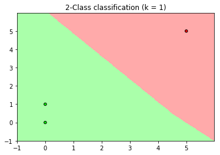

```python
#(b)
scaler = hlp.StandardScaler_()
X1 = scaler.fit_transform(X)
knn = hlp.KNeighborsClassifier_(1)
knn.fit(X1, y)

hlp.draw(X, y, knn, flag=2, preprocess=scaler)
```


```python
#(c)
pca = hlp.PCA_(1)
pca.fit(X)
X2 = pca.transform(X)
knn = hlp.KNeighborsClassifier_(1)
knn.fit(X2, y)

hlp.draw(X, y, knn, flag=3, preprocess=pca)
```

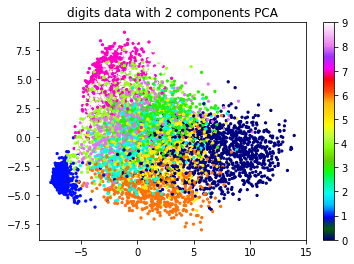


#### Problem 9.2 (Page 38)

We considered three forms of input preprocessing: centering, normalization and whitening. The goal of input processing is to make the learning robust to unintentional choices made during data collection.
Suppose the data are $x_ n​$ and the transformed vectors $z_ n​$. Suppose that during data collection, $x′_n​$, a mutated version of $x_ n​$, were measured, and input preprocessing on $x′_ n​$ produces $z'_ n​$. We would like to study when the $z′_ n​$ would be the same as the $z_n​$. In other words, what kinds of mutations can the data vectors be subjected to without changing the result of your input processing.The learning will be robust to such mutations.
Which input processing methods are robust to the following mutations:
(a) Bias: $x′_n = x_n + b​$ where $b​$ is a constant vector.
(b) Uniform scaling: $x′_n = αx_n​$, where $α > 0​$ is a constant.
(c) Scaling: $x′_n = Ax_n​$ where $A​$ is a diagonal non-singular matrix.
(d) Linear transformation:$x′_n = Ax_n​$ where $A​$ is a non-singular matrix.

(a)center：

首先计算均值：
$$
\overline x' = \overline x + b
$$
所以
$$
z_n'  = x_n'- \overline x '= x_n + b - \overline x - b =x_n -  \overline x = z_n
$$
这说明平移不会影响center。

normalization：
$$
{\sigma_i'^2} = \frac 1 N \sum_{n=1}^N  (x_{ni}+b-\overline x_i -b)^2 = 
\frac 1 N \sum_{n=1}^N (x_{ni}-\overline x_i)^2
= \sigma_i^2
$$
考察分量
$$
z_{ni}'  =\frac{x_{ni}+b-\bar x_i -b}{{\sigma_i} } = z_{ni}
$$
这说明平移不会影响normalization。

whitening：
$$
\begin{aligned}
{\Sigma}' 
&= \frac 1 N \sum_{n=1}^N (x_n'- \overline x')(x_n- \overline x')^T\\
&=\frac 1 N \sum_{n=1}^N (x_n+b- \overline x-b)(x_n+b- \overline x-b)^T\\
&=\frac 1 N \sum_{n=1}^N (x_n- \overline x)(x_n- \overline x)^T\\
&=\Sigma
\end{aligned}
$$
所以
$$
z_n' = {\Sigma'}^{-\frac 1 2 } x_n' ={\Sigma}^{-\frac 1 2 } (x_n+b- \overline x-b) = 
{\Sigma}^{-\frac 1 2 } (x_n- \overline x)=z_n
$$
这说明平移不会影响whitening。

(b)center：

首先计算均值：
$$
\overline x' =\alpha \overline x
$$
所以
$$
z_n'  = x_n'- \overline x '= \alpha x_n - \alpha \overline x  
=\alpha(x_n - \overline x)=\alpha z_n
$$
这说明伸缩会影响center。

normalization：
$$
{\sigma_i'^2} = \frac 1 N \sum_{n=1}^N
(\alpha x_{ni}-\alpha \overline x_i)^2
= \frac {\alpha^2} N \sum_{n=1}^N  (x_{ni}-\overline x_i)^2 =\alpha^2\sigma_i^2
$$
考察分量
$$
z_{ni}' =\frac{\alpha (x_{ni}-\overline x_i)}{\alpha \sigma_i } = z_{ni}
$$
这说明伸缩不会影响normalization。

whitening：
$$
\begin{aligned}
{\Sigma}' 
&= \frac 1 N \sum_{n=1}^N (x_n'- \overline x')(x_n- \overline x')^T\\
&=\frac 1 N \sum_{n=1}^N (\alpha x_n - \alpha \overline x  )(\alpha x_n - \alpha \overline x  )^T\\
&=\frac {\alpha^2} N \sum_{n=1}^N (x_n- \overline x)(x_n- \overline x)^T\\
&=\alpha^2{\Sigma}
\end{aligned}
$$
所以
$$
z_n' = {\Sigma'}^{-\frac 1 2 } x_n' ={\Sigma}^{-\frac 1 2 }{\alpha}^{-1} 
(\alpha x_n -\alpha \overline x)
={\Sigma}^{-\frac 1 2 } (x_n - \overline x)  =z_n
$$
这说明伸缩不会影响whitening。

(b)假设
$$
A=\text{diag}\{a_1,...,a_d\}
$$
那么
$$
x_n' = \left(
 \begin{matrix}
  a_1 x_{n1}\\
  ... \\
  a_d x_{nd}
  \end{matrix}
  \right)
$$
center：

首先计算均值：
$$
\overline x' =A \overline x
$$
所以
$$
z_n'  = Ax_n -A \overline x
=A(x_n -\overline x)  =A z_n
$$
这说明不同比例伸缩会改变center。

normalization：
$$
{\sigma_i'^2} = \frac 1 N \sum_{n=1}^N (a_i x_{ni}-a_i \overline x_i)^2
= \frac {a_i^2 } N \sum_{n=1}^N (x_{ni}-\overline x_i)^2=a_i^2 \sigma_i^2
$$
所以
$$
z_{ni}' =\frac{a_i(x_{ni}-\overline x_i)}{a_i\sigma_i } 
= \frac{x_{ni}-\overline x_i}{\sigma_i } =z_{ni}
$$
这说明不同比例伸缩不会改变normalization。

whitening：
$$
\begin{aligned}
{\Sigma}' 
&= \frac 1 N \sum_{n=1}^N (x_n'- \overline x')(x_n- \overline x')^T\\
&=\frac 1 N \sum_{n=1}^N (A x_n - A \overline x)(A x_n - A \overline x)^T\\
&=\frac {1} N \sum_{n=1}^N A(x_n- \overline x)(x_n- \overline x)^TA^T\\
&= A{\Sigma} A^T\\
\end{aligned}
$$
所以
$$
z_n' ={\Sigma}'^{-\frac 1 2 } (Ax_n -A\bar x) ={\Sigma}'^{-\frac 1 2 } A(x_n-\overline x)\neq z_n
$$
这说明不同比例伸缩会改变whitening。

(d)center：

首先计算均值：
$$
\overline x' =A \overline x
$$
所以
$$
z_n'  = Ax_n -A \overline x
=A(x_n -\overline x)  =A z_n
$$
这说线性变换会改变center。

normalization：

这里就不列式子表示了，但是结果是线性变换会改变normalization。

whitening：
$$
\begin{aligned}
{\Sigma}' 
&= \frac 1 N \sum_{n=1}^N (x_n'- \overline x')(x_n- \overline x')^T\\
&=\frac 1 N \sum_{n=1}^N (A x_n - A \overline x)(A x_n - A \overline x)^T\\
&=\frac {\alpha^2} N \sum_{n=1}^N A(x_n- \overline x)(x_n- \overline x)^TA^T\\
&= A\Sigma A^T\\
\end{aligned}
$$
所以
$$
z_n' ={\Sigma}'^{-\frac 1 2 } A(x_n-\overline x) \neq z_n
$$
这说明线性变换会改变whitening。


#### Problem 9.3 (Page 38)

Let $\Sigma   $ be a symmetric positive definite matrix with eigendecomposition $\Sigma =  U\Gamma U^T$ (see the Appendix), where $U$ is orthogonal and $\Gamma  $ is positive diagonal. Show that
$$
\Sigma^{\frac{1}{2}}=\mathrm{U} \Gamma^{\frac{1}{2}} U^{\mathrm{T}} \quad \text { and } \quad \Sigma^{-\frac{1}{2}}=\mathrm{U} \Gamma^{-\frac{1}{2}} \mathrm{U}^{T}
$$
What are  $\Gamma^{\frac{1}{2}}$ and $\Gamma^{- \frac{1}{2}}$

接验证即可
$$
{\Sigma}^{\frac 1 2 }{\Sigma}^{\frac 1 2 }=U\Gamma^{\frac 1 2 } U^TU\Gamma^{\frac 1 2 } U^T
=U\Gamma^{\frac 1 2 } \Gamma^{\frac 1 2 } U^T = U \Gamma U^T = \Sigma \\
{\Sigma}^{-\frac 1 2 }{\Sigma}^{-\frac 1 2 }=U\Gamma^{-\frac 1 2 } U^TU\Gamma^{-\frac 1 2 } U^T
=U\Gamma^{-\frac 1 2 } \Gamma^{-\frac 1 2 } U^T 
=U\Gamma^{-1} U^T ={\Sigma}^{-1}
$$


#### Problem 9.4 (Page 38)

If $A$ and $V$ are orthonormal bases, and $A = Vψ$, show that $ψ = V^TA$ and hence that $ψ$ is an orthogonal matrix.

因为
$$
A=V \psi
$$
左乘$V^T$，注意$V$为正交基，因此
$$
V^T A = V^T V \psi = \psi
$$
接下来验证$\psi$为正交矩阵
$$
\psi^T \psi  =A^TV V^T A= A^T A  = I
$$
所以$\psi$为正交矩阵。


#### Problem 9.5 (Page 39)

Give the SVD of matrix $A$ defined in each case below.
(a) $A$ is a diagonal matrix.
(b) $A$ is a matrix with pairwise orthogonal rows.
(c) $A$ is a matrix with pairwise orthogonal columns.
(d) Let $A$ have SVD $U\Gamma V^T$ and $Q^TQ = I$. What is the SVD of $QA$.
(e) $A$ has blocks $A_i$ along the diagonal, where $A_ i$ has SVD $U_i\Gamma V_i^T$.

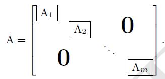

以下都对照课本第11页，假设$A \in \mathbb R^{N \times d}​$

(a)此时为对角阵，所以$N=d​$，比较第11页的形式不难发现
$$
U= V= I_N,\Gamma= A 
$$
(b)$A$的行向量互相正交，所以
$$
U =\left[
 \begin{matrix}
I_d  \\

  0
  \end{matrix}
  \right]
$$
SVD分解为
$$
A= \Gamma V^T
$$
(c)$A$的列向量互相正交，所以
$$
V=I_d
$$
SVD分解为
$$
A= U \Gamma
$$

(d)
$$
QA = Q U\Gamma V^T
$$
注意
$$
(QU)^T QU= U^T Q^T QU=U^T U= I
$$
所以SVD分解为
$$
QA = (Q U)\Gamma V^T
$$
(e)取如下分块形式
$$
U= \left[
 \begin{matrix}
U_1 &&   \\
   & \ddots   \\
   &&U_m  \\
  \end{matrix}
  \right],
 \Gamma= \left[
 \begin{matrix}
\Gamma_1 &&   \\
   & \ddots   \\
   && \Gamma_m  \\
  \end{matrix}
  \right],
   V= \left[
 \begin{matrix}
V_1 &&   \\
   & \ddots   \\
   && V_m  \\
  \end{matrix}
  \right]
$$

注意到
$$
U^TU = \left[
 \begin{matrix}
U_1^T &&   \\
   & \ddots   \\
   &&U_m^T  \\
  \end{matrix}
  \right]\left[
 \begin{matrix}
U_1 &&   \\
   & \ddots   \\
   &&U_m  \\
  \end{matrix}
  \right] = I_N,
V^TV=VV^T = \left[
 \begin{matrix}
V_1^T &&   \\
   & \ddots   \\
   &&V_m^T  \\
  \end{matrix}
  \right]\left[
 \begin{matrix}
V_1 &&   \\
   & \ddots   \\
   &&V_m  \\
  \end{matrix}
  \right]  =I_d
$$
所以SVD分解
$$
A=U\Gamma V^T
$$


#### Problem 9.6 (Page 39)

For the digits data, suppose that the data were not centered first in Example 9.2. Perform PCA and obtain a 2-dimensional feature vector (give a plot). Are the transformed data whitened?

这里分别对中心化和非中心化分别作图，首先是中心化：

```python
# -*- coding: utf-8 -*-
"""
Created on Thu May  2 11:08:48 2019

@author: qinzhen
"""

import numpy as np
import matplotlib.pyplot as plt
import helper as hlp

data = np.genfromtxt("zip.train")
X = data[:, 1:]
y = data[:, 0]
#PCA分解with centering
pca = hlp.PCA_(n_components=2)
X_pca = pca.fit_transform(X)

plt.scatter(X_pca[:, 0], X_pca[:, 1], s=5, c=y, cmap='gist_ncar')
plt.colorbar()
plt.title("digits data with 2 components PCA with centering")
plt.show()
```

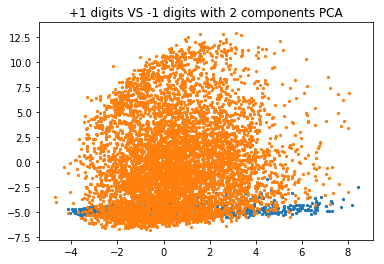

其次是非中心化：
```python
#PCA分解without centering
pca = hlp.PCA_(n_components=2)
X_pca = pca.fit_transform(X, flag=2)
plt.scatter(X_pca[:, 0], X_pca[:, 1], s=5, c=y, cmap='gist_ncar')
plt.colorbar()
plt.title("digits data with 2 components PCA without centering")
plt.show()
```

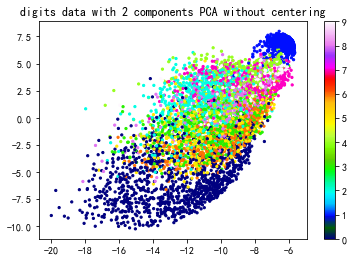

由下题可知，因为原始数据没有中心化，所以转换后的数据没有whitened。


#### Problem 9.7 (Page 39)

Assume that the input matrix $X$ is centered, and construct the reduced feature vector $z_n =\Gamma_k^{-1}V_k^T x_n$ where $V_k$ is the matrix of top-$k$ right singular vectors of $X$. Show that the feature vectors $z_ n $ are whitened.

因为 
$$
z_n = \Gamma_k^{-1}V_k^T x_n
$$
所以
$$
Z=\left[
 \begin{matrix}
z_1^T   \\
...   \\
z_N^T\\
  \end{matrix}
  \right]  =
  \left[
 \begin{matrix}
x_1^TV_k  (\Gamma_k^{-1})^T   \\
...   \\
x_N^TV_k  (\Gamma_k^{-1})^T \\
  \end{matrix}
  \right]=
    \left[
 \begin{matrix}
x_1^T  \\
...   \\
x_N^T \\
  \end{matrix}
  \right] V_k (\Gamma_k^{-1})^T =XV_k (\Gamma_k^{-1})^T
$$
我们计算$Z^TZ​$，注意$X=U\Gamma V^T​$
$$
\begin{aligned}
Z^T Z 
&=\Gamma_k^{-1}V_k ^T X^T XV_k (\Gamma_k^{-1})^T \\
&=\Gamma_k^{-1}V_k ^T V\Gamma^T  U^T U\Gamma V^TV_k (\Gamma_k^{-1})^T \\
&=\Gamma_k^{-1}V_k ^T V\Gamma^T \Gamma V^TV_k (\Gamma_k^{-1})^T 
\end{aligned}
$$

我们考虑$V_k ^T V,V^T V_k​$，注意$V​$为正交矩阵
$$
V_k^T V= \left[
 \begin{matrix}
v_1^T \\
...   \\
v_k^T  \\
  \end{matrix}
  \right]  \left[
 \begin{matrix}
v_1,...,v_d
  \end{matrix}
  \right]   = \left[
 \begin{matrix}
I_k & 0
  \end{matrix}
  \right] \in \mathbb R ^{k\times d} \\
  V^T V_K =(V_k^T V)^T =\left[
 \begin{matrix}
I_k\\
0
  \end{matrix}
  \right]
$$
从而
$$
V_k ^TV\Gamma^T \Gamma V^TV_k = \left[
 \begin{matrix}
I_k & 0
  \end{matrix}
  \right] 
 \left[
 \begin{matrix}
\gamma_1 &&   \\
   & \ddots   \\
   && \gamma_d  \\
  \end{matrix}
  \right] \left[
 \begin{matrix}
\gamma_1 &&   \\
   & \ddots   \\
   && \gamma_d  \\
  \end{matrix}
  \right] \left[
 \begin{matrix}
I_k\\
0
  \end{matrix}
  \right] =
  \left[
 \begin{matrix}
\gamma_1^2 &&   \\
   & \ddots   \\
   && \gamma_k^2  \\
  \end{matrix}
  \right]
$$
因此
$$
\begin{aligned}
Z^T Z 
&=\Gamma_k^{-1}V_k ^T V\Gamma^T \Gamma V^TV_k (\Gamma_k^{-1})^T \\
&=\Gamma_k^{-1}\left[
 \begin{matrix}
\gamma_1^2 &&   \\
   & \ddots   \\
   && \gamma_k^2  \\
  \end{matrix}
  \right](\Gamma_k^{-1})^T\\
  &= I_k
\end{aligned}
$$
所以
$$
z_n^T z_n =1
$$
因此$z_n$已经whitened。


#### Problem 9.8 (Page 39)

One critique of PCA is that it selects features without regard to target values. Thus, the features may not be so useful in solving the learning problem, even though they represent the input data well.
One heuristic to address this is to do a PCA separately for each class, and use the top principal direction for each class to construct the features. Use the digits data. Construct a two dimensional feature as follows.

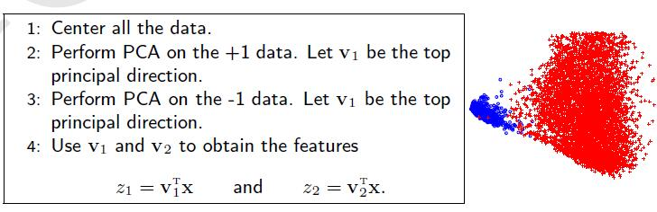

We applied the algorithm to the digits data, giving the features shown above.

(a) Give a scatter plot of your resulting two features.
(b) Are the directions $v_1​$ and $v_2​$ necessarily orthogonal?
(c) Let $Z = X\hat V​$ be the feature matrix, where $\hat V = [v_1, v_2]​$. Show that the best reconstruction of $X​$ from $Z​$ is
$$
\hat{{X}}={Z} \hat{{V}}^{\dagger}={X} \hat{{V}} \hat{{V}}^{\dagger}
$$
where $\hat{{V}}^{\dagger}$ is the pseudo-inverse of $\hat{{V}}​$.
(d) Is this method of constructing features supervised or unsupervised?

(a)无法画出和教材中一样的图片，暂时没有找到问题在哪

```python
# -*- coding: utf-8 -*-
"""
Created on Thu May  2 14:50:33 2019

@author: qinzhen
"""

import numpy as np
import matplotlib.pyplot as plt
import helper as hlp

data = np.genfromtxt("zip.train")
X = data[:, 1:]
#中心化
X -= np.mean(X, axis=0)
y = data[:, 0]
#选择的标签
l = 1
#划分数据
Xpos = X[y == l]
Xneg = X[y != l]
#对每一类分别使用PCA，flag=2表示pca中不使用中心化
pca = hlp.PCA_(n_components=1)
pca.fit(Xpos, flag=2)
z1 = pca.transform(X)

pca = hlp.PCA_(n_components=1)
pca.fit(Xneg, flag=2)
z2 = pca.transform(X)

#作图
plt.scatter(z1[y == l], z2[y == l], s=5)
plt.scatter(z1[y != l], z2[y != l], s=5)
plt.title("+1 digits VS -1 digits with 2 components PCA")
plt.show()
```


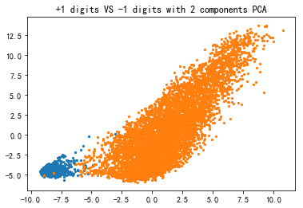

(b)由算法描述可知，$v_1,v_2$不一定正交。

(c)我们需要最小化
$$
 \| X- ZU\|_F^2 = \| X- X \hat VU\| _F^2 = \| X(I- \hat VU)\| _F^2
$$
如果
$$
\hat V U= I
$$
那么上式即可达到最小值，可以通过施密特正交化方法构造$U​$。在上述条件成立的情形下，我们有
$$
\begin{aligned}
U\hat V U&= U\\
\hat V U \hat V&= \hat V
\end{aligned}
$$
所以$U$是$\hat V$的伪逆矩阵。

(d)这个算法利用到了标签，所以是监督式学习。


#### Problem 9.9 (Page 40)

Let $X=U\Gamma V^T $ be the SVD of $X$. Give an alternative proof of the Eckart-Young theorem by showing the following steps.

(a) Let $\hat  X$ be a reconstruction of $X$ whose rows are the data points in $X$ projected onto $k$ basis vectors. What is the rank($\hat   X$)?
(b) Show that 
$$
\|{X}-\hat{{X}}\|_{F}^{2} \geq\left\|{U}^{{T}}({X}-\hat{{X}}) {V}\right\|_{F}^{2}=\left\|\Gamma-{U}^{{T}} \hat{{X}} {V}\right\|_{F}^{2}
$$
(c) Let $\hat{\Gamma}=U^{T} \hat{X} V​$. Show that $\text{rank}(\hat \Gamma)\le k ​$
(d) Argue that the optimal choice for $\hat \Gamma  ​$ must have all off-diagonal elements zero. [Hint: What is the definition of the Frobenius norm?]
(e) How many non-zero diagonals can $\hat \Gamma  ​$ have.
(f) What is the best possible choice for $\hat \Gamma  ​$.
(g) Show that $\hat X = XVV^T ​$ results in such an optimal choice for $\hat X​$

(a)因为$\hat X​$是由$X​$投影到$k​$个基向量得到的矩阵，所以$\text{rank}(\hat X) = k​$

(b)此处原题有误，根据课本12页的Exercise 9.9可知
$$
\|X-\hat X \|_F^2 =\|U^T(X-\hat X)V \|_F^2 =\|\Gamma - U^T\hat XV \|_F^2
$$
(c)利用秩不等式
$$
\text{rank}(AB) \le \min \{\text{rank} (A), \text{rank}(B)\}
$$
所以
$$
\text{rank}(\hat\Gamma) =\text{rank}(U^T\hat XV)  \le \text{rank}(\hat X) =k
$$
(d)我们的目标是最小化$\|\Gamma - U^T\hat XV \|_F^2= \|\Gamma - \Gamma' \|_F^2$，由定义可知
$$
\|\Gamma - \Gamma' \|_F^2 =\sum_{i=1}^d \sum_{j=1}^d (\gamma_{ij}- \gamma_{ij}')^2
=\sum_{i=1}^d (\gamma_{ii}- \gamma_{ii}')^2 + \sum_{i\ne j}  \gamma_{ij}'^2 \ge \sum_{i=1}^d (\gamma_{ii}- \gamma_{ii}')^2
$$
上述等式利用了$\Gamma$为对角阵，不难看出上述不等式当且仅当$\gamma_{ij}'=0$时才成立，所以$\hat \Gamma$的最优选择为非对角线元素全为$0$。

(e)现在已经确定$\hat \Gamma$为对角矩阵，由于$\text{rank}(\hat\Gamma)\le k $，这说明对角线的非$0$元素最多有$k$个。

(f)继续利用定义，注意$\Gamma$和$\hat \Gamma$为对角矩阵
$$
\|\Gamma - \Gamma' \|_F^2 =\sum_{i=1}^d (\gamma_{ii}- \gamma_{ii}')^2 
=\sum_{i=1}^k (\gamma_{ii}- \gamma_{ii}')^2 + \sum_{i=k+1}^d \gamma_{ii}^2 
\ge  \sum_{i=k+1}^d \gamma_{ii}^2
$$
上述等号成立当且仅当$\gamma_{ii}'= \gamma_{ii}$，即
$$
\Gamma' =\text{diag} \{\gamma_{11}, \ldots, \gamma_{kk} , 0,\ldots ,0\}
$$
(g)题目有误，正确的应该是
$$
\hat X = X V_k V_k^T
$$
直接带入计算可得
$$
U^T\hat XV = U^T X V_k V_k^T V =U^T U\Gamma V^T V_k V_k^T V
=\Gamma V^T V_k V_k^T V
$$
注意$V​$为正交矩阵，因此
$$
V_k^T V = \left[
 \begin{matrix}
v_1^T\\
...\\ v_k^T 
  \end{matrix}
  \right] 
  \left[
 \begin{matrix}
v_1& ... & v_k & ... & v_d 
  \end{matrix}
  \right] 
  = \left[
 \begin{matrix}
I_k& 0
  \end{matrix}
  \right]
$$
从而
$$
V^T V_k V_k^T V = ( V_k^T V)^T  V_k^T V=
\left[
 \begin{matrix}
I_k\\0
  \end{matrix}
  \right]
  \left[
 \begin{matrix}
I_k&0
  \end{matrix}
  \right] = \left[
 \begin{matrix}
I_k&0 \\
0 & 0
  \end{matrix}
  \right] \\
  U^T\hat XV 
=\Gamma V^T V_k V_k^T V =\Gamma \left[
 \begin{matrix}
I_k&0 \\
0 & 0
  \end{matrix}
  \right] =  
 \left[
 \begin{matrix}
\gamma_{11} &&   \\
   & \ddots   \\
   && \gamma_{kk}  \\
      &&& 0   \\
  \end{matrix}
  \right]
$$
这说明$  U^T\hat XV​$为$\hat \Gamma​$的最优解。


#### Problem 9.10 (Page 40)

Data Snooping with Input Preprocessing. You are going to run PCA on your data $X$ and select the top-$k$ PCA features. Then, use linear regression with these $k$ features to produce your final hypothesis. You want to estimate $E_{\text{out}}$ using cross validation. Here are two possible algorithms for getting a cross-validation error.

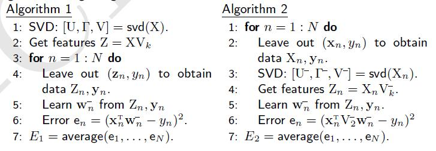

In both cases, your final hypothesis is $g(x) = x^TV_kw​$ where $w​$ is learned from $Z = XV_k​$ form Algorithm 1 and $y​$. (Recall $V_ k​$ is the matrix of top-$k​$ singular singular vectors.) We want to estimate $E_{\text{out}}(g)​$ using either $E_1​$ or $E_2​$.

(a) What is the difference between Algorithm 1 and Algorithm 2?

(b) Run an experiment to determine which is a better estimate of $E_{\text{out}}(g)$.
	(i) Set the dimension $d = 5$, the number of data points $N = 40$ and
$k = 3$. Generate random target function weights $w_f$ , normally distributed.Generate $N$ random normally distributed $d$-dimensional
inputs $x_1, . . . , x_N$. Generate targets $y_n = w^T_f
x_n + \epsilon_n$ where $\epsilon_ n$ is independent Gaussian noise with variance $0.5$.
	(ii) Use Algorithm 1 and 2 to compute estimates of $E_{\text{out}}(g)$.
	(iii) Compute $E_{\text{out}}(g)$.
	(iv) Report $E_1, E_2, E_{\text{out}}(g)$.
	(v) Repeat parts (i)–(iv) $10^6$ times and report averages $\bar E_1, \bar E_2,\bar  E_{\text{out}}(g)$.
(c) Explain your results from (b) part (v).
(d) Which is the correct estimate for $E_{\text{out}}(g)$.

(a)算法1是先进行SVD然后再进划分数据，算法2是先划分数据再进行SVD。

(b)$E_1,E_2​$均值比$E_{\text{out}}​$大，这是因为PCA降维后减少了一些信息，从而误差会变大；$E_1​$均值比$E_{2}​$小，这是因为算法1是先进行SVD，这时候会利用到交叉验证集的数据，从而整体误差会小一些。

```python
# -*- coding: utf-8 -*-
"""
Created on Sat May  4 09:12:52 2019

@author: qinzhen
"""

#### (b)
import numpy as np
from numpy.linalg import inv
import matplotlib.pyplot as plt
import helper as hlp

#### (i)
N = 40
d = 5
k = 3

def data(N, d):
    """
    生成数据集
    """
    X = np.random.randn(N, d)
    w = np.random.randn(d)
    epsilon = np.random.randn(N) * 0.5
    y = X.dot(w) + epsilon
    return w, X, y

#### (ii)
#Algorithm 1
def Algorithm_1(X, y, k):
    pca = hlp.PCA_(n_components=k)
    pca.fit(X)
    Z = pca.fit_transform(X)
    e1 = []
    N, d = X.shape
    for i in range(N):
        #每轮选择的数据下标
        index = np.array([True] * N)
        index[i] = False
        #划分数据
        Z0 = Z[i]
        y0 = y[i]
        Z1 = Z[index]
        y1 = y[index]
        w = inv(Z1.T.dot(Z1)).dot(Z1.T).dot(y1)
        e1.append((Z0.dot(w) - y0) ** 2)
    return np.mean(e1)

#Algorithm 2
def Algorithm_2(X, y, k):  
    e2 = []
    
    N, d = X.shape
    for i in range(N):
         #每轮选择的数据下标
        index = np.array([True] * N)
        index[i] = False
        #划分数据
        X0 = X[i].reshape(1, -1)
        y0 = y[i]
        X1 = X[index]
        y1 = y[index]
        #训练
        pca = hlp.PCA_(n_components=k)
        pca.fit(X1)
        Z1 = pca.transform(X1)
        w = inv(Z1.T.dot(Z1)).dot(Z1.T).dot(y1)
        
        Z0 = pca.transform(X0)
    
        e2.append((Z0.dot(w) - y0) ** 2)
    return np.mean(e2)

#### (iii)
def E_out(X, y, w):
    #计算结果
    w0 = inv(X.T.dot(X)).dot(X.T).dot(y)
    #生成新的数据来模拟Eout
    d = X.shape[1]
    N = 10000
    X1 = np.random.randn(N, d)
    epsilon = np.random.randn(N) * 0.5
    y1 = X1.dot(w) + epsilon
    y0 = X1.dot(w0)
    return np.mean((y1 - y0) ** 2)

#### (iv)
w, X, y = data(N, d)
print("E1 =", Algorithm_1(X, y, k))
print("E2 =", Algorithm_2(X, y, k))
print("E_out =", E_out(X, y, w))


#### (v)
M = 1000
E1 = []
E2 = []
Eout = []
for i in range(M):
    w, X, y = data(N, d)
    E1.append(Algorithm_1(X, y, k))
    E2.append(Algorithm_2(X, y, k))
    Eout.append(E_out(X, y, w))
    
plt.hist(E1)
plt.title("E1")
plt.show()
plt.hist(E2)
plt.title("E2")
plt.show()
plt.hist(Eout)
plt.title("Eout")
plt.show()
print("E1_mean =", np.mean(E1))
print("E2_mean =", np.mean(E2))
print("E_out_mean =", np.mean(Eout))
```

    E1 = 2.9848477689390487
    E2 = 3.3734459718878087
    E_out = 0.2671906269590378

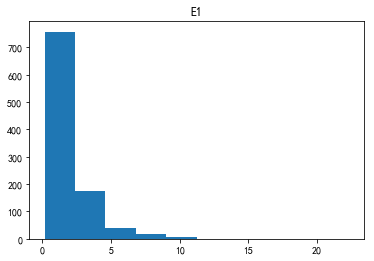

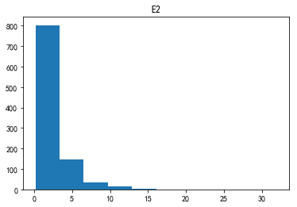

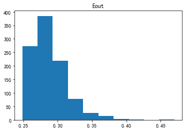


    E1_mean = 1.865415167353018
    E2_mean = 2.3127315449440284
    E_out_mean = 0.2877558958424026
(c)(b)中已经解释了，算法1是先进行SVD，这时候会利用到交叉验证集的数据，这样会是一种Data snooping，所以$E_1$比$E_2$更小。

(d)从(c)中的讨论不难看出算法2更正确一些，注意这里$E_1​$，$E_2​$和$E_{\text{out}}​$偏差较大，这是因为主成分选择较少的原因。


#### Problem 9.11 (Page 41)

From Figure 9.8(a), performance degrades rapidly as the order of the model increases. What if the target function has a high order? One way to allow for higher order, but still get good generalization is to fix the effective dimension $d_{\text{eff}}$, and try a variety of orders. Given $X,d_{\text{eff}}$ depends on $λ$. Fixing $d_{\text{eff}}$ (to say 7) requires changing $λ$ as the order increases.

(a) For fixed $d_{\text{eff}}$, when the order increases, will $λ$ increase or decrease?
(b) Implement a numerical method for finding $λ(d_{\text{eff}})$ using one of the measures for the effective number of parameters (e.g., $d_{\text{eff}} = \text{trace}(H^2(λ))$, where ${H}(\lambda)={X}\left({X}^{{T}} {X}+\lambda {I}\right)^{-1} {X}^{{T}}$ is the hat-matrix from Chapter 4). The inputs are $d_\text{eff}$, and $X$ and the output should be $\lambda\left(d_{\mathrm{eff}}, {X}\right)$.
(c) Use the experimental design in Exercise 9.18 to evaluate this approach. Vary the model order in $[0, 30]$ and set $d_\text{eff}$ to $7$. Plot the expected out-of-sample error versus the order.
(d) Comment on your results. How should your plot behave if $d_\text{eff}$ alone controlled the out-of-sample error? What is the best model order using this approach?

(a)因为次数增加，所以要保持$d_{\text{deff}}​$不变，$\lambda ​$必然要增加。

(b)利用Chaper 4，Problem 4.15(c)计算$d_{\text{eff}}​$
$$
d_{\text{eff}}(\lambda)=\sum_{i=0}^d\frac{s_i^4}{(s_i+\lambda)^2}
$$
不难看出$d_{\text{eff}}$关于$\lambda$单调，从而可以用二分法解此方程。

由于exercise 9.18有点问题，(c)(d)暂时略过。


#### Problem 9.12 (Page 41)

In this problem you will derive the permutation optimism penalty in Equation (9.5). We compute the optimism for a particular data distribution and use that to penalize $E_{\mathrm{in}}$ as in (9.5). The data is $\mathcal{D}=\left(\mathrm{x}_{1}, y_{1}\right), \ldots,\left(\mathrm{x}_{N}, y_{N}\right)$, and the permuted data set is
$$
\mathcal{D}_{\pi}=\left(\mathrm{x}_{1}, y_{\pi_{1}}\right), \ldots,\left(\mathrm{x}_{N}, y_{\pi_{N}}\right)
$$
Define the ‘permutation input distribution’ to be uniform over $\mathbf{x}_{1}, \dots, \mathbf{x}_{N}$. Define a ‘permutation target function’ $f_π$ as follows: to compute target values $f_{\pi}\left(\mathbf{x}_{n}\right)$, generate a random permutation $π$ and set $f_{\pi}\left(\mathrm{x}_{n}\right)=y_{\pi_{n}}$. So,
$$
\mathbb{P}\left[f_{\pi}\left(\mathbf{x}_{n}\right)=y_{m}\right]=\frac{1}{N}
$$
for $m=1, \ldots, N$, independent of the particular $\mathrm{x}_{n}$. We define $E_{\mathrm{out}}^{\boldsymbol{\pi}}(h)$ with respect to this target function on the inputs $\mathrm{x}_{1}, \ldots, \mathrm{x}_{N}$.

(a)Define $E_{\mathrm{out}}^{\pi}(h)=\frac{1}{4} \mathbb{E}_{\mathbf{x}, \pi}\left[\left(h(\mathrm{x})-f_{\pi}(\mathrm{x})\right)^{2}\right]​$, where expectation is with respect to the permutation input and target joint distribution. Show that
$$
E_{\mathrm{out}}^{\pi}(h)=\frac{1}{4 N} \sum_{n=1}^{N} \mathbb{E}_{\pi}\left[\left(h\left(\mathrm{x}_{n}\right)-f_{\pi}\left(\mathrm{x}_{n}\right)\right)^{2}\right]
$$
(b)Show that 
$$
E_{\mathrm{out}}^{\pi}(h)=\frac{s_{y}^{2}}{4}+\frac{1}{4 N} \sum_{n=1}^{N}\left(h\left(\mathrm{x}_{n}\right)-\overline{y}\right)^{2}
$$
where $\overline{y}=\frac{1}{N} \sum_{n} y_{n}$ and $s_{y}^{2}=\frac{1}{N} \sum_{n}\left(y_{n}-\overline{y}\right)^{2}$ are the mean and variance of the target values.

(c)In-sample error minimization on $\mathcal{D}_{\pi}$ yields $g_{\pi}$. What is $E_{\mathrm{in}}^{\pi}\left(g_{\pi}\right)$?

(d)The permutation optimism penalty is $E_{\mathrm{out}}^{\pi}\left(g_{\pi}\right)-E_{\mathrm{in}}^{\pi}\left(g_{\pi}\right)$. Show:
$$
\text{permutation optimism penalty}=

\frac{1}{2 N} \sum_{n=1}^{N}\left(y_{\pi_{n}}-\overline{y}\right) g_{(\pi)}\left(\mathrm{x}_{n}\right)\tag {9.7}
$$
(e)Show that the permutation optimism penalty is proportional to the correlation between the randomly permuted targets $y_{π_n}$ and the learned function $g_{\pi}\left(\mathrm{x}_{n}\right)​$.

(a)
$$
\begin{aligned}
E_{\text{out}}^{\pi} (h)
&=  \frac 1 4 \mathbb E_{x,\pi}[(h(x) - f_{\pi}(x))^2]\\
&= \frac 1 4\sum_{n=1}^N \mathbb E_{\pi}[(h(x) - f_{\pi}(x))^2|x =x _n]\mathbb P[x=x_n] \\
&=\frac 1 4\sum_{n=1}^N \mathbb E_{\pi}[(h(x_n) - f_{\pi}(x_n))^2]\frac 1 N \\
&=\frac 1 {4N} \sum_{n=1}^N \mathbb E_{\pi}[(h(x_n) - f_{\pi}(x_n))^2]
\end{aligned}
$$
(b)注意$f_{\pi}(x_n) =y_{\pi_n}$，所以
$$
\begin{aligned}
E_{\text{out}}^{\pi} (h)
&=\frac 1 {4N} \sum_{n=1}^N \mathbb E_{\pi}[(h(x_n) - f_{\pi}(x_n))^2] \\
&=\frac 1 {4N} \sum_{n=1}^N \mathbb E_{\pi}[(h(x_n) -\overline y+\overline y- y_{\pi_n})^2]\\
&=\frac 1 {4N} \sum_{n=1}^N 
\Big( \mathbb  E_{\pi}[(h(x_n) -\overline y)^2]+\mathbb E_{\pi}[(\overline y- y_{\pi_n})^2]
+2 \mathbb E_{\pi}[(h(x_n) -\overline y)(\overline y- y_{\pi_n})] \Big) \\
&=\frac 1 {4N} \sum_{n=1}^N  \mathbb  E_{\pi}[(h(x_n) -\overline y)^2]+
\frac 1 {4N} \sum_{n=1}^N  \mathbb E_{\pi}[(\overline y- y_{\pi_n})^2] +
\frac 1 {2N}\sum_{n=1}^N  \mathbb E_{\pi}[(h(x_n) -\overline y)(\overline y- y_{\pi_n})]
\end{aligned}
$$
下面分别分析每一项。

第一项：$(h(x_n) -\overline y)^2$关于排列$\pi$为常数，所以
$$
\frac 1 {4N} \sum_{n=1}^N  \mathbb  E_{\pi}[(h(x_n) -\overline y)^2]= 
\frac 1 {4N} \sum_{n=1}^N (h(x_n) -\overline y)^2
$$
第二项：
$$
\begin{aligned}
\frac 1 {4N} \sum_{n=1}^N  \mathbb E_{\pi}[(\overline y- y_{\pi_n})^2]
&=\frac 1 {4N} \sum_{n=1}^N \sum_{i=1}^N \mathbb E_{\pi}[(\overline y- y_{\pi_n})^2|\pi_n = i ]\mathbb P[\pi_n = i]\\
&=\frac 1 {4N} \sum_{n=1}^N \sum_{i=1}^N \mathbb E_{\pi}[(\overline y- y_i)^2]\frac 1 N  \\
&=\frac 1 {4N} \sum_{n=1}^N \sum_{i=1}^N (\overline y- y_i)^2\frac 1 N \\
&=\frac 1 {4N} \sum_{i=1}^N (\overline y- y_i)^2\\
&=\frac{s_y^2}{4}
\end{aligned}
$$
第三项：$(h(x_n) -\overline y)​$关于排列$\pi​$为常数，所以
$$
\begin{aligned}
\frac 1 {2N}\sum_{n=1}^N  \mathbb E_{\pi}[(h(x_n) -\overline y)(\overline y- y_{\pi_n})]
&=\frac 1 {2N}\sum_{n=1}^N  (h(x_n) -\overline y) \mathbb E_{\pi}[(\overline y- y_{\pi_n})]\\
&=\frac 1 {2N}\sum_{n=1}^N  (h(x_n) -\overline y) 
\sum_{i=1}^N\mathbb E_{\pi}[(\overline y- y_{\pi_n})|\pi_n=i] \mathbb P[\pi_n = i] \\
&=\frac 1 {2N}\sum_{n=1}^N  (h(x_n) -\overline y) 
\sum_{i=1}^N\mathbb E_{\pi}[(\overline y- y_{i})] \frac 1 N \\
&=\frac 1 {2N}\sum_{n=1}^N  (h(x_n) -\overline y) 
\sum_{i=1}^N(\overline y- y_{i}) \frac 1 N \\
&=0
\end{aligned}
$$
综上可得
$$
E_{\text{out}}^{\pi}(h)  = \frac{s_y^2}{4}+ \frac 1 {4N} \sum_{n=1}^N (h(x_n) -\overline y)^2
$$
(c)由(a)中$E_{\text{out}}^h(h)$的计算式可得
$$
E_{\text{in}}^{\pi} (h) = \frac 1 {4N} \sum_{n=1}^N (h(x_n) -y_{\pi_n})^2
$$
为了计算(d)，对上式进行处理，注意$f_{\pi}(x_n) =y_{\pi_n}$
$$
\begin{aligned}
E_{\text{in}}^{\pi} (h) 
&= \frac 1 {4N} \sum_{n=1}^N (h(x_n) -y_{\pi_n})^2 \\
&= \frac 1 {4N} \sum_{n=1}^N (h(x_n) -\overline y + \overline y -y_{\pi_n})^2 \\
&= \frac 1 {4N} \sum_{n=1}^N \Big[(h(x_n) -\overline y)^2 + (\overline y -y_{\pi_n})^2  
+ 2(h(x_n) -\overline y) (\overline y -y_{\pi_n})\Big]\\
&= \frac 1 {2N} \sum_{n=1}^N  (h(x_n) -\overline y) (\overline y -y_{\pi_n})+
\frac 1 {4N} \sum_{n=1}^N (h(x_n) -\overline y)^2 +  \frac{s_y^2}{4}\\
\end{aligned}
$$
(d)不难看出相减的结果为
$$
\begin{aligned}
E_{\text{out}}^{\pi}(h)-E_{\text{in}}^{\pi} (h) 
&= -\frac 1 {2N} \sum_{n=1}^N  (h(x_n) -\overline y) (\overline y -y_{\pi_n})\\
&=-\frac 1 {2N}\sum_{n=1}^N  h(x_n)(\overline y -y_{\pi_n})
+\frac 1 {2N} \overline y\sum_{n=1}^N  (\overline y -y_{\pi_n}) \\
&=\frac 1 {2N}\sum_{n=1}^N  (y_{\pi_n} -\overline y)h(x_n)
\end{aligned}
$$
(e)不难看出，上式即为协方差，所以结论成立。


#### Problem 9.13 (Page 42)

Repeat Problem 9.12, but , instead of defining the target distribution for the random problem using a random permutation (sampling the targets without replacement), use sampling of the targets with replacement (the Bootstrap distribution).
[Hint: Almost everything stays the same.]

Bootstrap为放回抽样，只要重新计算第一步即可，实际上，由放回抽样的定义可知$\mathbb P[x=x_n]=\frac 1 N $，所以上述推导不变，所以结论都一样。


#### Problem 9.14 (Page 42)

In this problem you will investigate the Rademacher optimism penalty for the perceptron in one dimension, $h(x)=\operatorname{sign}\left(x-w_{0}\right)$.

(a) Write a program to estimate the Rademacher optimism penalty:
	(i) Generate inputs $x_{1}, \dots, x_{N}$ and random targets $r_1, . . . , r_N$.
	(ii) Find the perceptron $g_{\mathrm{r}}$ with minimum in-sample error $E_{\mathrm{in}}^{\prime} \left(g_{\mathrm{r}}\right)$.
	(iii) Compute the optimism penalty as $\frac{1}{2}-E_{\text { in }}^{\prime}\left(g_{\mathrm{r}}\right)$.
Run your program for $N = 1, 2, . . . , 10^3$ and plot the penalty versus $N$.

(b) Repeat part (a) $10,000$ times to compute the average Rademacher penalty and give a plot of the penalty versus $N$.

(c)On the same plot show the function $1/\sqrt N$; how does the Rademacher penalty compare to $1/\sqrt N$? What is the VC-penalty for this learning model and how does it compare with the Rademacher penalty?

(a)

```python
# -*- coding: utf-8 -*-
"""
Created on Thu May  2 23:00:48 2019

@author: qinzhen
"""

import numpy as np
import matplotlib.pyplot as plt

#(a)
def f(N):
    #生成数据
#    N = 40
    X = np.random.randn(N)
    r = np.sign(np.random.rand(N) - 0.5)
    
    #寻找阈值
    X1 = np.sort(X)
    X2 = (X1[1:] + X1[:-1]) / 2
    X2 = np.append(X1[0] - 1, X2)
    X2 = np.append(X2, X1[-1] + 1)
    
    #计算结果，向量化计算
    temp = np.sign(X1.reshape(-1, 1) - X2)
    result = np.mean(temp != r.reshape(-1, 1), axis=0)
    error = np.min(result)
    
    return 1 / 2 - error

N = np.arange(1, 101)
Error = []
for n in N:
    Error.append(f(n))
plt.plot(N, Error)
plt.title("penalty VS N")
plt.show()
```


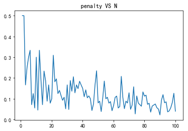

(b)

```python
#(b)
m = 100
Error = []
for n in N:
    error = []
    for _ in range(m):
        error.append(f(n))
    Error.append(np.mean(error))
plt.plot(N, Error)
plt.title("mean penalty VS N")
plt.show()
```

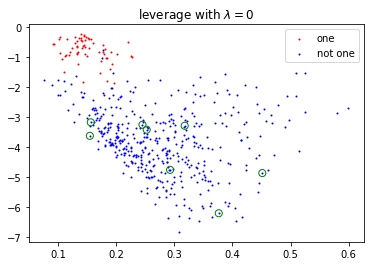

(c)可以看到Rademacher penalty的数量级为$O(\frac 1 {\sqrt N})$，由课本上册58页可知VC penalty为
$$
\sqrt{\frac{8}{N} \ln \left(\frac{4\left((2 N)^{d_{\text{vc}}} +1\right)}{\delta}\right)}
$$
不考虑$\delta $的影响，VC penality为
$$
\sqrt{\frac{8}{N} \ln \left({4\left((2 N)^{d_{\text{vc}}} +1\right)}\right)}
$$
此处为一维感知机，所以
$$
d_{\text{vc}}=2
$$

作图可得：

```python
#(c)
N1 = 1 / np.sqrt(N)
N2 = np.sqrt(8 * np.log((4 * ((2 * N) ** 2 + 1))) / N)
plt.plot(N, Error, label="Rademacher optimism penalty")
plt.plot(N, N1, label="$1/\sqrt{N}$")
plt.plot(N, N2, label="VC penalty")
plt.title("mean penalty VS N")
plt.legend()
plt.show()
```

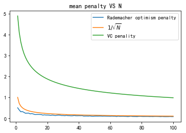

可以看到VC penalty要明显大很多。


#### Problem 9.15 (Page 43)

The Rademacher optimism penalty is
$$
E_{\mathrm{out}}^{\prime}\left(g_{\mathrm{r}}\right)-E_{\mathrm{in}}^{\prime}\left(g_{\mathrm{r}}\right)=\frac{1}{2}-E_{\mathrm{in}}^{\prime}\left(g_{\mathrm{r}}\right)
$$
Let $\mathcal H$ have growth function $m_{\mathcal H}(N)$. Show that, with probability at least $1-\delta $,
$$
\text{Rademacher optimism penalty}
\leq \sqrt{\frac{1}{2 N} \ln \frac{2 m_{\mathcal{H}}(N)}{\delta}}
$$
[Hint: For a single hypothesis gives $\mathbb{P}\left[ | E_{\text {out}}(h)-E_{\text {in}}(h) |>\epsilon\right] \leq 2 e^{-2 N \epsilon^{2}}$ .]

由第二章可知
$$
\begin{aligned}
\mathbb P(|E'_{\text{out}}(g_r) -E'_{\text{in}}(g_r)| > \epsilon ) &\le 2 m_{\mathcal H }(N)e^{-2N\epsilon^2}\\
\mathbb P(|E'_{\text{out}}(g_r) -E'_{\text{in}}(g_r)| \le \epsilon )&\ge 1- 2 m_{\mathcal H }(N)e^{-2N\epsilon^2}
\end{aligned}
$$
令$\delta =2 m_{\mathcal H }(N)e^{-2N\epsilon^2} ​$，可得
$$
\begin{aligned}
e^{2N\epsilon^2} &=  \frac{2 m_{\mathcal H }(N)}{\delta}\\
2N\epsilon^2 &= \ln  \left(\frac{2 m_{\mathcal H }(N)}{\delta}\right) \\
\epsilon &= \sqrt{ \frac {1}{2N} \ln (\frac{2 m_{\mathcal H }(N)}{\delta})}
\end{aligned}
$$
所以上式表示至少有$1-\delta​$概率，如下事实成立
$$
|E'_{\text{out}}(g_r) -E'_{\text{in}}(g_r)| \le \sqrt{ \frac {1}{2N} \ln (\frac{2 m_{\mathcal H }(N)}{\delta})} 
$$
即至少有$1-\delta$概率
$$
\text{Rademacher optimism penalty} \le  \delta
$$


#### Problem 9.16 (Page 43)

[Hard] **Rademacher Generalization Bound.**

The Rademacher optimism penalty bounds the test error for binary classification (as does the VC-bound). This problem guides you through the proof.

We will need McDiarmid’s inequality (a generalization of the Hoeffding bound):

**Lemma 9.1** (McDiarmid, 1989).

Let $X_{i} \in A_{i}$ be independent random variables, and $Q$ a function, $Q : \prod_{i} A_{i} \mapsto \mathbb{R}$, satisfying
$$
\sup _{x \in \Pi_{i} A_{j},z\in A_j}\left|Q(\mathrm{x})-q\left(x_{1}, \ldots, x_{j-1}, z, x_{j+1}, \ldots, x_{n}\right)\right| \leq c_{j}
$$
for $j=1, \dots, n$. Then, $t>0$,
$$
\mathbb{P}\left[Q\left(X_{1}, \ldots, X_{n}\right)-\mathbb{E}\left[Q\left(X_{1}, \ldots, X_{n}\right)\right] \geq t\right] \leq \exp \left(-\frac{2 t^{2}}{\sum_{i=1}^{n} c_{i}^{2}}\right)
$$
**Corollary 9.2**

With probability at least $1-\delta $
$$
\left|Q\left(X_{1}, \ldots, X_{n}\right)-\mathbb{E}\left[Q\left(X_{1}, \ldots, X_{n}\right)\right]\right| \leq \sqrt{\frac{1}{2} \sum_{i=1}^{n} c_{i}^{2} \ln \frac{2}{\delta}}
$$
(a)Assume that the hypothesis set is symmetric ($h ∈ \mathcal H$ implies $−h ∈ \mathcal H$). Prove that with probability at least $1 − δ$,
$$
E_{\mathrm{out}}(g) \leq E_{\mathrm{in}}(g)+\mathbb{E}_{r, \mathcal{D}}\left[\max _{h \in \mathcal{H}} \frac{1}{N} \sum_{n=1}^{N} r_{n} h\left(\mathrm{x}_{n}\right)\right]+\sqrt{\frac{1}{2 N} \log \frac{2}{\delta}} \tag {9.8}
$$
To do this, show the following steps.

(i)
$$
E_{\mathrm{out}}(g) \leq E_{\mathrm{in}}(g)+\max _{h \in \mathcal{H}}\left\{E_{\mathrm{out}}(h)-E_{\mathrm{in}}(h)\right\}
$$
(ii)
$$
\max _{h \in \mathcal{H}}\left\{E_{\text {out}}(h)-E_{\text {in}}(h)\right\}=\frac{1}{2} \max _{h \in \mathcal{H}}\left\{\frac{1}{N} \sum_{n=1}^{N} y_{n} h\left(\mathbf{x}_{n}\right)-\mathbb{E}_{\mathbf{x}}[f(\mathbf{x}) h(\mathbf{x})]\right\}
$$
(iii)Show that $\frac{1}{2} \max _{h \in \mathcal{H}}\left\{\frac{1}{N} \sum_{n=1}^{N} y_{n} h\left(\mathbf{x}_{n}\right)-\mathbb{E}_{\mathbf{x}}[f(\mathbf{x}) h(\mathbf{x})]\right\}$ is upper bounded with probability at least $1-\delta   $ by
$$
\frac{1}{2} \max _{h \in \mathcal{H}}\left\{\frac{1}{N} \sum_{n=1}^{N} y_{n} h\left(\mathbf{x}_{n}\right)-\mathbb{E}_{\mathbf{x}}[f(\mathbf{x}) h(\mathbf{x})]\right\}
$$
[Hint: Use McDairmid’s inequality with
$$
Q\left(\mathrm{x}_{1}, \ldots, \mathrm{x}_{N}, y_{1}, \ldots, y_{N}\right)=\max _{h \in \mathcal{H}}\left\{\frac{1}{N} \sum_{n=1}^{N} y_{n} h\left(\mathrm{x}_{n}\right)-\mathbb{E}_{\mathrm{x}}[f(\mathrm{x}) h(\mathrm{x})]\right\}
$$
Show that perturbing data point $\left(\mathrm{x}_{n}, y_{n}\right)$ changes $Q$ by at most $\frac 2 N $.]

(iv)Let $\mathcal{D}^{\prime}=\left(\mathrm{x}_{1}^{\prime}, y_{1}^{\prime}\right), \ldots,\left(\mathrm{x}_{N}^{\prime}, y_{N}^{\prime}\right)$ be an independent (ghost) data set.Show that
$$
\mathbb{E}_{\mathbf{x}}[f(\mathbf{x}) h(\mathbf{x})]=\frac{1}{N} \sum_{n=1}^{N} \mathbb{E}_{\mathcal{D}^{\prime}}\left[y_{n}^{\prime} h\left(\mathbf{x}_{n}^{\prime}\right)\right]
$$
Hence, show that $\max _{h \in \mathcal{H}}\left\{\frac{1}{N} \sum_{n=1}^{N} y_{n} h\left(\mathrm{x}_{n}\right)-\mathbb{E}_{\mathrm{x}}[f(\mathrm{x}) h(\mathrm{x})]\right\}$ equals
$$
\max _{h \in \mathcal{H}}\left\{\mathbb{E}_{\mathcal{D}^{\prime}}\left[\frac{1}{N} \sum_{n=1}^{N}\left(y_{n} h\left(\mathbf{x}_{n}\right)-y_{n}^{\prime} h\left(\mathbf{x}_{n}^{\prime}\right)\right)\right]\right\}
$$
By convexity, $\max _{h}\{\mathbb{E}[\cdot]\} \leq \mathbb{E}\left[\max _{h}\{\cdot\}\right]$, hence show that
$$
\begin{aligned} 
& \max _{h \in \mathcal{H}}\left\{\frac{1}{N} \sum_{n=1}^{N} y_{n} h\left(\mathbf{x}_{n}\right)-\mathbb{E}_{\mathbf{x}}[f(\mathbf{x}) h(\mathbf{x})]\right\} \\ 
\le\quad & \mathbb{E}_{\mathcal{D}^{\prime}}\left[\max _{h \in \mathcal{H}} \sum_{n=1}^{N}\left(y_{n} h\left(\mathbf{x}_{n}\right)-y_{n}^{\prime} h\left(\mathbf{x}_{n}^{\prime}\right)\right)\right] 
\end{aligned}
$$
Conclude that

$$
E_{\mathrm{out}}(g) \leq E_{\mathrm{in}}(g)+\frac{1}{2} \mathbb{E}_{\mathcal{D}, \mathcal{D}^{\prime}}\left[\max _{h \in \mathcal{H}} \frac{1}{N} \sum_{n=1}^{N}\left(y_{n} h\left(\mathbf{x}_{n}\right)-y_{n}^{\prime} h\left(\mathbf{x}_{n}^{\prime}\right)\right)\right]+\sqrt{\frac{1}{2 N} \log \frac{2}{\delta}}
$$
The remainder of the proof is to bound the second term on the RHS.

(v)Let $r_{1}, \dots, r_{N}$ be arbitrary $\pm 1$ Rademacher variables. Show that
$$
\begin{aligned} & \mathbb{E}_{\mathcal{D}, \mathcal{D}^{\prime}}\left[\max _{h \in \mathcal{H}}\left\{\frac{1}{N} \sum_{n=1}^{N}\left(y_{n} h\left(\mathbf{x}_{n}\right)-y_{n}^{\prime} h\left(\mathbf{x}_{n}^{\prime}\right)\right)\right\}\right] \\
=\quad& \mathbb{E}_{\mathcal{D}, \mathcal{D}^{\prime}}\left[\max _{h \in \mathcal{H}}\left\{\frac{1}{N} \sum_{n=1}^{N} r_{n}\left(y_{n} h\left(\mathbf{x}_{n}\right)-y_{n}^{\prime} h\left(\mathbf{x}_{n}^{\prime}\right)\right)\right\}\right] \\ 
\leq\quad & 2 \mathbb{E}_{\mathcal{D}}\left[\max _{h \in \mathcal{H}}\left\{\frac{1}{N} \sum_{n=1}^{N} r_{n} y_{n} h\left(\mathbf{x}_{n}\right)\right\}\right] \end{aligned}
$$
[Hint: Argue that $r_n = −1$ effectively switches $\mathrm{x}_{n}$ with $\mathrm{x}_{n}'$ which is just a relabeling of variables in the expectation over $\mathbf{x}_{n}, \mathbf{x}_{n}^{\prime}$. For the second step, use $\max \{A-B\} \leq \max |A|+\max |B|$ and the fact that $\mathcal H$ is symmetric.]

(vi) Since the bound in (v) holds for any $\mathrm r$, we can take the expectation over independent $r_n $ with $\mathbb{P}\left[r_{n}=+1\right]=\frac{1}{2}$. Hence, show that
$$
\begin{aligned}
&\mathbb{E}_{\mathcal{D}, \mathcal{D}^{\prime}}\left[\max _{h \in \mathcal{H}}\left\{\frac{1}{N} \sum_{n=1}^{N}\left(y_{n} h\left(\mathbf{x}_{n}\right)-y_{n}^{\prime} h\left(\mathbf{x}_{n}^{\prime}\right)\right)\right\}\right] \\
 \leq \quad&2 \mathbb{E}_{\mathbf{r}, \mathcal{D}}\left[\max _{h \in \mathcal{H}}\left\{\frac{1}{N} \sum_{n=1}^{N} r_{n} h\left(\mathbf{x}_{n}\right)\right\}\right]
 
 \end{aligned}
$$
and obtain (9.8). [Hint: what is the distribution of $r_ny_n $?]

(b) In part (a) we obtained a generalization bound in terms of twice the expected Rademacher optimism penalty. To prove Theorem 9.6, show that this expectation can be well approximated by a single realization.

(i)Let 
$$
Q\left(r_{1}, \ldots, r_{N}, \mathrm{x}_{1}, \ldots, \mathrm{x}_{n}\right)=\max _{h \in \mathcal{H}}\left\{\frac{1}{N} \sum_{n=1}^{N} r_{n} h\left(\mathrm{x}_{n}\right)\right\}
$$
Show that if you change an input of $Q$, its value changes by at most $\frac 2 N $.

(ii)Show that with probability at least $1- \delta $,
$$
\mathbb{E}_{\mathbf{r}, \mathcal{D}}\left[\max _{h \in \mathcal{H}}\left\{\frac{1}{N} \sum_{n=1}^{N} r_{n} h\left(\mathbf{x}_{n}\right)\right\}\right] \leq \max _{h \in \mathcal{H}}\left\{\frac{1}{N} \sum_{n=1}^{N} r_{n} h\left(\mathbf{x}_{n}\right)\right\}+\sqrt{\frac{2}{N} \ln \frac{2}{\delta}}
$$
(iii) Apply the union bound to show that with probability at least $1-\delta  $,
$$
E_{\mathrm{out}}(g) \leq E_{\mathrm{in}}(g)+\max _{h \in \mathcal{H}}\left\{\frac{1}{N} \sum_{n=1}^{N} r_{n} h\left(\mathrm{x}_{n}\right)\right\}+\sqrt{\frac{9}{2 N} \ln \frac{4}{\delta}}
$$
(a)

(i)
$$
E_{\text{out}}(g) = E_{\text{in}}(g)+E_{\text{out}}(g) - E_{\text{in}}(g) 
\le E_{\text{in}}(g)  + \max_{h\in \mathcal H}(E_{\text{out}}(h) - E_{\text{in}}(h) )
$$
(ii)不难发现，误差函数为
$$
\text{err}(x,y) = \frac{1- xy}{2}
$$
所以
$$
\begin{aligned}
E_{\text{out}}(h)& =\frac 1 2 (1- \mathbb E_{x}[f(x)h(x)])\\
E_{\text{in}}(h)& =\frac 1 {2N} \sum_{n=1}^N(1- y_n h(x_n))\\
\max_{h\in \mathcal H}(E_{\text{out}}(h) - E_{\text{in}}(h) )&=
\frac 1 {2}\max_{h\in \mathcal H} 
\Big\{ 
\frac 1 N \sum_{n=1}^N y_n h(x_n)  - \mathbb E_{x}[f(x)h(x)]
\Big\}
\end{aligned}
$$
(iii)首先估计改变$x_i$，$\frac 1 {2N} \sum_{n=1}^N y_n h(x_n)  - \mathbb E_{x}[f(x)h(x)]$的变化，注意第二项不变，第一项最多变化$\frac 1 N $，取最大值后最多变化$\frac 1 N $，从而引理中的$c_i = \frac 1 N$，注意引理中的$n= N$，因此
$$
\sqrt{\frac 1 2 \sum_{i=1}^N c_i ^2  \ln \frac 2 \delta} 
=\sqrt{\frac 1 {2N}  \ln \frac 2 \delta}
$$
从而有大于等于$1-\delta$的概率，如下事实发生
$$
\frac 1 {2}\max_{h\in \mathcal H} 
\Big\{ 
\frac 1 N \sum_{n=1}^N y_n h(x_n)  - \mathbb E_{x}[f(x)h(x)]
\Big\} 
\le \frac 1 {2}\mathbb E_{\mathcal D}\Big[\max_{h\in \mathcal H} 
\Big\{ 
\frac 1 N \sum_{n=1}^N y_n h(x_n)  - \mathbb E_{x}[f(x)h(x)]
\Big\}
\Big] +\sqrt{\frac 1 {2N}  \ln \frac 2 \delta}
$$
(iv)
$$
\begin{aligned}
  \mathbb E_{x}[f(x)h(x)]
  &=\sum_{n=1}^N \mathbb E_{x,\mathcal D'}[f(x)h(x)|x = x_n']\mathbb P[x=x_n']\\
  &=\frac 1 N \sum_{n=1}^N \mathbb E_{x,\mathcal D'}[f(x_n')h(x_n')]\\
  &=\frac 1 N \sum_{n=1}^N \mathbb E_{\mathcal D'}[y_n'h(x_n')]
\end{aligned}
$$
因此
$$
\begin{aligned}
\max_{h\in \mathcal H} 
\Big\{ 
\frac 1 N \sum_{n=1}^N y_n h(x_n)  - \mathbb E_{x}[f(x)h(x)]
\Big\}
&=\max_{h\in \mathcal H} 
\Big\{ 
\frac 1 N \sum_{n=1}^N (y_n h(x_n)  -\mathbb E_{\mathcal D'}[y_n'h(x_n')])
\Big\}\\
&=\max_{h\in \mathcal H} 
\Big\{ 
\frac 1 N \mathbb E_{\mathcal D'}\Big[\sum_{n=1}^N (y_n h(x_n)  -y_n'h(x_n'))\Big]
\Big\}\\
&\le \mathbb E_{\mathcal D'}
\Big[
\max_{h\in \mathcal H}  \frac 1 N \sum_{n=1}^N (y_n h(x_n)  -y_n'h(x_n'))
\Big]
\end{aligned}
$$
从而有$1-\delta$的概率，如下事实发生
$$
\mathbb  E_{\text{out}}(g) 
\le\mathbb  E_{\text{in}}(g)  + \frac 12  \mathbb E_{\mathcal D,\mathcal D'}
\Big[
\max_{h\in \mathcal H}  \frac 1 N \sum_{n=1}^N (y_n h(x_n)  -y_n'h(x_n'))
\Big]
+ \sqrt{\frac 1 {2N}  \ln \frac 2 \delta}
$$
(v)注意如果$h\in \mathcal H$，那么$-h\in \mathcal H$，从而对任意$r_n \in \{+1, -1\}$，$r_n h\in \mathcal H$，所以
$$
\max_{h\in \mathcal H}  \frac 1 N \sum_{n=1}^N r_n(y_n h(x_n)  -y_n'h(x_n'))
\le \max_{h\in \mathcal H}  \frac 1 N \sum_{n=1}^N r_n y_n h(x_n) +
\max_{h\in \mathcal H}  \frac 1 N \sum_{n=1}^N r_n y_n' h(x_n')
=2 \max_{h\in \mathcal H}  \frac 1 N \sum_{n=1}^N r_n y_n h(x_n)
$$
因此
$$
\begin{aligned}
\mathbb E_{\mathcal D,\mathcal D'}
\Big[
\max_{h\in \mathcal H}  \frac 1 N \sum_{n=1}^N (y_n h(x_n)  -y_n'h(x_n'))
\Big]
&=\mathbb E_{\mathcal D,\mathcal D'}
\Big[
\max_{h\in \mathcal H}  \frac 1 N \sum_{n=1}^N r_n(y_n h(x_n)  -y_n'h(x_n'))
\Big] \\

&\le 2\mathbb E_{\mathcal D,\mathcal D'}
\Big[
\max_{h\in \mathcal H}  \frac 1 N \sum_{n=1}^N r_n y_n h(x_n)
\Big]\\
&= 2\mathbb E_{\mathcal D}
\Big[
\max_{h\in \mathcal H}  \frac 1 N \sum_{n=1}^N r_n y_n h(x_n)
\Big]
\end{aligned}
$$
最后一步是因为期望内部和$\mathcal D'​$无关，因此至少有$1-\delta​$的概率，如下事实发生
$$
\mathbb  E_{\text{out}}(g) 
\le\mathbb  E_{\text{in}}(g)  + \mathbb E_{\mathcal D}
\Big[
\max_{h\in \mathcal H}  \frac 1 N \sum_{n=1}^N r_n y_n h(x_n)
\Big]
+ \sqrt{\frac 1 {2N}  \ln \frac 2 \delta}
$$
(vi)如果$\mathbb P[r_n=1]=\frac 1 2$，那么
$$
\begin{aligned}
\mathbb P[r_ny_n=1]
&= \mathbb P[r_ny_n=1|r_n =1]\mathbb  P[r_n =1]+
\mathbb P[r_ny_n=1|r_n =-1]\mathbb  P[r_n =-1]\\
&= \frac1 2\mathbb  P[y_n=1]+\frac 1 2
\mathbb P[y_n=-1]\\
&=\frac 1 2 
\end{aligned}
$$
从而$r_ny_n​$与$r_n​$分布相同，所以
$$
\mathbb E_{\mathcal D}
\Big[
\max_{h\in \mathcal H}  \frac 1 N \sum_{n=1}^N r_n y_n h(x_n)
\Big] = \mathbb E_{r,\mathcal D}
\Big[
\max_{h\in \mathcal H}  \frac 1 N \sum_{n=1}^N r_n h(x_n)
\Big]
$$
因此至少有$1-\delta$的概率，如下事实发生
$$
\mathbb  E_{\text{out}}(g) 
\le\mathbb  E_{\text{in}}(g)  + \mathbb E_{r,\mathcal D}
\Big[
\max_{h\in \mathcal H}  \frac 1 N \sum_{n=1}^N r_n h(x_n)
\Big]
+ \sqrt{\frac 1 {2N}  \ln \frac 2 \delta}
$$
(b)

(i)改变某个$x_n$，$\frac 1 N \sum_{n=1}^N r_n h(x_n)$最多改变$\frac 2 N$，从而$\max_{h\in \mathcal H}  \frac 1 N \sum_{n=1}^N r_n h(x_n)$最多改变$\frac 2 N$

(ii)由上题可知，引理中$c_i=\frac 2 N,n= N$，因此至少有$1-\delta$的概率
$$
\mathbb E_{r,\mathcal D}
\Big[
\max_{h\in \mathcal H}  \frac 1 N \sum_{n=1}^N r_n h(x_n)
\Big]
\le \max_{h\in \mathcal H}  \frac 1 N \sum_{n=1}^N r_n h(x_n) +\sqrt{\frac 2 {N}  \ln \frac 2 \delta}
$$
(iii)因为$A\le B$，$B\le C$可以推出$A\le C$，所以
$$
\mathbb P[A\le B，B\le C] \le \mathbb  P[A\le C]
$$
注意到
$$
\begin{aligned}
\mathbb P[A\le B，B\le C]
&= \mathbb P[A\le B]+\mathbb P[B\le C] -\mathbb P[A\le B\bigcup B\le C]\\
&\ge \mathbb P[A\le B]+\mathbb P[B\le C] - 1
\end{aligned}
$$
所以如果
$$
\mathbb P[A\le B] \ge 1-\delta_1,\mathbb P[B\le C] \ge 1-\delta_1
$$
那么
$$
\mathbb  P[A\le C] \ge \mathbb P[A\le B，B\le C] \ge  2-2\delta_1  - 1 = 1-2\delta_1
$$
取$\delta = 2\delta_1​$可得
$$
\mathbb  P[A\le C] \ge  1 -\delta
$$
注意我们已有的结论为，至少有$\ge 1-\delta/ 2$的概率，如下事实成立
$$
\mathbb  E_{\text{out}}(g) 
\le\mathbb  E_{\text{in}}(g)  + \mathbb E_{r,\mathcal D}
\Big[
\max_{h\in \mathcal H}  \frac 1 N \sum_{n=1}^N r_n h(x_n)
\Big]
+ \sqrt{\frac 1 {2N}  \ln \frac 2 {\delta/ 2}}\\
$$
以及至少有$\ge 1-\delta/ 2$的概率，如下事实成立
$$
\mathbb E_{r,\mathcal D}
\Big[
\max_{h\in \mathcal H}  \frac 1 N \sum_{n=1}^N r_n h(x_n)
\Big]
\le \max_{h\in \mathcal H}  \frac 1 N \sum_{n=1}^N r_n h(x_n) +\sqrt{\frac 2 {N}  \ln \frac 2 {\delta /2}}
$$

所以这里取
$$
\begin{aligned}
A&=\mathbb  E_{\text{out}}(g) \\
B&= \mathbb  E_{\text{in}}(g)  + \mathbb E_{r,\mathcal D}
\Big[
\max_{h\in \mathcal H}  \frac 1 N \sum_{n=1}^N r_n h(x_n)
\Big]
+ \sqrt{\frac 1 {2N}  \ln \frac 2 {\delta/ 2}} \\
C&= \mathbb  E_{\text{in}}(g)  +  \max_{h\in \mathcal H}  \frac 1 N \sum_{n=1}^N r_n h(x_n) +\sqrt{\frac 2 {N}  \ln \frac 2 {\delta /2}}
+ \sqrt{\frac 1 {2N}  \ln \frac 2 {\delta / 2}}\\
&= \mathbb  E_{\text{in}}(g)  +  \max_{h\in \mathcal H}  \frac 1 N \sum_{n=1}^N r_n h(x_n) +

 \sqrt{\frac 1 {2N}  \ln \frac 4 {\delta}}(2+ 1)\\
 &=\mathbb  E_{\text{in}}(g)  +  \max_{h\in \mathcal H}  \frac 1 N \sum_{n=1}^N r_n h(x_n) +\sqrt{\frac 9 {2N}  \ln \frac 4 {\delta}}
\end{aligned}
$$
所以至少有$1-\delta$的概率，如下事实成立
$$
\mathbb  E_{\text{out}}(g) \le
\mathbb  E_{\text{in}}(g)  +  \max_{h\in \mathcal H}  \frac 1 N \sum_{n=1}^N r_n h(x_n) 
+\sqrt{\frac 9 {2N}  \ln \frac 4 {\delta}}
$$


#### Problem 9.17 (Page 43)

[Hard] Permutation Generalization Bound. Prove that with probability at least $1-\delta$,
$$
E_{\mathrm{out}}(g) \leq E_{\mathrm{in}}(g)+\mathbb{E}_{\pi}\left[\max _{h \in \mathcal{H}} \frac{1}{N} \sum_{n=1}^{N} y_{n}^{(\pi)} h\left(\mathrm{x}_{n}\right)\right]+O\left(\sqrt{\frac{1}{N} \log \frac{1}{\delta} )}\right.
$$
The second term is similar to the permutation optimism penalty, differing by $\overline{y} \mathbb{E}_{\pi}\left[\overline{g}_{\pi}\right]$, which is zero for balanced data.

[Hint: Up to introducing the $r_ n$, you can follow the proof in Problem 9.16; now pick a distribution for $r$ to mimic permutations. For some helpful tips, see “A Permutation Approach to Validation,” Magdon-Ismail, Mertsalov, 2010.]

暂时略过，思路基本同上一题，参考论文在文件夹内。


#### Problem 9.18 (Page 45)

**Permutation Penalty for Linear Models.**

For linear models, the predictions on the data are $\hat{\mathbf{y}}^{(\pi)}=\mathrm{Hy}^{(\pi)}​$, $\mathrm H​$ is the hat matrix, $\mathrm{H}(\lambda)=\mathrm{X}\left(\mathrm{X}^{\mathrm{T}} \mathrm{X}+\lambda \mathrm{I}\right)^{-1} \mathrm{X}^{\mathrm{T}}​$, which is independent of $\pi ​$. For regression, the permutation optimism penalty from (9.7) is $\frac{2}{N} \sum_{n=1}^{N}\left(y_{\pi_{n}}-\overline{y}\right) g_{(\pi)}\left(\mathrm{x}_{n}\right)​$.

(we do not divide the squared error by $4$ for regression).

(a)Show that for a single permutation, permutation penalty is:
$$
\frac{2}{N} \sum_{m, n=1}^{N} \mathrm{H}_{m n}\left(y_{\pi_{m}} y_{\pi_{n}}-\overline{y} y_{\pi_{n}}\right)
$$
(b)Show that: $\mathbb{E}_{\pi}\left[y_{\pi_{n}}\right]=\overline{y}$ and 
$$
\mathbb{E}_{\pi}\left[y_{\pi_{m}} y_{\pi_{n}}\right]=\left\{\begin{array}{ll}{\overline{y}^{2}+s_{y}^{2}} & {m=n} \\ {\overline{y}^{2}-\frac{1}{N-1} s_{y}^{2}} & {m \neq n}\end{array}\right.
$$
($\overline y$ and $s_y^2$ are defined in Problem 9.12(b).)

(c)Take the expectation of the penalty in (a) and prove Equation (9.6):
$$
\text{permutation optimism penalty}=\frac{2 \hat{\sigma}_{y}^{2}}{N}\left(\operatorname{trace}(\mathrm{S})-\frac{1^{\mathrm{T}} \mathrm{S} 1}{N}\right)
$$
where $\hat{\sigma}_{y}^{2}=\frac{N}{N-1} s_{y}^{2}​$ is the unbiased estimate of the target variance.

(a)注意
$$
g_{(\pi)} (x_n) = (Hy^{(\pi)})_n = \sum_{m=1}^N H_{nm} y_{\pi_m}
$$
所以
$$
\begin{aligned}
\frac 2 N \sum_{n=1}^N (y_{\pi_n } -\overline y)g_{(\pi)} (x_n)
&=\frac 2 N \sum_{n=1}^N (y_{\pi_n } -\overline y) \sum_{m=1}^N H_{nm} y_{\pi_m}\\
&=\frac 2 N \sum_{m,n=1}^NH_{nm}  (y_{\pi_n } -\overline y)  y_{\pi_m}\\
&=\frac 2 N \sum_{m,n=1}^NH_{nm}( y_{\pi_m}y_{\pi_n }- \overline y y_{\pi_m})
\end{aligned}
$$
(b)
$$
\begin{aligned}
\mathbb E_{\pi} [y_{\pi_n }] =
&\sum_{i=1}^N \mathbb E_{\pi} [y_{\pi_n }|\pi_n =i]\mathbb P[\pi_n = i]\\
&=\frac 1 N \sum_{i=1}^N y_i\\
&= \overline y
\end{aligned}
$$
如果$m=n​$，那么
$$
\begin{aligned}
\mathbb E_{\pi} [y_{\pi_m }y_{\pi_n}] 
&=\mathbb E_{\pi} [y_{\pi_n }^2] \\
&=\sum_{i=1}^N \mathbb E_{\pi} [y_{\pi_n }^2|\pi_n =i] \mathbb P[\pi_n = i]\\
&=\frac 1 N \sum_{i=1}^N y_{i}^2 \\
&=\overline y ^2 + s_y^2
\end{aligned}
$$
如果$m\ne n​$，那么
$$
\begin{aligned}
\mathbb E_{\pi} [y_{\pi_m }y_{\pi_n}] 
&=\sum_{i\neq j} \mathbb E_{\pi} [y_{\pi_m }y_{\pi_n}|\pi_n =i,\pi_m =j] 
\mathbb P[\pi_n =i,\pi_m =j]\\
&=\frac 1 {N(N-1)} \sum_{i\neq j}  y_i y_j \\
&=\frac 1 {N(N-1)} \Big(\sum_{i=1}^N\sum_{j=1}^N y_i y_j -\sum_{i=1}^N y_i^2   \Big)\\
&=\frac 1 {N(N-1)} \Big(N^2 \overline y^2 - \sum_{i=1}^N y_i^2 \Big) \\
&=\frac 1 {N(N-1)} \Big(N^2 \overline y^2 -N \overline y^2 +N \overline y^2- \sum_{i=1}^N y_i^2 \Big) \\
&= \overline y^2 -\frac 1 {N-1}s_y^2
\end{aligned}
$$
(c)我们来计算(a)式的期望，注意$\hat \sigma_y^2 =\frac N {N-1}s_y^2​$
$$
\begin{aligned}
\mathbb E [\frac 2 N \sum_{m,n=1}^NH_{nm}( y_{\pi_m}y_{\pi_n }- \overline y y_{\pi_m})]
&=\frac 2 N \mathbb E [\sum_{m,n=1}^NH_{nm} y_{\pi_m}y_{\pi_n }]
-\frac 2 N \mathbb E [\sum_{m,n=1}^NH_{nm}\overline y y_{\pi_m}] \\
&=\frac 2 N \mathbb E [\sum_{m\neq n }H_{nm} y_{\pi_m}y_{\pi_n }]
+\frac 2 N \mathbb E [\sum_{m=n }H_{nm} y_{\pi_m}y_{\pi_n }]
-\frac 2 N {\sum_{m,n=1}^N} H_{nm}\overline y^2\\
&=\frac 2 N  {\sum_{m\neq n }}H_{nm} (\overline y ^2 -\frac 1 {N-1} s_y^2)
+\frac 2 N \sum_{n=1 }^NH_{nn} (\overline y ^2 + s_y^2) -\frac 2 N  {\sum_{m,n=1}^N} H_{nm}\overline y^2\\
&=-\frac 2 N  {\sum_{m\neq n }}H_{nm}  \frac 1 {N-1} s_y^2+
\frac 2 N \sum_{n=1 }^NH_{nn} s_y^2\\
&=-\frac 2 N  {\sum_{m, n=1 }^N}H_{nm}  \frac 1 {N-1} s_y^2
+\frac 2 N \sum_{n=1 }^NH_{nn} s_y^2+
\frac 2 N  {\sum_{n=1 }^N} H_{nn}  \frac 1 {N-1} s_y^2\\
&=-\frac 2 {N(N-1)}  {\sum_{m, n=1 }^N}H_{nm}   s_y^2+
\frac 2 {N-1}{\sum_{n=1 }^N} H_{nn}  s_y^2 \\
&=-\frac 2 {N^2}  {\sum_{m, n=1 }^N}H_{nm}   \hat \sigma_y^2 +
\frac 2 {N}{\sum_{n=1 }^N} H_{nn}  \hat \sigma_y^2 \\
&=\frac{2\hat \sigma_y^2 }{N}\Big(
\text{trace}(H) -\frac {1^T H 1}N
\Big)
\end{aligned}
$$


#### Problem 9.19 (Page 46)

Repeat Problem 9.18 for the Bootstrap optimism penaltyand show that 
$$
\text{Bootstrap optimism penalty}=\frac{2 s_{y}^{2}}{N} \operatorname{trace}(\mathrm{H})
$$
Compare this to the permutation optimism penalty in Problem 9.18.
[Hint: How does Problem 9.18(b) change for the Bootstrap setting?]

第一步不变，然后我们重新计算 $\mathbb E_{\pi} [y_{\pi_n }],E_{\pi} [y_{\pi_m }y_{\pi_n}] $
$$
\begin{aligned}
\mathbb E_{\pi} [y_{\pi_n }] =
&\sum_{i=1}^N \mathbb E_{\pi} [y_{\pi_n }|\pi_n =i]\mathbb P[\pi_n = i]\\
&=\frac 1 N \sum_{i=1}^N y_i\\
&= \overline y
\end{aligned}
$$
如果$m=n​$，那么
$$
\begin{aligned}
\mathbb E_{\pi} [y_{\pi_m }y_{\pi_n}] 
&=\mathbb E_{\pi} [y_{\pi_n }^2] \\
&=\sum_{i=1}^N \mathbb E_{\pi} [y_{\pi_n }^2|\pi_n =i] \mathbb P[\pi_n = i]\\
&=\frac 1 N \sum_{i=1}^N y_{i}^2 \\
&=\overline y ^2 + s_y^2
\end{aligned}
$$


如果$m\neq n$，注意Bootstrap为放回抽样，那么
$$
\begin{aligned}
\mathbb E_{\pi} [y_{\pi_m }y_{\pi_n}] 
&=\sum_{i,j=1}^N  \mathbb E_{\pi} [y_{\pi_m }y_{\pi_n}|\pi_n =i,\pi_m =j] 
\mathbb P[\pi_n =i,\pi_m =j]\\
&=\frac 1 {N^2}\sum_{i=1}^N\sum_{j=1}^N y_i y_j \\
&= \overline y^2
\end{aligned}
$$
所以
$$
\begin{aligned}
\mathbb E [\frac 2 N \sum_{m,n=1}^NH_{nm}( y_{\pi_m}y_{\pi_n }- \overline y y_{\pi_m})]
&=\frac 2 N \mathbb E [\sum_{m,n=1}^NH_{nm} y_{\pi_m}y_{\pi_n }]
-\frac 2 N \mathbb E [\sum_{m,n=1}^NH_{nm}\overline y y_{\pi_m}] \\
&=\frac 2 N \mathbb E [\sum_{m\neq n }H_{nm} y_{\pi_m}y_{\pi_n }]
+\frac 2 N \mathbb E [\sum_{m=n }H_{nm} y_{\pi_m}y_{\pi_n }]
-\frac 2 N {\sum_{m,n=1}^N} H_{nm}\overline y^2\\
&=\frac 2 N  {\sum_{m\neq n }}H_{nm} \overline y ^2
+\frac 2 N \sum_{n=1 }^NH_{nn} (\overline y ^2 + s_y^2) -\frac 2 N  {\sum_{m,n=1}^N} H_{nm}\overline y^2\\
&=\frac 2 N \sum_{n=1 }^NH_{nn} s_y^2\\
&=\frac{2s_y^2 }{N}
\text{trace}(H)
\end{aligned}
$$


#### Problem 9.20 (Page 46)

见Problem 8.15


#### Problem 9.21 (Page 46)

**[Cross-Validation Leverage for Linear Regression.]**
In this problem, compute an expression for the leverage defined in Equation (9.4) for linear regression with weight decay regularization. We will use the same notation from Problem 4.26, so you may want to review that problem and some of the tools developed there.

To simulate leaving out the data point $\left(\mathbf{z}_{m}, y_{m}\right)$, set the mth row of $\mathrm Z$ and the $m$th entry of y to zero, to get data matrix  $\mathrm{Z}^{(m)}$ and target vector $\mathbf{y}^{(m)}$, so  $\mathcal{D}_{m}=\left(\mathrm{Z}^{(m)}, \mathbf{y}^{(m)}\right)$. We need to compute the cross validation error for this data set $E_{\mathrm{cv}}\left(\mathcal{D}_{m}\right)$. Let $\hat{\mathrm{H}}^{(m)}$be the hat matrix you get from doing linear regression with the data $\mathrm{Z}^{(m)}, \mathrm{y}^{(m)}$.

(a)Show that
$$
E_{\mathrm{cv}}\left(\mathcal{D}_{m}\right)=\frac{1}{N-1} \sum_{n \neq m}\left(\frac{\hat{y}_{n}^{(m)}-y_{n}}{1-\mathrm{H}_{n n}^{(m)}}\right)^{2}
$$
(b)Use the techniques from Problem 4.26 to show that
$$
\mathrm{H}_{n k}^{(m)}=\mathrm{H}_{n k}+\frac{\mathrm{H}_{m n} \mathrm{H}_{m k}}{1-\mathrm{H}_{m m}}
$$
(c)Similarly, show that
$$
\hat{y}_{n}^{(m)}=\hat{y}_{n}+\left(\frac{\hat{y}_{m}-y_{m}}{1-\mathrm{H}_{m m}}\right) \mathrm{H}_{m n}
$$
[Hint: Use part (c) of Problem 4.26.]

(d)Show that $E_{\mathrm{cv}}\left(\mathcal{D}_{m}\right)$ is given by
$$
\frac{1}{N-1} \sum_{n=1}^{N}\left(\frac{\hat{y}_{n}-y_{n}+\left(\frac{\hat y_{m}-y_{m}}{1-\mathrm{H}_{m m}}\right) \mathrm{H}_{m n}}{1-\mathrm{H}_{n n}-\frac{\mathrm{H}_{m n}^2}{1-\mathrm{H}_{m m}}}\right)^{2}+\frac{1}{N-1}\left(\frac{\hat{y}_{m}-y_{m}}{1-2 \mathrm{H}_{m m}}\right)^{2}
$$
(e)Give an expression for the leverage $ℓ_m$. What is the running time toc ompute the leverages $ℓ_1, . . . , ℓ_N$.

(a)回顾problem 4.26我们知道
$$
e_n =\Big(
\frac {\hat y_n-y_n}{1-H_{nn}}
\Big)^2
$$
所以
$$
E_{\text{cv}}(\mathcal D_m) =\frac 1 {N-1}
\sum_{n\neq m}\left(
\frac {\hat y_n^{(m)}-y_n}{1-H_{nn}^{(m)}}
\right)^2
$$
(b)记$A=Z^TZ +\lambda \Gamma^T \Gamma=\sum_{n=1}^N z_n z_n^T +\lambda \Gamma^T \Gamma​$，所以
$$
A^{(m)}=\sum_{n=1}^N z_n z_n^T-z_mz_m^T +\lambda \Gamma^T \Gamma
=A -z_mz_m^T
$$
注意$H=ZA^{-1}Z^T$，$H^{(m)}=Z{A^{(m)}}^{-1}Z^T$，所以
$$
\begin{aligned}
H_{nk} &= z_n^T A^{-1}z_k\\
H_{nk}^{(m)}&=z_n^T (A -z_mz_m^T)^{-1}z_k
\end{aligned}
$$

回顾Problem 4.26可知
$$
\begin{aligned}
H_{nk}^{(m)}
&=z_n^T\left (A^{-1}+\frac{A^{-1}z_mz_m^TA^{-1}}{1-z_m^TA^{-1}z_m}\right)z_k \\
&=z_n^T A^{-1}z_k +\frac{(z_n^TA^{-1}z_m)(z_m^TA^{-1}z_k)}{1-z_m^TA^{-1}z_m} \\
&=H_{nk} + \frac{H_{nm}H_{mk}}{1-H_{mm}}
\end{aligned}
$$
(c)由Problem 4.26可知
$$
w^{(m)} 
=w + \frac{\hat y_m-y_m}{1-H_{mm}}A^{-1}z_m
$$
所以
$$
\begin{aligned}
\hat y_n^{(m)}
&=z_n^T w^{(m)} \\
&=z_n^T(w + \frac{\hat y_m-y_m}{1-H_{mm}}A^{-1}z_m) \\
&=z_n^Tw +\frac{\hat y_m-y_m}{1-H_{mm}}z_n^TA^{-1}z_m \\
&= \hat y_n  +\frac{\hat y_m-y_m}{1-H_{mm}} H_{nm}
\end{aligned}
$$
由$H$为对称矩阵可知$H_{mn}=H_{nm}$，从而
$$
\hat y_n^{(m)} =\hat y_n  +\frac{\hat y_m-y_m}{1-H_{mm}} H_{mn}
$$
(d)回顾(a)中的等式
$$
E_{\text{cv}}(\mathcal D_m) 
=\frac 1 {N-1}
\sum_{n\neq m}\left(
\frac {\hat y_n^{(m)}-y_n}{1-H_{nn}^{(m)}}
\right)^2
$$
首先计算分子$(\hat y_n^{(m)}-y_n)^2​$
$$
\begin{aligned}
(\hat y_n^{(m)}-y_n)^2
&=(\hat y_n  +\frac{\hat y_m-y_m}{1-H_{mm}} H_{mn}- y_n)^2 \\
&=(\hat y_n- y_n  +\frac{\hat y_m-y_m}{1-H_{mm}} H_{mn})^2
\end{aligned}
$$
接着计算分母$(1-H_{nn}^{(m)})^2$，注意$H$为对称矩阵
$$
\begin{aligned}
(1-H_{nn}^{(m)})^2 
&=(1- H_{nn}-\frac{H_{nm}H_{mn}}{1-H_{mm}})^2 \\
&=(1- H_{nn}-\frac{H_{nm}^2}{1-H_{mm}})^2
\end{aligned}
$$

注意到如果$m=n$，那么分子分母分别变为
$$
\begin{aligned}
分子&=(\hat y_m- y_m  +\frac{\hat y_m-y_m}{1-H_{mm}} H_{mm})^2 \\
&=\Big(\frac{(\hat y_m- y_m)(1-H_{mm}) +(\hat y_m-y_m)H_{mm}}{1-H_{mm}} \Big)^2 \\
&=\Big(\frac{\hat y_m- y_m}{1-H_{mm}} \Big)^2\\
分母&=(1- H_{mm}-\frac{H_{mm}^2}{1-H_{mm}})^2 \\
&=\Big(\frac{(1- H_{mm})^2 -H_{mm}^2}{1-H_{mm}} \Big)^2 \\
&=\Big(\frac{1-2H_{mm}}{1-H_{mm}} \Big)^2
\end{aligned}
$$

所以
$$
\begin{aligned}
E_{\text{cv}}(\mathcal D_m) 
&=\frac 1 {N-1}
\sum_{n\neq m}\Big(
\frac {\hat y_n^{(m)}-y_n}{1-H_{nn}^{(m)}}
\Big)^2 \\
&=\frac 1 {N-1}
\sum_{n=1}^N \Big(
\frac {\hat y_n^{(m)}-y_n}{1-H_{nn}^{(m)}}
\Big)^2 -\frac 1 {N-1}\Big(
\frac {\hat y_m^{(m)}-y_m}{1-H_{mm}^{(m)}}
\Big)^2 \\
&=\frac 1 {N-1}\sum_{n=1}^N
\Big(\frac{\hat y_n- y_n  +\frac{\hat y_m-y_m}{1-H_{mm}} H_{mn}}
{1- H_{nn}-\frac{H_{nm}^2}{1-H_{mm}}}
\Big)^2 - \frac 1 {N-1}
\Big(
\frac{\hat y_m- y_m}{1-2H_{mm}}
\Big)^2
\end{aligned}
$$
注意这里我认为是减号，不是加号。

(e)回顾课本150页可知
$$
E_{\text {cv} }(\mathcal D)= \frac 1 N \sum_{n=1}^N \left(\frac{\hat y_n-y_n}{1-H_{nn}}\right)^2
$$
回顾第九章29页可得
$$
\begin{aligned}
l_m 
&\approx  E_{\text {cv} }(\mathcal D) - E_{\text{cv}}(\mathcal D_m)  \\
&=  \frac 1 N \sum_{n=1}^N(\frac{\hat y_n-y_n}{1-H_{nn}})^2 -
\frac 1 {N-1}\sum_{n=1}^N
\Big(\frac{\hat y_n- y_n  +\frac{\hat y_m-y_m}{1-H_{mm}} H_{mn}}
{1- H_{nn}-\frac{H_{nm}^2}{1-H_{mm}}}
\Big)^2 + \frac 1 {N-1}
\Big(
\frac{\hat y_m- y_m}{1-2H_{mm}}
\Big)^2
\end{aligned}
$$
接下来分析计算复杂度，注意$X^TX +\lambda \Gamma^T \Gamma ​$为$d\times d​$矩阵，所以计算$ (X^TX +\lambda \Gamma^T \Gamma )^{-1}​$的时间复杂度为$O(d^3)​$，注意到
$$
H = X (X^TX +\lambda \Gamma^T \Gamma )^{-1} X^T 
$$
所以计算$H$的时间复杂度为$O(N d^2 + N^2 d)$，因为
$$
\hat y_n = x_n^Tw = x_n^TA^{-1} x^T y = H_{n:} y
$$
其中$H_{n:}$为$H$的第$n$行，所以计算$\hat y_n $的时间复杂度为$O(N)$，所以计算全部$\hat y_n $的时间为$O(N^2)$，所以计算全部$l_m$的时间复杂度为$O(N d^2 + N^2 d)$。


#### Problem 9.22 (Page 47)

The data set for Example 9.3 is
$$
\mathrm{X}=\left[ \begin{array}{ccc}{1} & {0.51291} \\ {1} & {0.46048} \\ {1} & {0.3504} \\ {1} & {0.09504} \\ {1} & {0.43367} \\ {1} & {0.70924} \\ {1} & {0.11597}\end{array}\right] \quad \mathrm{y}=\left[ \begin{array}{c}{0.36542} \\ {0.2156} \\ {0.15263} \\ {0.10015} \\ {0.26713} \\ {2.3095}\end{array}\right]
$$
Implement the algorithm from Problem 9.21 to compute the leverages for all the data points as you vary the regularization parameter $\lambda$.

Give a plot of the leverage of the last data point as a function of $λ$. Explain the dependence you find in your plot.

```python
import numpy as np
from numpy.linalg import inv
import matplotlib.pyplot as plt

X = np.array([[1, 0.51291],
     [1, 0.46048],
     [1, 0.3504],
     [1, 0.095046],
     [1, 0.43367],
     [1, 0.70924],
     [1, 0.11597]])
y = np.array([0.36542, 0.22156,
     0.15263, 0.10355,
     0.10015, 0.26713,
     2.3095])

def l(X, y, Lambda):
    N, d = X.shape
    #计算
    w = inv(X.T.dot(X) + Lambda * np.eye(d)).dot(X.T).dot(y)
    H = X.dot(inv(X.T.dot(X) + Lambda * np.eye(d))).dot(X.T)
    y_hat = X.dot(w)
    
    N = X.shape[0]
    H1 = np.diag(H)
    Ecv = np.mean(((y - y_hat) / (1 - H1)) ** 2)
    
    #最后一个点
    m = N - 1
    #分子
    e1 = y_hat - y + (y_hat[m] - y[m]) / (1 - H[m][m]) * H[m, :]
    #分母
    e2 = 1 - H1 - H[m, :] ** 2 / (1 - H[m][m])
    Ecv_m = 1 / (N - 1) * np.sum((e1 / e2) ** 2) - \
            1 / (N - 1) * ((y_hat[m] - y[m]) / (1 - 2 * H[m][m])) ** 2
    return Ecv - Ecv_m

Lambda = np.linspace(0, 10, num=300)
leverage = []
for i in Lambda:
    leverage.append(l(X, y, i))

plt.scatter(X[:, 1], y)
plt.show()

plt.plot(Lambda, leverage)
plt.xlabel("$\lambda$")
plt.ylabel("leverage")
plt.title("$\lambda$ VS leverage")
plt.show()
```


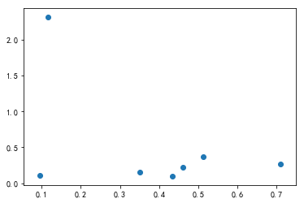

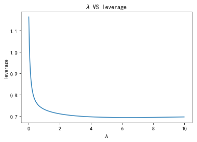

作图后可以发现，随着$\lambda$的增加，异常点（最后一个点）的影响在减少，这是因为增加$\lambda$会使得范化能力增加，$E_{\text {cv} }$减少。


#### Problem 9.23 (Page 48)

For a sample of $500$ digits data (classifying “1” versus “not 1”), use linear regression to compute the leverage of the data points (even though the problem is a classification problem). You can use the algorithm in Problem 9.21.

Give a similar plot to Figure 9.5 where you highlight in a black box all the data points with the top-10 largest (positive) leverages.Give some intuition for which points are highlighted.

```python
# -*- coding: utf-8 -*-
"""
Created on Fri May  3 12:00:28 2019

@author: qinzhen
"""

import numpy as np
import matplotlib.pyplot as plt
from numpy.linalg import inv

data = np.genfromtxt("features.train")
#预处理数据
N = 500
X = data[:, 1:][:N]
y = data[:, 0][:N]
y = (y == 1).astype("double")

def l(X, y, Lambda):
    N, d = X.shape
    #计算
    w = inv(X.T.dot(X) + Lambda * np.eye(d)).dot(X.T).dot(y)
    H = X.dot(inv(X.T.dot(X) + Lambda * np.eye(d))).dot(X.T)
    y_hat = X.dot(w)
    
    N = X.shape[0]
    H1 = np.diag(H)
    Ecv = np.mean(((y - y_hat) / (1 - H1)) ** 2)
    Ecvm = np.array([])
    
    for m in range(N):
        #分子
        e1 = y_hat - y + (y_hat[m] - y[m]) / (1 - H[m][m]) * H[m, :]
        #分母
        e2 = 1 - H1 - H[m, :] ** 2 / (1 - H[m][m])
        Ecv_m = 1 / (N - 1) * np.sum((e1 / e2) ** 2) - \
                1 / (N - 1) * ((y_hat[m] - y[m]) / (1 - 2 * H[m][m])) ** 2
        Ecvm = np.append(Ecvm, Ecv_m)
    return Ecv - Ecvm

Lambda = 0
#计算影响
leverage = l(X, y, Lambda)
#找到影响最大的10个点
label = leverage.argsort() > N - 9
#作图
plt.scatter(X[y==1][:, 0], X[y==1][:, 1], s=1, c="r", label="one")
plt.scatter(X[y!=1][:, 0], X[y!=1][:, 1], s=1, c="b", label="not one")
plt.scatter(X[:, 0][label], X[:, 1][label], color='', marker='o', edgecolors='g', s=50)
plt.title("leverage with $\lambda={}$".format(Lambda))
plt.legend()
plt.show()
```


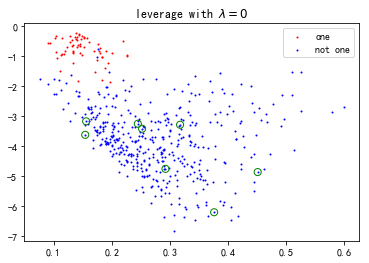


#### Problem 9.24 (Page 48)

**The Jackknife Estimate.**

The jackknife is a general statistical technique used to reduce the bias of an estimator, based on the assumption that the estimator is asymptotically (as $N$ increases) unbiased. Let $\mathcal{Z}=\mathbf{z}_{1}, \dots, \mathbf{z}_{N}$be a sample set. In the case of learning, the sample set is the data, so $\mathbf{z}_{n}=\left(\mathbf{x}_{n}, y_{n}\right)$. We wish to estimate a quantity $t$ using an estimator $\hat{t}(\mathcal{Z})$ (some function of the sample $\mathcal Z$. Assume that $\hat{t}(\mathcal{Z})$ is asymptotically unbiased, satisfying 
$$
\mathbb{E}_{\mathcal{Z}}[\hat{t}(\mathcal{Z})]=t+\frac{a_{1}}{N}+\frac{a_{2}}{N^{2}}+\cdots
$$
The bias is $O\left(\frac{1}{N}\right)$. $\mathcal{Z}_{n}=\mathbf{z}_{1}, \ldots, \mathbf{z}_{n-1}, \mathbf{z}_{n+1}, \ldots, \mathbf{z}_{N}$ be the leave one out sample sets (similar to cross validation), and consider the estimates using the leave one out samples $\hat{t}_{n}=\hat{t}\left(\mathcal{Z}_{n}\right)$.

(a) Argue that
$$
\mathbb{E}_{\mathcal{Z}}\left[\hat{t}_{n}\right]=t+\frac{a_{1}}{N-1}+\frac{a_{2}}{(N-1)^{2}}+\cdots
$$
(b)Define $\hat{\tau}_{n}=N \hat{t}(\mathcal{Z})-(N-1) \hat{t}_{n}$. Show that
$$
\mathbb{E}_{\mathcal{Z}}\left[\hat{\tau}_{n}\right]=t-\frac{a_{2}}{N(N-1)}+O(\frac 1 {N^2})
$$
($\hat{\tau}_{n}​$ has an asymptotically asymptotically smaller bias than $t(\mathcal{Z})​$.) The $\hat{\tau}_{n}​$ are called pseudo-values because they have the “correct” expectation. A natural improvement is to take the average of the pseudovalues, and this is the jackknife estimate:
$$
\hat{t}_{J}(\mathcal{Z})=\frac{1}{N} \sum_{n=1}^{N} \hat{\tau}_{n}=N \hat{t}(\mathcal{Z})-\frac{N-1}{N} \sum_{n=1}^{N} \hat{t}\left(\mathcal{Z}_{n}\right)
$$
(c)Applying the Jackknife to variance estimation. Suppose that the sample is a bunch of independent random values $x_{1}, \dots, x_{N}$from a distribution whose variance $σ^2$ we wish to estimate. We suspect that the sample variance,
$$
s^{2}=\frac{1}{N} \sum_{n=1}^{N} x_{n}^{2}-\frac{1}{N^{2}}\left(\sum_{n=1}^{N} x_{n}\right)^{2}
$$
should be a good estimator, i.e., it has the assumed form for the bias (it does).Let $s_{n}^{2}​$ be the sample variances on the leave one out samples. Show that
$$
s_{n}^{2}=\frac{1}{N-1}\left(\sum_{m=1}^{N} x_{m}^{2}-x_{n}^{2}\right)-\frac{1}{(N-1)^{2}}\left(\sum_{m=1}^{N} x_{m}-x_{n}\right)^{2}
$$
Hence show that jackknife estimate $N s^{2}-\frac{N-1}{N} \sum_{n} s_{n}^{2}$ is $s_{J}^{2}=\frac{N}{N-1} s^{2}$, which is the well known unbiased estimator of the variance. In this particular case, the jackknife has completely removed the bias (automatically).

(d) What happens to the jackknife if $t(\mathcal{Z})​$ has an asymptotic bias?

(e) If the leading order term in the bias was $\frac{1}{N^{2}}​$ , does the jackknife estimate have a better or worse bias (in magnitude)?

(a)由定义即可，将定义中的$N​$替换为$N-1​$

(b)分别计算$\mathbb E_{\mathcal Z}[N \hat t(\mathcal Z)]$，$\mathbb E_{\mathcal Z}[(N-1) \hat t_n]$
$$
\begin{aligned}
\mathbb E_{\mathcal Z}[N \hat t(\mathcal Z)]
&=N (t + \frac{a_1}{N} +\frac{a_2}{N^2} + O(\frac 1 {N^3})) \\
&=N t + a_1 +\frac{a_2}{N}  +O(\frac 1 {N^2})\\

\mathbb E_{\mathcal Z}[(N-1) \hat t_n]
&=(N-1) (t + \frac{a_1}{N-1} +\frac{a_2}{(N-1)^2} + O(\frac 1 {N^3})) \\
&=(N-1) t + a_1 +\frac{a_2}{N-1}  +O(\frac 1 {N^2})
\end{aligned}
$$

所以
$$
\begin{aligned}
\mathbb E_{\mathcal Z}[\hat \tau_n]
&=\mathbb E_{\mathcal Z}[N \hat t(\mathcal Z)] - \mathbb E_{\mathcal Z}[(N-1) \hat t_n]\\
&=N t + a_1 +\frac{a_2}{N} -(N-1) t - a_1 -\frac{a_2}{N-1}  +O(\frac 1 {N^2}) \\
&= t -\frac{a_2}{N(N-1)}+O(\frac 1 {N^2}) 
\end{aligned}
$$
(c)计算之前给出如下记号
$$
a_1 =\sum_{m=1}^N x_m,a_2 =\sum_{m=1}^N x_m^2
$$
所以
$$
s^2 =\frac 1 N  a_2 -\frac 1 {N^2 }a_1 ^2
$$
由定义可知
$$
\begin{aligned}
s_n^2 
&=\frac 1 {N-1} \Big(\sum_{m=1}^N x_m^2-x_n^2\Big)-
\frac 1 {(N-1)^2 }\Big(\sum_{m=1}^N x_m -x_n\Big) ^2 \\
&=\frac 1 {N-1} \Big(a_2-x_n^2\Big)-
\frac 1 {(N-1)^2 }\Big(a_1 -x_n\Big) ^2
\end{aligned}
$$
对$\sum_{n=1}^N s_n^2 $进行处理
$$
\begin{aligned}
\sum_{n=1}^N s_n^2 
&= \frac 1 {N-1} \sum_{n=1}^N\Big(a_2-x_n^2\Big)-
\frac 1 {(N-1)^2 }\sum_{n=1}^N\Big(a_1 -x_n\Big) ^2 \\
&=\frac 1 {N-1}(Na_2 -\sum_{n=1}^Nx_n^2) 
-\frac 1 {(N-1)^2 }\Big(Na_1^2 +\sum_{n=1}^N x_n^2-2a_1\sum_{n=1}^N x_n \Big) \\
&=\frac 1 {N-1}(Na_2 -a_2) 
-\frac 1 {(N-1)^2 }\Big(Na_1^2 +\sum_{n=1}^N x_n^2-2a_1\sum_{n=1}^N x_n \Big)\\
&=a_2 -\frac 1 {(N-1)^2 }\Big(Na_1^2 + a_2 -2a_1^2  \Big) \\
&= \frac{(N^2 -2N)a_2 -(N-2)a_1^2}{(N-1)^2}\\
&=\frac{(N-2)(Na_2 -a_1^2)}{(N-1)^2}\\
&=\frac{(N-2)N^2 s^2}{(N-1)^2}
\end{aligned}
$$
因此
$$
\begin{aligned}
Ns^2 -\frac{N-1}{N} \sum_{n=1}^N  s_n^2
&=Ns^2-\frac{N-1}{N}\frac{(N-2)N^2 s^2}{(N-1)^2} \\
&=Ns^2-\frac{(N-2)Ns^2}{N-1} \\
&=Ns^2 (1- \frac {N-2}{N-1}) \\
&=\frac{N}{N-1}s^2
\end{aligned}
$$
(d)如果本来是渐近有偏的，那么jackknife estimate并不能改变有偏性。

(e)此时相当于$a_1=0$，那么这时要比较以下两项绝对值的大小
$$
\frac{a_2}{N^2} ,-\frac{a_2}{N(N-1)}
$$
不难看出
$$
\left|\frac{a_2}{N^2}\right| \le \left|\frac{a_2}{N(N-1)}\right|
$$
说明这时候jackknife estimate的偏差更大。


#### Problem 9.25 (Page 49)

**The Jackknife for Validation.**

(see also the previous problem) If $E_{\mathrm{in}}$ is an asymptotically unbiased estimate of $E_{\mathrm{out}}$,we may use the jackknife to reduce this bias and get a better estimate. The sample is the data. We want to estimate the expected out-of-sample error when learning from $N$ examples, $\mathcal{E}_{\text {out}}(N)$. We estimate $\mathcal{E}_{\text {out}}(N)$ by the in-sample error $E_{\mathrm{in}}\left(g^{(\mathcal{D})}\right)$.

(a) What kind of bias (+ve or -ve) will $E_{\mathrm{in}}​$ have. When do you expect it to be asymptotically unbiased?

(b)Assume that the bias has the required form:
$$
\mathbb{E}_{\mathcal{D}}\left[E_{\text {in}}\left(g^{(\mathcal{D})}\right)\right]=\mathcal{E}_{\text {out}}(N)+\frac{a_{1}}{N}+\frac{a_{2}}{N^{2}}+\cdots
$$
Now consider one of the leave one out data sets $\mathcal{D}_{n}$,which would produce the estimates $E_{\mathrm{in}}\left(g^{\left(\mathcal{D}_{n}\right)}\right)$. Show that:

i.the pseudo-values are
$$
 N E_{\mathrm{in}}\left(g^{(\mathcal{D})}\right)-(N-1) E_{\mathrm{in}}\left(g^{\left(\mathcal{D}_{n}\right)}\right)
$$
ii.the jackknife estimate is:
$$
E_{J}=N E_{\mathrm{in}}\left(g^{(\mathcal{D})}\right)-\frac{N-1}{N} \sum_{n=1}^{N} E_{\mathrm{in}}\left(g^{\left(\mathcal{D}_{n}\right)}\right)
$$
(c)Argue that
$$
\mathbb{E}_{\mathcal{D}}\left[E_{\text {in}}\left(g^{\left(\mathcal{D}_{n}\right)}\right)\right]=\mathcal{E}_{\text {out}}(N-1)+\frac{a_{1}}{N-1}+\frac{a_{2}}{(N-1)^{2}}+\cdots
$$
and hence show that the expectation of the jackknife estimate is given by
$$
\mathbb{E}_{\mathcal{D}}\left[E_{J}\right]=\mathcal{E}_{\text {out}}(N)+(N-1)\left(\mathcal{E}_{\text {out}}(N)-\mathcal{E}_{\text {out}}(N-1)\right)+O\left(\frac{1}{N^{2}}\right)
$$
(d)the learning curve converges, having a form
$$
\mathcal{E}_{\text {out}}(N)=E+\frac{b_{1}}{N}+\frac{b_{2}}{N^{2}}+\ldots
$$
,then show that
$$
\mathbb{E}_{\mathcal{D}}\left[E_{J}\right]=\mathcal{E}_{\text {out}}(N)+\frac{b_{1}}{N}+O\left(\frac{1}{N^{2}}\right)
$$
The jackknife replaced the term $\frac{a_{1}}{N}$ in the bias by $\frac{b_{1}}{N}$.(In a similar vein to cross validation, the jackknife replaces the bias of the in-sample estimate with the bias in the learning curve.) When will the jackknife be helpful?

(a)由之前几章的讨论可知$E_{\text{in}}$是对$E_{\text{out}}$较小的估计，当模型的方差不大时，可以认为是渐近无偏的。

(b)这个两个结论由定义以及上一题即可得到。
(c)由定义不难看出
$$
\mathbb E_{\mathcal D} [ E_{\text{in}}(g^{\mathcal D_n}) ]=
\epsilon_{\text{out}}(N-1)
+\frac{a_1}{ N-1}+\frac{a_2}{(N-1)^2}+...
$$
注意
$$
\mathbb E_{\mathcal D} [ E_{\text{in}}(g^{\mathcal D}) ]=
\epsilon_{\text{out}}(N)
+\frac{a_1}{ N}+\frac{a_2}{N^2}+...
$$
所以
$$
\begin{aligned}
\mathbb E_{\mathcal D} [E_J ] 
&=N\epsilon_{\text{out}}(N)+a_1 +\frac {a_2}{N}- 
(N-1)\epsilon_{\text{out}}(N-1) -a_1 -\frac {a_2}{N-1}
+O(\frac 1 {N^2})\\
&=\epsilon_{\text{out}}(N)+(N-1)(\epsilon_{\text{out}}(N)-\epsilon_{\text{out}}(N-1))
+O(\frac 1 {N^2})
\end{aligned}
$$
(d)将$\epsilon_{\text{out}}(N)= E+\frac{b_1}{N}+\frac{b_2}{N^2}+...​$带入上式可得
$$
\begin{aligned}
\mathbb E_{\mathcal D} [E_J ] 
&=\epsilon_{\text{out}}(N)+(N-1)
(E+\frac{b_1}{N}+\frac{b_2}{N^2}-E-\frac{b_1}{N-1}-\frac{b_2}{(N-1)^2})
+O(\frac 1 {N^2})\\
&=\epsilon_{\text{out}}(N) - \frac{b_1}{N}+O(\frac 1 {N^2})
\end{aligned}
$$
